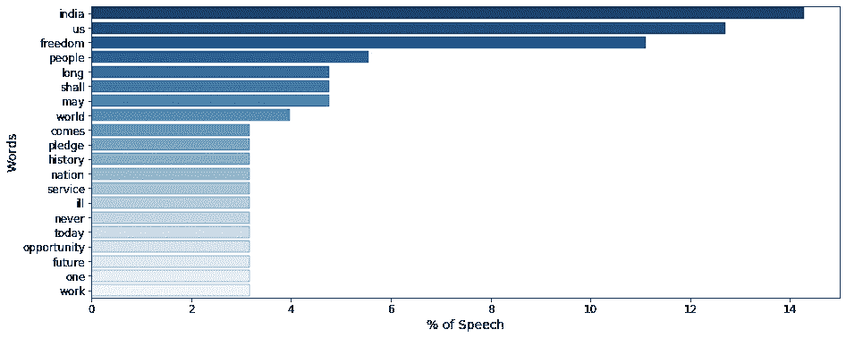
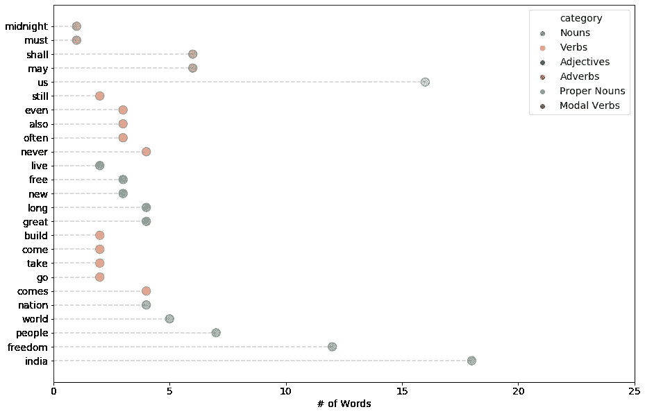
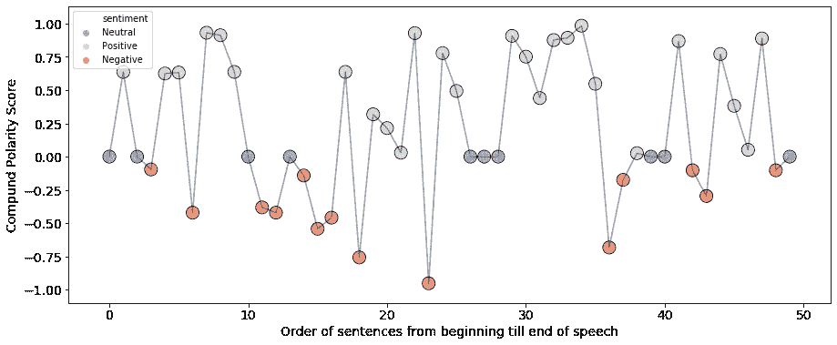

# 《与命运的幽会》的情感分析

> 原文：<https://towardsdatascience.com/a-long-tryst-with-destiny-a35424f44841?source=collection_archive---------21----------------------->

## 用 NLTK 对贾瓦哈拉尔·尼赫鲁著名演讲的情感分析

潘迪特·尼赫鲁在蒙巴顿勋爵的主持下宣誓就任印度独立后的第一任总理(个人电脑:photodivision.gov.in/公共领域)

1947 年 8 月 14 日印度独立前夕，印度首任总理潘迪特·贾瓦哈拉尔·尼赫鲁发表了一篇现在被认为是 20 世纪所有政治家中最优秀的演讲之一。

1947 年 8 月 14 日，接近午夜，潘迪特·尼赫鲁站在自由独立的印度制宪会议前，说了这些鼓舞人心的话-

> “很久以前，我们与命运订了一个幽会；现在是我们兑现承诺的时候了，不是全部或全部，而是相当大的一部分。当午夜钟声敲响的时候，当世界沉睡的时候，印度将会为生命和自由而觉醒……

这篇演讲证明了一个时代，公开演说是许多政治家和自由战士致命优雅地挥舞的武器。不仅是潘迪特·尼赫鲁的演讲技巧让这篇演讲与众不同，还有他在没有诉诸沙文主义的情况下，向印度民众传达爱国热情和激情斗争的细致入微和雄辩。一个长期受压迫的民族的希望和愿望通过坚定的乐观主义和谨慎的实用主义表达出来。

在这篇文章中，我试图从分析的角度来看他的演讲。由于他的演讲鼓舞人心，我想知道情绪分析是否会揭示同样的情绪。

# 前言

简单地说，情绪分析是一种知道一个观点或陈述是积极的还是消极的能力。比如说—

> 句子 1——“我不太喜欢那种柠檬姜冰茶”
> 
> 句子 2——“我喜欢柠檬姜冰茶”
> 
> 句子 3——“让我想想，我是不是想要一杯柠檬姜汁冰茶”

第一句表达的是消极的感觉，而第二句表达的是积极的感觉，第三句是中性的。我们的大脑天生就有能力辨别积极的陈述和消极的陈述，而我们甚至不知道这是什么时候发生的。

现在想象一个计算机算法有能力做到这一点。想象一下，如果它有能力理解隐藏在句子中的情绪，并正确地说出它是什么——“积极”、“消极”或“中性”。这种情感识别和分类就是情感分析的全部内容。

它是自然语言处理(NLP)中的一套工具和方法，帮助我们筛选大量的客户反馈数据、产品评论数据、twitter feed 等。，并正确识别积极情绪和消极情绪。

虽然情感分析在客户反馈/评论和 twitter 分析中得到广泛使用和优化，但我想在潘迪特·尼赫鲁的演讲中尝试一下。我在这个项目中使用了流行的自然语言处理库 **NLTK** ，你可以在我的 [github](https://github.com/ani-rudra-chan/speech_sentiment_analysis.git) 页面上找到完整的代码来玩。该代码非常简单明了，我将在本文中只分享一些有趣的结果。演讲全文可以免费获取[这里](https://en.wikipedia.org/wiki/Tryst_with_Destiny)，这里[这里](https://www.toppr.com/guides/speech-for-students/tryst-with-destiny-speech/)，这里[这里](https://www.inc.in/en/in-focus/tryst-with-destiny-speech-made-by-pt-jawaharlal-nehru)。

# 一.探索性数据分析

潘迪特·尼赫鲁的演讲持续了近 8 分钟，以他那个时代的演讲风格发表。他的演讲是英文的，总共有 1099 个单词。

潘迪特·尼赫鲁演讲的文字云(来源:我的[朱庇特笔记本](https://github.com/ani-rudra-chan/speech_sentiment_analysis.git)

考虑到演讲的时间和背景，人们很自然地会经常提到“**印度**”、“**自由**”和“**人民**”等词。事实上，在他演讲中出现的前 20 个词中，**印度**，**美国**，**自由**被提到了超过 10 次。我们必须记住，潘迪特·尼赫鲁的演讲不仅仅是为了他的同胞，更是为了向世界其他国家发表声明。历经千辛万苦获得独立后，他现在的任务是领导一个脆弱的国家进入下一个十年。他经常使用“我们”和“人民”这样的词，这是他想向因第二次世界大战而分裂的国际社会展示的民族团结和统一的表现。

尼赫鲁演讲中最常用的 20 个词。

一篇演讲之所以伟大，是因为它的内容和讲述内容的方式。我早些时候说过，尼赫鲁的雄辩是他的品质之一，这也是他的演讲获得尊崇地位的部分原因。另一部分是书面内容。快速浏览一下他演讲中的词汇类别可以发现，最常被提及的词汇类别及其对应的热门词汇是-

1.  名词:'**印度**'——既然演讲是关于印度的自由；
2.  形容词:'**龙**'和'**大** ' —在争取独立的斗争和困难的背景下；
3.  副词:' **never** ' —在英国殖民地对其占领者的顽强态度和历史性胜利的背景下；
4.  动词:'**来了**'
5.  人称代词:' **us** ' —突出人民的团结统一；
6.  情态动词:' **may** '和'**shall**'——象征谨慎的希望。

潘迪特·尼赫鲁演讲中出现的每个词汇类别的前 5 个单词

# 二。情感分析

探索性数据分析产生了一些有趣的结果，并给出了从情感分析中期望得到什么的想法。

在这里，我使用了 NLTK 包中的 VADER 模型(情感推理的效价感知字典)来测量“极性得分”方面的情感。这是代表特定文本的情感的指数或分数。文本可以有一个*正*、*负*或*中性* *分数*或所有三个分数的归一化分数，称为*复合分数。*

我使用 NLTK 库的 *sent_tokenize* 函数将整篇演讲分成多个句子，并使用 VADER 的*SentimentIntensityAnalyzer*测量每个句子的极性得分。

这样做的原因是这样的，

> 当你听一个演讲者时，你会在他或她的演讲中感受到不同的情绪，特别是如果是由像潘迪特·尼赫鲁这样的人在那个特定的历史时期发表的演讲。这些情绪和感悟可以量化吗？

因此，作为量化这些情绪的基本练习，我绘制了整个演讲的极性得分(请记住，这些是单个句子的极性得分)。

个人情感分数确实给出了某个句子是否引发了特定情感的想法。这里的情绪代表了整个句子。你可以立即看到，在整个演讲过程中，情绪并不是一致积极的。相反，它接近于中性和负面情绪的爆发。看一看复合分数，它是单个分数的集合，会给出更好的见解。

从复合得分图中，你可以感觉到潘迪特·尼赫鲁演讲的很大一部分是积极的(52%)，中度消极的(28%)和中性的(20%)。

这正是我所期待的！

我不希望在独立前夕发表的演讲过于积极，这个演讲是通过多年的斗争获得的，由一位优雅的政治家发表，而不是尖酸刻薄或狂热的沙文主义。负面情绪的暗示可以被认为是代表了讲话中提到为获得独立所面临的斗争以及未来的斗争的部分。中性情绪可能代表他演讲中的实用或非感性部分。

对潘迪特·尼赫鲁演讲的总体评价是积极的(标准化综合得分为 0.21)。

# 结束语

通过这个小练习，我能够证实一个广为流传的观点，即潘迪特·尼赫鲁的演讲确实鼓舞人心，并向整个国家传达了积极的情感。

一些需要记住的事情—

1.我想向读者指出，情感分析，尤其是 VADER 在 NLTK 中进行的情感分析，是为分析社交媒体上的用户情感而优化的，社交媒体通常包括许多最高级，表情符号和标点符号。尽管如此，我还是想尝试一种不同的文本结构。

2.VADER 模型基本上是一种基于词汇和规则的情感分析方法。因此，无论这种情绪被识别出来，并不完全意味着机器智能。要做到这一点，应该有一个机器学习和预测/分类的元素。那是我想要尝试的事情。

3.最重要的一点——这个项目的目的是用 NLTK 学习情感分析，我期待着建议、评论和批评。

*目前就这样。当我游向更深处时，我会发表更多我对情绪分析的理解！
Ciao！*