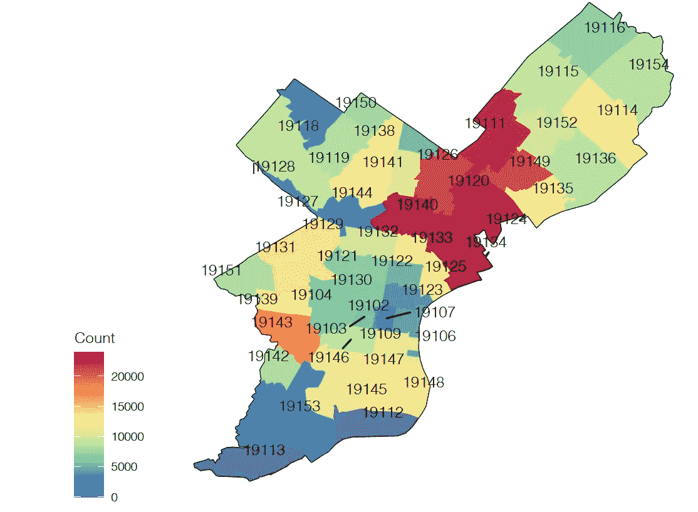
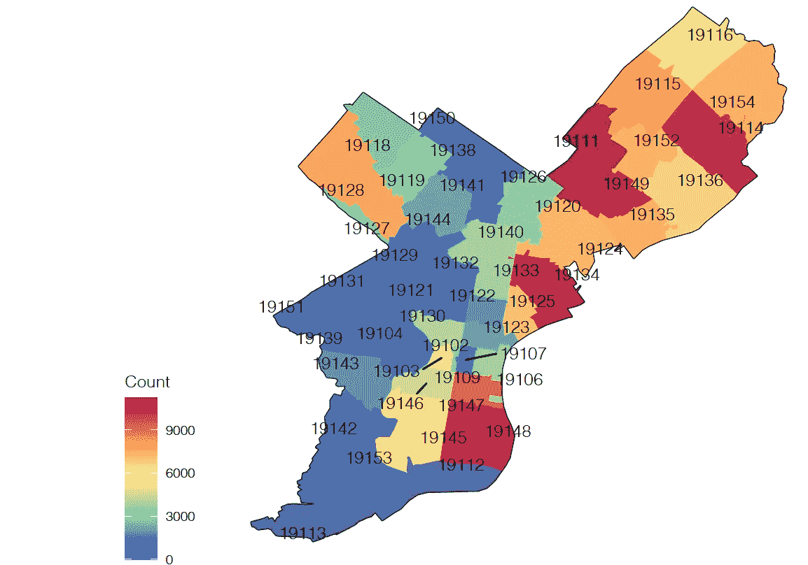
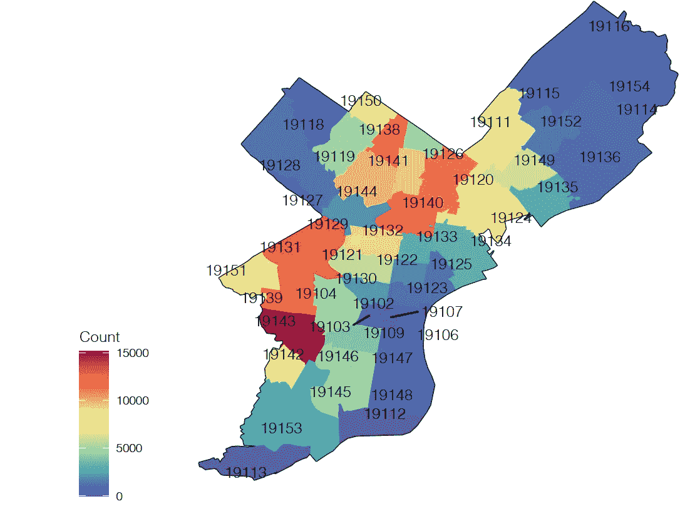
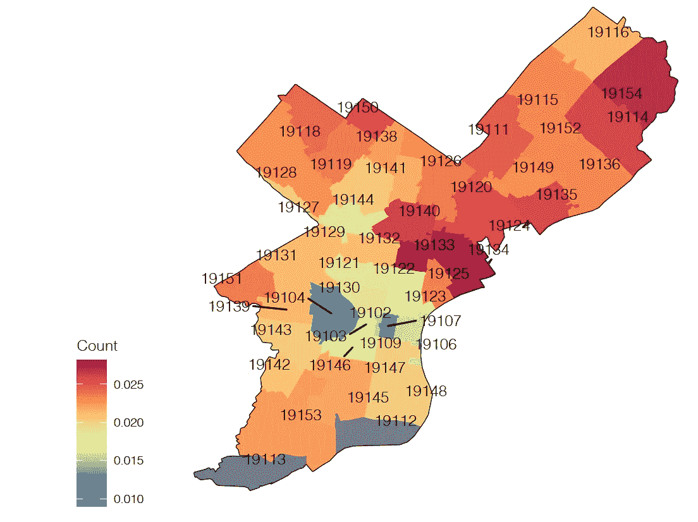
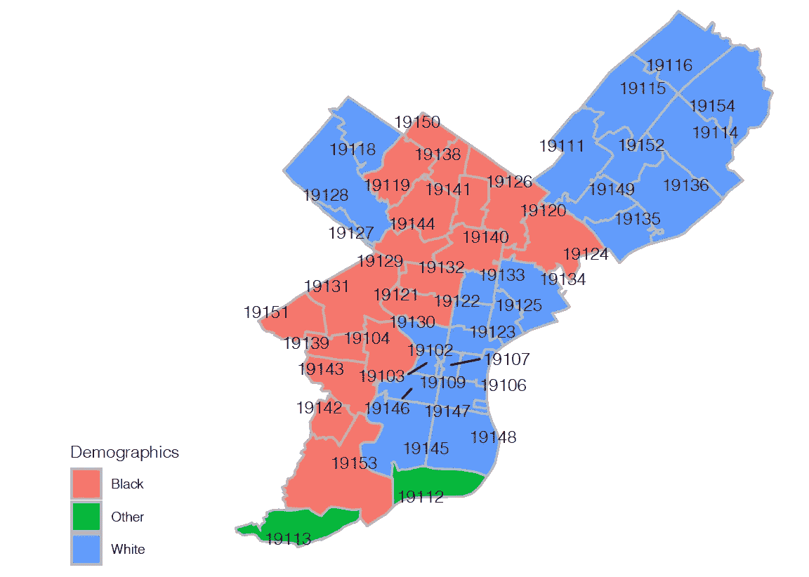
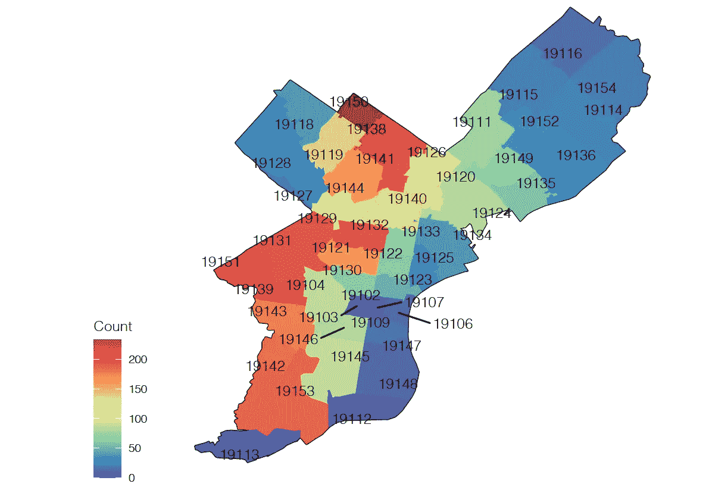
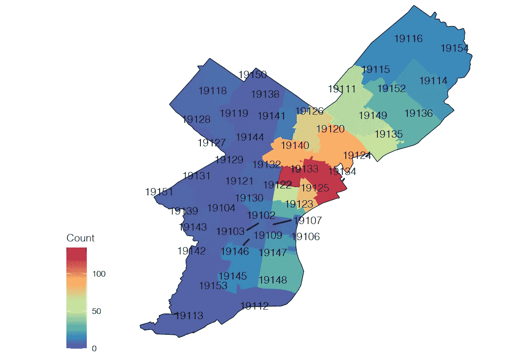
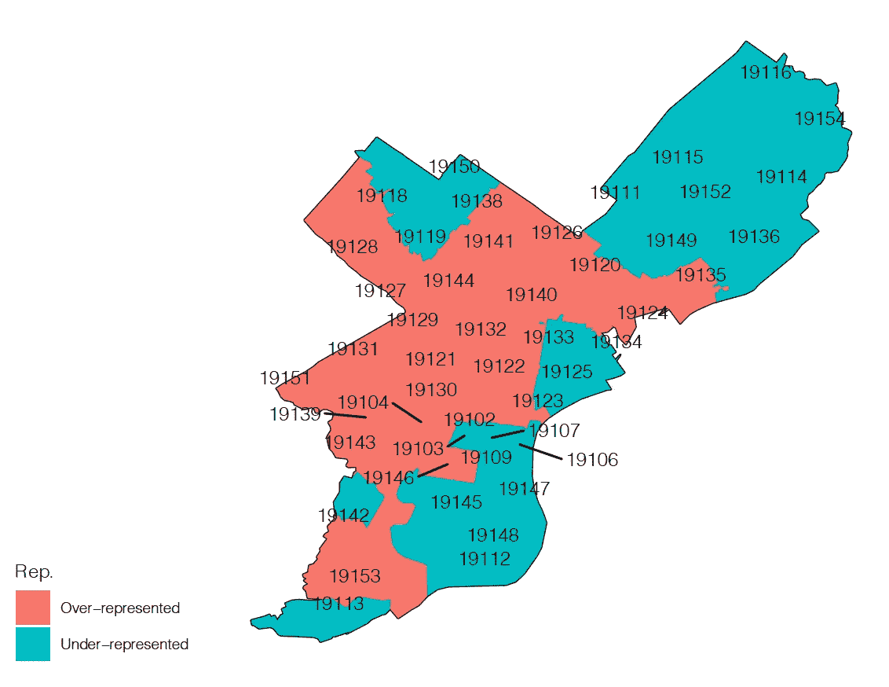

# 费城一瞥

> 原文：<https://towardsdatascience.com/a-look-a-philadelphia-e710eff69a3f?source=collection_archive---------37----------------------->

## 贫困、教育和劳动力如何帮助理解一个大城市的健康。

费城是一个多元化的城市，拥有 159 万居民，占地 142.7 平方英里。在这 159 万居民中，约有 50 万人生活贫困。今天，我们将利用 R 和地图来研究费城的贫困动态。根据 2010 年人口普查，贫困将在邮政编码层面进行调查。在这里，几个问题将被调查，包括整个费城的贫困、教育和劳动力，以获得城市健康的快照。总之，调查将利用以邮政编码为中心的彩色编码地图。

在这里，贫困的原始统计，人均贫困统计，贫困的差异统计，以及黑人和西班牙裔社区之间的差异比较都被关注。

# **贫困的基本统计**

快速浏览一下贫困人口的总数，我们就会发现:

图 1:每个邮政编码的原始贫困人口数。注:Zips 19113 和 19112 是工业区，不包含任何居民区，因此不包括在分析中。

很明显，最大的贫困人口集中在“北费城”(邮编:19140、19133、19134、19120、19111、19149、19124)和“西南部”(邮编:19139、19143、19131)。其他地区属于中等贫困水平，靠近“中心城市”的贫困人口较少(zips: 19102、19103、19109、19107、19123、19130)。

尽管统计数据很有帮助，但如果没有人口统计或每个邮政编码内的总人口的背景数据，这些数据就不太具有洞察力。首先，将绘制人口层面的贫困数据，以探索任何人口层面的贫困模式。

**白人的贫困**

以下是白人每个邮政编码的原始贫困人口统计图:

图 2:费城每个邮政编码的贫困白人的原始数量。注意:邮政编码 19113 和 19112 的数据点太少，无法进行有意义的解释。

显而易见，随着人们在费城向东北方向迁移，白人的原始贫困率会增加。同样，在“南费城”，一个传统的意大利遗产区(zips: 19148，19147，19145)，白人贫困人数也有所增加。除 19128 年外，西部、西南部和西北部的贫困水平较低。

**黑人的贫困**

以下是黑人每个邮政编码的原始贫困人口统计图:

图 3:整个费城根据 Zp 编码的贫困黑人原始人数。注意:邮政编码 19113 和 19112 的数据点太少，无法进行有意义的解释。

与白人相比，这里有一个几乎相反的趋势。对于贫困的黑人来说，统计集中在“西费城”地区(邮编:19143、19139、19131)，以及极北地区(邮编:1938、19144、19141、19120、19140)。在费城南部、老城区或东北部，很少有黑人处于贫困之中。

**西班牙人的贫困**

以下是西班牙裔人每个邮政编码的原始贫困人口数地图:

图 4:费城拉美裔贫困人口的原始统计。注意:邮政编码 19113 和 19112 的数据点太少，无法进行有意义的解释

拉美裔贫困人口的原始数据表明，贫困人口集中在北费城地区，这是该市传统的拉美裔聚居区。在整个费城，除了这个地区以外，很少有拉美裔人处于贫困之中。

**结论**

人口的原始计数是有趣的，因为人们可以看到聚类。然而，如果不控制人口数量或代表性，它们就没有那么有意义。下文考虑了这些因素。

# **按邮政编码统计的人均贫困人口**

更直观地观察整个城市的贫困状况，可以看到每个邮政编码与所有其他邮政编码相比的人均贫困率。下图显示了贫困水平。

图 5:每个邮政编码的相对原始贫困数与整个费城的原始贫困数的对比。注:邮政编码 19113、19112 没有足够的数据用于分析。

在这里，可以看出一个普遍的主题是存在的。在费城市中心，贫困水平相对较低，随着人们离开中心而增加。查看原始数据，我们看到在邮政编码 19107(老城区)的范围是 0.8%，在邮政编码 19133(北费城)的范围是 2.8%。另一个低于平均水平的贫困水平是邮政编码为 19134(浅蓝色)，被称为大学城，那里有德雷克塞尔大学、宾夕法尼亚大学和科学大学。费城另一所著名的大学，天普大学，排名 19122，贫困率约为 1.7%。

# **按人口统计的人均贫困人口**

现在，我们的注意力转向了人口统计中的人均贫困率。为了更好地理解人均贫困率，让我们先来看看每个 zip，看看哪个人口统计组最有代表性。

图 6:查看每个邮政编码代表的人口统计组。注:邮政编码 19112、19113 没有足够的数据用于分析。

上图中，我们看不到西班牙裔社区最多的邮政编码。此外，南费城、中心城、旧城(19107、19106)、菲什敦(19123、19122、19125、19133)、东北和西北的社区由白人社区主导。相比之下，费城西南部、西部和北部则由黑人社区主导。

**白色贫困**

下图向我们展示了每个邮政编码区的白人贫困率与该邮政编码区总人口数的对比。

图 7:与费城其他地区相比，按邮编划分的白人人均贫困率(每万人)。注:19113 和 19112 不包含用于分析的足够数据。

上面的地图显示了与整个城市的人均贫困总量相比，每个种族的贫困总量。上图显示，与其他人均贫困地区相比，白人贫困程度最高的地区也是白人数量最多的地区，因此这种分布并不令人惊讶。然而，在白人群体中，相对人均贫困率最高的邮政编码是 19154 年的远东北部。

**黑色贫困**

看看黑人社区与白人社区有着相似的分布模式。它遵循多数人占主导地位的邮政编码。如下图所示:

图 8:黑人群体的人均贫困率(每 10，000 人)与整个城市的人均贫困率的关系。注:邮政编码 19113、19112 没有足够的数据用于分析。

上图中，我们看到了与白人群体相似的主题。黑人群体的最高相对贫困率在邮政编码区内遵循相同的模式，其主要人口群体是黑人。北费城是整个城市中黑人相对人均贫困率最高的地方。

**拉美裔贫困**

虽然没有西班牙裔社区占主导地位的邮政编码。因此，当数据标准化时，可能很难辨别任何模式，并且与整个城市的总人均贫困数相比，查看西班牙裔社区的人均贫困数可能仍然是有见地的。如下图所示。

图 9:西班牙裔人均贫困数(每万人)与全市人均贫困数的对比

这里的趋势类似于原始贫困统计，因为西班牙裔社区集中在北费城地区。邮政编码 19122 显示了西班牙裔社区最高的人均贫困水平。

**结论**

在这里，通过以邮政编码为中心的地图来查看每个人口统计群体的人均贫困人数。与其他邮政编码相比，这些邮政编码是根据其人均贫困人数进行排名的。总的来说，人们注意到，人均贫困模式遵循一般趋势，正如在每个邮政编码中哪个社区群体最占主导地位所示。然而，与贫困的原始统计数字相比，调查人均统计数字时存在微妙的差异。

虽然在调查社会或人口因素时，人均比率显示了典型的标准化值，但人均比率并没有捕捉到任何可能存在的公平差异。因此，在下一节中，将调查根据特定邮政编码内的特定人口统计数据进行标准化的人均贫困率。

**贫困分布的种族差异模型**

贫困分布的种族差异模型背后的基本原理如下:假设一个村庄有两组人，A 组和 B 组。该村庄的总人数为 100 人，A 组有 80 人，B 组有 20 人。A 组有 20 人贫困，B 组都有 15 人贫困。在人均值上，A 组(每 100 个村庄中有 20 个贫困人口)高于 B 组(每 100 个村庄中有 15 个贫困人口)。然而，与每个群体的人数相比，B 群体的贫困人口似乎过多。例如:A 组每 80 人中有 20 人贫困(20%)，B 组每 20 人中有 15 人贫困(75%)。

据说，第一个指标(每一群体中的贫困人数与总人数之比)是贫困的平等模型。相比之下，后一种衡量标准(每一群体的贫困人数与该群体的人数之比)被认为是贫困分布的种族差异模型。

因此，下图显示了与整个城市的相同指标相比，某个邮政编码内每个人口统计的贫困人口数量(由该邮政编码内该人口统计的人口数量控制)。

**白人悬殊**

下面是费城的白色差异度量。

图 10:整个费城白人群体贫困分布的差异模型，与整个费城相比，每个邮编每 10，000 名白人中有 1 名白人贫困。注:由于数据不足，19112 和 19113 未纳入分析。

在这里，我们看到差异模型计数给出了整个城市贫困行为的清晰视图。无论是从数量上还是从人均价值上看，白人贫困人口都不多的邮政编码现在都有了重要的价值。随着高贫困值的出现，新的邮政编码出现了西北部的邮政编码 19118、19119、19150、19138 与城市的其他地区相比，白人群体的人均贫困值相对较高。

**黑色贫富差距模型**

图 11:与整个费城相比，每个邮政编码的黑人社区人均贫困差异模型(每 10，000 名黑人中有 1 名黑人贫困)。注:19112 和 19113 包含的数据不足以进行分析。

值得注意的是，从不平等的角度来看，黑人社区的贫困模式显示了广泛的贫困，从平等的角度来看，这种贫困大大超出了贫困的范围。股票衍生人均价值相对较低的唯一邮政编码是在中心城市(19103，19102)和老城区(19107)。在这些邮政编码之外，贫困的公平模型捕捉到了一个更全面的视角。整个城市的黑人社区都很贫困。

**拉美裔差异贫困模型**

西班牙裔社区的差异模型如下所示。

图 12:与整个费城相比，西班牙裔社区人均贫困差异模型(每 10，000 名西班牙裔人中有 1 名西班牙裔贫困人口)。注:19112 和 19113 包含的数据不足以进行分析。

西班牙裔社区的公平地图显示了以费城北部和东北部地区为中心的广泛贫困。最初未被平等模型涵盖的地区包括南费城(19145，19148)和西费城(19139)。然而，与平等模型相比，差异模型显示了西班牙裔社区更广泛的贫困。然而，北费城地区西班牙裔社区的人均贫困水平仍然很高。

**结论**

公平模型是一种简单而强大的工具，用于查看邮政编码范围内特定人口的贫困水平，地图有助于查看整个费城这些贫困水平的相对丰富程度。

值得注意的是，公平模型强调了所有三个群体更广泛的贫困，但特别是黑人社区，其在公平模型中的贫困水平强调了系统性贫困水平。公平模型的一个结果是，人们可以在一个更合适的水平上比较不同的人口统计。尽管等式模型考虑了每个邮政编码的人口统计，但它并不提供表示各个邮政编码的人口统计信息。

因此，好处是公平的邮政编码比较可以帮助确定哪个邮政编码，一个人口统计或其他，可能超过或低于一些贫困的基准水平。这将在接下来探讨。

# **邮政编码差异比较**

在按人口公平比较邮政编码时，人们必须选择基准水平的贫困进行比较。也就是说，如果在一个村庄里，我们调查占主导地位的 A 组的人均差距贫困水平，就会发现 80 个成员中有 20 个处于贫困状态。因此，如果 A 组代表村内的主导群体，通过将其他群体对资源的可获得性或可获得性与主导群体进行比较，可以直接衡量差距的程度。

A 组的差距模型贫困水平为每 10，000 人 2，500 人。B 组的差距模型贫困水平为每 10，000 人 7，500 人。因此，比较两者，我们看到 B 组的差距水平为 3.0 (7，500 / 2，500)。也就是说，与占主导地位的群体相比，B 群体的贫困率高出 3 倍。

差距水平是一个事实上的公平数字。这个数字代表了一个群体的贫困程度。将此量化为公平数字的推理思路是，假设资源的可获得性与一个社区将经历的贫困程度成反比。因此，可以在种族层面上比较两个群体，尤其是一个少数群体与一个多数群体在整个城市的贫困和资源分配方面的情况。

值得注意的是，另一种方法是根据美国的平均贫富差距水平来衡量贫富差距水平。尽管在确定资源或生活质量的偏差水平(通过贫困水平衡量)方面很有用，但这一指标将提供对费城邮政编码位置的深入了解；如果试图考察费城内部的相对差异，那将不会有什么好处。因此，必须在费城建立一个基地组织。尽管费城的一些邮政编码区的主要人口是黑人，但将该邮政编码区内的黑人社区视为资源主导群体似乎是不合理的，因为与白人社区在全国范围内的影响力相比，一个邮政编码区社区的影响力是最小的。

此外，通过公平模型比较邮政编码有助于在复杂或过度饱和的系统中确定每个人口统计群体贫困增加的地区，如费城。通过根据已知或基数(在这种情况下，是全国主导的人口群组)对人口统计数据进行标准化，可以将大范围的贫困转化为模式。

总之，可以看出，差异模型可用于比较整个费城地区的邮政编码，以深入了解不同邮政编码之间的不同资源分配水平(通过贫困衡量)。

**黑人群体与白人群体在贫困差异模型方面的比较**

在这里，我们看到了黑人社区贫困的公平性与白人社区贫困的公平性之间的差异。有过度的代表性，特别是在西费城邮政编码 19130(最暗的红色)。然而，从总体上看，很难看出代表性是过多还是不足。因此，下图有助于回答这个问题:“在哪个邮政编码区，贫困的黑人社区比例过高？”。

图 13:全市人口人均贫困水平的比较。该值越高，与白人社区的差异-贫困模型相比，黑人社区的贫困程度越高。注:由于数据不足，19113 和 19112 未包括在内。

这些图表极具洞察力。他们证明，与人口的原始计数相比，黑人社区在更大数量的邮政编码中的贫困比例过高，这一点可能无法通过查看平等图甚至原始计数图来说明。因为即使在费城西部和北部以黑人为主的社区，当控制人均贫困率和相对人口数量时，与白人群体相比，这些人口统计数据中的贫困比例仍然过高。

图 14:看看哪些邮政编码代表了过多或过少的贫困黑人社区。注:由于数据不足，19113 和 19112 未包括在内。

有趣的是，与白人的平等贫困水平相比，黑人社区人均贫困值最高的地区的过度贫困水平有所下降。这表明，在一些邮政编码区，白人和黑人的贫困水平都不正常，而且相对较高。

**在贫困差异模型方面，西班牙裔群体与白人群体的比较**

使用同样的方法，我们可以看看西班牙裔群体的贫困水平。下面是两张图表，第一张展示了在同一邮政编码内，西班牙裔社区与白人群体的公平贫困计数相比的相对公平贫困水平。第二项调查显示了西班牙裔社区在贫困人群中的代表性是过高还是过低。

图 15:西班牙裔社区的公平贫困指标与白人社区的公平贫困指标的对比。注:由于数据不足，19113 和 19112 未包括在内。

同样，与黑人社区一样，与白人社区的贫困水平相比，西班牙裔社区似乎在整个费城的贫困群体中占了很大比例，其贫困程度超过了使用简单的平等甚至公平模型所观察到的水平。在这里，拉美裔社区的贫困人口比例远远超过了之前提到的孤立的北费城地区。现在，可以看出西费城和北费城地区的贫困程度更不平衡。

图 16:西班牙裔社区的公平贫困指标与白人社区的公平贫困指标的对比，白人社区的每个邮政编码被分类为西班牙裔社区代表过多或代表不足。注:由于数据不足，19113 和 19112 未包括在内。

**结论**

该理论认为，在研究贫困时，人们可以深入了解整个城市的资源分配水平。这是基于这样一种假设，即一个人拥有的资源越多，贫困的可能性就越小，或者说就越不突出。然而，要想了解由差距导致的贫困水平的相对数量，就必须有可以与之进行比较的东西。在这项调查中，选择了历史上和国家资源占主导地位的群体，即白人群体，作为所有其他人口统计数据进行比较的基准。

由此产生的贫困差异比较模型为了解整个城市的相对贫困程度提供了有用的信息。尽管原始计数、人均计数甚至差异模型计数都很有用，但差异模型的真正好处是比较不同邮政编码的人口统计数据。差异模型比较可以让我们看到，少数民族人口和主要人口之间的贫困水平可以讲述一个更完整的故事。

研究表明，与白人群体相比，所有人口统计数据的贫困水平都比没有对比的简单计数更为显著。特别是，在使用差异比较模型时，黑人社区似乎在贫困群体中占了很大比例。虽然这是在简单的视差模型中提出的，但是当使用视差比较模型时，真正的意义才被抓住。

通过差异模型，尤其是差异比较模型，对西班牙社区贫困水平的看法发生了巨大变化。从原始数据甚至人均数据来看，拉美裔社区的贫困水平似乎集中在北费城地区。然而，当使用差异模型时，人们注意到西班牙裔社区的贫困水平远远超出了北费城地区。差异比较模型更加精确地反映了这一点，该模型显示，在整个费城，西班牙裔社区的过度代表性是系统性的。

当需要使用基于公平的决策系统来努力增加特定人群的资源可用性时，这些模型是有用的。因此，这些可能对希望利用更全面的方法来分配他们的注意力和资源的社会工作者或社会机构特别有用。

**接下来的步骤**

接下来，将进行更深入的调查。下一篇文章将允许我们回答诸如“有没有办法将贫困水平纳入这些模型中？这将如何改变费城人对贫困的看法”。

对于那些对这些模型背后的数学和所使用的代码感兴趣的人，请留意我关于这些主题的文章！