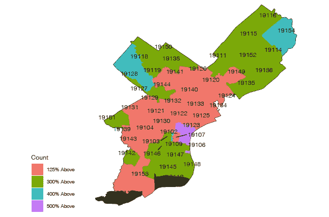
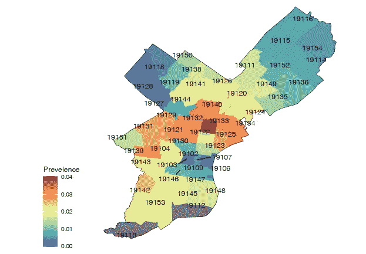
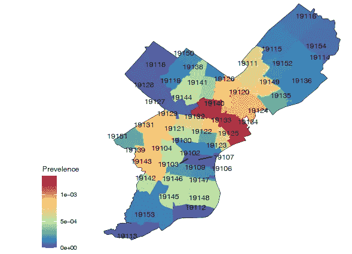
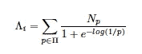
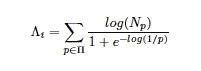
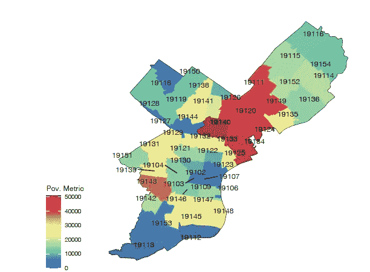
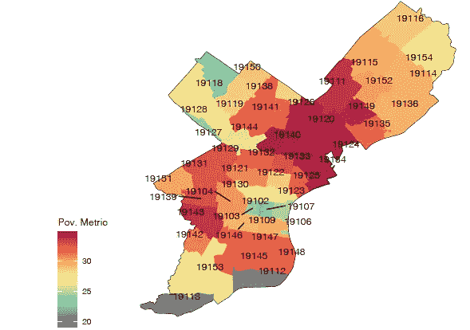

# 费城一瞥:第二部分

> 原文：<https://towardsdatascience.com/a-look-at-philadelphia-part-two-63f165792850?source=collection_archive---------51----------------------->

在之前的系列中，费城是从贫困的角度来看的，强调了人口统计和贫困之间的关系。现在，让我们来看看贫困水平是如何描述费城的贫困的。此外，一旦确定了贫困的程度，将会尝试在特定的邮政编码范围内平衡贫困人口的数量和贫困的严重程度。希望建立一个模型，能够捕捉到城市中可能需要额外资源和援助的区域。

贫困水平是以低于联邦贫困线的百分比为基础的，目前的贫困线为 12，760 美元。贫困百分比代表贫困线以上的金额，50%约为每年 6000 美元，500%约为每年 64000 美元。

下面是费城的地图，展示了在一个给定的邮政编码中，哪一个贫困等级是最普遍的。

图 1:根据每个邮政编码的原始计数来看，哪种贫困程度最具代表性。注:19112、19113 因数据不足未包括在内。

图中的亮点(紫色)出现在费城的老城区和中心城区，代表该市最富裕的部分。

没有大多数人口生活在贫困线或贫困线以下(100%或 50%)的邮政编码。

另一种观点是研究居住在贫困线以下至少 50%的邮政编码区的人口比例。下图显示了整个城市中生活在贫困线以下至少 50%的人的贫困分布情况。

图 2:看看全市人均邮政编码低于贫困线 50%的人的生活水平。

看起来，贫困率最高的地区的邮政编码至少比联邦贫困线低 50%,延伸到北部和西部的中心城市。随着人们从东西两个方向向北方各县移动，贫困程度会逐渐降低。

有趣的是，当将其与原始贫困计数图进行比较时，两张图有很大不同:在第一部分图 5 中，贫困人口的原始计数显示了更广泛的人均贫困水平。当使用 50%的贫困截止点时，贫困水平聚集得更紧密。这表明，图 5 第一部分的贫困水平可能比贫困线以下 50%的人更加贫困。

此外，我们可以在全市范围内相互比较邮政编码。下图展示了贫困线以下 50%人口与整个城市的其他邮政编码之间的关系。

图 3:费城人均城市范围内生活在贫困线以下的人口比例高达 50%。

在比较整个城市的邮政编码时，出现了一个相似的趋势:北费城地区最为贫困。19140 年，19133 年，19134 年在北费城，以及该市的肯辛顿地区，人均贫困率几乎高出一个数量级，高达贫困线以下 50%。

**贫困指标**

对社会研究人员来说，将贫困严重程度的数量与特定地理区域内的贫困严重程度相协调可能是有用的。在本节中，将介绍一个量化人口数量和贫困水平之间的平衡的模型。

虽然这里没有提供证据，但是使用了两个度量标准。在记录贫困人口数量和贫困水平方面发挥更大作用的指标。这两个指标都考虑到了，但是一个更适合另一个，这取决于它的优先级。

等式 1:贫困指标，每个贫困水平的每个邮政编码的人口数量的权重增加。

更重要的捕捉人口数量的度量是 Eq。1.其中 Np 是人数，p 是贫困水平。

相反，为了最大限度地减少人口的影响，采用了人口计数的对数，这可以提高对生活贫困者的敏感性，如下所列。

等式 2:贫困指标，每个贫困水平的每个邮政编码的人口数量权重递减。

因此，如果需要决定向何处投资资源，该指标提供了平衡两种对立考虑的基本方法。一个人是否将资源投资于贫困数量最多或距离贫困线最远的地方。

下图*图 4* 显示了对贫困人口数量更敏感的第一个指标(使用等式 1)。

图 4:费城每个邮政编码的贫困指标。

有趣的是，随着人口比重的增加，西费城和南费城的贫困水平相比之下有所下降。因此，如果一个人关注于以人口统计为中心的模型，同时仍然希望识别贫困增加的地区，那么北费城地区将是目标。

如果将人口数量的影响最小化，并考虑到贫困水平的更大影响，我们会看到下面的地图:

图 5:以贫困水平为中心的贫困度量计算。

当最小化人口的影响时，在*图 5* 中可以看到整个城市的贫困状况。北费城是该市最贫困的地区，这一持续趋势在人口统计模型和贫困水平模型中都存在。然而，如果不强调人口数量，西费城和南费城的贫困状况就会变得更加明显。

另一个持续的趋势是大学城(19103)，中心城市和老城区的贫困水平最低。

**结论**

在这一篇，也是最后一篇文章中，我们观察了整个费城的贫困状况，其中运用了几种观点。首先，在*图 1* 中查看了每个邮政编码最普遍的贫困水平。据发现，费城的大部分居住在大约 125%的贫困线以上，除了中心城市和老城区，随着向周围县的延伸，与贫困线的距离也增加了。

为了观察那些生活在贫困线或贫困线以下的人，多达 50%的人生活在贫困线以下，*图 2* 观察了每个邮政编码区的人均患病率。然后，为了比较整个城市的邮政编码，图 3 向我们展示了生活在贫困线以下 50%的人的邮政编码是如何比较的。在这两个例子中，北费城被强调为贫困加剧的地区。

最后，为了捕捉社会工作的竞争性意识形态:功利主义与基于差异的救济，设计了一个贫困衡量标准，以结合贫困人数的影响或可能存在的贫困水平。虽然在贫困指标中考虑到了这两种观点，但人们可以通过选择指标中贫困人口原始数量的影响来突出或专门关注其中的一个。在*图 4* 中，人数的影响被最大化，费城与贫困相关的传统区域相对于费城北部的普遍贫困状况有所减少。如图 5 中的*图所示，当该指标与贫困人口数量对比时，北费城贫困人口数量的影响进一步凸显。在这里，相对于目前的贫困水平，人口数量被最小化。在这里，尽管费城北部再次被强调，但费城其他贫困地区也同样被展示出来。*

在对费城的分析中，始终有几个趋势显示出来。首先，北费城有严重的贫困问题。贫困表现在原始统计、人均统计、人口控制统计、贫困水平统计和贫困度量统计中。

其次，紧随北费城之后的是西费城。尽管西费城的原始统计数据较低，但人口统计和计量得出的贫困水平却很明显。

第三，南费城是一个混合体；当考虑到人口统计时，对一些人来说，南费城是一个突出的贫困地区。但是当控制人均数量和贫困水平数量时，南费城在整个费城的贫困人口中处于中游。

最后，中心城市、老城区、偶尔还有大学城(取决于视角)的贫困率一直很低。无论从哪一方面来看，老城区都没有明显贫困。

总之，我希望提供一些费城的贫困状况。作者希望通过强调人们看待贫困的各种方式，突出对围绕社会工作的困难和挑战的理解。此外，尽管不是重点，作者希望贫困度量至少提供一种基本的方式，试图调和确定最需要的领域的至少两个方面。