# 精确度、召回率和 F1 分数

> 原文：<https://towardsdatascience.com/a-look-at-precision-recall-and-f1-score-36b5fd0dd3ec?source=collection_archive---------1----------------------->

## [入门](https://towardsdatascience.com/tagged/getting-started)

## 探索机器学习度量之间的关系

特定领域的术语通常很难开始。有了软件工程背景，机器学习有许多这样的术语，我发现我需要记住使用工具和阅读文章。

一些基本术语是精确度、召回率和 F1 值。这些涉及到获得一个分类器做得有多好的更细粒度的想法，而不是只看整体准确性。写解释迫使我思考，帮助我自己记住题目。这就是我喜欢写这些文章的原因。

我在这篇文章中看到了一个二元分类器。同样的概念确实适用于更广泛的领域，只是需要对多类问题进行更多的考虑。但这是另一个时间要考虑的事情。

在进入细节之前，一个概览图总是不错的:

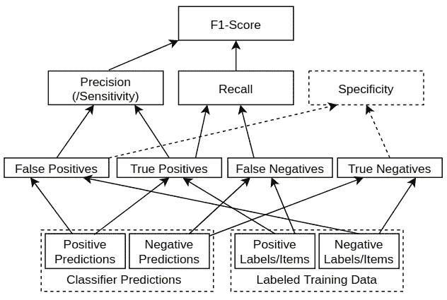

从原始测量值/标记数据到 F1 分数的指标层级。图片作者。

乍一看，这是一个有点混乱的网络。现在不需要担心细节，但是我们可以在下面的部分中自下而上地解释细节时回头看看。这些指标形成了一个层次结构，从*真/假阴性/阳性*(在底部)，一直到*F1-分数*将它们绑定在一起。让我们从那里开始。

# 真/假阳性和阴性

二元分类器可以被视为将实例分类为*正*或*负:*

*   **肯定的**:实例被分类为分类器试图识别的类的成员。例如，寻找猫照片的分类器会将有猫的照片分类为正面的(当正确时)。
*   **否定的**:实例被归类为不是我们试图识别的类的成员。例如，寻找猫照片的分类器应该将有狗(没有猫)的照片分类为负面的。

精确度、召回率和 F1 分数的基础来自于*真阳性*、*真阴性*、*假阳性*和*假阴性*的概念。下表说明了这些情况(将值 1 视为正面预测):

真/假阳性和阴性的例子

## 真阳性(TP)

下表显示了真阳性(TP)的 3 个示例。第一行是一个通用示例，其中 1 表示正面预测。下面两行是带有标签的示例。在内部，算法将使用 1/0 表示，但是为了更直观的理解，我在这里使用了标签。

真正正(TP)关系的例子。

## 假阳性

这些假阳性(FP)的例子说明了做出错误的预测，用实际的阴性样本预测阳性样本。这种失败的预测被称为假阳性。

## 真阴性(TN)

对于真阴性(TN)示例，猫分类器正确地将照片识别为其中没有猫，并且将医学图像识别为没有癌症的患者。所以预测是否定的，正确的(真)。

## 假阴性(FN)

在假阴性(FN)的情况下，分类器预测了阴性结果，而实际结果是阳性的。有猫的时候就像没有猫一样。所以预测是否定的，错误的(错误的)。因此，这是一个假阴性。

# 混淆矩阵

混淆矩阵有时用于说明基于上述四个值(TP、FP、TN、FN)的分类器性能。这些图表相互对照，显示出一个混淆矩阵:

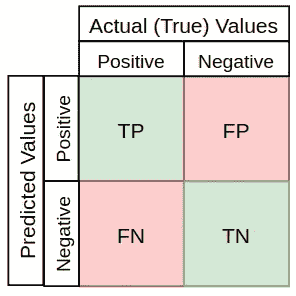

混乱矩阵。图片作者。

以癌症预测为例，100 名患者的混淆矩阵可能如下所示:

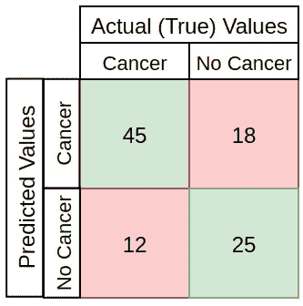

癌症例子的混淆矩阵。图片作者。

这个例子有:

*   TP:正确预测了 45 个阳性病例
*   TN: 25 个阴性病例被正确预测
*   FP: 18 个阴性病例被错误分类(错误的阳性预测)
*   FN: 12 个阳性病例被错误分类(错误的阴性预测)

想一想，这里不同的错误有不同的严重性。将患有癌症的人归类为没有癌症(假阴性，拒绝治疗)，可能比将没有癌症的人归类为患有癌症(假阳性，考虑治疗，做进一步测试)更严重。

由于不同种类的错误的严重性在不同的用例中有所不同，因此可以使用诸如*准确度*、*精度*、*召回*和*F1-分数*之类的度量来平衡分类器的估计值。

# 准确(性)

用于模型评估的基本指标通常是*准确度*，描述所有预测中正确预测的数量:

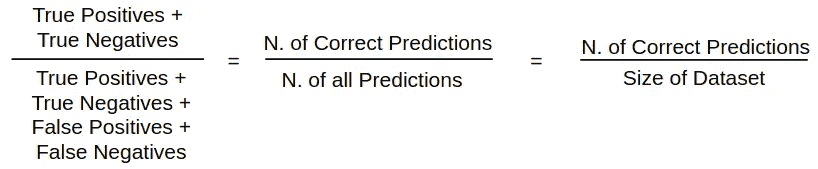

精确度公式。图片作者。

这三个公式显示了相同的计算精度，但在不同的措辞。从更形式化到更直观(我的看法)。在上面的癌症例子中，精确度是:

*   (TP+TN)/DatasetSize =(45+25)/100 = 0.7 = 70%。

这可能是模型评估度量中最直观的，因此也是最常用的。但是更深入一点通常也是有用的。

# 精确

*精度*是对有多少正面预测是正确的(真阳性)的度量。它的公式是:

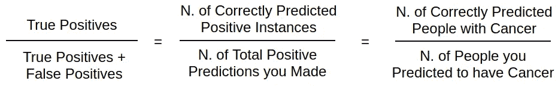

精确公式。图片作者。

以上三个都是相同的不同表达方式，最后一个用癌症作为具体的例子。在这个癌症示例中，使用来自上述示例混淆矩阵的值，精度将是:

*   45/(45+18)=45/63=0.714=71.4%.

# 回忆/敏感度

*Recall* 是对数据中所有阳性案例中分类器正确预测的阳性案例数量的度量。[它有时也被称为](https://stats.stackexchange.com/questions/362332/is-there-any-difference-between-sensitivity-and-recall)**。*它的公式是:*

*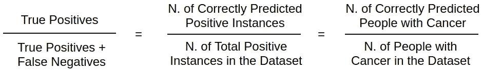*

*回忆公式。图片作者。*

*同样，这只是用三种不同方式表达的同一个公式。对于癌症的例子，使用混淆矩阵数据，回忆将是:*

*   *45/(45+12)=45/57=0.789=78.9%.*

# *特征*

*特异性是对做出的否定预测有多少是正确的(真否定)的度量。它的公式是:*

*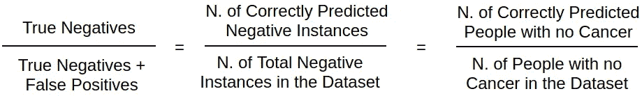*

*特异性公式。图片作者。*

*在上面的医学例子中，特异性是:*

*   *25/(25+18)=0.581=58,1%.*

# *f1-分数*

*F1 分数是一个结合了精确度和召回率的指标。一般描述为两者的[调和平均值](https://en.wikipedia.org/wiki/Harmonic_mean)。调和平均值只是计算值的“平均值”的另一种方法，通常被描述为比传统的算术平均值更适合比率(如精确度和召回率)。在这种情况下，F1 分数使用的公式为:*

*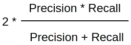*

*f1-得分公式。图片作者。*

*这个想法是提供一个单一的衡量标准，以平衡的方式衡量两个比率(精确度和召回率)，要求两者都有一个更高的值，以提高 F1 值。例如，精度为 0.01，召回率为 1.0，则得出:*

*   *(0.01+1.0)/2 的算术平均值=0.505，*
*   *f1-得分分数(上式)为 2*(0.01*1.0)/(0.01+1.0)=~0.02。*

*这是因为 F1 分数对两个输入中的一个具有低值(此处为 0.01)更加敏感。如果你想平衡这两者，这很好。*

*F1 分数的一些优势:*

*   *非常小的精确度或召回率将导致较低的总得分。因此，它有助于平衡这两个指标。*
*   *如果您选择阳性类别作为样本较少的类别，F1-score 可以帮助平衡阳性/阴性样本之间的指标。*
*   *正如本文中的第一个图所示，它将许多其他指标组合成一个单一的指标，一次捕获许多方面。*

*在上面的癌症例子中，F1 值为*

*   *2 * (0.714*0.789)/(0.714+0.789)=0.75 = 75%*

## *探索 F1 分数*

*我发现通过看一些例子最容易理解概念。首先是 Python 中计算 F1 分数的函数:*

*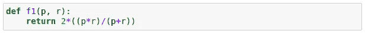*

*F1 分数公式的 Python 实现。图片作者。*

*为了比较精度和召回率的不同组合，我生成了精度和召回率的示例值，范围为 0 到 1，步长为 0.01(0.01、0.02、0.03、…、1.0 的 100 个值):*

*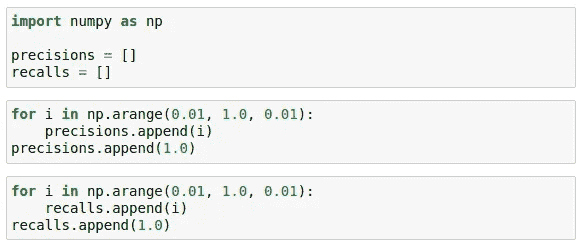*

*生成精度和召回率的示例值。图片作者。*

*这将产生一个包括精确度和召回率的列表来进行实验:*

*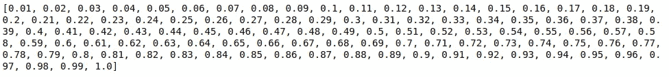*

*生成的精度和召回值。图片作者。*

## *f1-精确度=回忆时的分数*

*如果精度等于召回率，要查看 F1 分数是多少，我们可以计算每一点的 F1 分数 0.01 到 1.0，精度=每一点的召回率:*

*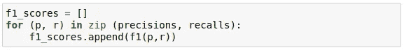*

*计算示例值的 F1 分数，其中精度=每 100 分的召回率。图片作者。*

*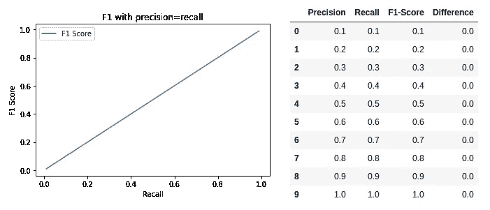*

*f1-当精确度=回忆时得分。当 p=r 时，f1-分数等于每个点的精确度和召回率。*

*f1-如果两个输入指标(P&R)相等，得分等于精确度和召回率。表格中的*差异*栏显示了较小值(精确度/召回率)与 F1 分数之间的差异。这里它们是相等的，所以没有区别，在下面的例子中它们开始变化。*

## *f1-召回率= 1.0，精确度= 0.01 至 1.0 时的得分*

*因此，F1 值应该能够很好地处理其中一个输入(P/R)较低的情况，即使另一个输入非常高。*

*让我们尝试将 Recall 设置为最大值 1.0，并将精度从 0.01 变到 1.0:*

*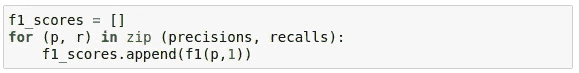*

*当召回率始终为 1.0 且精确度在 0.01 到 1.0 之间变化时，计算 F1 分数。图片作者。*

*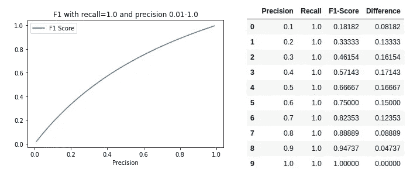*

*f1-当回忆= 1.0 且精确度从 0.1 到 1.0 变化时的分数。图片作者。*

*正如预期的那样，当两个输入( *Precision / R* ecall)中的一个为低时，F1 值保持低。*差异*列显示了在这种情况下 F1 分数如何比较小的输入值(此处为*精度*)上升得更快，在图表的中间增加更多，由较大的值(此处为*回忆一下*)加权一点。然而，它永远不会远离较小的输入，平衡基于两个输入的总得分。这些差异也可以在图上看到(*差异*在垂直红线处最大):*

*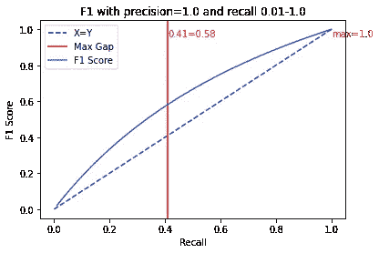*

*f1-精度得分= 1.0，回忆得分= 0–1.0，突出显示文章。图片作者。*

## *f1-精确度= 1.0，回忆= 0.01 到 1.0 时的得分*

*如果我们交换上述示例中*精度*和*召回*的角色，我们会得到相同的结果(由于*F1-分数*公式):*

*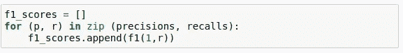*

*当精度始终为 1.0，召回率在 0.0 到 1.0 之间变化时，计算 F1 分数。图片作者。*

*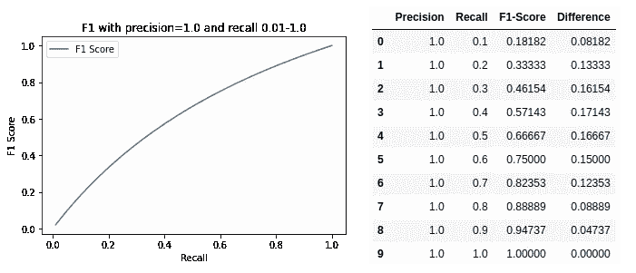*

*f1-精确度= 1.0 且回忆从 0.01 到 1.0 变化时的分数。图片作者。*

*也就是说，无论哪一个更高或更低，总的*F1-分数*都受到完全相同的影响(这在公式中似乎相当明显，但容易忘记)。*

## *f1-精确度=0.8，回忆= 0.01 到 1.0 时的得分*

*除了将一个输入固定在最大值之外，让我们试着降低一点。这里精度固定为 0.8，而召回率和以前一样在 0.01 到 1.0 之间变化:*

*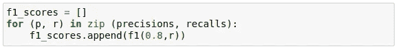*

*当精度始终为 0.8，召回率在 0.0 到 1.0 之间变化时，计算 F1 分数。图片作者。*

*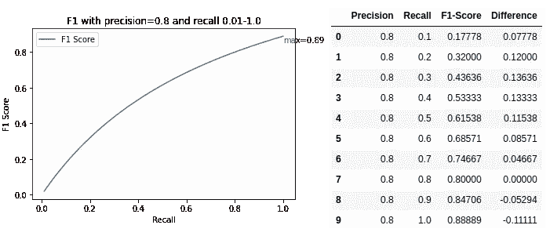*

*f1-当精确度= 0.8 且回忆从 0.01 到 1.0 变化时的分数。图片作者。*

*输入(0.8，1.0)的最高分是 0.89。上升曲线形状类似于*回忆*值上升。在最大*精度* = 1.0 时，它获得的值比较小的值(0.89 比 0.8)高大约 0.1(或 0.09)。*

## *f1-精确度=0.1，回忆=0.01 到 1.0 时的得分*

*如果我们把一个值固定在最小值 0.1 附近呢？*

*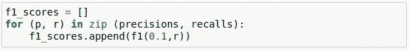*

*当精度始终为 0.1，召回率在 0.0 到 1.0 之间变化时，计算 F1 分数。图片作者。*

*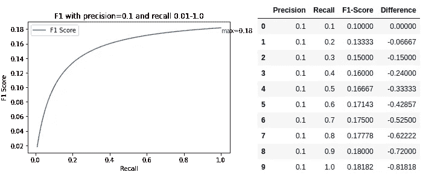*

*f1-当精确度= 0.1 且回忆从 0.01 到 1.0 变化时的分数。图片作者。*

*因为两个输入中的一个总是低电平(0.1)，所以*F1-分数*不会升得很高。然而，有趣的是，它再次上升到最大值，大约比较小的输入值大 0.08(*精度* = 0.1，*F1-分数* =0.18)。这非常类似于上面的固定值*精度* = 0.8，其中达到的最大值比较小的输入高 0.09。*

## *关注 F1 分数的准确性或回忆性*

*除了普通的 *F1-score* 之外，还有一个更通用的版本，叫做 [*Fbeta-score*](https://en.wikipedia.org/wiki/F1_score) 。 *F1-score* 是 *Fbeta-score* 的特例，其中 *beta* =1。它允许人们通过增加一个加权因子来衡量精确度或回忆更多。在这篇文章中，我不会深入探讨这个问题，但是，这是需要记住的。*

# *f1-分数与准确性*

*准确性通常被描述为一个更直观的指标，使用 *F1-score* 可以更好地处理更不平衡的数据集。那么，*F1-score*(**F1**)vs*Accuracy*(**ACC**)如何在不同类型的数据分布(正/负比率)之间进行比较呢？*

## ***不平衡:阳性病例很少***

*在此示例中，存在 10 个阳性病例和 90 个阴性病例的不平衡，对于分类器来说，具有不同的 TN、TP、FN 和 FP 值来计算 f 1 和 ACC:*

*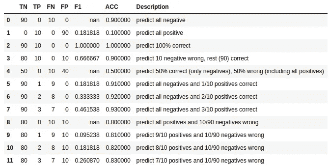*

*不同预测率和不平衡数据下的 F1 分数与准确性。图片作者。*

*等级不平衡的最大精度是 TN=90 和 TP=10 的结果，如第 2 行所示。*

*在 TP =0 的每种情况下，*精度*和*召回*都变成 0，并且*F1-分数*不能计算(除以 0)。这种情况可以被评分为 F1-score = 0，或者通常将分类器标记为无用。因为分类器不能预测任何正确的肯定结果。这是上表中的第 0、4 和 8 行。这些还示出了对于损坏的分类器的高*准确度*的一些情况(例如，具有 90% *准确度*的第 0 行，同时总是仅预测负面)。*

*剩余的行说明了 *F1 分数*如何对分类器做出更平衡的预测做出更好的反应。比如第 5 行的*F1-得分* =0.18 vs *准确度* = 0.91，到第 7 行的*F1-得分* =0.46 vs *准确度* = 0.93。这只是 2 个正面预测的变化，但由于这是 10 个可能中的一个，变化实际上相当大，并且 *F1 分数*强调了这一点(并且*准确度*看不到任何其他值的差异)。*

## *平衡 50/50 阳性和阴性病例:*

*当数据集更加平衡时会怎样？以下是具有 50 个负项目和 50 个正项目的平衡数据集的类似值:*

*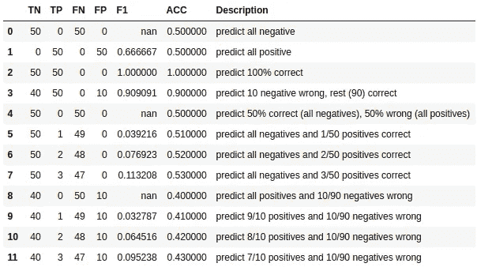*

*f1-分数与不同预测率和平衡数据的准确性。图片作者。*

**F1-score* 在这里仍然是一个稍微好一点的指标，当只有很少(或没有)的正面预测时。但是这种差异并不像不平衡的班级那么大。一般来说，更深入地研究结果总是有用的，尽管在平衡的数据集中，高精度通常是分类器性能良好的良好指标。*

## *不平衡:很少有负面案例*

*最后，如果少数阶级被认为是消极的而不是积极的，会发生什么？ *F1-score* 不再平衡而是相反。下面是一个有 10 个阴性病例和 90 个阳性病例的例子:*

*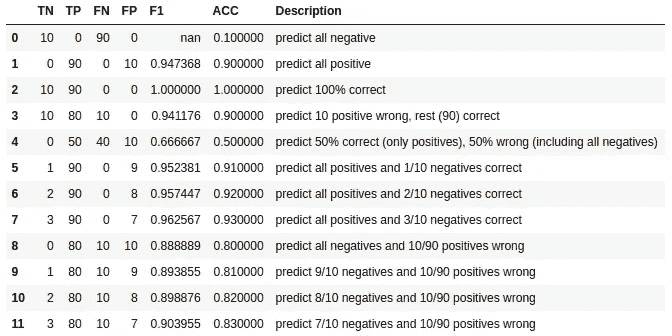*

*f1-当正类为多数类时，得分与准确度。图片作者。*

*例如，第 5 行在 10 个否定情况中只有 1 个正确预测。但是 *F1 得分*仍然在 95%左右，所以非常好，甚至高于准确度。在同样的比例适用于少数阳性病例的情况下，该病例的 *F1 得分*为 0.18，而现在为 0.95。这是一个更好的质量指标。*

*少数阴性病例的这一结果是因为计算 *F1 分数*的公式是如何定义超过*精度*和*召回*(强调阳性病例)的。如果你回头看看本文开头的图表，你会看到*真阳性*是如何进入*精度*和*召回*，并从那里进入*F1-分数*。该图还显示了*真阴性*对 *F1 分数*没有任何影响。如果你颠倒比例，并且有更少的*真阴性*，这似乎是不可思议的。*

*因此，像往常一样，我认为牢记如何表示您的数据是有好处的，并做您自己的数据探索，不要盲目相信任何单一的指标。*

# *结论*

*那么这些指标有什么用呢？*

*如果您有非常平衡的数据集，并且对所有类型的输出都同样感兴趣，那么传统的**精度**是一个很好的衡量标准。在任何情况下，我都喜欢从它开始，因为它是直观的，并根据需要从那里深入挖掘。*

***如果你想尽量减少误报，精确度**是非常重要的。例如，您构建了一个垃圾邮件分类器。您希望看到尽可能少的垃圾邮件。但是你不想错过任何重要的，非垃圾邮件。在这种情况下，您可能希望以最大化精度为目标。*

***回忆**在医疗(如识别癌症)等领域非常重要，在这些领域中，您确实希望将遗漏阳性病例的几率降至最低(预测假阴性)。在这些典型的案例中，错过一个积极的案例比错误地将某件事归类为积极的要付出更大的代价。*

*无论是精度*还是召回*都不一定单独有用，因为我们通常对整体感兴趣。*精度*作为一个选项总是很好检查的。*F1-得分*又是一个。*

***F1-score** 结合了精确度和召回率，也适用于数据集不平衡的情况，因为它要求精确度和召回率都有一个合理的值，正如我在本文中展示的实验所证明的那样。即使有少量正例与负例，如果正类的精度或召回率较低，公式也会降低指标值的权重。*

*除此之外，还有各种其他指标和方法来探索您的结果。一种流行且非常有用的方法也是使用 [**ROC-和 precision-recall 曲线**](https://machinelearningmastery.com/roc-curves-and-precision-recall-curves-for-classification-in-python/) 。这允许根据我们想要最小化的误差类型来微调评估阈值。但这是另一个需要探讨的话题。*

*今天到此为止..:)*