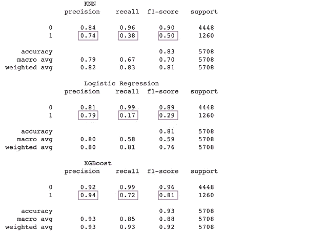

# 信用风险评估的机器学习方法

> 原文：<https://towardsdatascience.com/a-machine-learning-approach-to-credit-risk-assessment-ba8eda1cd11f?source=collection_archive---------5----------------------->

## 分类任务

## *预测贷款违约及其概率*


来源:unDraw.co

## 1.介绍

信用违约风险被简单地称为由于借款人未能偿还贷款而给贷款人造成损失的可能性。信用分析师通常负责通过彻底分析借款人偿还贷款的能力来评估这种风险——但信用分析师的时代已经一去不复返了，现在是机器学习时代！由于其无与伦比的预测能力和速度，机器学习算法可以为信用风险评估领域提供很多东西。在这篇文章中，我们将利用机器学习的力量来预测借款人是否会拖欠贷款，并预测他们的违约概率。让我们开始吧。

## 2.资料组

我们正在使用的数据集可以在 [Kaggle](https://www.kaggle.com/laotse/credit-risk-dataset) 上找到，它包含 32，581 名借款人的数据和与每个借款人相关的 11 个变量。让我们看看这些变量是什么:

*   年龄——数字变量；年龄(年)
*   收入——数字变量；美元年收入
*   家庭状况——分类变量；“租金”、“抵押贷款”或“自有”
*   就业时间——数值变量；就业年限(年)
*   贷款意向——分类变量；“教育”、“医疗”、“风险”、“家居装修”、“个人”或“债务合并”
*   贷款金额——数字变量；贷款金额(美元)
*   贷款等级——分类变量；“A”、“B”、“C”、“D”、“E”、“F”或“G”
*   利率——数字变量；百分比利率
*   贷款收入比——数字变量；介于 0 和 1 之间
*   历史默认值—二元、分类变量；“Y”或“N”
*   贷款状态—二进制数字变量；0(无默认值)或 1(默认值)→这将是我们的目标变量

现在我们知道了我们在这里处理的是什么样的变量，让我们来看看事情的本质。

## 3.数据探索和预处理

首先，让我们继续检查数据集中缺失的值。

```
#Checking for missing values
data.isnull().sum()Age                       0 
Income                    0 
Home_Status               0 
Employment_Length       895 
Loan_Intent               0 
loan_Grade                0 
Loan_Amount               0 
Interest_Rate          3116 
Loan_Status               0 
loan_percent_income       0 
Historical_Default        0 
dtype: int64
```

我们可以看到就业时间和利率都有缺失值。鉴于缺失值只占数据集的一小部分，我们将删除包含缺失值的行。

```
#Dropping missing values
data = data.dropna(axis=0)
```

接下来，我们将寻找数据集中的异常值，以便进行相应的补救。我们将使用 describe()方法来完成这项工作，该方法用于计算描述性统计数据。它不仅有助于识别异常值，还能让我们更好地理解数据是如何分布的。我们还将使用散点图矩阵，这是一个散点图网格，用于可视化变量组合之间的二元关系，以直观地检测异常值。

```
data.describe()
```


作者图片

我不知道你的情况，但我没遇到过那么多活到 144 岁或工作了 123 年的人。除此之外，来自变量*年龄*和*就业时间*的异常值可能会对的模型产生负面影响，因此应该被移除。在此之前，我们将使用散点图矩阵寻找更多的异常值。

```
#Scatterplot matrix
fig = px.scatter_matrix(data, dimensions=
["Age","Income","Employment_Length","Loan_Amount","Interest_Rate"],
labels={col:col.replace('_', ' ') for col in data.columns},           height=900, color="Loan_Status", color_continuous_scale=px.colors.diverging.Tealrose)
fig.show()
```


作者图片

现在很清楚的是*收入*也有一个需要剔除的异常值。我们现在将使用下面几行代码删除所有异常值。

```
#Removing outliers
data = data[data["Age"]<=100]
data = data[data["Employment_Length"]<=100]
data = data[data["Income"]<= 4000000]
```

鉴于我们数据集的性质，我们预计我们正在处理一个不平衡的分类问题，这意味着我们的非违约案例比违约案例多得多。使用下面的代码，我们确认 78.4%的数据集包含非默认案例的情况确实如此。

```
#Percentage of non-default cases
data_0 = data[data.Loan_Status == 0].Loan_Status.count() / data.Loan_Status.count()
data_0
```

考虑到这一点，我们现在将进一步探索*贷款状态*如何与数据集中的其他变量相关联。

```
#Box plot
fig = px.box(data, x="loan_Grade", y="loan_percent_income", color="Loan_Status",
color_discrete_sequence=px.colors.qualitative.Dark24,
labels={col:col.replace('_', ' ') for col in data.columns},
category_orders={"loan_Grade":["A","B","C","D","E","F","G"]})
fig.update_layout(legend=dict(orientation="h", yanchor="bottom",
y=1.02, xanchor="right", x=1))
fig.show()
```


作者图片

当我们看这个方框图时，两件事很快就凸显出来了。我们可以清楚地看到，那些没有违约的人在所有贷款等级中都有较低的贷款收入比均值；这并不奇怪。我们还可以看到，没有贷款等级为 G 的借款人能够偿还他们的贷款！

使用平行类别图，我们可以了解数据集中不同类别变量之间的相互关系，并且我们可以根据*贷款状态绘制出这些关系。*

```
#Parallel category diagram
fig = px.parallel_categories(data, color_continuous_scale=px.colors.sequential.RdBu, color="Loan_Status",
dimensions=['Home_Status', 'Loan_Intent', "loan_Grade", 'Historical_Default'], labels={col:col.replace('_', ' ') for col in data.columns})
fig.show()
```


作者图片

上图的主要要点:

*   我们的数据集主要由以前从未拖欠过贷款的借款人组成；
*   贷款等级“A”和“B”是最常见的等级，而“F”和“G”是最不常见的等级；
*   房屋租赁者比有抵押贷款的人更经常拖欠贷款，而房主拖欠的最少；
*   借款人用于房屋装修的贷款最少，用于教育的贷款最多。此外，用于支付医疗费用和债务整合的贷款违约更为常见。

在我们开始模型训练之前，我们需要确保我们所有的变量都是数值型的，因为我们将要使用的一些模型不能对标签数据进行操作。我们可以简单地使用一键编码方法来做到这一点。

```
#One hot encoding of categorical variables
df = pd.get_dummies(data=data,columns=['Home_Status','Loan_Intent','loan_Grade','Historical_Default'])
```

现在是时候将我们的数据集分割成一列并测试分割，我们将准备好开始构建一些模型。

```
#Train and test split
Y = df['Loan_Status']
X = df.drop('Loan_Status',axis=1)
x_train, x_test, y_train, y_test = model_selection.train_test_split(X, Y, random_state=0, test_size=.20)
```

[Giphy](https://giphy.com/gifs/gotham-fox-3o7abuqxszgO6pFb3i/links)

## 4.模型训练和评估

在本节中，我们将训练和测试 3 个模型，即 KNN、逻辑回归和 XGBoost。我们还将评估他们在预测贷款违约及其概率方面的表现。

首先，我们将构建模型并查看一些评估指标，以评估模型预测类别标签的能力，即默认或无默认。

```
def model_assess(model, name='Default'):
model.fit(x_train, y_train)
preds = model.predict(x_test)
preds_proba = model.predict_proba(x_test)
print('                   ', name, '\n',
classification_report(y_test, model.predict(x_test)))#KNN
knn = KNeighborsClassifier(n_neighbors=151)
model_assess(knn, name='KNN')#Logistic Regression
lg = LogisticRegression(random_state=0)
model_assess(lg, 'Logistic Regression')#XGB
xgb = XGBClassifier(n_estimators=1000, learning_rate=0.05)model_assess(xgb, 'XGBoost')
```



作者图片

我们之前已经认识到，我们正在处理一个不平衡的数据集，因此我们需要确保我们在我们的案例中使用了适当的评估指标。出于这个原因，我们将对常见的**准确性**指标持保留态度。为了说明为什么会出现这种情况，accuracy 计算了真实预测值与输入样本总数的比率，这意味着我们的模型通过预测多数类可以获得相当高的准确性，但无法捕获少数类 default，这可不是什么好事。这就是为什么我们将重点评估模型分类性能的评估指标是**精度**、**召回**和 **F1** **得分**。

首先， **Precision** 给出了分类器预测的真阳性与总阳性的比率，其中阳性表示我们上下文中的默认情况。考虑到它们是我们数据集中的少数类，我们可以看到我们的模型在正确预测这些次要实例方面做得很好。此外，**回忆，**也称为真阳性率，给出了真阳性的数量除以实际上属于阳性类的元素总数。在我们的例子中，回忆是一个比精确度更重要的指标，因为我们更关心假阴性(我们的模型预测某人不会违约，但他们会违约)而不是假阳性(我们的模型预测某人会违约，但他们不会)。最后， **F1 分数**提供了一个衡量精确度和召回率的单一分数。现在我们知道了要寻找什么，我们可以清楚地看到 XGboost 在所有 3 个指标中表现最好。尽管它在精确度上比在召回上得分更高，但它仍然有 0.81 的不错的 F1 分数。

我们现在来看看 **ROC** 其中是一条概率曲线，x 轴是假阳性率(FPR)，y 轴是真阳性率(TPR，召回)。最佳模型应该最大化 TPR 为 1，最小化 FPR 为 0。也就是说，我们可以使用 ROC 曲线曲线下的面积 **AUC** 来比较分类器，其中其值越高，该模型在预测 0 为 0 和 1 为 1 时就越好。

```
#ROC AUC
fig = plt.figure(figsize=(14,10))
plt.plot([0, 1], [0, 1],'r--')#KNN
preds_proba_knn = knn.predict_proba(x_test)
probsknn = preds_proba_knn[:, 1]
fpr, tpr, thresh = metrics.roc_curve(y_test, probsknn)
aucknn = roc_auc_score(y_test, probsknn)
plt.plot(fpr, tpr, label=f'KNN, AUC = {str(round(aucknn,3))}')#Logistic Regression
preds_proba_lg = lg.predict_proba(x_test)
probslg = preds_proba_lg[:, 1]
fpr, tpr, thresh = metrics.roc_curve(y_test, probslg)
auclg = roc_auc_score(y_test, probslg)
plt.plot(fpr, tpr, label=f'Logistic Regression, AUC = {str(round(auclg,3))}')#XGBoost
preds_proba_xgb = xgb.predict_proba(x_test)
probsxgb = preds_proba_xgb[:, 1]
fpr, tpr, thresh = metrics.roc_curve(y_test, probsxgb)
aucxgb = roc_auc_score(y_test, probsxgb)
plt.plot(fpr, tpr, label=f'XGBoost, AUC = {str(round(aucxgb,3))}')plt.ylabel("True Positive Rate")
plt.xlabel("False Positive Rate")
plt.title("ROC curve")
plt.rcParams['axes.titlesize'] = 18
plt.legend()
plt.show()
```


作者图片

我们可以再次看到，XGBoost 性能最好，因为它具有最高的 AUC，因此是区分默认和非默认类的最佳分类器。

到目前为止，我们已经研究了每个模型预测类别标签的能力，现在我们将评估它们在预测样本属于正类别的概率(即违约概率)方面的性能。对于这项任务，我们将使用**可靠性图**和 **Brier 评分**，其中前者创建实际概率与测试集预测概率的图表，后者计算预测概率与其各自正类值之间的均方误差。考虑到 Brier 得分是一个成本函数，Brier 得分越低表示预测越准确。

```
#Reliability plot and Brier Score
fig = plt.figure(figsize=(14,10))
plt.plot([0, 1], [0, 1], color="black")#KNN
knn_y, knn_x = calibration_curve(y_test, preds_proba_knn[:,1], n_bins=10, normalize=True)
loss_knn = brier_score_loss(y_test, preds_proba_knn[:,1])
plt.plot(knn_x, knn_y, marker='o', label=f'KNN, Brier score = {str(round(loss_knn,3))}')#Logistic Regression
lg_y, lg_x = calibration_curve(y_test, preds_proba_lg[:,1], n_bins=10, normalize=True)
loss_lg = brier_score_loss(y_test, preds_proba_lg[:,1])
plt.plot(lg_x, lg_y, marker='o',label=f'Logistic Regression, Brier score = {str(round(loss_lg,3))}')#XGBoost
preds_proba_xgb = xgb.predict_proba(x_test)
xgb_y, xgb_x = calibration_curve(y_test, preds_proba_xgb[:,1], n_bins=10, normalize=True)
loss_xgb = brier_score_loss(y_test, preds_proba_xgb[:,1])
plt.plot(xgb_x, xgb_y, marker='o', label=f'XGBoost, Brier score = {str(round(loss_xgb,3))}')plt.ylabel("Actual probabilty")
plt.xlabel("Predicted probability")
plt.title("Reliability plot")
plt.rcParams['axes.titlesize'] = 18
plt.legend()
plt.show()
```


作者图片

我们可以从上面的 Brier 评分中看到，与其他型号相比，XGBoost 再次表现最佳，这并不令人惊讶。从这个分数和图中，我们得出结论，我们的模型对于概率预测来说是校准良好的，这意味着预测的概率与每个类别的预期概率分布非常匹配，因此不需要进一步校准。

不用说，哪个模型被选为我们在预测类别标签和违约概率方面表现最好的模型。如果你不知何故跳过了前面所有的步骤，发现自己在这里，你应该回去读一下，顺便说一下，这是 XGBoost。

[吉菲](https://giphy.com/gifs/bestcoast-Vdoc3Q62X6aUro6Dv1/links)

## 5.特征重要性

最后但并非最不重要的一点，是时候确定哪些特征对预测我们的目标变量最有影响了。对于这个任务，我们将通过**信息增益**使用特性重要性，它测量每个特性对 XGBoost 中每棵树的贡献。

```
#Feature importance plot
fig, (ax1, ax2) = plt.subplots(figsize = (15, 17), ncols=1, nrows=2)
plt.subplots_adjust(left=0.125, right=0.9, bottom=0.1, top = 0.9, wspace=0, hspace = 0.5)plot_importance(xgb, importance_type='gain', ax = ax1)
ax1.set_title('Feature Importance by Information Gain', fontsize = 18)
ax1.set_xlabel('Gain')
```


作者图片

从上图中我们可以看出，作为住房状况的租金、贷款收入比和贷款等级 C 是预测贷款违约及其概率的三个最重要的特征。

就这样。

## 6.结论

总之，我们分析和预处理了我们的数据，训练和评估了 3 个模型，纳姆利 KNN，逻辑回归和 XGBoost，以了解它们预测贷款违约的能力和概率。我们使用 Precision、Recall、F1 和 ROCAUC 来评估模型在预测类别标签方面的性能。我们特别使用了这些指标，并放弃了准确性，因为我们正在处理一个不平衡的数据集。我们还使用可靠性图和 Brier 评分来评估我们的模型的校准。在确定 XGBoost 在所有指标上表现最佳之后，我们使用信息增益的特性重要性研究了哪些特性对我们的预测最重要。说完这些，我们就可以总结我们的演示了，机器学习是如何应用于信用风险评估领域的。

希望你觉得这篇文章很有见地！