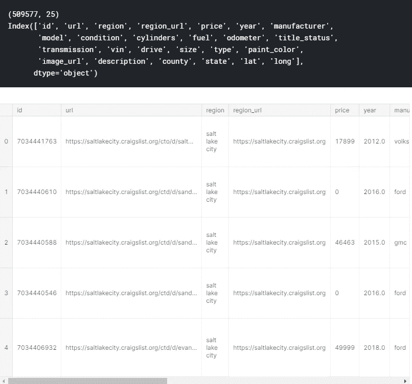
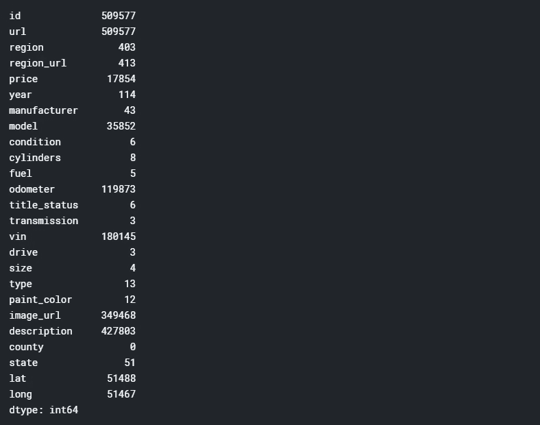
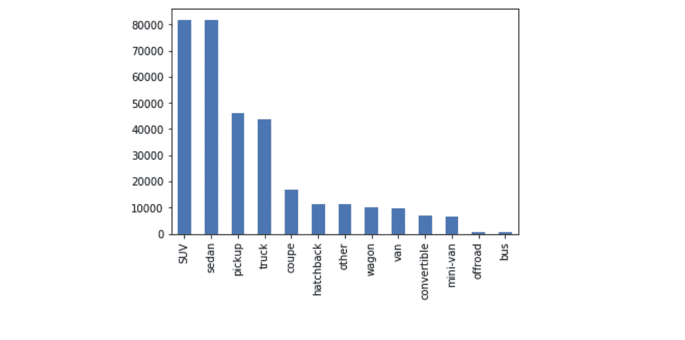
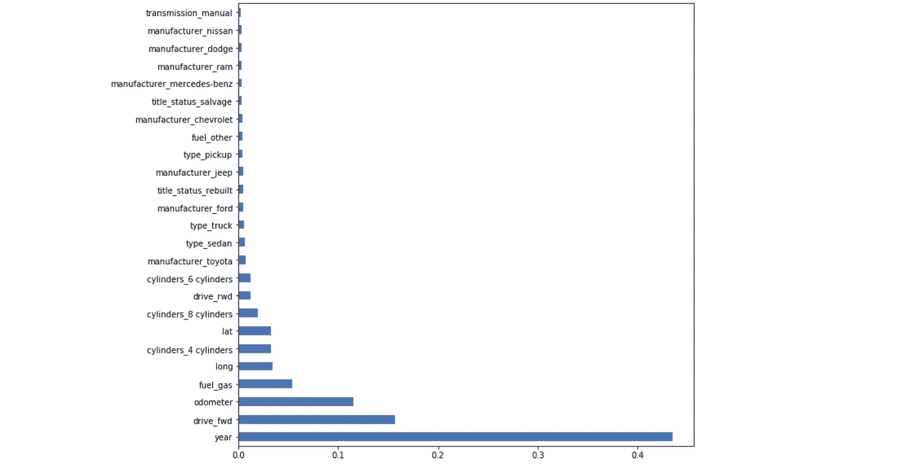

# 机器学习项目——预测二手车价格

> 原文：<https://towardsdatascience.com/a-machine-learning-project-predicting-used-car-prices-efbc4d2a4998?source=collection_archive---------6----------------------->

## 你的第一个机器学习项目的逐步指南！


这是给那些想进入数据科学的人，他们有一点点知识，但很难想出你的第一个数据科学项目。这就是为什么我创建了一个逐步指南来完成您的第一个端到端机器学习模型！跟着做，你会学到很多新技能。

我使用了 [Kaggle 的二手车数据集](https://www.kaggle.com/austinreese/craigslist-carstrucks-data)，因为它有各种分类和数字数据，并允许您探索处理缺失数据的不同方式。我把我的项目分成三部分:

1.  [探索性数据分析](#c0d7)
2.  [数据建模](#207c)
3.  [特征重要性](#eced)

# 1.探索性数据分析

## 了解我的数据

```
*# Importing Libraries and Data*
import numpy as np
import pandas as pd *# data processing, CSV file I/O (e.g. pd.read_csv)*
import os
for dirname, _, filenames **in** os.walk('/kaggle/input'):
    for filename **in** filenames:
        print(os.path.join(dirname, filename))df = pd.read_csv("../input/craigslist-carstrucks-data/vehicles.csv")*# Get a quick glimpse of what I'm working with*
print(df.shape)
print(df.columns)
df.head()
```

在处理数据科学问题时，我总是做的第一件事是了解我正在处理的数据集。使用 **df.shape** 、 **df.columns** 和 **df.head()** ，我能够看到我正在处理的特性以及每个特性需要什么。



## 探索分类数据

```
df.nunique(axis=0)
```

我喜欢使用 **df.nunique(axis=0)** ，来查看每个变量有多少个唯一值。利用这个，我可以看到是否有什么不寻常的事情，并找出任何潜在的问题。例如，如果它显示有 60 个州，这将引发一个红旗，因为只有 50 个州。



## 探索数字数据

```
df.describe().apply(lambda s: s.apply(lambda x: format(x, 'f')))
```

对于数字数据，我使用 **df.describe()** 来快速浏览我的数据。例如，我可以立即看到*价格、*的问题，因为最低价格是 0 美元，最高价格是 3，600，028，900 美元。

稍后，您将看到我是如何处理这些不切实际的异常值的。


## 包含太多空值的列

```
NA_val = df.isna().sum()def na_filter(na, threshold = .4): *#only select variables that passees the threshold*
    col_pass = []
    for i **in** na.keys():
        if na[i]/df.shape[0]<threshold:
            col_pass.append(i)
    return col_passdf_cleaned = df[na_filter(NA_val)]
df_cleaned.columns
```

在继续我的 EDA 的其余部分之前，我使用上面的代码删除了超过 40%的值为 null 的所有列。这使我剩下下面的专栏。


## 移除异常值

```
df_cleaned = df_cleaned[df_cleaned['price'].between(999.99, 250000)] *# Computing IQR*
Q1 = df_cleaned['price'].quantile(0.25)
Q3 = df_cleaned['price'].quantile(0.75)
IQR = Q3 - Q1*# Filtering Values between Q1-1.5IQR and Q3+1.5IQR*
df_filtered = df_cleaned.query('(@Q1 - 1.5 * @IQR) <= price <= (@Q3 + 1.5 * @IQR)')
df_filtered.boxplot('price')
```


在使用四分位(IQR)方法移除价格的异常值之前，我决定将*价格*的范围设置为更现实的数字，这样标准差将被计算为比 9，575，025 更现实的数字。

IQR 也称为中间值，是一种统计离差的度量，可用于识别和移除异常值。IQR 范围规则的理论如下:

1.  计算 IQR (=第三个四分位数-第一个四分位数)
2.  找出范围的最小值(=第一个四分位数— 1.5 * IQR)
3.  找出范围的最大值(=第三个四分位数+ 1.5 * IQR)
4.  删除任何超出此范围的值。

你可以在上面的方框图中看到，我使用这种方法显著缩小了*价格*的范围。

```
df_filtered.describe().apply(lambda s: s.apply(lambda x: format(x, 'f')))
```


使用**。describe()** 同样，我们可以看到价格范围似乎比最初更现实，但年份和里程表似乎有点偏离(例如，2021 年的最大值)。

我使用下面的代码将年份范围设置为 1900–2020，将里程表设置为 0–271，341.5。

```
*# cant be newer than 2020*
df_filtered = df_filtered[df_filtered['year'].between(1900, 2020)]*# = 140000 + 1.5 * (140000-52379)*
df_filtered = df_filtered[df_filtered['odometer'].between(0, 271431.5)]
```

## 删除剩余的列

```
df_final = df_filtered.copy().drop(['id','url','region_url','image_url','region','description','model','state','paint_color'], axis=1
df_final.shape
```

通过部分使用我的直觉，部分猜测和检查，我删除了以下几列:

*   *url* ， *id* ， *region_url* ， *image_url:* 它们与正在进行的分析完全无关
*   *描述*:描述可能可以使用自然语言处理，但是超出了本项目的范围，因此不予考虑
*   *地区，州:*我去掉了这些，因为它们本质上传达的信息和经度和纬度是一样的。
*   *model* :我去掉了这个，因为有太多不同的值，无法将其转换为虚拟变量。此外，我不能使用标签编码，因为值是无序的。
*   *paint_color* :最后我在进行了特征重要性(稍后你会看到)后去掉了这个。由于特征重要性表明 *paint_color* 在确定*价格*中的重要性很小，所以我将其移除，模型的准确性提高了。

## 可视化变量和关系

```
import matplotlib.pylab as plt
import seaborn as sns*# calculate correlation matrix*
corr = df_final.corr()*# plot the heatmap*
sns.heatmap(corr, xticklabels=corr.columns, yticklabels=corr.columns, annot=True, cmap=sns.diverging_palette(220, 20, as_cmap=True))
```

清理完数据后，我想可视化我的数据，并更好地理解不同变量之间的关系。利用 **sns.heatmap()** 我们可以看到*年份*与*价格*正相关*里程表*与*价格*负相关——这个有道理！看来我们走对了路。


```
df_final['manufacturer'].value_counts().plot(kind='bar')df_cleaned['type'].value_counts().plot(kind='bar')
```

出于我自己的兴趣，我使用条形图绘制了一些分类属性(见下文)。为了更好地了解数据集，您还可以做更多的可视化工作，如散点图和箱线图，但我们将进入下一部分，数据建模！



# 数据建模

## 虚拟变量

```
df_final = pd.get_dummies(df_final, drop_first=True)
print(df_final.columns)
```

为了能够在我的随机森林模型中使用分类数据，我使用了 **pd.get_dummies()。这实质上是将变量的每个唯一值变成它自己的二进制变量。例如，如果制造商之一是本田，那么将创建一个名为“manufacturer_honda”的新虚拟变量，如果是本田，它将等于 1，否则等于 0。**


## 缩放数据

```
from sklearn.preprocessing import StandardScaler
X_head = df_final.iloc[:, df_final.columns != 'price']X = df_final.loc[:, df_final.columns != 'price']
y = df_final['price']
X = StandardScaler().fit_transform(X)
```

接下来，我使用**标准缩放器**缩放数据。Prasoon 提供了一个很好的答案[这里](https://www.quora.com/Why-do-we-normalize-the-data)为什么我们要缩放(或标准化)我们的数据，但本质上，这样做是为了我们的自变量的缩放不会影响我们模型的组成。例如，*年*的最大数字是 2020，*里程表*的最大数字超过 20 万。如果我们不对数据进行缩放，里程表*的一个小变化*会比*年*的同样变化产生更大的影响。

## 创建模型

```
from sklearn.ensemble import RandomForestRegressor
from sklearn.model_selection import train_test_split
from sklearn.metrics import mean_absolute_error as maeX_train, X_test, y_train, y_test = train_test_split(X, y, test_size=.25, random_state=0)
model = RandomForestRegressor(random_state=1)
model.fit(X_train, y_train)
pred = model.predict(X_test)
```

我决定使用随机森林算法有几个原因:

1.  它**很好地处理了高维度**，因为它采用了数据子集。
2.  它非常通用，并且只需要很少的预处理
3.  这在**避免过度拟合**方面很棒，因为每个决策树都具有低偏差
4.  它允许您检查**特性重要性**，您将在下一节看到！

## 检查模型的准确性

```
print(mae(y_test, pred))
print(df_final['price'].mean())model.score(X_test,y_test)
```

总的来说，我的模型在平均价格为 12600 美元左右的情况下实现了 1590 美元的 MAE，准确率为 90.5%！


MAE 和平均价格


模型的准确性

# 特征重要性

```
feat_importances = pd.Series(model.feature_importances_, index=X_head.columns)
feat_importances.nlargest(25).plot(kind='barh',figsize=(10,10))
```

我花了很多时间寻找特性重要性的最佳定义，Christoph Molnar 提供了最佳定义(见[这里](https://christophm.github.io/interpretable-ml-book/feature-importance.html))。他说:

> 我们通过计算置换特征后模型预测误差的增加来衡量特征的重要性。如果打乱某个特征的值会增加模型误差，则该特征是“重要的”，因为在这种情况下，模型依赖于该特征进行预测。“如果改变某个特征的值而不改变模型误差，则该特征是“不重要的”，因为在这种情况下，模型在预测中忽略了该特征。”

鉴于此，我们可以看到决定*价格*的三个最重要的特征是*年份、驱动(如果是前轮驱动的话)*和*里程表。*特性重要性是向非技术人员合理化和解释您的模型的好方法。如果您需要降低维度，它对于特征选择也非常有用。



我的项目到此为止！我希望这能激励那些想进入数据科学的人真正开始。请在评论中让我知道你将来还想看到哪些有趣的项目:)

> 更多类似的文章，请查看 https://blog.datatron.com/的

# 感谢阅读！

如果你喜欢我的工作，想支持我…

1.  支持我的最好方式就是在**媒体**T2 上关注我。
2.  在**推特** [这里](https://twitter.com/terence_shin)成为第一批关注我的人之一。我会在这里发布很多更新和有趣的东西！
3.  此外，成为第一批订阅我的新 **YouTube 频道** [这里](https://www.youtube.com/channel/UCmy1ox7bo7zsLlDo8pOEEhA?view_as=subscriber)！
4.  在 **LinkedIn** [这里](https://www.linkedin.com/in/terenceshin/)关注我。
5.  在我的**邮箱列表** [这里](https://forms.gle/UGdTom9G6aFGHzPD9)报名。
6.  查看我的网站，[**terenceshin.com**](https://terenceshin.com/)。