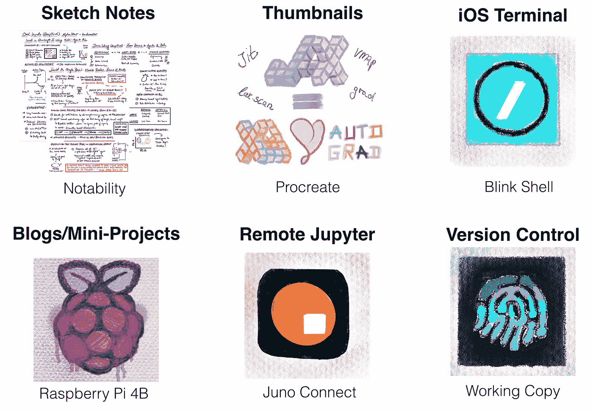
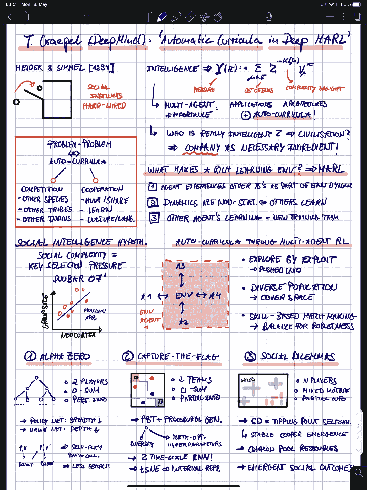
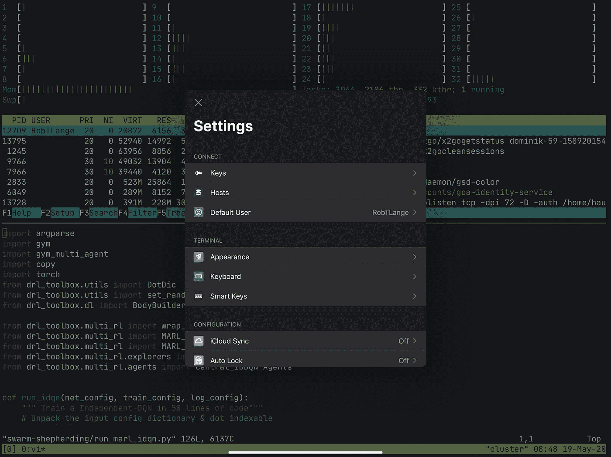
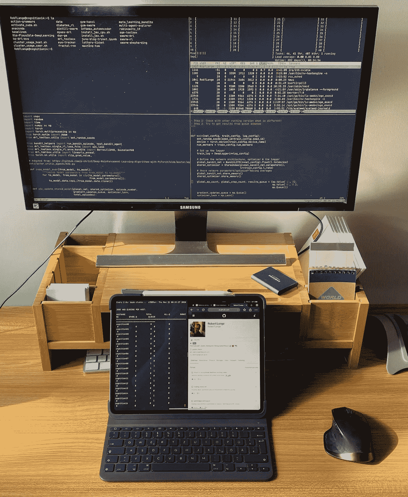
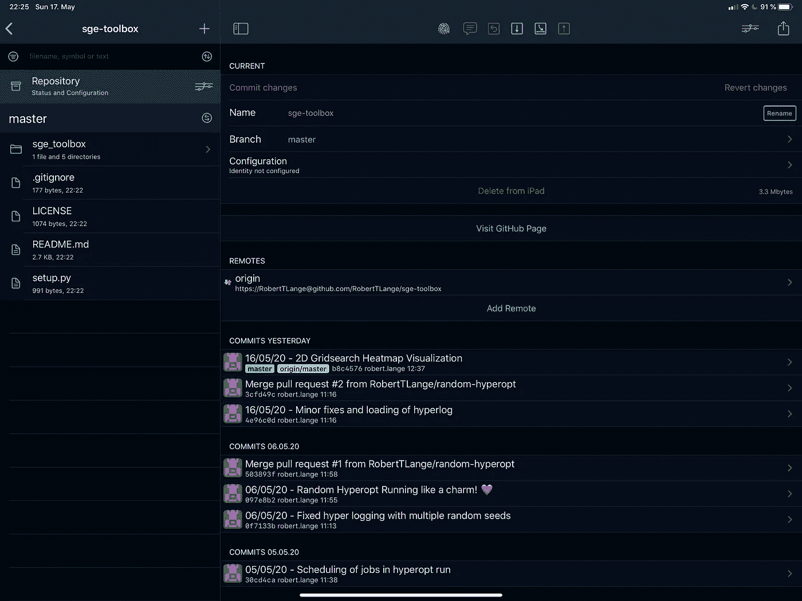
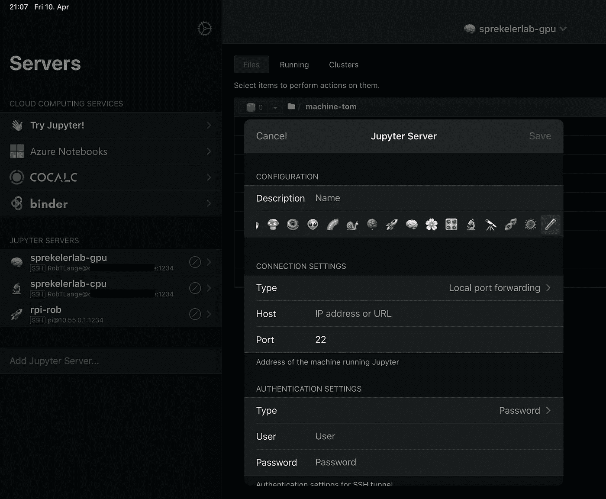
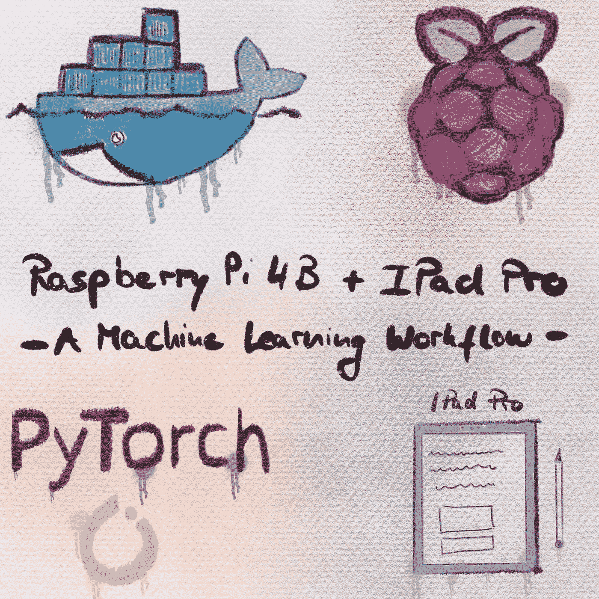
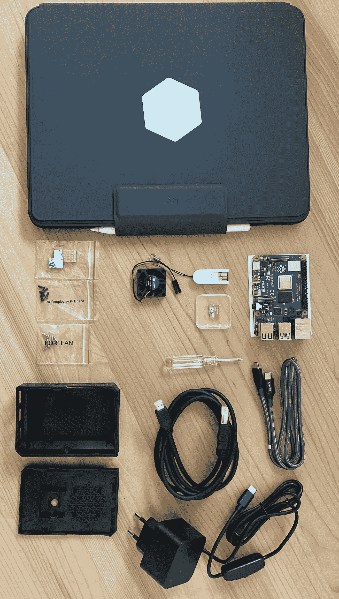
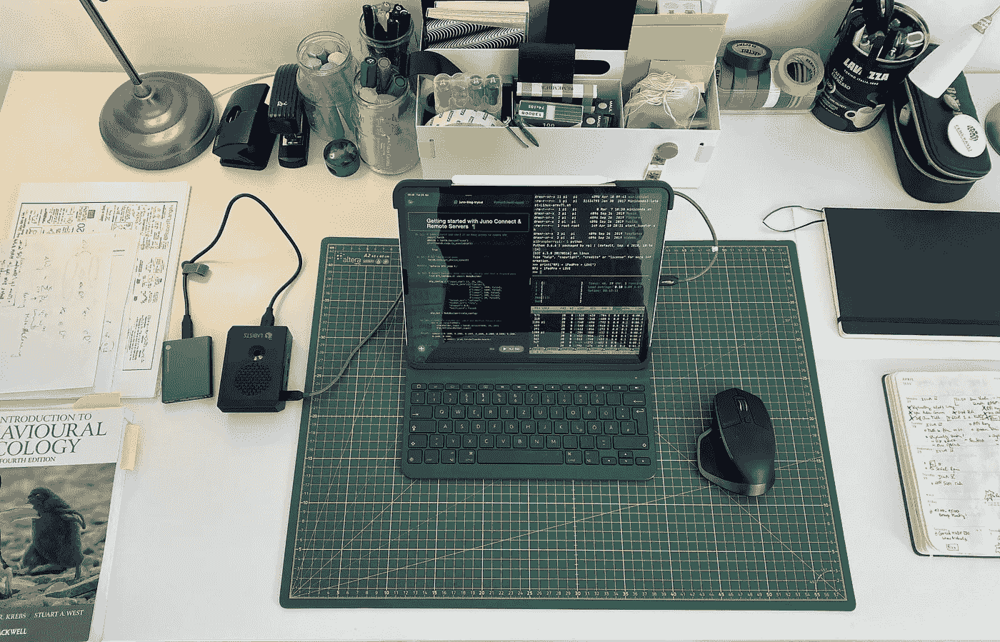
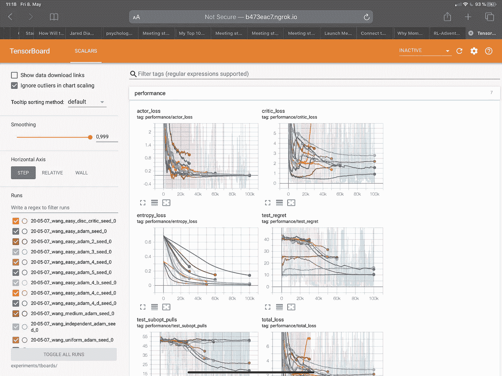

# iPad Pro 的机器学习工作流程

> 原文：<https://towardsdatascience.com/a-machine-learning-workflow-for-the-ipad-pro-bc640eead25a?source=collection_archive---------11----------------------->

iPad 是一个革命性的设备。我带着它记下所有的笔记，阅读注释论文，并在上面进行大部分的概念头脑风暴。但是*机器学习应用*怎么样？在今天的帖子中，我们将回顾一组有用的工具&探索 iPad Pro 的爱情故事&新的 Raspberry Pi (RPi)。之后，您将能够建立自己的“迷你”ML 工作流程，了解 ML 定制的应用环境&开始将 RPi 设置为 iPad 驱动的 USB-C 设备。更具体地说，我们将讨论我如何在日常研究中集成一组有用的应用程序，我如何开始使用 iPad & RPi，以及如何使用 iPad 在远程服务器上运行更大的计算任务。所以让我们开始吧！

iPad Pro 是我最好的金融投资之一。它主要是为需要直观高效工作流程的多媒体创意人员设计的。这包括艺术家、创作者和媒体编辑。不一定是喜欢编程的人。就在最近，苹果一直在推动 iPad Pro 成为独立的电脑替代品。最大的进步是 USB-C 端口，它允许同时充电和数据交换。结合新的 [iPadOS](https://www.apple.com/ipados/) 我们可以开始梦想&实验。此外，最近应用程序的更新和新的推出为代码 savy peepz 带来了过多的可能性。以下是我最喜欢的一些:

# 笔记&论文注释与显著性&生成✏️

诉讼中的知名度

我用大部分“iPad 时间”阅读论文，在会谈或项目头脑风暴会议上做笔记。有许多选项允许你这样做。我个人真的很喜欢 T2 的知名度。这是非常灵活的，同时在它的设计最小化。我非常欣赏的一个功能是**裁剪文本片段的简易性** &你可以流畅地包含来自演示文稿/白板/在线搜索的图片。完成写作后，或者如果你想分享你的笔记，你可以将它们导出到任何云存储中，或者通过隔空投送/电子邮件来分享。这使得协作变得超级容易！我还为所有的[可视 ml 注释](https://visual-ml-notes.github.io/)使用了 Notability(查看[库](https://github.com/visual-ml-notes/visual-machine-learning-notes))。最后，一个我没有充分使用(但应该使用)的功能是**录音&回放笔记**。知名度允许你在写作的时候记录。之后，您只需按下 play，就可以在再次收听音频的同时获得笔记创建过程的视频形式。您可以“轻敲”笔记，音频时间线将自动跳转到写作时正在录制的音频。很漂亮，对吧？

让我们用生育创造一些艺术

如果我想更艺术一点，我喜欢选择[生育](https://procreate.art/)。有时候，让自己沉浸在绘画的一些细节中真的很放松(有时候我在想，星期天是不是为*“人类创造的极致”*)而生的)。我最近的博客缩略图在《生育》中有插图。对于艺术家(和艺术爱好者)来说，生殖是一个“严肃”的应用🤗)并有大量的功能来调整颜色，绘画风格，画布&等等。我不得不承认——最初选择的数量有点多。这就是万维网拯救我的地方。YouTube 上有很多很棒的教程。即使你不是最擅长绘画的人(我肯定不是), Procreate 也有一套工具来支持你(线捕捉，不同的图层，等等)。).我真正喜欢的是镜像选项，它让每一个小涂鸦看起来都像一个书法大师的作品(也许我在这里有点夸张)。

# 使用 blink.sh ️连接到远程机器👀

很多时候，当我参加会议时，我不想带着笔记本电脑，因为我知道我不会有太多的时间专注于项目。但是我仍然可能运行一些任务或者测试一些超参数直觉。在这种情况下，我只需要某种方式进入我的远程机器，这样我就可以监视正在发生的事情，并根据需要启动新的作业。这就是 [blink.sh](https://blink.sh/) 的用武之地。

在 blink.sh 中添加远程主机

Blink 是一个 Mosh(移动外壳)应用程序，可以让你顺利地进入你选择的任何远程机器。Blink 允许您为您的`ssh`服务器设置多个主机&快捷方式。我已经为一个小型 AWS EC2 实例、我的实验室集群和我的 Raspberry Pi 设置了几个组件(稍后会详细介绍)。给我一个 LTE 连接，我可以从任何地方登录到主机，而无需设置热点。一旦你登录了(并且掌握了一个终端模拟器，比如`[tmux](https://gist.github.com/andreyvit/2921703)` / `[screen](https://gist.github.com/jctosta/af918e1618682638aa82)`)你就已经把普通 Linux 操作系统的所有远程功能移植到 iPad 上了！

我用 blink.sh 设置的例子

我需要告诉你 Blink 还有一个很棒的特性:使用外部显示器和多个 Blink 窗口。你所要做的就是通过 USB-C 将你的 iPad 连接到一个外部显示器上。虽然通常外部显示器会与你的 iPad 同步，但 Blink Shell 会自动在外部显示器上投影第二个窗口，这样你就可以充分利用你的设置。然后，您可以使用`cmd + o`在闪烁窗口之间轻松切换，并使用远程`tmux`会话& `ctrl + b + arrows`在闪烁窗口内切换。对我来说，这个功能非常重要，它让我觉得我可以在列车上完成较小类型的任务之间无缝切换，在办公室类型的环境中切换到更严肃的工作。

Blink 的设计是最小化的，它专注于 mosh/ssh 服务。下面是一些我期待被整合(或者可能还没有发现)的东西:

*   分割闪烁窗格:有时你想同时登录两台独立的机器。眨眼没问题。但是你必须创造一个新的眨眼“窗口”&在它们之间移动。相反，我想把当前窗口分成多个窗格。
*   一种直接在 iPad 上编辑文件的方法&与 iPadOS 文件系统集成。
*   一些简单的方法可以将 iPad 上的文件同步到远程机器上&反之亦然。

# 使用 Kodex & WorkingCopy 进行编辑和版本控制💾

如果我想在 iPad 上本地编码，这通常包括 4 个主要步骤:

使用工作副本进行版本控制

1.  使用版本控制应用 [WorkingCopy](https://workingcopyapp.com/) 从我的 GitHub 本地克隆一个库。
2.  使用免费的& awesome [Kodex](https://kodex.app/) 编辑器在本地编辑必要的文件。
3.  使用本地 IDE(例如 [Pythonista3](http://omz-software.com/pythonista/) 或[Juno for Jupyter](https://juno.sh/)——见下文)测试代码，或者在使用`scp`复制文件后远程测试代码。
4.  `commit`和`push`使用 WorkingCopy 将编辑内容再次返回到您想要的存储库分支。

WorkingCopy 允许您将 iPad 与 GitHub 帐户连接起来，并提供所有可能需要的版本控制功能。另一方面，Kodex 是 iPad 的文本编辑器，它支持几乎所有编程语言的 linter 工具。你可以直接从你的云存储(Dropbox 等)中编辑文件。)或 iPad 本地。Kodex 和 WorkingCopy 都是免费的！

# 使用 Juno Connect 连接到 Jupyter 服务器📶

所以让我们回顾一下到目前为止我们已经涉及的内容:文书工作和艺术类的东西，连接到远程机器&编辑/管理基于代码的项目。我们遗漏了什么？没错，每个数据科学家最喜欢的应用程序——Jupyter 笔记本——下面是如何在 iPad 上使用 Jupyter:Juno 应用程序集合为我们提供了两个选项来设置/连接 Jupyter 服务器&在 iPad 上本地或远程使用笔记本:

1.  Juno for Jupyter :本地版可以让你直接在 iPad 上运行笔记本。您可以通过标准的 PyPi 存储库安装软件包。从那以后，你可以自由地制作原型。*注意*:在你的 iPad 上拥有一个完整的“迷你”环境可能会有所帮助，但我个人更喜欢在没有任何互联网连接的情况下通过 Raspberry Pi 运行东西(见下文)。
2.  Juno Connect for Jupyter :我真正的全明星是 Juno Connect。connect-version 使得通过隧道连接到任何转发远程 jupyter 服务器的端口变得非常简单。这是通过在您的远程机器上使用`jupyter notebook --ip 0.0.0.0 --port 8899 --no-browser`启动和暴露 jupyter 端口来完成的。

用户界面和笔记本呈现如下所示:

通过 Juno 轻松实现远程服务器连接

我在 Juno 中缺少的并且希望在未来看到的是 Jupyter Lab 的功能，它包括对系统外壳的支持以及其他 T2 的优秀扩展。Jupyter Lab(与普通的 Jupyter 笔记本相比)我最喜欢的功能之一是内置的终端多路复用器，它允许你在命令行和笔记本编辑之间轻松切换。

# iPad Pro +树莓 Pi 型号 4B = ️🧡

iPad Pro 本身没有完整的操作系统，也不应该被认为是一台计算机🤖。

尽管苹果声称 64 位 A12X/A12Z 仿生芯片比许多 Windows 电脑都快，但它们的性能是针对渲染/4K 编辑/游戏等图形操作进行优化的，而不是针对运行 Python 代码。这就是树莓派的用武之地。新的[四核 RPi 型号 4](https://www.raspberrypi.org/products/raspberry-pi-4-model-b/) 有几个不同的版本(1/2/4 GB) RAM，最重要的是有一个 USB-C 连接，可以同时供电和交换数据。它不比一包香烟大🚬&可以轻松连接到 iPad Pro。那么这种设置的主要好处是什么呢？

1.  您可以随时随地构建小型应用程序的原型。
2.  你有一个扩展(和美化)的加密狗。RPi 有一组 USB 2.0 和 3.0 端口以及一个音频插孔。
3.  通过 Raspbian Buster/Linux 环境，您可以获得更流畅的 git/版本控制支持。
4.  您不再依赖稳定的互联网连接来登录远程服务器。
5.  您可以安装外部固态硬盘/存储器，以便与 iPad 交换更大的文件，并随时进行备份。

那么，我们如何让这个工作？

# 设备，设备⚒️ -我们需要什么？！

那么，我目前使用的配料是什么呢？下面是一个简短的列表:

工具，工具，工具

1.  带有 USB-C 的 iPad Pro 第 3 代(或更高版本)
2.  RaspberryPi Model 4 又带 USB-C。有许多[入门包](https://www.amazon.com/LABISTS-Raspberry-Complete-Preloaded-Heatsinks/dp/B07YRSYR3M/ref=sxin_0_osp35-ba0f8bee_cov?ascsubtag=amzn1.osa.ba0f8bee-ff67-4e52-9ec3-fd1b06c8e77b.ATVPDKIKX0DER.en_US&creativeASIN=B07YRSYR3M&crid=1Y0EGG29LEWM9&cv_ct_cx=raspberry+pi+4&cv_ct_id=amzn1.osa.ba0f8bee-ff67-4e52-9ec3-fd1b06c8e77b.ATVPDKIKX0DER.en_US&cv_ct_pg=search&cv_ct_wn=osp-search&dchild=1&keywords=raspberry+pi+4&linkCode=oas&pd_rd_i=B07YRSYR3M&pd_rd_r=b168d592-ef1a-4c4e-a592-f4b45eae9199&pd_rd_w=KOXD6&pd_rd_wg=7LgYD&pf_rd_p=512a262a-4ed3-4613-bc5f-04e64a7bad4e&pf_rd_r=0HWSE2GE7FXMWYV4P3XY&qid=1587973967&sprefix=raspber%2Caps%2C262&sr=1-2-32a32192-7547-4d9b-b4f8-fe31bfe05040&tag=heavy0013-20)以合理的价格为您提供入门所需的一切。
3.  一套基本的 RPi 基础，包括一个微型 SD 卡，一些散热器和一种保持 Pi 冷却的方法(用于 CPU 的迷你超频)。
4.  一根 USB-C 转 USB-C 线，可以给 RPi 充电，我们将用它来连接 iPad 和 RPi。请注意，RPi 并不支持所有 USB-C 电缆。我用的是 Anker 的电缆。
5.  初次启动时将 RPi 连接到屏幕的方法(例如微型 HDMI 电缆)。
6.  快速外置固态硬盘，可交换文件和数据。(我用的是 500 的[三星 T5](https://www.amazon.com/Samsung-T5-Portable-SSD-MU-PA500B/dp/B073GZBT36/ref=sr_1_3?dchild=1&keywords=samsung+ssd&qid=1587969846&sr=8-3)
7.  蓝牙兼容鼠标。(我用的是[罗技 MX Master 2](https://www.amazon.com/Logitech-Master-Wireless-Mouse-High-precision/dp/B00TZR3WRM/ref=sr_1_7?crid=2H2AN7BTDK7AV&dchild=1&keywords=logitech+mx+master+2&qid=1587969802&sprefix=logitech+mx+master%2Caps%2C246&sr=8-7) 。)
8.  额外的 RPi 小工具和扩展，如传感器和摄像头。

最后三个都是可有可无的可以平滑掉的体验。

# 设置树莓 Pi 的步骤🍓

1.  下载一个刷新操作系统镜像的工具(例如 [Etcher](https://www.balena.io/etcher/) )。
2.  下载一个 [Raspbian Buster 图像](https://www.raspberrypi.org/downloads/raspbian/)并将其刷新到 Pi 的微型 SD 上。然后，插入 Pi 的 Micro-SD 插槽(在板的背面)。
3.  将 Raspberry Pi 放入机箱中，连接散热器和风扇(使用引脚 4 和 6)。
4.  启动 Pi 并设置新密码。之后，您可以[将您的 RPi 连接到互联网](https://raspberrypihq.com/how-to-connect-your-raspberry-pi-to-wifi/)。
5.  设置 Miniconda 3(例如使用这些[指令](https://gist.github.com/simoncos/a7ce35babeaf73f512be24135c0fbafb))。
6.  按照这些[说明](https://www.hardill.me.uk/wordpress/2019/11/02/pi4-usb-c-gadget/)将 Pi 设置为 USB-C 设备。

**注意**正确的最终指令应该加上`sh /root/usb.sh to /etc/rc.local`。

如果您可以使用外部显示器来检查一切是否都如您所愿，那么第一步就容易多了。

# 设置 iPad Pro 的步骤📱

此时，您已经准备好在 iPad 上运行所有内容:

1.  下载一个 shell 客户端。比如我最喜欢的 Blink shell。
2.  通过 USB-C 将 Raspberry Pi 连接到 iPad。此时，Pi shoot 检测到电源并开始启动。这可能需要 30 秒。
3.  转到设置，检查是否有一个新的“以太网”标志，并确保检测到 Pi。如果没有，请确保将 RPi 设置为 USB-C 设备的第 6 步成功完成！
4.  转到您的 iPad shell，通过`ssh pi@10.55.0.1`SSH 到 Pi，这是我们之前设置的静态 IP。然后，您应该能够使用您的 RPi 用户名和密码登录。

您应该第一次登录 RPi，现在我们可以更深入地了解了。完整的 RPi-iPad 设置如下所示:

# ⎘接下来要做的事情

您已经完成了&现在可以开始根据您的需求定制所有功能了！我最初的一些步骤包括:

*   通过创建 iPad 热点并自动将 RPi 连接到您的 WiFi 来设置 LTE 使用。为此，我使用了一个捷径(见最后一节的交易技巧)。
*   安装 Jupyter 并使用 Juno 软件包创建工作环境。
*   在 Blink shell 中设置主机，并开始在其他远程机器上工作。
*   熟悉使用`tmux`或`screen`操作多个终端面板。
*   熟练使用基于命令行的编辑器，如`vim`或`nano`进行编辑。

根据我的经验，RPi 不会从 iPad 吸取太多能量。在没有任何电源的情况下，iPad 充满电可以让我使用大约 5 个多小时的 RPi(在中等计算和主动风扇的情况下)。这通常对我来说已经足够了。有两个 USB-C 端口的 USB-C 适配器可能会派上用场。这样你就可以给 iPad 充电，同时给 RPi 供电。

# 计算，计算，计算📈

至此，我们已经讨论了使用 iPad 进行科学计算的两种主要方式:

1.  使用一个远程服务器，并使用 Blink.sh 将`ssh`加入其中。
2.  使用 Juno Connect 作为移植 Jupyter 服务器的便捷方式。

现在我们有了更多的选择:

如前所述，Juno 还允许您连接到运行在 RPi 上的笔记本电脑。为此，您只需在 RPi 上设置 Miniconda(Python > = 3.6)，然后再次运行带有端口转发的无浏览器笔记本进程。而且你甚至不需要任何网络连接！

# 使用外部固态硬盘管理文件，`scp` & Netatalk

RPi 的优势之一是随身携带一个增压适配器加密狗🤓这让你可以更好地利用 iPad 的单个 USB-C 端口，并开辟了在 RPi 和 iPad 之间交换文件的可能性。我做的第一件事就是在 RPi 上安装一个固态硬盘，并在启动时自动完成这个过程。这允许您在 RPi &上探索更大的数据集，以便随时随身携带我的主笔记本电脑的备份。此外，iPad 的文件系统允许我们[轻松地将 RPi 中的文件下载到 iPad 或任何电脑上](https://pimylifeup.com/raspberry-pi-afp/)。

# 使用新的 iPadOS 快捷方式应用程序来顺利整合事情。

在启动和设置 RPi 时，以及更一般的日常活动中，快捷方式非常方便。以下是我最喜欢的几个:

1.  [通过](https://www.icloud.com/shortcuts/ac9bc8fafc48436c8f824513e8fc9763) [TechCraft](https://youtu.be/SPSlyqo5Q2Q) 的快捷方式关闭 RPi
2.  [通过](https://www.icloud.com/shortcuts/360c5a095bb64bc6b6097de865fce569) [TechCraft](https://youtu.be/SPSlyqo5Q2Q) 的快捷方式连接 RPi 和 WiFi
3.  [Jason Snell](https://www.icloud.com/shortcuts/0ee9415dd0bd4544971cf44e4fd70c7b)[分享文件尺寸缩小的图像](https://twitter.com/jsnell)

# 使用 ngrok 监控远程 Tensorboard 环回地址

使用 ngrok 查看张量板

另一个很酷的通用工具是 [ngrok](https://ngrok.com/) 。ngrok 允许您从公共 URL 访问本地服务器。正如 public 这个词可能已经说明的那样，安全性不一定得到保证，可能需要您做出一些额外的努力。我主要使用 ngrok 来隐式转发一个端口，我用它来简单地监视 tensorboards。原因是我还没有找到一种方法可以单独在 blink shell 中实现这一点。注册&安装 ngrok 后，您必须在您的 ngrok 配置中添加一个认证 id，然后 tensorboard 端口转发就像下面这样简单:

*   在远程机器的端口上启动 tensor board:`tensorboard --logdir experiments/tboards/ --port 6006`
*   将端口暴露给公共 URL(也来自远程机器):`./ngrok http 6006`

ngrok 会将您的本地主机实例转发到一个扩展名为`.ngrok.io`的 web URL。无论你在哪里，你都可以渴望学习曲线。

哇，这是相当多的文本和图像。但是仍然有太多的东西需要讨论(例如，Bear 的 markdown 编辑)。将来，我期待在一组 rpi 上建立一个小型 Kubernetes 集群。目前我对它没有任何用处，但这将是一次很好的(也不太昂贵的)学习经历——因为我对分布式计算知之甚少。此外，我很想让 JAX 参加 RPi。截至目前，有一个[未解决的问题](https://github.com/google/jax/issues/1161)来创建类似于如何将 TensorFlow 安装在 RPi 上的臂轮。CPU 的加速真的可以促进我的一些移动深度学习项目。

*一些最后的公共服务公告*:

👉鼓舞人心的道具去了 Rob 的(不是另一个)YouTube 频道 [TechCraft](https://roberttlange.github.io/posts/2020/04/blog-post-11/youtube.com/c/techcrafted) 。他有一个[很棒的视频](https://www.youtube.com/watch?v=IR6sDcKo3V8)是关于用 iPad Pro 驱动一个普通的 RPi 设置。看看吧！

👉大多数应用程序和设置都是要花钱的。我一直相信投资教育和工具能让我最有效率。但是你可能会有不同的想法或者处于不同的位置。这没关系。对于我在这篇博客中提到的大多数事情，都有免费的替代方案&你不需要苹果平板电脑来创建类似的工作流程。

👉我没有因为写这篇博客而从应用公司、苹果或任何人那里得到任何报酬/收益(从来没想过我会写这篇文章)。我只是喜欢分享我喜欢的东西，让我的生活更轻松。

对你的新设置满意的工具，

抢劫

附:让我( [@RobertTLange](https://twitter.com/RobertTLange) )知道我是否错过了你最喜欢的工具！

*原载于 2020 年 5 月 23 日*[*https://roberttlange . github . io*](https://roberttlange.github.io/posts/2020/04/blog-post-11/)*。*