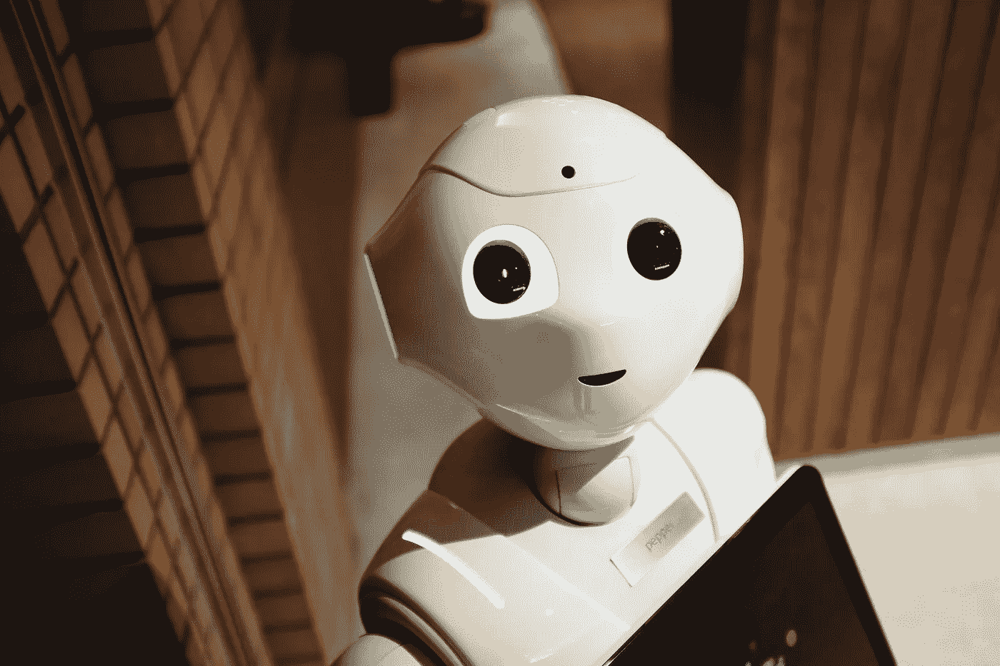

# 一台机器预测了我的下一句话

> 原文：<https://towardsdatascience.com/a-machine-predicts-my-next-sentence-d5a0767b6233?source=collection_archive---------61----------------------->

## 使用 Docker 和 TensorFlow 通过 RNN 生成文本



[亚历山大·奈特](https://unsplash.com/@agkdesign?utm_source=unsplash&utm_medium=referral&utm_content=creditCopyText)在 [Unsplash](https://unsplash.com/s/photos/robot?utm_source=unsplash&utm_medium=referral&utm_content=creditCopyText) 上的照片【1】

# 目录

1.  文本生成
2.  码头工人
3.  张量流
4.  资料组
5.  密码
6.  摘要
7.  参考

# 文本生成

文本生成属于数据科学的一个分支，即自然语言生成或通常称为 NLG。自然语言处理(NLP)使用库来清理、转换、变换并最终操纵文本，而 NLG 则努力从过去的数据中创造新的文本。

其中一个突出的例子是聊天机器人。它使用各种不同类型的算法来模仿以前的文本，以产生一个用户认为(在某种程度上)他们正在与人而不是机器交谈的响应。这一代文本不仅很棒，而且也很有用，因为它可以自动完成手工操作。

# 码头工人

[Docker](https://www.docker.com/)【2】利用虚拟化，利用容器来开发和传播软件。容器包含那些已配置的文件和库。在这个例子中，docker 文件中使用的信息有几个主要方面:中的*、*公开*、*工作目录*、*复制*和*入口点*。运行完所有必要的建模代码后，tensor flow[列出了 3 个步骤来运行您的第一个生产文本生成器，如下所示:](https://www.tensorflow.org/tutorials/text/text_generation)*

*   建设

`docker build -t tf-text-generator .`

*   奔跑

`docker run --rm -p 8080:8888 tf-text-generator`

*   试验

`curl -d '{"text" : "ROMEO:"}' -H "Content-Type: application/json" -X POST [http://127.0.0.1:8080](http://127.0.0.1:8080)`

# 张量流

TensorFlow 是一个免费、易用的软件库，有助于建立机器学习模型(包括数据科学和深度学习模型)。它的主要应用之一是神经网络。在[tensor flow](https://www.tensorflow.org/tutorials/text/text_generation)【3】提供的例子中，许多聪明的、富有灵感的作者合作开发了一个文本生成器，它可以被克隆并在你的本地桌面上执行。

# 资料组

使用的数据集是莎士比亚作品片段的汇编。对于自己的版本，可以使用任意*。txt*文件，只要您在模型类中定义了变量 pathname，如下所示[3]:

```
text = open(your_text_path, ‘rb’).read().decode(encoding=’utf-8')
```

# 密码

例子的代码可以在 [TensorFlow](https://www.tensorflow.org/tutorials/text/text_generation) 的网站上找到。这个函数只是整个管道的一部分，但它是文本生成最突出的地方[3]:

```
def generate_text(model, start_string):
  # Evaluation step (generating text using the learned model)

  # Number of characters to generate
  num_generate = 1000

  # Converting our start string to numbers (vectorizing)
  input_eval = [char2idx[s] for s in start_string]
  input_eval = tf.expand_dims(input_eval, 0)

  # Empty string to store our results
  text_generated = []

  # Low temperatures results in more predictable text.
  # Higher temperatures results in more surprising text.
  # Experiment to find the best setting.
  temperature = 1.0

  # Here batch size == 1
  model.reset_states()
  for i in range(num_generate):
      predictions = model(input_eval)
      # remove the batch dimension
      predictions = tf.squeeze(predictions, 0)

      # using a categorical distribution to predict the character returned by the model
      predictions = predictions / temperature
      predicted_id = tf.random.categorical(predictions, num_samples=1)[-1,0].numpy()

      # We pass the predicted character as the next input to the model
      # along with the previous hidden state
      input_eval = tf.expand_dims([predicted_id], 0)

      text_generated.append(idx2char[predicted_id])

  return (start_string + ''.join(text_generated))
```

两个参数是*模型*和 *start_string* ，一旦 docker 映像被构建、运行和测试，就可以在您的终端中执行，它将返回您生成的文本。在这段莎士比亚对话中，马歇斯生成的文本或句子的输出是[3]:

```
MARCIUS:
How do thou wast forced;
The endempily east enought than whence, or, bear
headed me aple, to-morrow why I rue,
My own brothers on't, but stins abbooon of
so sours; or ghinf purnicy in base as as
Two kings at my heart?
```

# 摘要

提供的代码是实现 TensorFlow 众多令人印象深刻的功能的好方法。它被存储和开发以容易地产生简单和强大的模型。为了使这个过程更加个性化，修改文本文件当然会得到不同的生成文本，但是模型中的参数也可以通过反复试验来调整，这样您就可以制作自己的生成文本的机器。

# 参考

[1] A .奈特， [Unsplash](https://unsplash.com/s/photos/robot?utm_source=unsplash&utm_medium=referral&utm_content=creditCopyText) ，(2020)

[2] Docker， [Docker](https://www.docker.com/) (2020)

[3]张量流，[张量流](https://www.tensorflow.org/tutorials/text/text_generation)，(2015)

*   致谢:

```
Martín Abadi, Ashish Agarwal, Paul Barham, Eugene Brevdo,
Zhifeng Chen, Craig Citro, Greg S. Corrado, Andy Davis,
Jeffrey Dean, Matthieu Devin, Sanjay Ghemawat, Ian Goodfellow,
Andrew Harp, Geoffrey Irving, Michael Isard, Rafal Jozefowicz, Yangqing Jia,
Lukasz Kaiser, Manjunath Kudlur, Josh Levenberg, Dan Mané, Mike Schuster,
Rajat Monga, Sherry Moore, Derek Murray, Chris Olah, Jonathon Shlens,
Benoit Steiner, Ilya Sutskever, Kunal Talwar, Paul Tucker,
Vincent Vanhoucke, Vijay Vasudevan, Fernanda Viégas,
Oriol Vinyals, Pete Warden, Martin Wattenberg, Martin Wicke,
Yuan Yu, and Xiaoqiang Zheng.
TensorFlow: Large-scale machine learning on heterogeneous systems,
2015\. Software available from tensorflow.org.
```