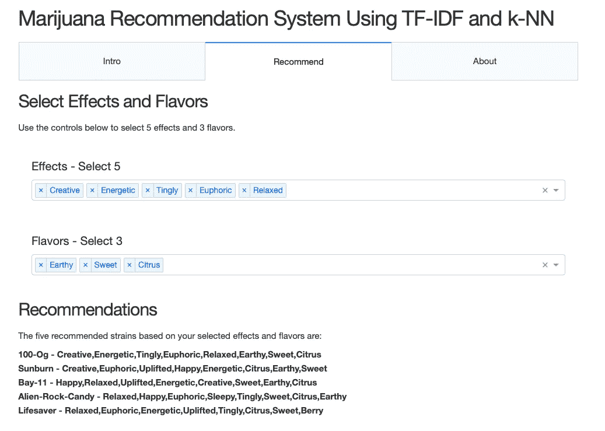
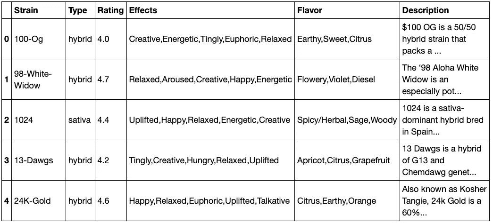

# 基于 TF-IDF 和 k-NN 的大麻推荐系统

> 原文：<https://towardsdatascience.com/a-marijuana-recommendation-system-using-tf-idf-and-k-nn-bd472242cb3f?source=collection_archive---------26----------------------->


## 使用 NLP、TF-IDF、k-NN、Pickling 和 Dash 的内容推荐系统

基于内容的推荐系统利用用户提供的数据为用户生成推荐。推荐系统可以用于为用户个性化信息，并且通常用于推荐电影、书籍、餐馆以及其他产品和服务。

使用下面的大麻推荐系统或此处的链接，我们将使用用户选择的效果和口味从 2300 多种大麻品种中推荐五种大麻品种。在我们的例子中，产品是大麻，特征是效果和味道的列表。

[**点击此处查看大麻推荐系统网页 App**](https://strains-live.herokuapp.com)



该项目的所有代码、数据和相关文件都可以在 my [GitHub](https://github.com/JimKing100/strains-live) 访问。自述文件提供了 repo 目录和文件的详细信息。

**采用 k-NN 的 TF-IDF 模型**

TF-IDF 指术语频率-逆文档频率。TF 就是一个单词在文档中出现的频率。IDF 是整个文档语料库中的文档频率的倒数。TF-IDF 背后的思想是在确定一个项目(文档)的重要性时抑制高频词的影响。

k-NN 指的是 K 最近邻，是一种简单的算法，在我们的例子中，它基于相似性度量对数据进行分类。换句话说，它为我们的用户输入选择“最接近”的匹配。

让我们使用 [tf_knn.ipynb](https://github.com/JimKing100/strains-live/blob/master/model/tf_knn.ipynb) 笔记本浏览一个示例。基本步骤是:

1.  加载、清理和争论数据
2.  对要素进行符号化和矢量化
3.  创建文档术语矩阵(DTM)
4.  将最近邻模型拟合到 DTM
5.  从模型中获取建议
6.  泡菜 DTM 和矢量器

**加载、清理和整理数据**

大麻品种数据来自 Kaggle 的 LiamLarsen 的大麻品种数据库。数据被加载到数据帧中，带有 nans 的菌株被删除(少量< 70)，效果和风味特征被合并到一个标准特征中。

```
df = pd.read_csv(“[https://raw.githubusercontent.com/JimKing100/strains-live/master/data/cannabis.csv](https://raw.githubusercontent.com/JimKing100/strains-live/master/data/cannabis.csv)")
df = df.dropna()
df = df.reset_index(drop=True)
df[‘Criteria’] = df[‘Effects’] + ‘,’ + df[‘Flavor’]
```



原始数据

**对特征进行符号化和矢量化**

效果和风味特征非常清晰，由 16 种独特的效果和 50 种独特的风味组成。我们在 TfidVectorizer 中使用了默认的标记器来标记特征，但是如果我们想从大量的文本描述中提取特征，我们可能会使用自定义的标记器。然后我们实例化矢量器。

```
tf = TfidfVectorizer(stop_words=’english’)
```

**创建文档术语矩阵**

特征(标准)然后被矢量化(拟合/转换)成文档术语矩阵(dtm)。dtm 是一个矩阵，每个要素在一列中，每个“计数”在每一行中。该计数是 tf-idf 值。下图显示了矢量化矩阵。

```
dtm = tf.fit_transform(df[‘Criteria’].values.astype(‘U’))
dtm = pd.DataFrame(dtm.todense(), columns=tf.get_feature_names())
```


文档术语矩阵(dtm)

**拟合最近邻模型**

然后实例化最近邻模型，并且 dtm 适合该模型。这是我们用来选择前五名推荐的推荐模型。

```
nn = NearestNeighbors(n_neighbors=5, algorithm=’ball_tree’)
nn.fit(dtm)
```

**获得推荐**

理想应变测试数据变量代表用户期望的 8 个特征。前五个特征是效果，后三个特征是味道。然后将变量矢量化，并在模型中运行。结果以数组元组的形式返回。为了获得这些值，首先访问第 2 个元组，然后访问第 1 个数组，最后访问第 1 个值— results[1][0][0]。在这种情况下，它返回索引 0。“应变”的值为“100-Og ”,并且“标准”与用户特征完全匹配。第二个示例是 index 1972，它的应变值为“日晒伤”,匹配 8 个特征中的 6 个。这些推荐非常符合用户的特点！

```
ideal_strain = [‘Creative,Energetic,Tingly,Euphoric,Relaxed,Earthy,Sweet,Citrus’]
new = tf.transform(ideal_strain)
results = nn.kneighbors(new.todense())df[‘Strain’][results[1][0][0]]
#’100-Og’
df[‘Criteria’][results[1][0][0]]
#’Creative,Energetic,Tingly,Euphoric,Relaxed,Earthy,Sweet,Citrus’df[‘Strain’][results[1][0][1]]
#’Sunburn’
df[‘Criteria’][results[1][0][1]]
#’Creative,Euphoric,Uplifted,Happy,Energetic,Citrus,Earthy,Sweet’
```

**腌制**

最后，dtm 和矢量器将在 Dash 应用程序中使用。

```
pickle.dump(dtm, open(‘/content/dtm.pkl’, ‘wb’))
pickle.dump(tf, open(‘/content/tf.pkl’, ‘wb’))
```

**Dash 应用**

由于本文的重点是创建一个基于内容的推荐系统，Dash 应用程序的细节将不在本文讨论之列。有关创建 Dash 应用程序的详细信息，请参阅我的文章 [*如何创建交互式 Dash Web 应用程序*](/how-to-create-an-interactive-dash-web-application-11ea210aa6d9) 。

我欢迎建设性的批评和反馈，请随时给我发私信。

在推特上关注我

这篇文章最初出现在我的网站上

大麻数据来源: [*大麻品种大麻数据集来自卡格尔*](https://www.kaggle.com/kingburrito666/cannabis-strains) 的利亚姆拉森

图片来源:*“free images . com/Gerhard Taatgen Jr .”*