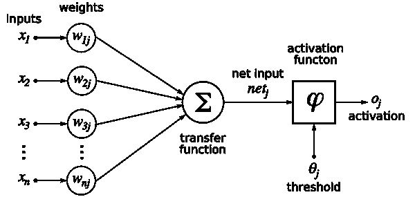
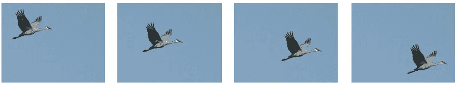
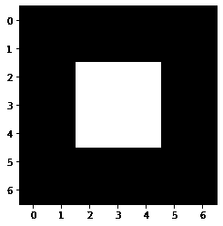
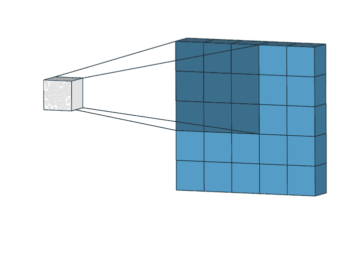
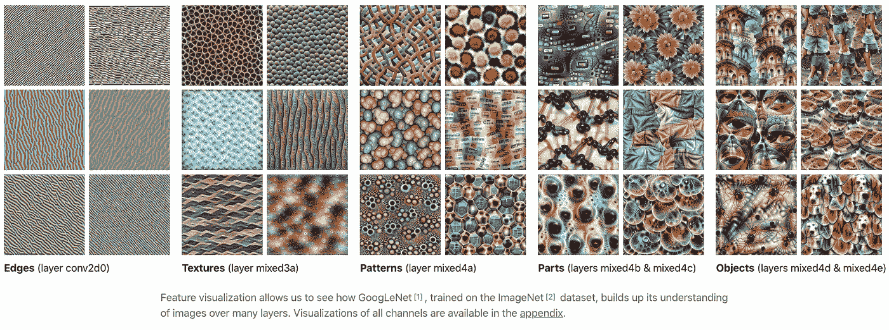

# 卷积神经网络:它与其他网络有何不同？

> 原文：<https://towardsdatascience.com/a-math-free-introduction-to-convolutional-neural-network-ff38fbc4fc76?source=collection_archive---------23----------------------->

## [**内艾**](https://medium.com/towards-data-science/inside-ai/home)

## CNN 有什么独特之处，卷积到底是做什么的？这是对 CNN 奇迹的无数学介绍。

我不是深度学习研究人员，但我通过各种接触了解了一些关于神经网络的事情。我一直听说 CNN 是一种神经网络，特别擅长与图像相关的问题。但是，这到底意味着什么呢？**卷积**这个词是怎么回事？一个与图像相关的问题需要不同的网络，这有什么不寻常的？

最近，我有机会研究新冠肺炎图像分类问题，并使用`tensorflow.keras` 构建了一个基于 CNN 的分类器，达到了 85%的准确率。最后，我想我已经找到了这些问题的答案。让我用一种没有数学的方式和你分享那些答案。如果你已经熟悉 CNN，这篇文章应该是一个很好的复习。如果没有，看一看，你可以对 CNN 背后的动机和定义 CNN 的独特功能有一个直观的了解。

# 深度神经网络

在深入研究神经网络之前，我们先来看看机器学习的全貌:

> ***机器学习*** *(ML)是通过经验自动改进的计算机算法的研究。—维基百科*

看看 ML 试图解决的问题，ML 经常被切成

*   监督学习:预测标签，例如分类或连续变量；
*   无监督学习:未标记数据的模式识别，例如聚类；
*   强化学习:算法学习“行为”的最佳方式，例如 AlphaGo、自动驾驶汽车。

其中，深度学习是一种强大的机器学习形式，因其在计算机视觉(例如，图像识别)、自然语言处理等领域的成功而备受关注。神经网络的灵感来自生物系统中的信息处理和通信节点。按照设计，输入数据通过网络的各个层传递，这些层包含几个节点，类似于“神经元”。然后，系统输出信息的特定表示。DNN 可能是最知名的深度学习网络，它可以通过训练很好地学习数据的特征。

粗略来说，组成一个神经网络有两个重要的操作:
1。正向传播
2。反向传播

## 正向传播

这是**预测**步骤。网络读取输入数据，通过网络计算其值，并给出最终输出值。

但是网络如何计算输出值呢？让我们看看当单层网络进行一次预测时会发生什么。它将输入作为一个数字向量。层中的每个节点都有其权重。当输入值通过图层时，网络会计算其加权和。这之后通常是(典型的非线性)激活函数，例如阶跃函数，其中加权和被“激活”。



单层感知。来源:感知器。米切尔，机器学习，p87。/ [CC BY-SA](https://creativecommons.org/licenses/by-sa/3.0)

如果您对代数有所了解，那么操作是这样进行的:

```
y = f(**w** • **x**+ **b**)
```

其中**w****x**+**b**为加权和，f 为激活函数，y 为输出。现在，在更深层次的神经网络中，程序本质上是相同的，即**输入- >加权求和- >激活**过程对许多层重复。

## 反向传播

这是**训练**步骤。通过比较网络的预测/输出和实际值，即计算损耗，网络调整其参数以提高性能。

网络如何通过训练调整参数(权重和偏差)？这是通过称为**反向传播**或反向传播的操作完成的。网络获取损失，并递归计算损失函数相对于每个参数的斜率。计算这些斜率需要使用微积分中的链式法则；你可以在这里了解更多信息[。](https://sebastianraschka.com/faq/docs/backprop-arbitrary.html)

然后使用优化算法利用梯度信息更新网络参数，直到性能不能再提高为止。一种常用的优化器是随机梯度下降。

经常用来解释基于梯度的优化的一个类比是徒步旅行。训练网络使损失最小化就像从山上下到地面的最低点。反向投影运算寻找损失函数梯度就像寻找向下的路径。优化算法是你实际走的路，最终到达最低点的那一步。


来源:雅格布·贝尔托洛蒂/ CC0

我掩盖了许多细节，但我希望你现在知道 DNN

*   是一种强大的**机器学习**技术；
*   可用于解决**有监督**、**无监督、**和**强化学习**问题；
*   包括正向传播(**输入到输出**)和反向传播(**误差到参数更新**)。

我们准备好谈论 CNN 了！

# 卷积神经网络

我们上面讨论过的普通神经网络期望输入数据是数字的**向量，即**x**=【x1，x2，x3，…】。如果我们想训练一个**图像分类器**，即使用一幅图像作为输入，该怎么办？先说一些数字图像基础知识。**

*   一幅图像是像素的**集合。例如，32 乘 32 的图像有 32*32 = 1024 个像素。**
*   每个像素是由范围[0，255]中的数字表示的**强度，其中 0 是黑色，255 是白色。**
*   彩色图像有三个维度:**【宽度、高度、深度】**其中深度通常为 3。
*   为什么深度是 3？那是因为它编码了[ **R** ed， **G** reen， **B** lue]的强度，即 RGB 值。

所以，这张黑白林肯像只是一个整数矩阵。


作者:[戈兰·莱文](http://www.flong.com/)于[图像处理与计算机视觉](https://openframeworks.cc/ofBook/chapters/image_processing_computer_vision.html)

由于数字图像可以表示为像素值的 2D 网格，我们可以拉伸/展平网格，将其转换为数字向量，并将其输入神经网络。那解决了问题…对吗？

然而，这种方法有两个主要限制。

1.  它不能很好地缩放到更大的图像。

*   虽然对于 32*32 = 1024 维的输入来说它仍然是可管理的，但是大多数现实生活中的图像都比这大。
*   例如，大小为 320x320x3 的彩色图像将转换为尺寸为 **307200** 的输入！

**2。它不考虑图像的属性。**

*   *位置*:附近的像素通常是强相关的(如看到林肯脸部的轮廓)。拉长它会打破这种模式。
*   *平移不变性*:有意义的特征可以出现在图像的任何地方，例如，看到飞鸟。



图片[信用](https://storage.googleapis.com/deepmind-media/UCLxDeepMind_2020/L3%20-%20UUCLxDeepMind%20DL2020.pdf)。

## 卷积的力量

另一方面，CNN 被设计成很好地缩放图像，并利用这些独特的属性。它有两个独特的功能:

1.  **权重共享**:图像的所有局部部分都用相同的权重处理，这样可以在许多位置检测到相同的模式，例如水平边缘、曲线等。
2.  **特征层次**:将开始时学习的较低层次的模式进行组合，形成跨层的较高层次的模式，例如从边缘到轮廓到面部轮廓。

这是通过**卷积**的操作完成的:

1.  定义滤波器:特定大小的 2D 加权矩阵，例如 3 乘 3 滤波器。
2.  用滤波器对整个图像进行卷积:将滤波器下的每个像素乘以权重。
3.  卷积输出形成新的图像:特征图。
4.  使用多个过滤器(每个具有不同的权重矩阵)，可以捕获不同的特征。

## 卷积示例:均值滤波器

其实还是用数字和图像来看操作吧。会更容易理解到底发生了什么。这里我们用 0 和 1 创建了一个明亮的正方形。`matplotlib`将[0，1]中的值解释为与[0，255]中的值相同。

```
Original image pixel values: 
 [[0\. 0\. 0\. 0\. 0\. 0\. 0.]
 [0\. 0\. 0\. 0\. 0\. 0\. 0.]
 [0\. 0\. 1\. 1\. 1\. 0\. 0.]
 [0\. 0\. 1\. 1\. 1\. 0\. 0.]
 [0\. 0\. 1\. 1\. 1\. 0\. 0.]
 [0\. 0\. 0\. 0\. 0\. 0\. 0.]
 [0\. 0\. 0\. 0\. 0\. 0\. 0.]]
```

这是图像的样子:



回想一下，滤波器是一个 2D 加权矩阵。让我们创建一个示例过滤器，并将其命名为**“均值过滤器”**:

```
[[0.11 0.11 0.11]
 [0.11 0.11 0.11]
 [0.11 0.11 0.11]]
```

在卷积中，这种“均值滤波器”实际上会滑过图像，取 9 个相连像素的值，将每个值乘以权重(0.11)，然后返回总和，即原始 9 个值的加权平均值，因此称为“均值滤波器”:



您可以从过滤后的图像像素值中看到平均效果。它会模糊图像中的任何边缘。

```
Filtered image pixel values: 
 [[0.11 0.22 0.33 0.22 0.11]
 [0.22 0.44 0.67 0.44 0.22]
 [0.33 0.67 1\.   0.67 0.33]
 [0.22 0.44 0.67 0.44 0.22]
 [0.11 0.22 0.33 0.22 0.11]]
```

**这和卷积神经网络有什么关系？**

CNN 本质上应用了相同的卷积程序，但关键的区别在于**通过反向传播(训练)来学习滤波器权重**。

此外，通常每个图层都有许多滤镜，每个滤镜都有不同的权重矩阵，应用于同一个图像。每个过滤器将捕捉同一图像的不同模式。CNN 也可以有多层卷积。网络的复杂性允许捕捉不同尺度的特征。例如，这是过滤器从网络的早期到后期学习的特征的图示。

*   早期的滤镜捕捉边缘和纹理。(**通用**)
*   后面的过滤器形成部件和对象。(**具体**)



图片[信用](https://distill.pub/2017/feature-visualization/)。

## CNN 的主要特点

虽然 DNN 使用许多全连接层，但 CNN 主要包含卷积层。最简单的形式，CNN 是一个由一组层组成的网络，这些层将图像转换成一组类别概率。一些最受欢迎的图层类型有:

*   **卷积层** (CONV):图像经过滤波器的卷积。
*   **RELU 层** (RELU):单元式非线性激活函数(与 DNN 之前的相同)。
*   **池层**(池):图像经过均值(或最大值)滤波器的卷积，因此它被向下采样。
*   **全连通层** (FC):通常作为最后一层输出一个类概率预测。

现在，如果你是*设计自己的 CNN* ，有很多元素可以玩。它们通常分为两类:

1.  卷积层的类型

*   **深度**:每层使用的滤镜数量。
*   **步幅**:在图像上滑动滤镜时的步幅，通常是 1(见上面的卷积 GIF)或 2。
*   **大小**:每个卷积滤波器的大小，例如均值滤波器为 3 乘 3。
*   **填充**:卷积时是否在图像周围使用填充。这决定了输出图像的大小。
*   和其他人。

2.各层如何连接？

除了层的类型，你需要为你的 CNN 设计一个架构。这是一个活跃的研究领域，例如，什么是更好的架构？还是可以自动搜索更好的架构？如果你有兴趣，可以去“神经结构搜索”看看。一个常用的架构是这样的:

```
**INPUT --> [ [CONV --> RELU]^N --> POOL]^M --> [FC --> RELU]^K --> FC**
```

幂(N，M，K)意味着操作重复这些次数。

# 下一步是什么？

谢谢你一直读到最后！我希望到现在为止，你可以看到 CNN 和普通 DNN 的区别，并且对卷积运算有一个直观的理解。请在评论区告诉我你的想法或任何反馈。

在下一篇文章中，我们将探讨如何使用 CNN 来构建一个**新冠肺炎 CT 扫描图像分类器**。不出所料，一个预先训练好的 CNN 可以达到很强的基线表现(85%的准确率)。然而，要产生可靠和令人信服的结果，需要的不仅仅是一个神经网络。下面是这篇文章:

[](/domain-expertise-what-deep-learning-needs-for-better-covid-19-detection-56cdeefde564) [## 深度学习需要什么来更好地检测新冠肺炎

### 这个世界可能不需要另一个神经网络，但它需要与那些在第一线的人进行咖啡聊天。

towardsdatascience.com](/domain-expertise-what-deep-learning-needs-for-better-covid-19-detection-56cdeefde564) 

# 更多资源

如果你有兴趣了解更多关于 CNN 的信息，请查阅👉：

*   [用于视觉识别的 CS231n 卷积神经网络](https://cs231n.github.io/)
*   [DeepMind x UCL |用于图像识别的卷积神经网络](https://www.youtube.com/watch?v=shVKhOmT0HE&ab_channel=DeepMind)

以及如何实现它们👉：

*   工程师 Keras 简介
*   [Tensorflow Keras CNN 指南](https://www.tensorflow.org/tutorials/images/cnn)

尽情享受吧！👏👏👏

*原载于*[*https://yang xiaozhou . github . io*](https://yangxiaozhou.github.io/data/2020/09/24/intro-to-cnn.html)*。*