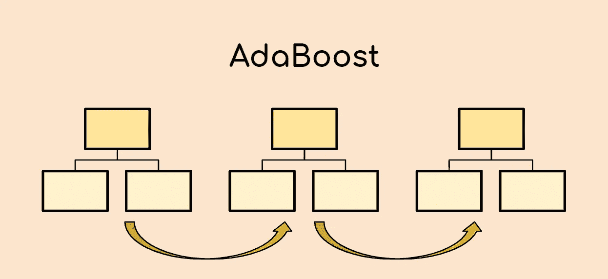
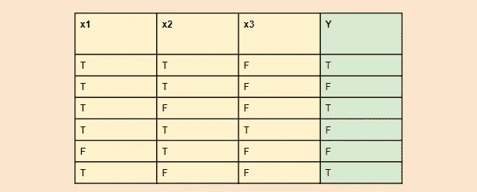
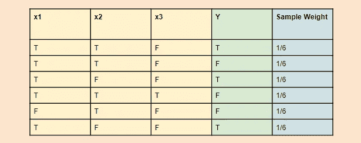
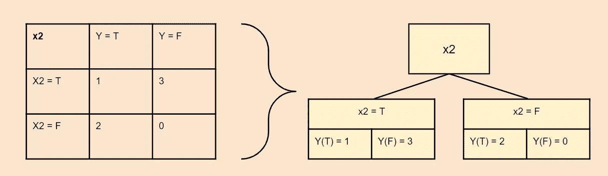
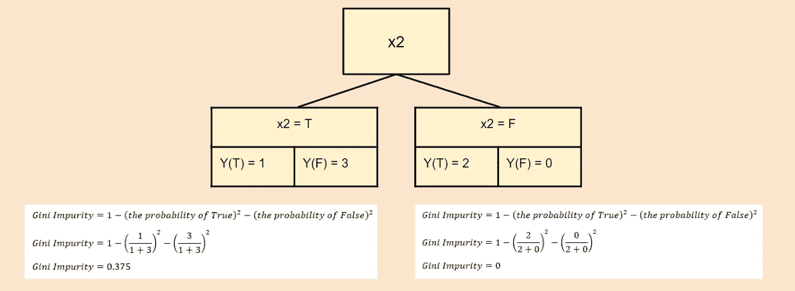
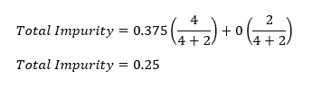
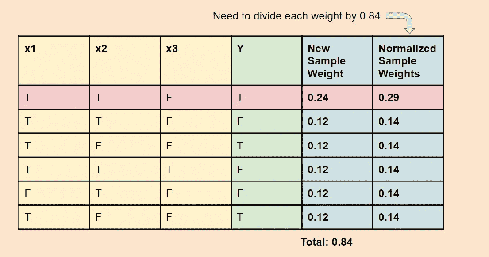
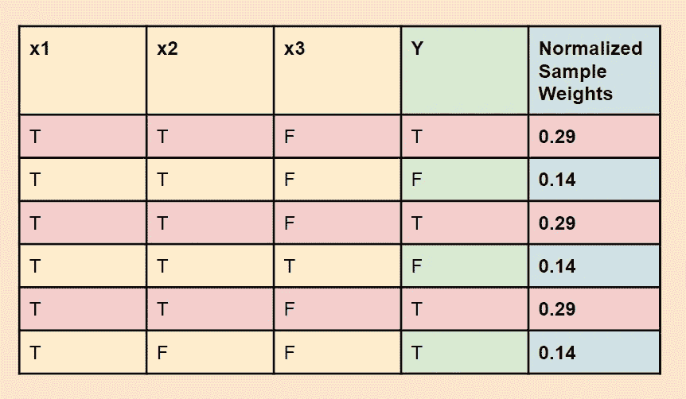
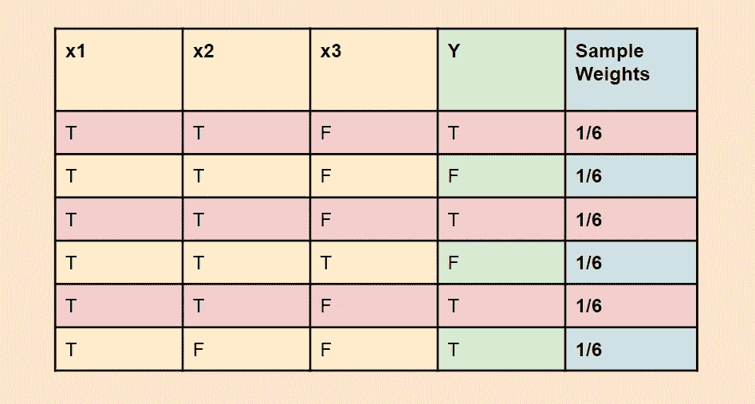

# 5 分钟 AdaBoost 的数学解释

> 原文：<https://towardsdatascience.com/a-mathematical-explanation-of-adaboost-4b0c20ce4382?source=collection_archive---------9----------------------->

## 用一个例子彻底解释 AdaBoost

作者创建的图像

# 目录

1.  介绍
2.  AdaBoost 有何不同
3.  AdaBoost 工作原理的示例
4.  如何评估一个新的点

# 介绍

AdaBoost，或称自适应 Boost，是一种相对较新的机器学习分类算法。这是一个**集成**算法，它将许多弱学习器(决策树)组合在一起，并将其转化为一个强学习器。因此，其算法利用**装袋**和**助推**方法来开发增强的预测器。

如果这些词让你感到困惑，不要担心。在本文中，我们将通过一个简单的例子来展示 AdaBoost 的工作原理及其背后的数学原理。

# AdaBoost 有何不同

AdaBoost 类似于随机森林，因为预测来自许多决策树。然而，AdaBoost 的独特之处主要有三点:

1.  首先，AdaBoost 创造了一个树桩森林，而不是树木。树桩是只由一个节点和两片叶子组成的树(如上图)。
2.  第二，生成的树桩在最终决策(最终预测)中的权重不同。造成更多错误的树桩在最终决策中的发言权会更小。
3.  最后，生成树桩的顺序很重要，因为每个树桩都旨在减少前一个树桩所犯的错误。

# AdaBoost 工作原理的示例

现在我们来看一个例子。假设我们有下面的样本数据，有三个特征(x1，x2，x3)和一个输出(Y)。*注意 T =真，F =假。*

## 步骤 1:为每个样品分配样品重量

使用上面的等式，计算每个样品的样品重量。第一轮，样品重量相等。在本例中，每个样品的样品重量将等于 1/6。

## 第二步:计算每个变量的基尼系数

下一步是计算每个变量的基尼系数。这样做是为了确定使用哪个变量来创建第一个树桩。计算每个节点的基尼系数的公式如下:

一旦你计算出每个节点的基尼系数，每个变量的基尼系数就是每个节点的加权平均值。

举个例子，我们来计算 x2 的基尼杂质。

上面是样本的合并表，显示了适合每个类别的样本数(无论 x2 和 Y 是 T 还是 F)。

接下来，我们可以为 x2 计算每个叶节点的 Gini 杂质。

一旦计算出每个叶节点的基尼系数，就可以通过对两个单独的系数进行加权平均来计算出总的基尼系数。

因此，x2 的基尼系数= 0.25。

如果你对每个变量都这样做，你会得到 x2 具有最低的基尼系数，所以 x2 将被用来创建第一个树桩。

## 第三步:计算已创建的树桩的发言权

接下来，我们将使用总误差来计算这个树桩获得的“发言权”。

**总误差** **等于错误分类样本的权重之和。**由于其中一个样本被错误地分类为 x2，总误差等于 1/6。

一旦你知道了总误差，你就可以计算出**量，比如:**

因此对于这个树桩…

## 步骤 4:计算下一个树桩的新样本权重

接下来，我们将使用以下等式增加错误分类样本的样本权重，并减少正确分类样本的样本权重:

因此，利用上面的等式，我们能够计算新的样本权重。由于样本权重的总和等于 0.84，我们通过将每个权重除以 0.84 来标准化样本权重，使得新样本权重的总和等于 1。

## 步骤 5:创建一个引导数据集，根据新的样本权重选择每个样本的概率。

在这一步中，我们将从数据集中随机选择 6 个带有替换物的样本**，选择每个样本的几率基于它们新的样本重量。**

请注意，被错误分类的那一个的权重是其他的两倍多。这意味着它更有可能被选择多次，因此，下一个 stump 将更多地关注正确分类错误的样本。这就是 AdaBoost 的力量！

一旦创建了新的引导数据集，样本将再次被赋予相等的权重，并重复该过程。

## 步骤 6:重复这个过程 n 次

最后，重复这个过程，直到产生 n 个树桩，每个树桩都有自己的发言权。一旦完成，模型就完成了，可以对新点进行分类。

通过在所有树桩中运行新点并查看它们是如何分类的，可以对新点进行分类。然后，对每一个类的 say 量进行求和，say 量较高的类就是新点的分类。

# 感谢阅读！

学完本课程后，您应该理解 AdaBoost 模型是如何创建的，并且应该知道它背后的数学原理。

## 特伦斯·申

*创始人*[*ShinTwin*](https://shintwin.com/)*|我们连线上*[*LinkedIn*](https://www.linkedin.com/in/terenceshin/)*|项目组合是* [*这里*](http://terenceshin.com/) *。*