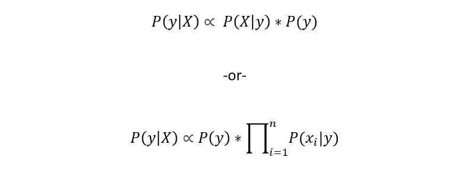
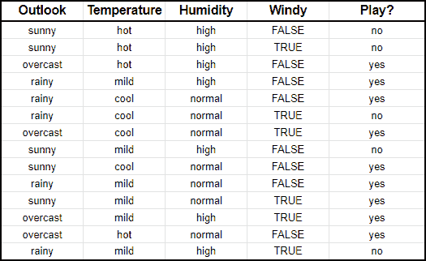
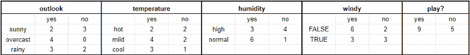
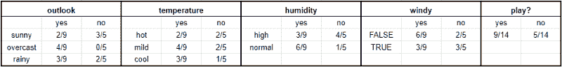
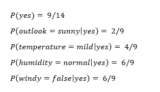
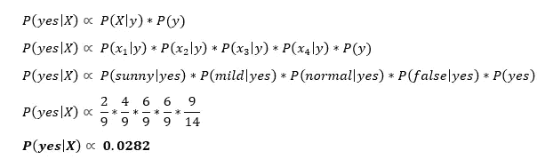
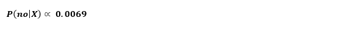

# 5 分钟内对朴素贝叶斯的数学解释

> 原文：<https://towardsdatascience.com/a-mathematical-explanation-of-naive-bayes-in-5-minutes-44adebcdb5f8?source=collection_archive---------2----------------------->

## 用一个例子彻底解释朴素贝叶斯

考特尼·库克在 [Unsplash](https://unsplash.com/s/photos/golf?utm_source=unsplash&utm_medium=referral&utm_content=creditCopyText) 上的照片

朴素贝叶斯。看起来非常令人困惑的算法实际上是曾经被理解的最简单的算法之一。理解和实现它如此简单的部分原因是因为它固有的假设。然而，这并不是说它是一个糟糕的算法，尽管它拥有强大的假设-事实上，朴素贝叶斯在数据科学领域中被广泛使用，并有很多现实生活中的应用。

在本文中，我们将了解什么是朴素贝叶斯，它如何通过一个例子来使其易于理解，朴素贝叶斯的不同类型，优点和缺点，以及它的一些实际应用。

# 初步知识

为了理解朴素贝叶斯并从本文中获得尽可能多的价值，您应该对以下概念有一个基本的了解:

*   **条件概率**:一个事件 A 发生的概率的量度，假设另一个事件已经发生。例如，“假设天气多云，下雨的概率有多大？”是条件概率的一个例子。
*   **联合概率**:计算两个或更多事件同时发生的可能性的度量。
*   **比例**:指的是与一个常数相乘的两个量之间的关系，或者更简单的说，它们的比值是否产生一个常数。
*   **贝叶斯定理**:根据维基百科，贝叶斯定理描述了一个事件发生的概率(后验)，是基于可能与该事件相关的条件的先验知识。

# 什么是朴素贝叶斯？

朴素贝叶斯是一种机器学习算法，但更具体地说，它是一种分类技术。这意味着当输出变量是离散的时，使用朴素贝叶斯。该算法的底层机制是由贝叶斯定理驱动的，您将在下一节看到这一点。

# 朴素贝叶斯是如何工作的

首先，我将介绍朴素贝叶斯背后的理论，然后用一个例子来巩固这些概念，使其更容易理解。

朴素贝叶斯分类器受贝叶斯定理的启发，贝叶斯定理陈述了以下等式:

这个等式可以用 X(输入变量)和 y(输出变量)改写，使其更容易理解。用简单的英语来说，这个方程就是在给定输入特征 x 的情况下求解 y 的概率。

因为假设变量是独立的，我们可以将 P(X|y)改写如下:

此外，由于我们求解 y，P(X)是一个常数，这意味着我们可以将其从等式中删除，并引入一个比例。这使我们得出以下等式:

现在我们已经得到了这个等式，朴素贝叶斯的目标是选择具有最大概率的类 y。Argmax 是一个简单的操作，它从目标函数中找到给出最大值的参数。在这种情况下，我们希望找到最大的 y 值。

现在让我们来看一个例子，这样你可以从这个算法中得到更多的意义。

# 朴素贝叶斯的例子

假设你跟踪了 14 天的天气状况，根据天气状况，你决定是否打高尔夫球。

**首先，我们需要把这个转换成频率表**，这样我们就可以得到 P(X|y)和 P(X)的值。*回想一下，我们正在求解 P(y|X)* :

**其次，我们希望将频率转换成比率或条件概率**:

**最后，给定 x，我们可以使用比例方程来预测 y。**

想象一下，X = {展望:晴天，温度:温和，湿度:正常，有风:假}。

首先，我们将计算给定 X，P(是|X)你将打高尔夫球的概率，然后是给定 X，P(否|X)你将不打高尔夫球的概率。

使用上面的图表，我们可以获得以下信息:

*谢谢各位的评论。上面我已经做了修正。*

现在我们可以简单地将这些信息输入到下面的公式中:

类似地，您将为 P(no|X)完成相同的步骤序列。

既然 P(yes|X) > P(no|X)，那么你可以预测这个人会打高尔夫球，因为天气晴朗，温度适中，湿度正常，没有风。

## TLDR

综合我们刚刚做的…

1.  首先，我们创建了一个频率表，然后创建了一个比率表，这样我们就可以得到 P(X)和 P(y|X)的值
2.  然后，对于给定的一组输入要素 X，我们计算每个类 y 的比例 P(y|X)。在我们的示例中，我们有两个类，是和否。
3.  最后，我们取所有类中 P(y|X)的最高值来预测最有可能的结果。

# 朴素贝叶斯的类型

实践中使用的朴素贝叶斯主要有三种类型:

## 多项式

多项式朴素贝叶斯假设每个 P(xn|y)遵循多项式分布。它主要用于文档分类问题，查看单词的频率，类似于上面的示例。

## 伯努利

伯努利朴素贝叶斯类似于多项式朴素贝叶斯，只是预测值是布尔型的(真/假)，就像上面示例中的“Windy”变量一样。

## 高斯的

高斯朴素贝叶斯假设连续值是从高斯分布中采样的，并假设如下:

# 朴素贝叶斯的利与弊

## 赞成的意见

*   如上所示，一旦你理解了这个概念，它就相当直观了
*   它易于实现，在多类预测中表现良好
*   它适用于分类输入变量

## 骗局

*   当测试集中有一个类别不在训练集中时，您可能会遇到零频率问题
*   从这个算法来看，概率估计不是最值得信赖的
*   如上所述，朴素贝叶斯有很强的假设。

# 朴素贝叶斯应用

下面是朴素贝叶斯的一些流行应用:

*   **实时预测**:因为朴素贝叶斯速度快，而且基于贝叶斯统计，所以它在实时预测方面做得很好。事实上，很多流行的实时模型或**在线**模型都是基于贝叶斯统计。
*   **多类预测**:如前所述，当输出变量有两个以上的类时，朴素贝叶斯工作得很好。
*   **文本分类**:文本分类还包括垃圾邮件过滤和情感分析等子应用。由于朴素贝叶斯最适合处理离散变量，因此它在这些应用程序中也能很好地工作。
*   **推荐系统**:朴素贝叶斯通常与其他算法一起使用，如协同过滤，以建立推荐系统，如网飞的“为你推荐”部分，或亚马逊的推荐产品，或 Spotify 的推荐歌曲。

# 感谢阅读！

## 特伦斯·申

*创始人*[*ShinTwin*](https://shintwin.com/)*|我们连线一下*[*LinkedIn*](https://www.linkedin.com/in/terenceshin/)*|项目组合这里是***。**