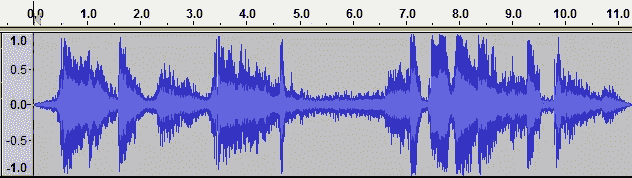
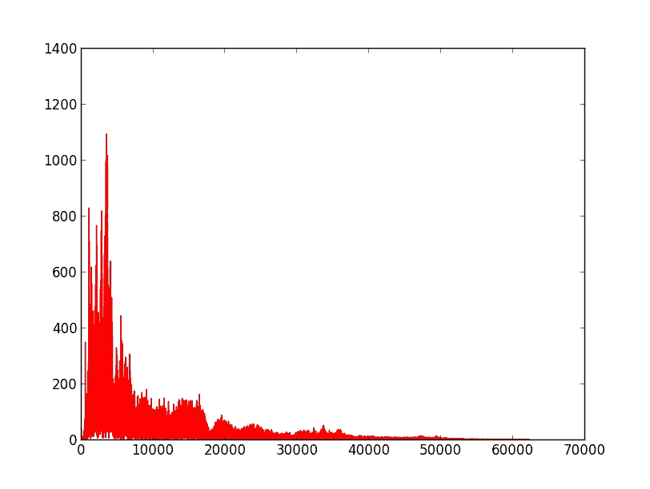
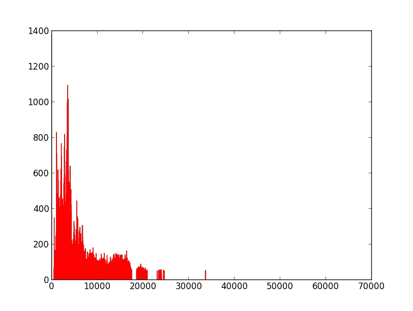
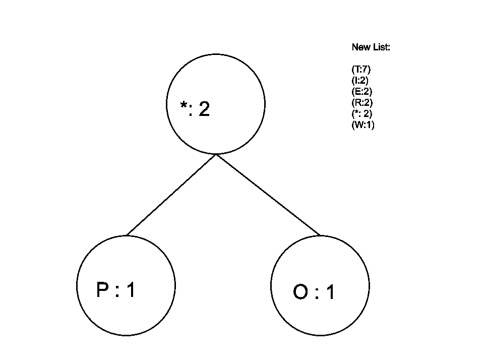
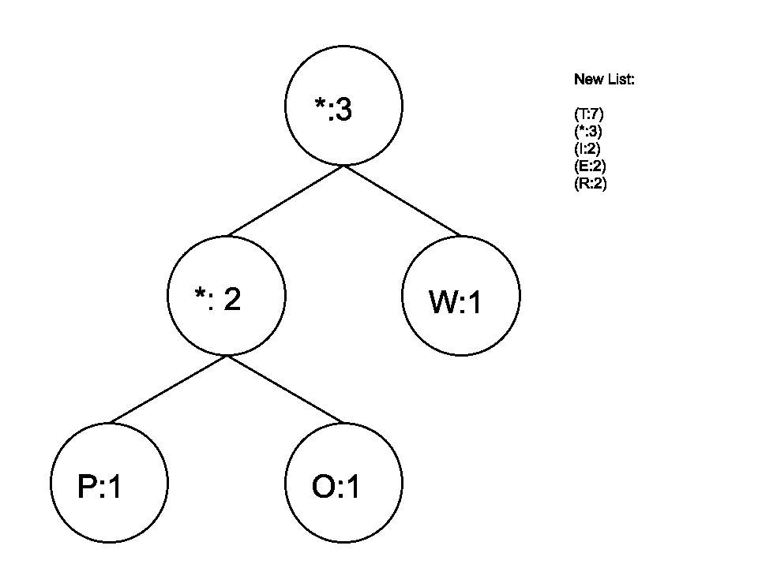
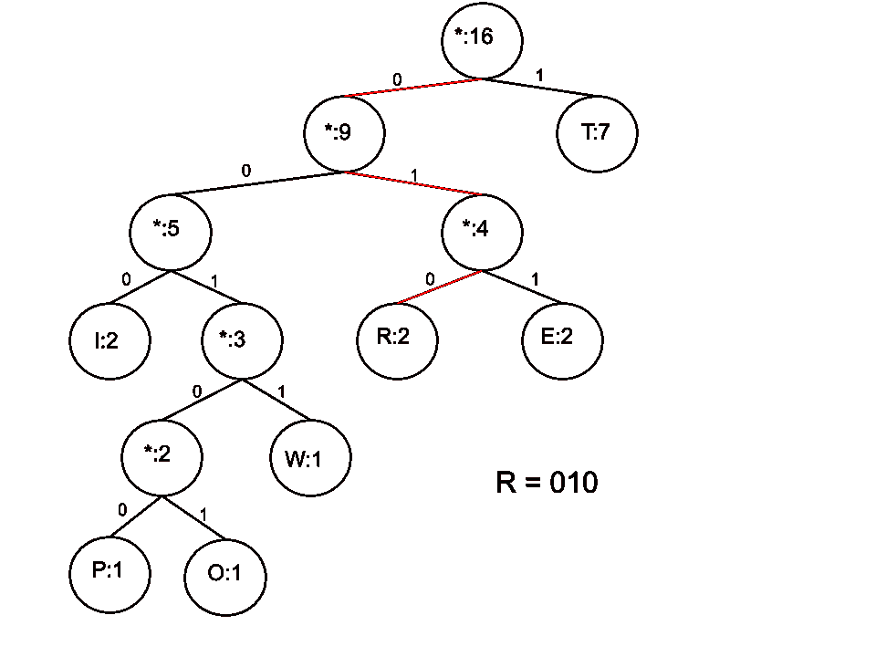

# 压缩的数学入门

> 原文：<https://towardsdatascience.com/a-mathematical-primer-of-compression-5ea1ca53fc45?source=collection_archive---------29----------------------->

## 如何在不丢失信息的情况下减少存储空间？


阿列克谢·鲁班在 [Unsplash](https://unsplash.com?utm_source=medium&utm_medium=referral) 上的照片

由于我对音乐感兴趣，它经常出现在一个日益增长的趋势中:音乐以数字和黑胶的形式出售。有时我会听到人们错误地称黑胶潮流为“复古”、“新潮”、“时髦”或其他什么。但是如果你真的问别人为什么他们更喜欢唱片，他们可能会告诉你音质更好。

这将是一篇关于无损压缩的文章，我会尽量保持一般概念或例子。

先说术语。首先，媒体文件可能很大。在我年轻的时候，计算机基本上没有无限的空间，所以压缩是减小媒体文件大小的一个重要工具。就在那时，我迷上了这个话题。

***压缩*** 基本上是一种获取文件大小并使其变小的算法。最明显的方法是 ***有损压缩*** 。这只是意味着你丢失了信息。这种算法的目标是只丢失“不重要”和“不会被注意到”的信息。

一种更令人惊讶的压缩方法叫做 ***无损*** 。起初，这似乎是矛盾的。如何使文件变小，但不丢失任何信息？文件大小基本上不就是信息吗？

我们稍后会回答这些问题。

# 有损压缩

先说大家为什么不喜欢有损压缩音频文件。有一个快速和肮脏的事情，你可以做立即失去信息，并减少音频文件的大小。

这是 ***动态范围*** (DR)压缩。

想象一种声波。振幅基本决定了声音有多大。你可以在不改变任何其他音乐品质的情况下，将声波压缩到更小的振幅。

但这太可怕了！

音乐中最重要的部分之一是高潮部分，如果整个高潮部分的响度相同，那么动人的高潮部分就不会有同样的效果。

这是一种极具争议的压缩技术，以至于许多人纯粹出于灾难恢复的原因转而使用乙烯树脂。有一个完整的、可搜索的在线专辑数据库,可以找到唱片目录，以及它是好的、可接受的还是坏的。

去搜索你最喜欢的专辑。这是一种有趣的发现有多少已经被压扁了，即使在无损光盘格式与乙烯基！(例如，一个唐氏系统的*毒性*在黑胶上是 DR 11【可接受】，在 CD 上是 DR 6【非常糟糕】)。

另一种最常见的音频有损压缩技术有点复杂，但它实际上改变了音乐，因此值得考虑。让我们实际上做一个粗略的算法来做这件事(目前有更好的和更微妙的形式如下，但它相当于同一件事)。

这是一个有点傻的例子，但是我去了 www.wavsource.com 的[得到了一个原始的 wav 文件。我抓住了第一批中的一个，来自电影 *2001:太空漫游*的音频样本。这是声波的数据可视化:](http://www.wavsource.com)



我们可以做的一件事是快速傅立叶变换。这会把这些声波去掉，去掉时间成分。通常你会想做一个“移动窗口”，这样你就可以记录一些时间。

例如，我们可以看到从 0.5 秒到 1.5 秒是一个“数据包”我们可能应该首先转换它，然后再进行下一步。

FFT 留给我们的只是出现的频率以及它们有多大。我用 python 的 scypy.fftpack 做到了这一点:

```
import matplotlib.pyplot as plt
import scipy.fftpack as sfft
import numpy as np
from scipy.io import wavfilefs, data = wavfile.read('daisy.wav')
b=[(ele/2**8.)*2-1 for ele in data]
c = sfft.fft(b)
d = len(c)/2
plt.plot(abs(c[:(d-1)]),'r')
plt.show()compressed = []
for ele in c:
	if abs(ele) &gt; 50:
		compressed.append(ele)
	else:
		compressed.append(0)compressed = np.asarray(compressed)
plt.plot(abs(compressed[:(d-1)]),'r')
plt.show()e = sfft.ifft(compressed)
```



忽略那些只是为了让所有东西都更明显而没有标准化的比例。我们能做的最简单的事情就是设置一个截止频率，去掉所有我们认为听不到的频率:



如果我们做得太多，我们会破坏声音的自然性。所有自然产生的声音都有大量微妙的弦外之音。您通常无法明确听到这些，因此它们会在截止阈值以下出现。

这将把我们带向一个“纯净”的音调，听起来更像是合成的或计算机生成的。这可能就是为什么没有人真正这样压缩的原因。这个例子只是给出了一种方法的概念(要完成它，你现在只需逆 FFT 并写入 wav)。

稍微好一点的压缩技术是采用短时间间隔，并用一个凸起函数乘以峰值频率。这将缩小所有无关的频率，而不会完全消除声音的强度。

这就是一些有损压缩实际上是如何完成的。小波还有其他更有趣的东西，需要几篇文章来描述，但这里的目标是实现无损压缩。

我希望这有助于了解什么是有损压缩，如果不小心的话，它会造成一些严重的伤害。小心的话，你仍然会失去足够的音质，以至于许多音乐爱好者完全避免 mp3 和数字下载，而选择黑胶唱片。

现在让我们来解决无损压缩这个看似矛盾的概念。

# 无损压缩

我首先要指出的是，即使这个*看起来*像是一个矛盾的概念，每个人都已经相信这是可以做到的。当我们通过压缩电脑上的文件时，我们一直在使用它。

当然，这会导致文件变小，但是没有人会认为当他们解压缩时会丢失信息。这意味着必须存在无损压缩的方法。

今天的例子是一个非常简单和聪明的方法。它暂时与音乐无关，但不要认为这仅仅是一个玩具例子。 ***霍夫曼编码*** 实际上是作为 mp3 编码中的一个步骤使用的，所以和我们一直在讨论的内容有关。

大致思路是这样的。假设你想用最简单的方法将文本编码成二进制。你把 A 分配给 0，B 分配给 1，C 分配给 10，D 分配给 11，等等。当你到 Z 的时候，你会得到 11001。这意味着你必须为每个字母使用 5 位。

“猫”应该是 00010 00000 10011。

为了给“猫”编码，我们做了些蠢事。我们只需要 3 个字母，所以如果我们提前选择了一个更好的编码方法，比如 C = 00，A = 01，T = 10，那么我们可以将文本编码为 00 01 10。

换句话说，我们通过巧妙选择编码 00010 00000 10011 -> 000110 来压缩数据，而不会丢失任何信息。

我已经知道你的抱怨了。任何足够长的文本都将包含每个字母，因此没有比最初的简单方法更好的方法了。嗯，你只是不够聪明！

有些字母会比其他字母出现得更频繁。例如，如果字母“s”出现的频率是 100，而下一个出现频率最高的字母出现了 25 次，那么您应该选择类似“01”这样的字母来代表“s”。这样，最少数量的位被用于最频繁的字母。

啊，但是精明的读者又抱怨了。我们以前不能这样做的原因是，我们无法在一个长字符串中区分两个频繁的字母:10 01 和一个不太频繁的字母:1001。这就是为什么当我们使用整个字母表时，我们需要全部 5 位。

这是一个唯一性问题。我们要解决的是，一旦我们给字符串赋值，就不允许“01”成为它的前缀。这样，当我们遇到 01 时，我们就停下来。我们知道那是字母“s ”,因为没有其他字母以“01”开头。

当然，最终发生的情况是，对于某些字母，我们必须使用比 5 位多得多的位，但我们的想法是，它们的使用频率如此之低，而 2 位和 3 位字母的使用频率如此之高，最终会比我们坚持使用 5 位节省更多的空间。

现在你应该问两个问题:

1.  可以证明它更小吗？
2.  有没有什么简单的算法可以计算出如何将一个字母分配给一个比特序列，从而产生唯一性和微小性？

答案:两个都是！

我们不会谈论证据，因为这是一篇“通过例子”的文章，让你感受一下人们在压缩中做的事情的类型。但是我认为生成要编码的符号串的算法非常简洁。

让我们为“Titter Twitter Top”生成 ***哈夫曼树*** (只是为了得到一个高频和几个“重复”频率的东西)。

首先，把字母和它们出现的频率按顺序列出来:(T:7)，(I:2)，(E:2)，(R:2)，(W:1)，(O:1)，(P:1)。

现在我们将构建一个以这些为叶子的二叉树。从底部的 2 个叶开始，用占位符(*)和频率的总和将它们连接到父节点。然后将这个新的占位符插入列表中的正确位置，并删除您使用的两个占位符:



现在对列表底部的两个节点重复这个过程(如果一个节点已经在列表中，在树中使用它):



不断重复这个过程，直到你用尽了列表，你将得到完整的二叉树，我们将使用:



现在，为了找出如何对每个字母进行编码，在每个左边缘写一个 0，在每个右边缘写一个 1。从顶部往下到你想要的字母，按顺序写下数字。这是编码。

所以 T = 1，I = 000，R = 010，E = 011，W = 0011，O = 00101，P = 00100。

自己测试一下吧。你会发现没有歧义，因为用于一个字母的每个数字串从不作为另一个字母的前缀出现。

此外，请注意，出现频率最高的字母是一位，只有当频率变低时，位才会变长。使用霍夫曼码的 Twitter Top 的编码是 39 位，而简单编码是 80 位。

> 这将压缩到所需空间的一半，并且不会丢失任何信息！

我们不会进入计算机实际上如何存储信息的繁琐细节，以了解我们在实践中忽略了许多微妙之处(加上我们必须将转换表作为数据的一部分存储)，但至少我们在理论上看到了无损压缩的例子。

此外，这里的字母也没什么特别的。我们可以用基本上任何信息来做这件事(例如声音文件中的频率或图像中的像素颜色)。