# 灰度问题:理解 Dicom 窗口

> 原文：<https://towardsdatascience.com/a-matter-of-grayscale-understanding-dicom-windows-1b44344d92bd?source=collection_archive---------17----------------------->

## DICOM 图像可以包含大量的体素值，可以将开窗视为操纵这些值的一种手段，以改变图像的外观，从而突出显示特定的结构

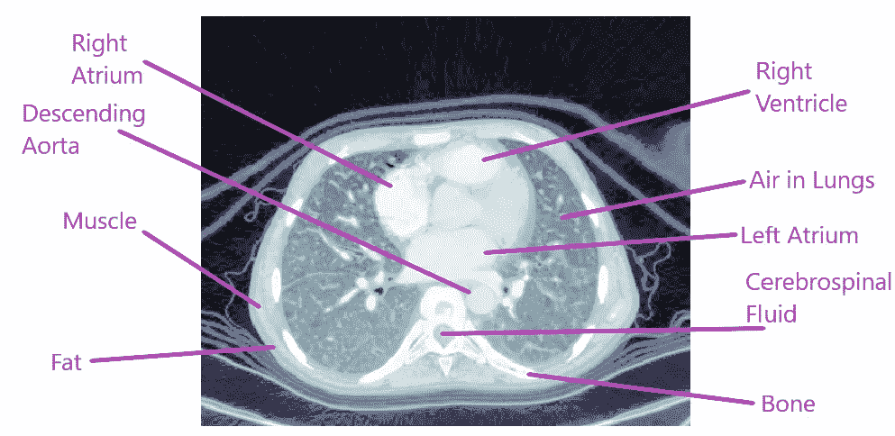

作者图片

DICOM 图像通常包含 12–16 位/像素，相当于大约 4，096 到 65，536 种灰度。大多数医学显示器和常规计算机屏幕通常限于 8 位或 256 种灰度。高端医疗显示器可以显示 1024 种灰度(如针对乳房 x 线摄影优化的显示器)。

然而，即使电脑屏幕可以显示 256 种灰度，我们的眼睛通常也只能察觉到灰度的 **6%** 变化

这意味着我们通常只能探测到大约 **100/6 = 17 种灰度。**

**Hounsfield 单位** ( **HU** )标度是用于描述*放射性密度*的定量标度。它采用线性变换，其中标准压力和温度(STP)下蒸馏水的放射性密度定义为 **0 HU** ，而标准压力和温度下空气的放射性密度定义为 **-1000 HU** 。

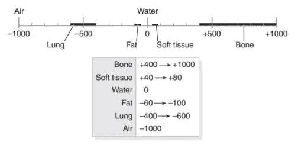

CT 数的 Hounsfield 标度[【图像来源】](https://web.archive.org/web/20070926231241/http://www.intl.elsevierhealth.com/e-books/pdf/940.pdf)

大多数图像需要在 **-1000 HU** (空气的参考值)和 **+1000 HU** (通常参考硬骨)之间查看。

因此，DICOM 图像的范围大约为 **2000 HU** (从-1000 HU 到+1000 HU)，如果我们想在只能显示 256 种灰度的计算机屏幕上显示这个范围:

2000/256 = 8

那么每个灰色阴影将具有 8 HU 的差异。

人眼只能检测到 6%的灰度变化，因此为了让人类检测到密度的差异(在 2000 HU 的图像范围内)，每个变化必须变化:**256/17∫8 = 120 HU**。正常组织和病变组织之间的差异通常远小于 120 HU，这就是应用`windows`的重要性。

为了解释`windowing`如何工作，我们使用这个[数据集](https://www.kaggle.com/c/rsna-str-pulmonary-embolism-detection)，导入 [fastai](https://github.com/fastai/fastai) 库并加载一个测试映像。

> 关于如何使用 fastai 的医学成像模块的更多信息，请访问我的`[github](https://github.com/asvcode/MedicalImaging)` [页面](https://github.com/asvcode/MedicalImaging)或我的关于医学成像的[教程博客](https://asvcode.github.io/MedicalImaging/)(哪个更适合查看笔记本教程:)

查看`pixel_array`

`show_image(patient6.pixel_array, cmap=plt.cm.bone);`

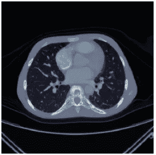

作者图片

使用`fastai`时的区别在于，默认情况下，当使用`show`功能时，它将显示归一化图像。

`patient6.show();`

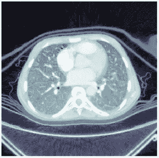

作者图片

很明显，图像中显示了更多的深度。然而，当试图定位那些由于某种情况而发生病理改变的正常区域时，这可能是一个问题。在大多数情况下，正常组织和病理改变组织之间的 Hounsfield 单位的差异可能非常小。

作者图片

归一化图像显示了大范围的组织密度(从-1000HU(空气)到大约+1000HU(骨骼))。如上所述，普通的电脑屏幕只能显示 256 种灰度，我们的眼睛只能推断出 6%的灰度变化

应用`windows`的基础是将 256 种灰度聚焦到一个包含我们可能感兴趣的相关组织密度的狭窄区域。

# Fastai 的内置窗户

fastai 医学影像库方便地提供了多个窗口范围，可通过其`windowed`功能使用。可以使用`dicom_windows`调用这些窗口

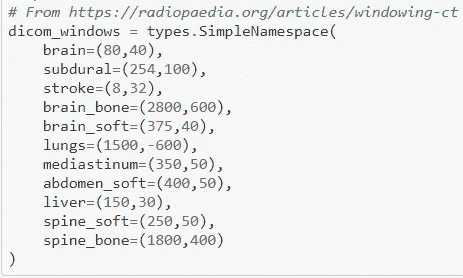

Fastai 医学影像[【信用】](https://github.com/fastai/fastai/blob/master/nbs/60_medical.imaging.ipynb)

# 窗口是如何工作的？

一个窗口有两个值:

*   `window level`或`center`，又称亮度，`l`
*   `window width`或`range`，又称对比、`w`

使用以下公式计算窗口像素值:

*   `lowest_visible_value` =窗位-窗宽/ 2
*   `highest_visible_value` =窗位+窗宽/ 2

以脑窗为例:它的`window width`为 80，`window level`为 40。

*   lowest _ visible _ value =**40—(80/2)= 0**
*   最高 _ 可见 _ 值= **40 + (80/2) = 80**

> 在这种情况下，`lowest_visible_value`将是 **0** 并且 **80** 的`highest_visible_value`。这意味着每个大于 80 的像素值**将显示为**白色**，任何小于 0** 的像素值**将显示为**黑色**。**

为了看看这在像素级别是什么样子，我们可以缩小到图像的一小部分，看看`windowing`有什么效果。

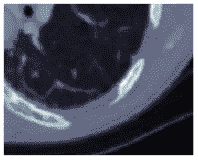

作者图片

进一步缩小(上图是为了说明我们正在看的图像区域)

按比例缩小以显示我们将在像素级别看到的图像部分[图片作者]

我们现在可以绘制每个像素值

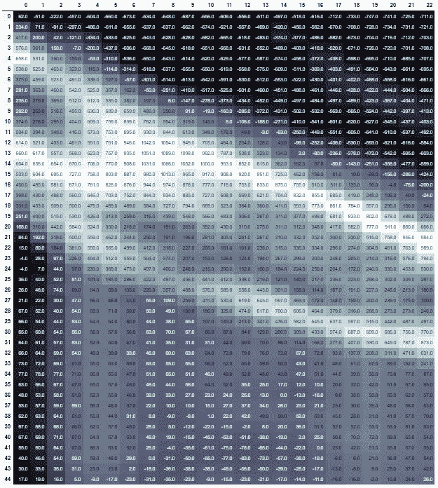

作者图片

使用肺窗，其`window width`为 1500，`window level`为-600。

*   lowest _ visible _ value =**-600—(1500/2)=-1350**
*   最高可见值= **-600 + (1500/2) = +150**

在这种情况下，最低可见值将为`-1350`，最高可见值为`+150`。这意味着大于`+150`的每个像素值将显示为白色，小于`-1350`的任何值将显示为黑色。

作者图片

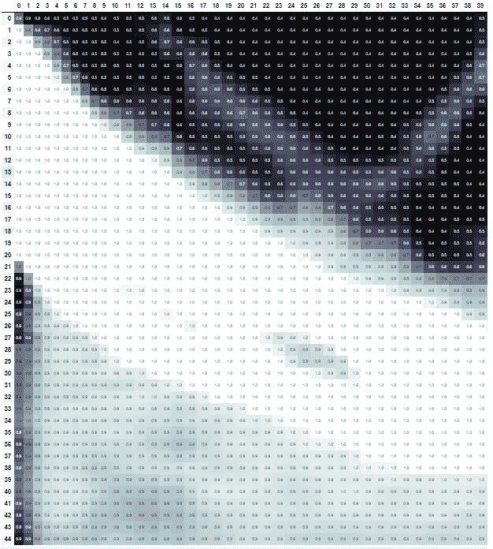

作者图片

像素强度已被缩放到窗口范围内的值。为了检查窗口范围是否按计划工作，我们可以比较原始图像和窗口图像的像素值。任何高于`+150`的像素值将显示为白色，任何低于`-1350`的像素值将显示为黑色，在这些值之间有各种阴影。

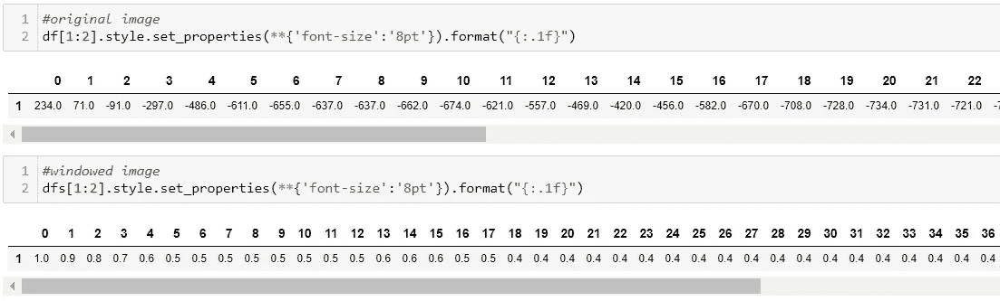

从左边的第一个像素开始，`234`的像素值高于`+150`的 highest_visible_value，因此该像素将在窗口图像上显示为白色(由`1.0`表示)。第 21 列的像素值为`-731`，其不低于`-1350`的最低可见值，因此不会显示为黑色，而是由值为`0.4`的阴影颜色(取决于 cmap 设置)表示。

# 更改窗口设置的意义

**窗口宽度**

*   增加窗口宽度将`decrease`图像的对比度
*   减小窗口宽度将`increase`图像的对比度

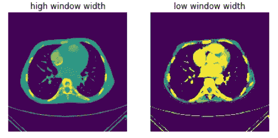

作者图片

**窗位**

*   增加窗位将`decrease`图像的亮度
*   降低窗位将`increase`图像的亮度

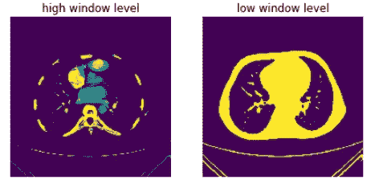

作者图片

# 各种窗肺范围

在`dicom_windows`中有许多指定的窗口范围，或者您可以通过指定`window width`和`window center`创建自己的窗口范围。这些是特别查看肺部图像时最常用的窗口范围。

## 肺窗

*   窗口设置:(宽:1600，长:-600)
*   通常与宽窗口一起使用，以提供良好的分辨率并显示各种密度。

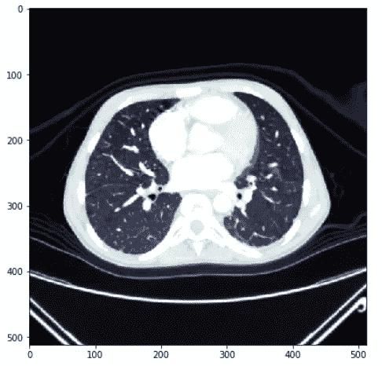

作者图片

## 纵隔窗

*   窗口设置:(宽:500，长:50)
*   纵隔是分隔肺部的区域。它被前面的胸骨和后面的脊柱包围，肺在两侧。它包括心脏、主动脉、食道、胸腺(颈部后面的一个腺体)和气管(气管)。

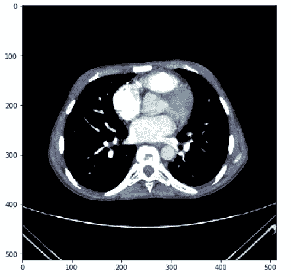

作者图片

## PE 窗口

*   窗口设置:(宽:700，长:100) —这不是`dicom_windows`的一部分，但您可以通过指定`window level`和`window width`轻松使用自定义窗口范围
*   专门用于观察肺栓塞的窗口范围

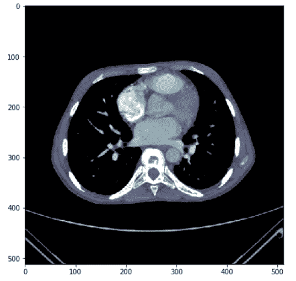

作者图片

每个窗口突出显示特定的范围，使放射科医师更容易看到正常组织和病理改变组织之间是否有任何变化。如果我们将上面的三幅图像与一幅没有开窗的图像进行比较，我们可以清楚地看到为什么开窗很重要。

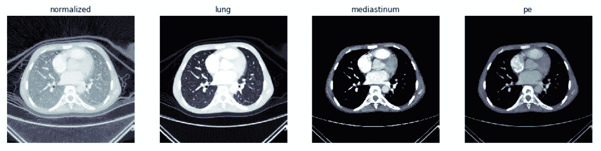

作者图片

如果你有兴趣了解更多关于 DICOM 的知识，你可以阅读我的文章 [**了解 DICOM**](/understanding-dicoms-835cd2e57d0b)**，这篇文章也发表在《走向数据科学》上。**

# **参考**

**( [1)增加医疗显示系统中的灰度数量——多少才够？](https://www.ncbi.nlm.nih.gov/pmc/articles/PMC3043920/)**

**( [2)了解 CT 窗口、级别和密度](https://www.youtube.com/watch?v=KZld-5W99cI)**

**( [3)豪恩菲尔德量表](https://en.wikipedia.org/wiki/Hounsfield_scale)**