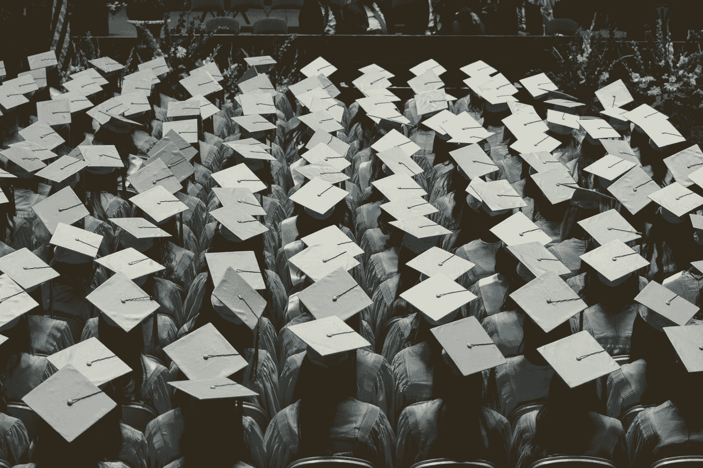
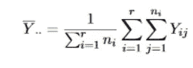

# 给大学生的信息

> 原文：<https://towardsdatascience.com/a-message-for-undergraduates-6fd16caa1da1?source=collection_archive---------38----------------------->

## 更客观地看待自己，看着肩上的重量消散。

Joshua Hoehne 在 [Unsplash](https://unsplash.com?utm_source=medium&utm_medium=referral) 上拍摄的照片

你是大学生。要么你即将毕业(像我一样)，要么你正在获得你的第一个大学学位。这个过程并不容易，我只能想象硕士和博士生的压力有多大。但是，我对此毫无头绪，所以这不会是我关注的话题。你可以很容易地认为我是为自己写这篇文章——这部分是对的。不管怎样，我还是想把这条消息发出去。[申请机器学习领域的工作并不容易](/the-uncertainty-in-the-machine-learning-job-hunt-a0e785c03a65)。任何人告诉你的都没有你现在工作的一半努力。

# 保持客观:

获得数学、统计学、计算机科学或任何与数据科学和机器学习相关的技术领域的本科学位是迈出这一步的绝佳途径。一般来说，在大学四年里，你应该有某种形式的实习或研究经历。事后获得经验同样很棒。但我说的客观对待自己，不一定是指你的经历。

我是我大学的一名高三学生。这意味着我还有不到一年的时间来获得统计学学士学位。我不断回想自己大二时上的第一堂高年级统计学课——方差分析。当我的教授在讨论如何找到总体样本均值时，我有生以来第一次看到了双重求和。我差点惊恐发作。这是一个等式:

作者图片

现在，你可能会认为这个方程非常直观。真的是。但是，我永远不会动摇我第*次*看到这个等式时的那种感觉。这是一种数学知识不足以理解二重求和的感觉。这是一种落后于班级的感觉，尽管在看到方程之前不到两周就开始了。那是一种失败的感觉。对这样一个方程来说，那不是太多感情了吗？真的是。

我第一次看到二重求和的时候是 19 岁，不到两年后的今天，我 21 岁，正在撰写一篇论文，要求我了解两个我没有接受过正规教育的领域。在不到两年的时间里，我从害怕方程变成了对方程看不够。现在回头看自己上这门课，也能客观理解自己的感受。作为一名新生，我第一次看到许多概念，所以我被这样的公式吓倒是有道理的。作为一名大学生，你可能会看到许多(我指的是**许多** *)* 你一生中从未见过或想过的新概念。这些概念中的许多会让你着迷不已，并与你对世界的解读完美契合。更多的这些概念会打破你的思维方式，让你困惑几天、几周，有时甚至几个学期才能理解它们(旁注:如果你对一个概念如此困惑，可以和你的教授和助教谈谈。如果这仍然没有帮助，YouTube 一直支持我。)

如果你不能认识到你在过去几年中取得的进步，你就不能认识到你在未来必将取得的进步。你的目标是什么？你打算如何实现你的目标？客观地审视自己会提醒你，不要期望你一开始就知道所有的事情。成为一名本科生意味着一件非常重要的事情:你是这个领域的新手。这绝不是一件坏事。事实上，只有你认为它是坏事，它才是坏事。开始认识到，你正沿着自己选择的道路开始你的旅程。开始认识到你现在不知道的并不代表你将来的知识和潜力。开始认识到你知识的延展性可以让你成为超级巨星——你只需要自己去看。