# 深层图像修复的里程碑——综述:全局和局部一致的图像修复

> 原文：<https://towardsdatascience.com/a-milestone-in-deep-image-inpainting-review-globally-and-locally-consistent-image-completion-505413c300df?source=collection_archive---------15----------------------->

欢迎回来，伙计们，我希望之前的帖子激起了你们对图像修复的深度生成模型的好奇心。如果你是新朋友，我强烈建议你浏览一下之前的帖子[这里](https://medium.com/analytics-vidhya/introduction-to-generative-models-for-image-inpainting-and-review-context-encoders-13e48df30244)和[这里](https://medium.com/@ronct/review-high-resolution-image-inpainting-using-multi-scale-neural-patch-synthesis-4bbda21aa5bc)。根据前一篇文章中的声明，我们今天将进入深层图像修复的另一个里程碑！你准备好了吗？开始吧:)

****图像修复*** 和 ***图像完成*** 代表相同的任务

# 回忆

这里只是简单回顾一下我们以前学过的内容。

*   对于图像修复，填充像素的纹理细节非常重要。有效像素和填充像素应该一致，填充的图像应该看起来逼真。
*   粗略地说，研究人员采用像素级重建损失(即 L2 损失)来确保我们可以用“正确”的结构填充缺失的部分。另一方面，应当使用 GAN 损失(即对抗性损失)和/或[纹理损失](https://medium.com/@ronct/review-high-resolution-image-inpainting-using-multi-scale-neural-patch-synthesis-4bbda21aa5bc)来获得具有所生成像素的更清晰纹理细节的填充图像。

# 动机

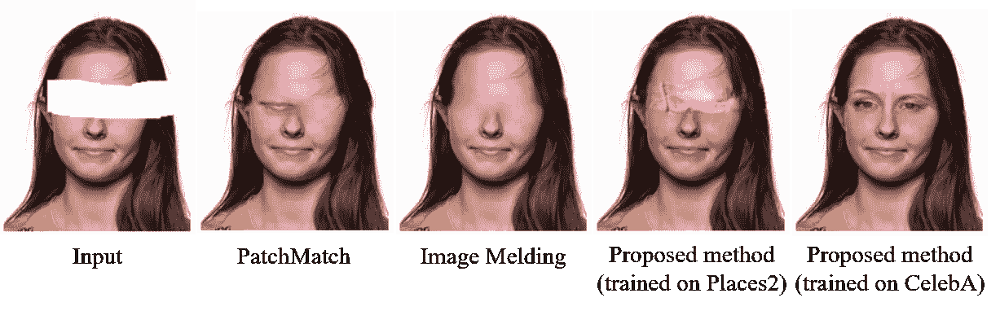

图一。一个例子显示了为图像修补任务生成新片段的需要。摘自并修改自[1]

*   对于基于补片的方法，一个重要的假设是，我们相信我们可以在缺失区域之外找到相似的补片，并且这些相似的补片对于填充缺失区域是有用的。这种假设对于自然场景可能是正确的，因为天空和草坪在一幅图像中可能有许多相似的斑块。如果丢失区域之外没有任何相似的补片，就像图 1 所示的人脸图像修复的情况一样，该怎么办？对于这种情况，我们无法找到任何眼罩来填补相应的缺失部分。因此，鲁棒的修复算法应该 ***能够生成新颖的片段*** 。
*   现有的基于 GAN 的修补方法利用鉴别器(对抗损失)通过将填充区域馈送给鉴别器(即欺骗鉴别器)来增强填充区域的锐度。一些人可以在预训练的网络中比较丢失区域内部和外部的局部神经响应，以确保丢失区域内部和外部的局部补片的相似纹理细节。如果我们同时考虑图像的局部和全局信息来加强局部和全局一致性，会怎么样？我们会获得更好的完整图像吗？ 让我们看看。

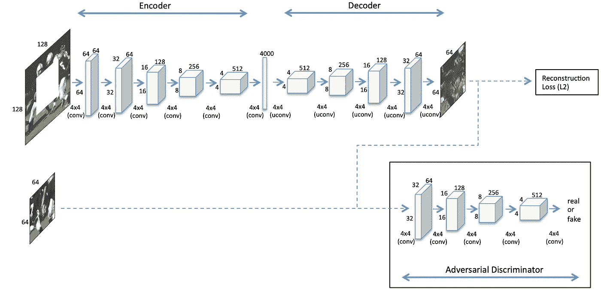

图二。上下文编码器的网络体系结构。摘自[2]

*   ***如何处理高分辨率图像？*** 我们之前讨论过第一种基于 GAN 的修复方法，上下文编码器[这里](https://medium.com/analytics-vidhya/introduction-to-generative-models-for-image-inpainting-and-review-context-encoders-13e48df30244)。他们假设测试图像总是 128×128，并且缺少一个 64×64 的中心孔。然后，我们还介绍了上下文编码器的改进版本，在之前的文章中的[中称为多尺度神经补片合成。他们提出了一种多尺度方法来处理最大分辨率为 512×512 且具有 256×256 中心缺失孔的测试图像。简而言之，他们使用三个网络来处理三种比例的图像，即 128×128，256×256，然后是 512×512。因此，速度是他们提出的方法的瓶颈。用 Titan X GPU 填充一个 512×512 的图像大约需要 1 分钟。所以，一个有趣的问题！ ***我们如何仅通过一次网络转发来处理高分辨率图像？*** 给你几秒钟时间思考，你可能会从如图 2 所示的架构中找到一些提示(注意中间层)。一个简单的答案是去掉中间的全连接层，采用全卷积网络！你很快就会知道怎么做和为什么！](https://medium.com/analytics-vidhya/review-high-resolution-image-inpainting-using-multi-scale-neural-patch-synthesis-4bbda21aa5bc)

# 介绍

*   现有的大多数方法都假设可以找到相似的图像块来填充同一幅图像中缺失的部分。图像修复并不总是如此，请参见图 1。更准确地说，我们应该看整个图像来理解它的上下文，然后根据它的上下文来填充缺失的部分。
*   如果采用全连接层，则输入图像大小必须是固定的。因此，网络不能仅通过一次向前传递来处理不同分辨率的测试图像。回想一下，全连接层完全连接两层之间的所有神经元，因此它对先前层的输出大小的变化很敏感，并且测试图像大小必须是固定的。另一方面，对于卷积层，神经元之间没有完全连接。较小的输入要素地图会导致较小的输出要素地图。因此，如果网络仅由卷积层组成，它可以处理各种大小的输入图像。我们称这类网络为**全卷积网络**。

# 解决方案(简而言之)

*   使用扩展卷积而不是全连接层，这样我们仍然可以理解图像的上下文，并构建一个全卷积网络(FCN)来处理不同大小的图像。
*   使用两个鉴别器来确保完成的(填充的)图像的局部和全局一致性。一个鉴别器在全局意义上查看整个图像，而一个鉴别器在局部意义上查看填充区域周围的子图像。
*   采用简单的后处理。有时很容易发现生成像素和有效像素之间的差异。为了进一步提高视觉质量，作者采用了两种常规技术，即[快速行进法](https://docs.opencv.org/master/df/d3d/tutorial_py_inpainting.html)和[泊松图像融合](http://www.ctralie.com/Teaching/PoissonImageEditing/)。这两种技术超出了本文的范围，感兴趣的读者可以点击超链接了解更多。后来，在某种程度上，后处理步骤已经以细化网络的形式嵌入到网络中。我们将在以后的文章中讨论它。

# 贡献

*   提出一种**全卷积网络，采用扩展卷积**进行图像修复。它允许我们在不使用完全连接的层的情况下理解图像的上下文，因此训练的网络可以用于不同大小的图像。这种架构实际上形成了后来基于深度学习的图像修复方法的基础。这就是为什么我认为这篇论文是修复的里程碑。
*   建议使用**两个鉴别器**(一个**局部**和一个**全局**)。多尺度鉴别器似乎可以在各种尺度下提供完整图像的更好的纹理细节。
*   强调在图像修复任务中生成新颖片段的重要性。实际上，训练数据极其重要。简单来说，**你不能生成你以前没见过的东西！**

# 方法

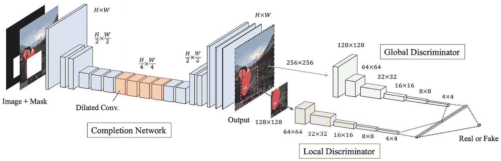

图 3。提议的体系结构概述。摘自[1]

*   图 3 显示了建议的整体网络架构。它由三个网络组成，即完备网络(即生成器，在训练和测试中都使用)、局部鉴别器和全局鉴别器(在刚训练时用作学习的辅助网络)。快速回忆一下这个 GAN 框架。生成器负责完成图像以欺骗鉴别器，而鉴别器负责区分完成图像和真实图像。

# 细胞神经网络中的扩张卷积

扩张卷积的概念对于读者理解本文的网络设计是重要的。所以，我想尽力为不熟悉扩张卷积的读者解释一下。对于非常了解它的读者，也请快速回顾一下。

图 4。标准卷积和扩展卷积的图示

*   在论文中，作者用了半页的篇幅来描述 CNN、标准卷积和扩张卷积。他们还提供了卷积方程供参考。有一点我必须澄清，扩张卷积不是作者在本文中提出的，他们用它来进行图像修复。
*   在这里，我只想用一个简单的图来说明标准卷积和扩张卷积的区别。
*   图 4(a)是一个标准卷积层，具有 3×3 内核，步幅=1，填充=1，膨胀率=1。在 case 设置中，8×8 输入产生 8×8 输出，每 9 个相邻位置构成输出端的一个元素。
*   图 4(b)也是标准卷积层。这次我们使用一个 5×5 的内核，步幅=1，填充=2(用于保持相同的输入和输出大小),膨胀率=1。在这种情况下，每 25 个相邻位置对输出端的每个元素都有贡献。这意味着对于输出端的每个值，我们必须更多地考虑(关注)输入端。我们通常称之为更大的**感受野**。对于一个大的感受野，来自远处空间位置的更多特征将被考虑以给出输出的每个值。
*   然而，对于图 4(b)中的情况，我们使用更大的核(5×5)来获得更大的感受野。这意味着需要学习更多的参数(与 5×5=25 相比，3×3=9)。有什么方法可以在没有更多参数的情况下增加感受野？答案是扩张卷积。
*   图 4(c)是一个具有 3×3 内核、步幅=1、填充=2 和膨胀率=2 的膨胀卷积层。当比较图 4(b)和图 4(c)中的核的覆盖范围时，我们可以看到它们都覆盖了输入端的一个 5×5 的局部空间区域。通过跳过连续的空间位置，3×3 核可以获得与 5×5 核一样的感受野。跳跃的步骤由膨胀率决定。举例来说，一个 3×3 的核，其**扩张率=2** 给出一个 5×5 的感受野；具有**扩张率=3** 的 3×3 核给出 7×7 感受野，依此类推。显然，通过跳过连续的空间位置，扩展卷积增加了感受野，而没有增加额外的参数。优点是我们有更大的感受野和相同数量的参数。缺点是我们跳过了一些位置(我们可能会因此丢失一些信息)。

# 为什么要扩张卷积？

在回顾了膨胀卷积的概念后，我现在要谈谈作者在他们的模型中使用膨胀卷积的原因。你们中的一些人可能已经猜到了原因。让我们检查一下！

*   如前所述，理解整个图像的上下文对于图像修复任务是很重要的。以前的方法采用全连接层作为中间层，以便理解上下文。请记住，标准卷积层在局部区域执行卷积，而全连接层完全连接所有神经元(即每个输出值取决于所有输入值)。然而，全连接层对输入图像大小施加了限制，并引入了更多可学习的参数。
*   为了解决这些限制，使用扩张卷积来构建允许各种大小输入的全卷积网络。另一方面，通过调整标准核的膨胀率(通常为 3×3)，我们可以在不同的层上有更大的感受野，以帮助理解整个图像的上下文。

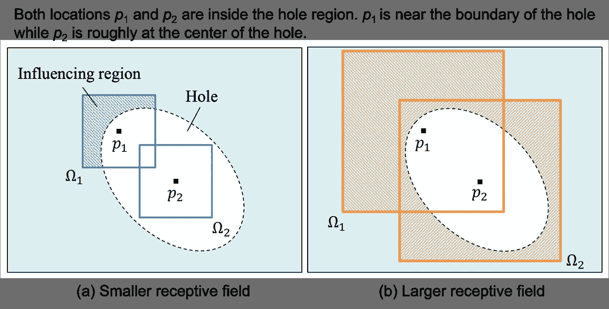

图 5。感受野大小的影响。摘自并修改自[1]

*   图 5 是一个示例，显示了扩张卷积的有效性。你可能认为(a)是具有 3×3 核(较小感受野)的标准卷积，而(b)是具有 3×3 核且扩张率≥2(较大感受野)的扩张卷积。位置 p1 和 p2 位于孔区域内，其中 p1 靠近边界，p2 大致位于中心点。对于(a)，可以看到位置 p1 的感受野(影响区域)可以覆盖有效区域。这意味着有效像素可以用来帮助填充位置 p1 处的像素。另一方面，位置 p2 的感受野不能覆盖有效区域，因此没有来自有效区域的信息可用于生成。
*   对于(b)，我们使用扩张卷积来增加感受野。这一次，两个位置的感受野可以覆盖有效区域。读者现在可以认识到扩张卷积的有效性。

# 完井网络

让我们回到图 3 所示的完井网络的结构。

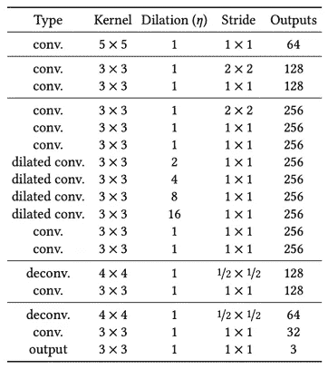

表 1。完井网络的结构。每个卷积层后面都跟有 ReLU，除了最后一个卷积层后面跟有 Sigmoid [1]

*   完成网络是一个完全卷积网络，它接受不同大小的输入图像。
*   该网络对输入进行 2 倍的下采样。这意味着，如果输入为 256×256，则中间层的输入大小为 64×64。
*   为了充分利用有效像素并保证逐像素精度，作者用有效像素代替空洞区域以外的像素。

# 上下文鉴别器

让我们来谈谈本地和全球歧视者。没有什么特别的，和单一鉴别器的情况一样。唯一不同的是我们这次有两个。

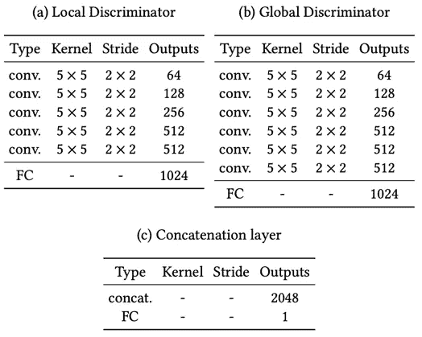

表二。局部和全局鉴别器的结构。FC 代表全连接层。级联层(c)的最后一个 FC 后面是一个 Sigmoid [1]

*   局部和全局鉴别器共享几乎相同的架构。全局鉴别器以 256×256 的大小(整个图像，为了全局一致性)获取输入图像，而局部鉴别器以 128×128 的大小围绕缺失区域的中心获取输入，为了局部一致性。
*   需要注意的一点是，在训练过程中，总有一个单一的缺失区域。在测试过程中，图像中可能会有多个缺失区域。此外，对于局部鉴别器，由于实际图像没有填充区域，因此对实际图像采用随机选择 128×128 的块。

# 训练策略和损失函数

*   和以前一样，使用两个损失函数来训练网络，即 L2 损失和对抗损失(GAN 损失)。

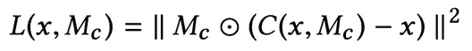

*   *C* ( *x* ， *M_c* )表示作为函数的完井网络。 *x* 是输入图像，并且 *M_c* 是指示缺失区域的二进制掩码。1 表示孔区域，0 表示外部区域。你可以看到 L2 损耗是在空穴区域内计算的。注意，完整图像的外部区域的像素直接被有效像素替换。

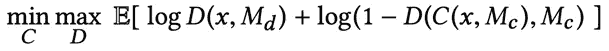

*   *D* ( *x* ， *M_d* )表示作为函数的两个鉴别器。 *M_d* 是一个随机掩码，用于为局部鉴别器随机选择一个图像块。这是标准的 GAN 损耗。我们希望鉴别器不能区分完整的图像和真实的图像，因此我们可以得到具有真实纹理细节的完整图像。

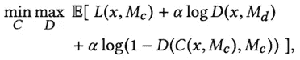

*   这是训练网络的联合损失函数。α是一个加权超参数，用于平衡 L2 损耗和 GAN 损耗。

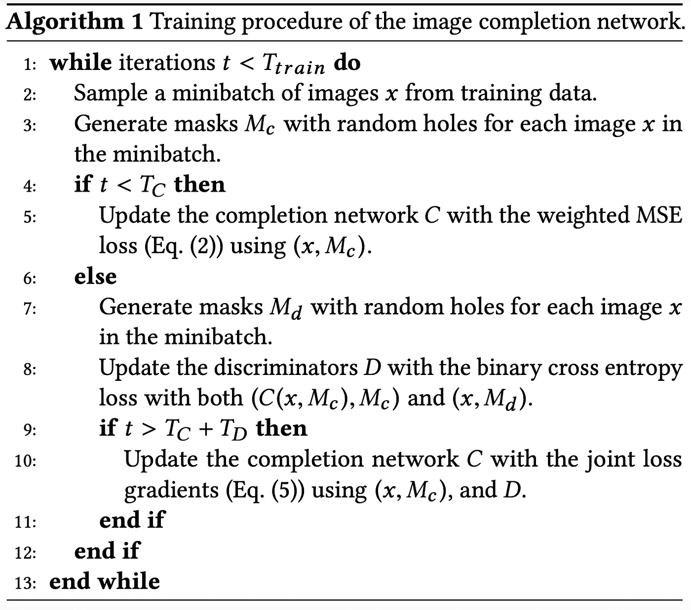

算法 1。提议的培训程序[1]

*   作者将他们的训练分为三个阶段。对于 *T_C* 次迭代，训练仅具有 L2 损耗的完成网络。 **ii)** 固定完成网络，使用 GAN 损耗训练鉴别器进行 *T_D* 次迭代。 **iii)** 交替训练完成网络和鉴别器，直到训练结束。
*   为了稳定的训练，在除了完成网络的最后一层和鉴别器之外的所有卷积层之后使用批量标准化(BN)。
*   为了生成训练数据，他们随机将图像的最小边缘调整到[256，384]像素范围。然后，他们随机裁剪一个 256×256 的图像块作为输入图像。对于掩模图像，他们随机生成一个洞，每个边的范围从[96，128]。
*   简单的后处理:如前所述，作者还采用传统的快速行进方法，然后进行泊松图像混合，以进一步提高完成图像的视觉质量。

# 实验

*   作者使用来自 Places2 数据集[3]的 8，097，967 幅训练图像来训练他们的网络。联合损失函数中的 alpha 加权超参数设置为 0.0004，批量大小为 96。
*   从论文来看，完井网络训练为*T _ C*= 90000 次迭代；鉴别器被训练 *T_D* = 10，000 次迭代，最后所有网络被联合训练 400，000 次迭代。他们声称，整个训练过程在一台配有 4k 80 GPU 的计算机上需要大约 2 个月的时间。

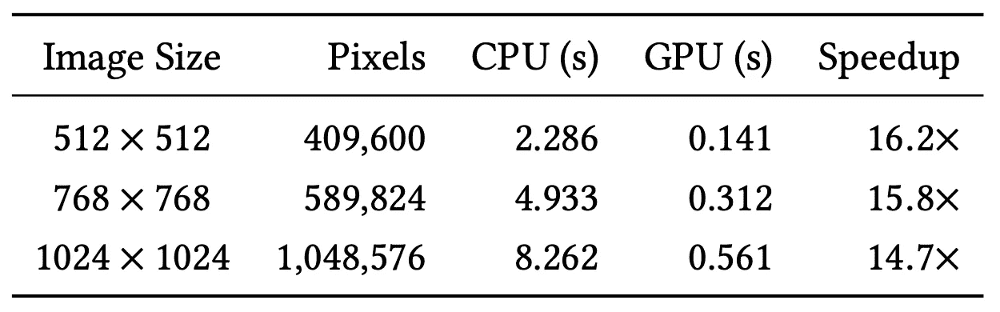

表 3。提议方法的时机[1]

*   他们使用 8 核英特尔酷睿 i7–5960 X CPU @ 3.00 GHz 和 NVIDIA GeForce TITAN X GPU 在 CPU 和 GPU 上进行评估。其实速度挺快的，半秒多一点完成一张 1024×1024 的图像。

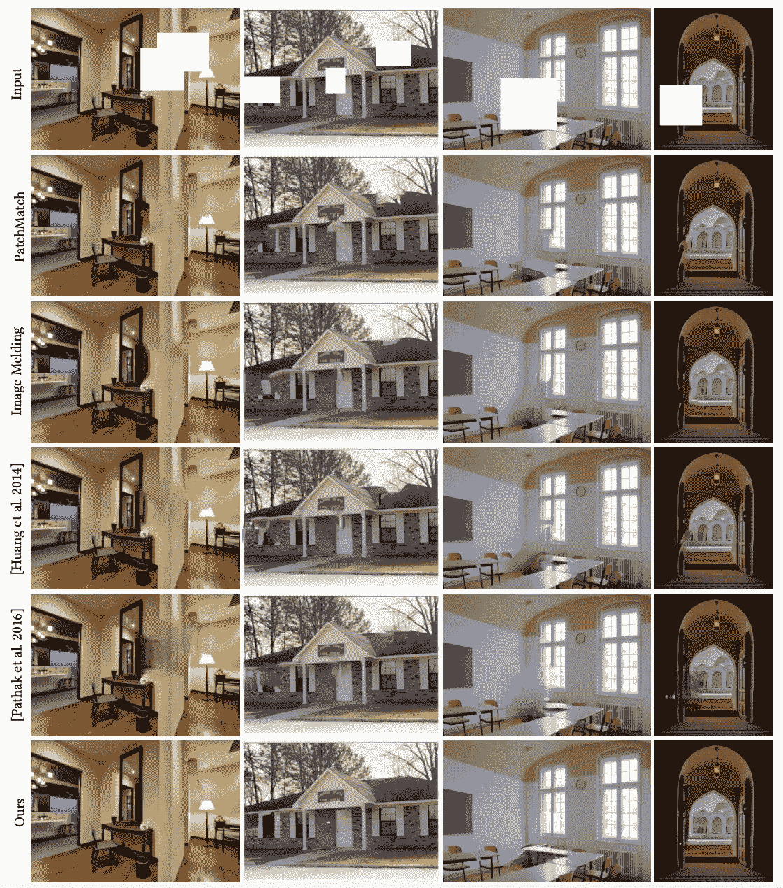

图 6。与现有修复方法的比较[1]

*   图 6 显示了与一些现有方法的比较。总的来说，基于补片的方法能够完成局部一致的图像补片，但是它们可能不与整个场景全局一致。最近基于 GAN 的方法，上下文编码器(第五行)，往往会给出模糊的完整图像。所提出的方法提供了局部和全局一致的完整图像。

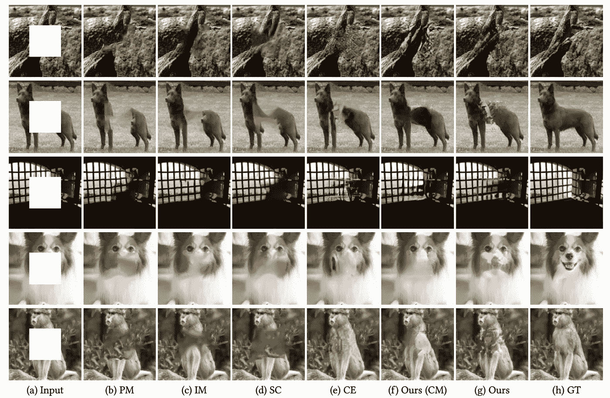

图 7。与上下文编码器(CE)对中心缺失孔的比较。CE 和我们的(CM)都使用来自 [ImageNet](http://www.image-net.org/) 的相同 100k 训练图像子集进行训练，用于中心孔洞填充【1】

*   为了与最新的基于 GAN 的修复方法进行比较，作者执行了中心区域填充，结果如图 7 所示。可以看出，对于中心区域完成，CE 比任意区域完成执行得更好(图 6)。在我看来，CE 和所提出的方法在图 7 中具有相似的性能。读者可以放大来看不同之处。

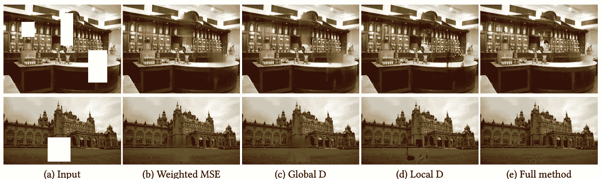

图 8。不同鉴别器设置的影响[1]

*   作者对这两种鉴别器进行了消融研究。从图 8(b)和(c)可以看出，当不使用局部鉴别器时，完成的区域看起来更加模糊。另一方面，对于(d ),如果仅使用局部鉴别器，我们可以获得良好的局部一致性纹理细节，但不能保证全局一致性。对于(e)中的完整方法，我们实现了具有局部和全局一致性的结果。

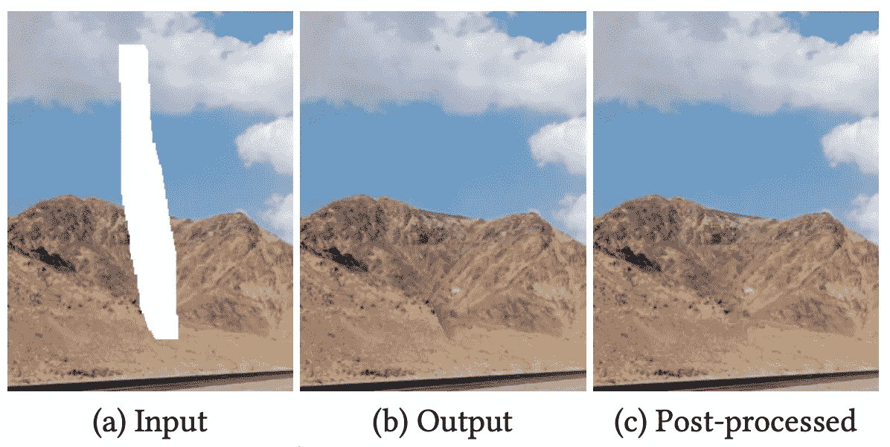

图 9。简单后处理的效果[1]

*   图 9 显示了简单后处理的效果。对于图 9(b ),我们可以很容易地观察到边界。

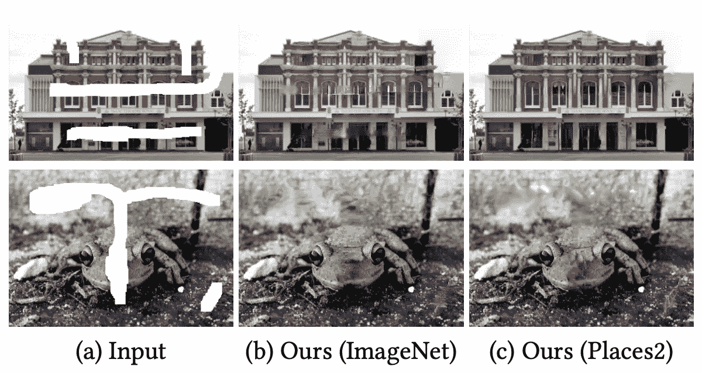

图 10。修复不同数据集的训练结果[1]

*   图 10 显示了在不同数据集上训练的模型的修复结果。请注意，Places2 包含大约 800 万张不同场景的训练图像，而 ImageNet 包含 100 万张用于对象分类的训练图像。我们可以看到，在 Places2 上训练的模型的结果比在 ImageNet 上训练的结果要好一些。

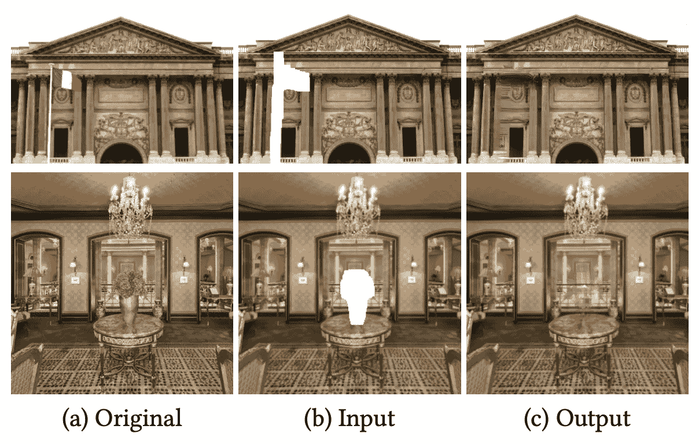

图 11。提出的方法去除物体的例子[1]

*   图像修补的一个潜在应用是对象移除。图 11 示出了通过使用所提出的方法来移除对象的一些例子。

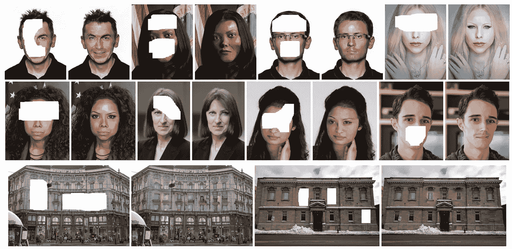

图 12。更具体数据集的结果，即面部和立面[1]

*   本文作者还考虑了特定领域的图像修复。他们在 CelebA 数据集[4](用于人脸修复)和 CMP Facade 数据集[5](用于立面修复)上微调了他们的预训练模型，这两个数据集分别由 202，599 和 606 幅图像组成。他们使用在 Places2 数据集上训练的预训练模型。对于新的数据集，他们从头开始训练鉴别器，然后完成网络和鉴别器一起交替训练。
*   图 12 示出了由所提出的用于域特定图像修补的方法给出的一些修补结果。对于人脸修复，提出的方法能够生成新颖的片段，如眼睛和嘴巴。对于立面修复，所提出的方法还能够生成像窗口一样的片段，这些片段在局部和全局上与整个图像一致。
*   作者还对完整的人脸图像进行了用户研究。结果表明，77.0%的人脸被 10 个用户认为是真实人脸。另一方面，96.5%的真实人脸可以被 10 个用户正确识别。

# 局限性和讨论

以下是作者列出的关于局限性和未来方向的一些观点。

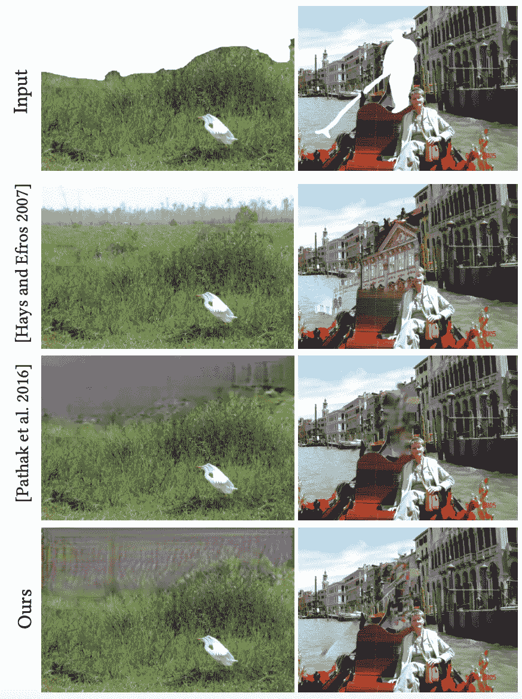

图 13。失败情况 I)掩模在图像的边界 ii)场景复杂。摘自[1]

*   对于图 13 左侧的情况，我们可以看到**缺失的部分在上部图像**的边界处。作者声称**在这种情况下，可以从邻近位置**借用的信息更少，因此基于 GAN 的方法(第 3 行和第 4 行)比传统的基于补丁的方法(第 2 行)表现更差。另一个原因是，这个例子是自然场景，所以基于补丁的方法可以很好地工作。
*   对于图 13 右边的例子，**场景要复杂得多**。根据遮罩，我们想要移除一个人，我们必须填充一些建筑物的细节来完成这个复杂的场景。在这种情况下，所有的方法都不能正常工作。所以在复杂场景中填充缺失的部分**还是很有挑战性的。**

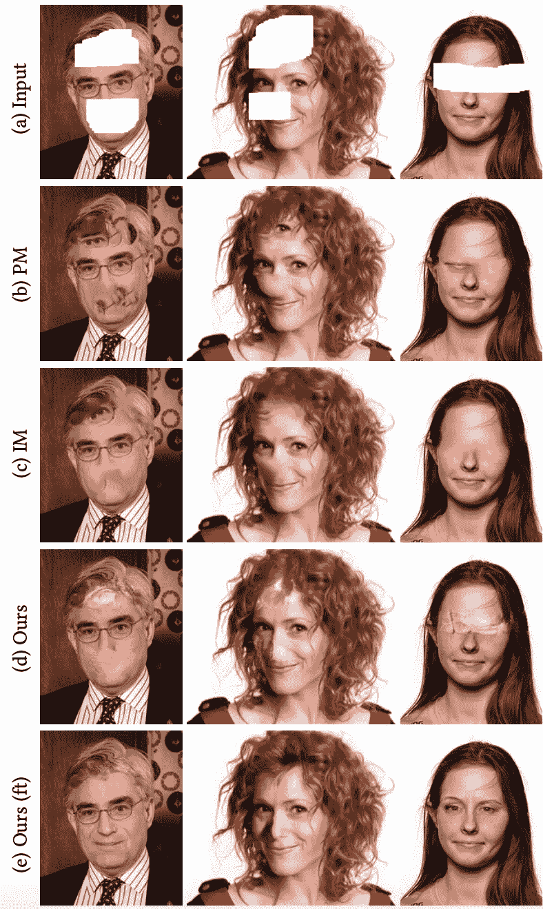

图 14。举例说明生成新片段的重要性，我们只能生成我们以前在训练中见过的内容。摘自[1]

*   作者提供了额外的例子来强调另外两点。 **i)** 生成眼睛、鼻子、嘴巴等新奇片段的重要性。 **ii)** 训练数据集的重要性。
*   对于我们无法找到相似图像补片来填充缺失部分的情况，基于补片的方法(第 2 行和第 3 行)无法正常工作，如图 14 所示。因此，**鲁棒的修复算法必须能够生成新颖的片段**。
*   为了进一步表明选择训练数据集的重要性，作者比较了在 Places2(通用数据集，(d))和 CelebA(人脸数据集，(e))上训练的两个模型。显然,( d)不能用合理的面部细节来填充缺失的部分，因为它是在不包含任何对齐的面部图像的地点 2 上训练的。另一方面，(e)工作得很好，因为它是在 CelebA 上训练的，CelebA 是一个具有许多对齐的人脸图像的数据集。因此，**我们只能生成我们在训练**时看到的内容。鲁棒的通用修复还有很长的路要走。

# 结论

*   所提出的体系结构是大多数后期修复论文的基础。具有扩展卷积的全卷积网络允许我们在不使用全连接层的情况下理解图像的上下文，因此网络可以采用各种大小的输入图像。
*   多尺度鉴别器(这里我们有两个鉴别器，实际上有些可能有三个！)对于增强不同比例的完整图像的纹理细节是有用的。
*   在场景复杂的情况下，填补缺失的部分仍然具有挑战性。另一方面，自然场景相对容易完成。

# 外卖食品

在这里，我想列出一些对以后的帖子有用的点。

*   记住，具有扩展卷积的全卷积网络是用于图像修复的典型网络结构。它允许不同大小的输入，并为完全连接的层提供类似的功能(即帮助理解图像的上下文)。如果你愿意，你可以跳转到[ [这里](https://medium.com/analytics-vidhya/review-of-deepgin-deep-generative-inpainting-network-for-extreme-image-inpainting-de5b191562b0) ]查看最近的修复论文，看看这种典型结构的变化。
*   实际上，人脸图像修复比一般图像修复相对简单。这是因为我们总是在人脸数据集上训练模型来进行人脸图像修复，而数据集由许多对齐的人脸图像组成。对于一般的图像修复，我们可以在更加多样化的数据集上进行训练，如 Places2，它包含来自各种类别的数百万张图像，如城市、建筑物和许多其他图像。对于一个模型来说，学习生成具有良好视觉质量的所有东西要困难得多。不管怎么说，路还很长。

# 下一步是什么？

*   到目前为止，我们已经深入研究了三篇非常好的早期修复论文。下次，我想复习一下。我将讨论另一篇论文，它采用了这种具有扩展卷积的全卷积网络。希望你能看到基于深度学习的图像修复的发展。尽情享受吧！:)

# 参考

1.  饭冢聪，埃德加·西莫-塞拉，石川宽，“[全球和局部一致的图像完成](http://iizuka.cs.tsukuba.ac.jp/projects/completion/data/completion_sig2017.pdf)， *ACM Trans。《论图形》*，第 36 卷第 4 期第 107 条，出版日期:2017 年 7 月。
2.  Deepak Pathak，Philipp krhenbüHL，Jeff Donahue，Trevor Darrell 和 Alexei A. Efros，"[上下文编码器:通过修补进行特征学习](https://arxiv.org/pdf/1604.07379.pdf)，" *Proc .计算机视觉与模式识别* ( *CVPR* )，2016 年 6 月 27-30 日。
3.  地点 2 数据集，[http://places2.csail.mit.edu/download.html](http://places2.csail.mit.edu/download.html)
4.  、罗平、王晓刚和唐晓鸥，“在野外深度学习人脸属性”， *Proc。计算机视觉与模式识别* ( *CVPR* )，2015。
5.  Radim Tyleč ek 和 Radimára，“用于识别具有规则结构的对象的空间模式模板”， *Proc。2013 年德国模式识别会议*。

感谢你花时间写这篇文章。如果您有任何问题，请随时询问或在此留下评论。下次见！:)