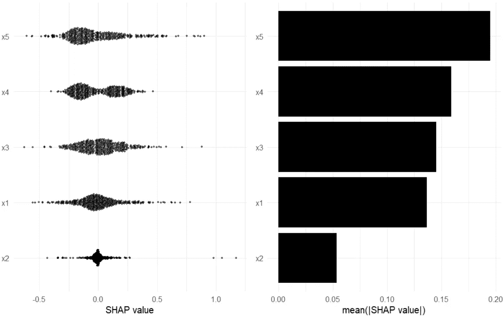

# R 中结合 H2O 自动分解和沙普利分解的一个极小例子

> 原文：<https://towardsdatascience.com/a-minimal-example-combining-h2os-automl-and-shapley-s-decomposition-in-r-ba4481282c3c?source=collection_archive---------44----------------------->


Borna Bevanda 在 [Unsplash](https://unsplash.com?utm_source=medium&utm_medium=referral) 上的照片

作为巴西一家大型金融机构的数据科学家，每天都要为业务的许多不同方面构建预测模型，这是很常见的。这取决于问题规模、数据类型、时间可用性等。，我的方法可以从开发快速和肮脏的模型(例如，基线逻辑回归)到更复杂(也许更精确)的模型。这两种方法都很有价值，在权衡每个问题的成本效益及其潜力时，都应该加以考虑。

作为一名经常使用 R 的用户，我最喜欢的机器学习方法之一是将 AutoML 的 H2O 框架的预测建模能力与 Shapley 值的可解释性结合起来。虽然有很多关于这两种技术的在线教程/解释(对于 H2O，我推荐艾琳·莱德尔的视频，比如这个:【https://www.youtube.com/watch?v=DjzKTeIIxOY】，对于沙普利的价值观，斯科特·伦德伯格的视频，比如这个[https://www.youtube.com/watch?v=ngOBhhINWb8](https://www.youtube.com/watch?v=ngOBhhINWb8))，博客帖子，笔记本等等。，我从来没有找到一种材料能以简洁的方式将它们结合在一起。

这篇博客文章是我构建的一个方便的脚本中的一个演练，我偶尔会为机器学习任务重新访问这个脚本(该脚本可在[https://github . com/renanxcortes/SHAP _ with _ H2O _ AutoML/blob/master/SHAP _ with _ H2O _ AutoML 获得。R](https://github.com/renanxcortes/SHAP_with_H2O_AutoML/blob/master/SHAP_with_H2O_AutoML.R) )。其思想是在拟合后，使用 AutoML 和 Shapley 的可解释性值逐步解释模型估计的整个过程。

你准备好了吗？所以，让我们开始吧！

我们首先加载所需的库:

```
library(h2o)
library(tidyverse)
library(ggbeeswarm)
```

因为我想尽可能保持简单，所以让我们为具有五个协变量的二元分类问题构建一个数据框架:

```
df <- tibble(y = rep(c(0,1), c(1000,1000)),
x1 = rnorm(2000),
x2 = rf(2000, df1 = 5, df2 = 2),
x3 = runif(2000),
x4 = c(sample(rep(c('A', 'B', 'C'), c(300, 300, 400))),                     sample(c('A', 'B', 'C'), 1000, prob = c(0.25, 0.25, 0.5), replace = T)),
x5 = c(rnorm(1000), rnorm(1000, 0.25)))
```

现在，作为中间步骤，H2O 的框架需要处理因子而不是字符。因此，让我们改变一些变量的类:

```
df <- df %>%   
mutate(y = as.factor(y)) %>%   
mutate_if(is.character, factor)
```

接下来的三个步骤分别是:在 R 会话中启动 H2O 实例，将数据框转换为 H2O 数据框，以及将数据拆分为定型集和维持集。

```
h2o.init() 
df_frame <- as.h2o(df) 
df_frame_split <- h2o.splitFrame(df_frame, ratios = 0.8)
```

值得注意的是，在分割画面时，H2O 并没有给出精确的分割。它旨在使用概率分割方法而不是精确分割来高效处理大数据。

现在，时候到了！鉴于我们之前运行的步骤，是时候拟合机器学习模型了。下面的代码完成了这个任务:

```
# Metric for binary classification (deviance is the default). Check documentation here [http://docs.h2o.ai/h2o/latest-stable/h2o-docs/automl.html](http://docs.h2o.ai/h2o/latest-stable/h2o-docs/automl.html)
automl_model <- h2o.automl(y = 'y',
balance_classes = TRUE,
training_frame = df_frame_split[[1]],
nfolds = 4,
leaderboard_frame = df_frame_split[[2]],
max_runtime_secs = 60 * 2,
include_algos = c('DRF', 'GBM', 'XGBoost'),
sort_metric = "AUC")
```

好吧…深呼吸，因为这里发生了很多事情。我强烈建议您看一下官方文档，键入`help(h2o.automl)`可以更好地了解每个参数设置。我想强调其中一些我认为至关重要的因素:

*   **include_algos** :首先也是更重要的，由于 Shapley 的值分解是为基于树的模型开发的，这篇博文的王牌就是通过设置`include_algos = c('DRF', 'GBM', 'XGBoost')`来限制算法。这样，AutoML 将保证生成的最佳模型对于第二阶段的 Shapley 值生成是可行的；
*   **max_runtime_secs** :其次，一个很重要的论点是`max_runtime_secs`。这是功能运行的最长时间，以秒为单位。如果您有复杂和/或大型数据集，并且有时间等待更准确的模型，则可以将设置为更大的值；
*   **sort_metric** :最后，我想强调一下`sort_metric`参数，可以根据您的喜好或机器学习问题对其他度量进行调整(例如，对于回归模型，您可以设置`sort_metric = "RMSE"`)。

关于`h2o.automl`最酷的事情之一是它生成了一个排行榜，非常类似于 Kaggle 的排行榜对模特进行排名:

```
lb <- as.data.frame(automl_model@leaderboard)
```


排行榜的第一行是在这个简单的例子中产生的

我们可以提取领导者模型:

```
aml_leader <- automl_model@leader
```

现在，我们计算并绘制 Shapley 值，以获得每个特征如何影响 leader 模型中因变量的总体概述，代码片段如下:

```
# SHAP values: http://docs.h2o.ai/h2o/latest-stable/h2o-r/docs/reference/predict_contributions.H2OModel.html 
SHAP_values <- predict_contributions.H2OModel(aml_leader, df_frame_split[[2]]) # Wrangling inspired here: https://bradleyboehmke.github.io/HOML/iml.html shap_df <- SHAP_values %>%  
as.data.frame() %>%  
select(-BiasTerm) %>%  
gather(feature, shap_value) %>%  
group_by(feature) %>%  
mutate(shap_importance = mean(abs(shap_value)),         
shap_force = mean(shap_value)) %>%   
ungroup() # SHAP contribution plotp1 <- ggplot(shap_df, aes(x = shap_value, y = reorder(feature, shap_importance))) +  
ggbeeswarm::geom_quasirandom(groupOnX = FALSE, varwidth = TRUE, size = 0.9, alpha = 0.5, width = 0.15) +  
xlab("SHAP value") +  
ylab(NULL) +  
theme_minimal(base_size = 15) # SHAP importance plotp2 <- shap_df %>%   
select(feature, shap_importance) %>%  
distinct() %>%   
ggplot(aes(x = reorder(feature, shap_importance),              
y = shap_importance)) +  
geom_col(fill = 'black') +  
coord_flip() +  
xlab(NULL) +  
ylab("mean(|SHAP value|)") +  
theme_minimal(base_size = 15) # Combine plotsgridExtra::grid.arrange(p1, p2, nrow = 1)
```



全球重要性的两个主要图

虽然 Shapley 的值在分析局部观测值时更直观，但检查这些全局属性也是有意义的。左侧的图表描述了维持集中每个功能的所有 Shapley 值的分布。可以看出， **x5** 具有大多数 Shapley 值负值，并且具有更宽的分布，表明其在预测能力或模型中的重要性，而 **x2** 是“不太重要的”。右侧的*重要性图*中的图表也加强了这一点，该图由分解的所有绝对值的平均值给出。

此外，还可以为每个特性的值构建部分相关图。让我们来看看最重要的特征是如何与因变量相关的:

```
# Shapley-based dependence plots for a numerical feature
SHAP_values %>%
  as.data.frame() %>%
  select(-BiasTerm) %>% 
  mutate(x5_feature_values = as.vector(df_frame_split[[2]]$x5)) %>% 
  ggplot(aes(x = x5_feature_values, y = x5)) +
  geom_point(aes(color = x5), width = 0.1) +
  scale_colour_gradient(low = "red", high = "blue", name = 'SHAP values') +
  ylab('Shapley\'s values for x5 feature') +
  xlab('x5 values') +
  theme_minimal(base_size = 15) +
  geom_smooth()
```


x5 特征的部分相关图:非线性关系

上图描绘了特征 **x5** 和其 Shapley 值之间明显的非线性关系。

此外，对于范畴特征，这种情节也是令人感兴趣的:

```
# Shapley-based dependence plots for a categorical feature
SHAP_values %>%
  as.data.frame() %>%
  select(-BiasTerm) %>% 
  mutate(x4_feature_values = as.vector(df_frame_split[[2]]$x4)) %>% 
  ggplot(aes(x = x4_feature_values, y = x4)) +
  geom_jitter(aes(color = x4), width = 0.1) +
  scale_colour_gradient(low = "red", high = "blue", name = 'SHAP values') +
  ylab('Shapley\'s values for x4 feature') +
  xlab('x4 feature classes') +
  theme_minimal(base_size = 15)
```


x4 特征的部分相关图:C 类高于其他类

您可以看到，类别 C 与因变量的较高值相关联，在本例中，因变量是“成功”的较高概率(y = 1)。

***收尾***

这篇文章描述了一个使用 R-数据科学中最常用的语言之一-的最小示例，用于使用 H2O 的 AutoML 和沙普利的值拟合机器学习模型。由于 H2O 的 AutoML 工具具有广泛的预测模型，这种方法的关键点是通过设置`include_algos = c('DRF', 'GBM', 'XGBoost')`将模型搜索限制为仅基于树。此外，为了说明这种方法的可解释性，使用了 Shapley 值、全局重要性图和部分相关性图。

你喜欢你读到的东西吗？推荐/分享这篇文章，让别人也能看到！还有 ， ***有什么意见或建议，不要犹豫和我联系！随时欢迎反馈！***

*通过*[*Linkedin*](https://www.linkedin.com/in/renan-cortes-a3583a33/)*，*[*Twitter*](https://twitter.com/renanxcortes)*，*[*Github*](https://github.com/renanxcortes)*。另外，你可以看看我的* [*网站*](https://renanxcortes.github.io/) *。*

由于 H2O 在幕后依赖于 Java，为了让它正常工作，您可能需要它。更多信息请访问[https://docs . H2O . ai/H2O/latest-stable/H2O-docs/downloading . html](https://docs.h2o.ai/h2o/latest-stable/h2o-docs/downloading.html)。

很容易在不考虑绝对值的情况下检查这些方法，试图检查每个特征的“总体方向”。但是，应考虑绝对值，而不是原始的正值和负值，因为正如 Scott Lundberg 所解释的那样，*“正值和负值都很重要，但是如果在测量全局特征重要性时允许它们相互抵消，那么您将不会测量特征对于模型的重要性，而是测量每个特征在您解释的样本和您的背景样本集之间的影响有多大不同。”[中提到的](https://github.com/slundberg/shap/issues/696#issuecomment-581993726)*https://github . com/slund Berg/shap/issues/696 # issue comment-581993726。