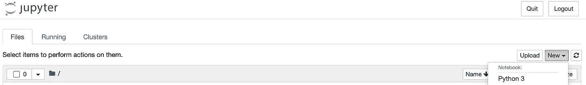

# 理解和创建 Python 虚拟环境的简明指南

> 原文：<https://towardsdatascience.com/a-minimal-guide-to-understanding-and-creating-python-virtual-environments-38ba3eac1bc7?source=collection_archive---------24----------------------->

## 以及依赖性管理的重要性

大多数严肃的数据科学项目应该在 Docker 容器或虚拟环境中进行。无论是对于测试还是依赖管理，这都是很好的实践，容器化为您调试和理解事物如何在统一的范围内协同工作提供了更大的能力。这篇文章是关于在 Python 3 中创建一个虚拟环境的，[虽然文档看起来很简单](https://packaging.python.org/guides/installing-using-pip-and-virtual-environments/)，但我想指出几个重要的清晰点，尤其是在使用 Jupyter 笔记本和管理内核和依赖项时。


乔治·霍丹的照片，[公共领域](https://www.publicdomainpictures.net/en/view-image.php?image=34228&picture=tin-on-white-background)

# venv 是什么？

Python 3 模块“venv”是 Python 3 的标准库。这意味着它是在你下载 Python 3 时内置的，所以你不必担心安装它。创建一个真实的虚拟环境非常简单:

```
python3 -m venv choose_your_venv_name
```

第一个命令是‘python 3’。这指示命令行运行 Python 3 脚本。后跟'-m '，该选项进一步指示 Python3 查找模块名，在本例中为' venv '。最后一个参数是您的虚拟环境的名称，它应该与您的预期项目的上下文相关(例如，基于统计的虚拟环境的“statsbox”)。

运行这个命令将会在你当前所在的目录中用你选择的名字创建一个目录，所以在运行它之前要小心地`cd`找到你想要的目录。几秒钟后，您的虚拟环境就应该创建好了。例如，我在主目录中运行了以下命令:

```
python3 -m venv tutorial_box
```

几秒钟后，我运行`ls`查看我的 home 目录，唉，‘tutorial _ box’就在那里。如果我们`cd`进入任何一个虚拟环境的目录，我们会发现它不是空的！

```
bin    include    lib    pyvenv.cfg
```

太好了。这些实际上是基本的“白板”文件，是启动和运行虚拟环境所必需的。仅仅因为你创造了一个虚拟环境，并不意味着你已经*真正置身其中(激活)*。这是一个重要的概念区别，我发现它会让入门学习者感到困惑。即使你`cd`进入虚拟环境目录(如上)，你的命令行命令，你的 Jupyter 笔记本，你的包*仍然由你的全局环境的 PATH 变量决定。*这意味着你打开的任何 Jupyter 笔记本仍然可以访问你在全球环境中安装的任何包或模块，如果你无意中制作了一个 genius 机器学习模型，而该模型**依赖于一个无法在不同环境中编译的包版本，那么你的代码将在该环境中中断**。例如，当试图用 Heroku、Streamlit、Flask、Dash 等部署数据科学应用程序时，这种情况很常见。

将虚拟环境(或 Docker 容器)想象成一台字面上的计算机是一个很好的比喻，它是您计算机内部的一台迷你计算机。换句话说，仅仅因为你的电脑**里有*新的迷你电脑*，并不意味着你还没有打开它**。

为此，在命令行中激活您的虚拟环境:

```
source bin/activate
```

就是这样！为了知道它在工作，您应该在左下方看到您的虚拟环境的名称，带有括号，在您通常的计算机的当前目录路径之前。在这种情况下，它是`(tutorial_box)`

最后，我们创建并激活了我们的虚拟环境。如果您在终端中手动运行 Python 3，您将在一个全新的环境中操作，并且您必须从头开始安装新项目所需的任何模块和包。但是记住，这是好事！它会把你从依赖地狱中拯救出来。

# …但为什么我的 Jupyter 笔记本仍在使用我的全球套餐？

这是我想在本教程中阐明的基本观点。

所以，我们已经激活了我们的虚拟环境。我们运行的任何 Python 3 命令都将被限制在我们新的虚拟环境的范围内。那么当我们打开一个新的 Jupyter 笔记本时会发生什么呢？

```
jupyter notebook
```

Jupyter 应该仍然可以在浏览器中打开，但是如果我们尝试创建一个新的笔记本，我们应该会看到下面的内核选项:



在右下角，我们只有一个选择

在“新”笔记本选项卡下，我们看到了“Python 3”。这很令人困惑:我们可以选择创建一个新的 Jupyter 笔记本，但是我们有一个潜在的内核列表可供选择。在某种程度上(与虚拟环境有些不同)，这些内核**本身就是虚拟 Python 环境，它将独立于您的虚拟环境运行，即使它被激活了！**

出现的默认 Python 3 内核实际上将再次成为您的全局 Python 3 环境，这完全挫败了使用虚拟环境的意义，因为我们希望从空白状态中精确地控制我们正在使用的包和模块。

为了向您的 Jupyter 环境*添加一个新的内核，它与您刚刚用 venv* 创建的虚拟环境相匹配，您需要在一个已经激活的虚拟环境中运行下面的命令【T9:

```
pip install --user ipykernel
```

这将在您的虚拟环境中安装 kernel-creator，并且您将总是需要在一个新创建的虚拟环境中运行它，因为它是一张白纸，不会安装`ipykernel`。然后，为了最终将内核添加到 Jupyter 笔记本的内核选项列表中，运行以下命令:

```
python -m ipykernel install --user --name=whatever_you_want 
```

这里有几点很重要。首先，`whatever_you_want`名称可以是您想要的任何名称，并且不必与您的虚拟环境名称相匹配。重要的是，用这个命令创建的内核将包含当前激活的虚拟环境中的所有包和模块。因此，给它起一个与你的虚拟环境相关的名字是有意义的，但是明智的做法是*附上一个版本号*。随着时间的推移，你可能会添加更多的包到你的虚拟环境中，然后你会添加那个虚拟环境 *state* 作为一个新的修改过的带有`ipykernel`的内核。最终，某些东西会坏掉，或者一些安装或更新的包会给你一个稍微不同的机器学习模型，你会想要恢复到以前的 Jupyter 内核。给这些内核添加您自己的版本号解决了这个问题，并且是虚拟环境的一种本地化版本控制。

或者，您也可以使用以下命令创建一个`requirements.txt`文件:

`pip freeze > requirements.txt`

那个。txt 文件可以安装在其他地方(更确切地说，是它里面的所有东西)，比如不同的虚拟环境或 Docker 容器。

或者，[我会推荐使用](https://github.com/jazzband/pip-tools) `pip-compile`，这是一个`pip-tools`包。这对于从手动输入的`requirements.in`文件自动生成`requirements.txt`文件非常有帮助。这非常有用，因为`pip-compile`会自动检测`requirements.in`文件中列出的包的所有必需依赖项。

这就足够了。使用`venv`、`ipykernel`和`pip-compile`是创建全新虚拟环境所需要的，希望这篇文章已经阐明了它们是如何与 Jupyter 笔记本、内核和依赖管理联系在一起的。

感谢阅读！