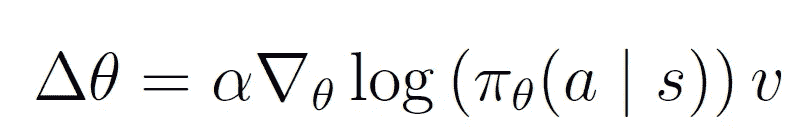
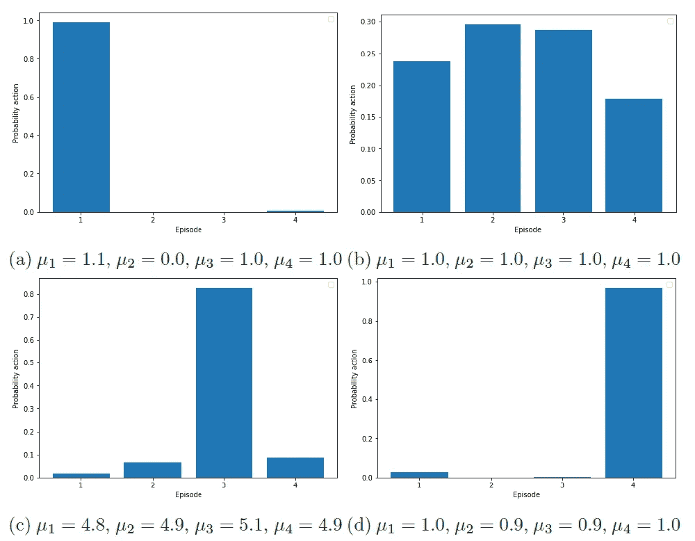

# TensorFlow 2.0 中离散策略梯度的最小工作示例

> 原文：<https://towardsdatascience.com/a-minimal-working-example-for-discrete-policy-gradients-in-tensorflow-2-0-d6a0d6b1a6d7?source=collection_archive---------38----------------------->

## 一个训练离散演员网络的多兵种土匪例子。在 GradientTape 功能的帮助下，只需几行代码就可以训练演员网络。

照片由[你好我是 Nik](https://unsplash.com/@helloimnik) via [Unsplash](https://unsplash.com/photos/NYpOl-PJDkM)

一旦你知道如何做，用 TensorFlow 2.0 训练离散演员网络是很容易的，但与 TensorFlow 1.0 中的实现有很大不同。由于 2.0 版本是 2019 年 9 月才发布的，所以网上流传的大部分例子还是为 TensorFlow 1.0 设计的。在与[相关的一篇文章](/a-minimal-working-example-for-continuous-policy-gradients-in-tensorflow-2-0-d3413ec38c6b)中，我们也更详细地讨论了数学——我们已经处理了连续的情况。在这里，我们使用一个简单的多臂土匪问题，以显示我们如何可以实现和更新一个演员网络的离散设置[1]。

## 一点数学知识

我们使用经典的策略梯度算法加强，其中参与者由称为参与者网络的神经网络表示。在离散情况下，网络输出仅仅是选择每个动作的概率。因此，如果动作集合由 *A* 定义，动作由 *a ∈ A* 定义，那么网络输出是概率 *p(a)* ， *∀a ∈ A* 。输入层包含状态 *s* 或特征数组 *ϕ(s)* ，后面是一个或多个转换输入的隐藏层，输出是每个可能被选择的动作的概率。

策略π由 *θ、*参数化，在深度强化学习中表示神经网络权重。在我们采取的每一个行动之后，我们都会观察到一个奖励 *v* 。计算 *θ* 的梯度并使用学习率 *α* ，教科书中常见的更新规则如下所示[2，3]:

当对神经网络应用反向传播更新时，我们必须稍微修改这个更新规则，但是程序遵循相同的路线。虽然我们可能手动更新网络权重，但我们通常更喜欢让 TensorFlow(或您使用的任何库)来处理更新。我们只需要提供一个损失函数；计算机处理梯度的计算和其他花哨的技巧，如定制的学习率。事实上，我们唯一要做的就是加上一个负号，因为我们执行的是坡度*下降*而不是*上升*。因此，损失函数——被称为*对数损失函数*或*交叉熵损失函数*【4】——看起来像这样:

## TensorFlow 2.0 实施

现在让我们转到实际的实现。如果你有一些 TensorFlow 的经验，你可能首先用`model.compile`编译你的网络，然后执行`model.fit`或`model.train_on_batch`来使网络适合你的数据。由于 TensorFlow 2.0 要求损失函数正好有两个参数，(`y_true`和`y_predicted`)，我们不能使用这些方法，因为我们需要动作、状态和奖励作为输入参数。TensorFlow 1.0 [5]中没有的`GradientTape`功能方便地解决了这个问题。在“磁带*的*上存储一个通过演员网络的前向通道后，它能够在稍后的后向通道中执行自动微分。

我们首先定义交叉熵损失函数:

在下一步中，我们使用函数`.trainable_variables`来检索网络权重。随后，`tape.gradient`通过简单地插入损失值和可训练变量，为您计算所有梯度。通过`optimizer.apply_gradients`，我们使用选定的优化器更新网络权重。如前所述，在 GradientTape 中包含正向传递(在此过程中，我们从网络中获取动作概率)是至关重要的。更新权重的代码如下:

## 多臂土匪

在多臂土匪问题中，我们能够玩几个具有独特支付属性的老虎机[6]。每台机器 *i* 都有一个平均收益 *μ_i* 和一个标准差 *σ_i* ，这些都是玩家不知道的。在每一个决策时刻，你玩一个机器，观察回报。经过充分的迭代和探索，你应该能够相当准确地估计每台机器的平均回报。自然，最佳策略是总是玩预期收益最高的老虎机。

使用 Keras，我们定义了一个密集的演员网络。它以一个固定的状态(一个值为 1 的张量)作为输入。我们有两个隐藏层，每层使用五个 ReLUs 作为激活函数。网络输出玩每个老虎机的概率。以这样的方式初始化偏置权重，使得每个机器在开始时具有相等的概率。最后，选择的优化器是 Adam，其默认学习率为 0.001。

我们测试了四种不同平均收益的设置。为了简单起见，我们把所有的标准差都设为相等。下图显示了每台老虎机的学习概率，使用四台机器进行测试。正如预期的那样，该策略学习玩预期收益最高的机器。一些探索自然会持续下去，尤其是当收益非常接近的时候。稍加调整，你肯定会在下一次拉斯维加斯之旅中做得更好。

## 要点

*   我们定义了一个伪损失来更新行动者网络。对于离散控制，伪损失函数只是负对数概率乘以回报信号，也称为对数损失或交叉熵损失函数。
*   常见的 TensorFlow 2.0 函数只接受恰好有两个参数的损失函数。而`GradientTape`则没有这个限制。
*   使用三个步骤来更新演员网络:(I)定义定制损失函数，(ii)计算可训练变量的梯度，以及(iii)应用梯度来更新演员网络的权重。

*本文部分基于我的方法论文:*[*【tensor flow 2.0 中离散控制的 Actor 网络实现*](https://www.researchgate.net/publication/344102641_Implementing_Actor_Networks_for_Discrete_Control_in_TensorFlow_20)*【1】*

*GitHub 代码(使用 Python 3.8 和 TensorFlow 2.3 实现)可以在我的* [*GitHub 资源库*](http://www.github.com/woutervanheeswijk/example_discrete_control) *找到。*

*希望实施连续变量或深度 Q 学习？结账:*

 [## TensorFlow 2.0 中连续策略梯度的最小工作示例

### 一个简单的训练高斯演员网络的例子。定义自定义损失函数并应用梯度胶带…

towardsdatascience.com](/a-minimal-working-example-for-continuous-policy-gradients-in-tensorflow-2-0-d3413ec38c6b)  [## TensorFlow 2.0 中深度 Q 学习的最小工作示例

### 一个多臂土匪的例子来训练一个 Q 网络。使用 TensorFlow，更新过程只需要几行代码

towardsdatascience.com](/a-minimal-working-example-for-deep-q-learning-in-tensorflow-2-0-e0ca8a944d5e) 

## 参考

[1] Van Heeswijk，W.J.A. (2020)在 TensorFlow 2.0 中实现离散控制的参与者网络。[https://www . researchgate . net/publication/344102641 _ Implementing _ Actor _ Networks _ for _ Discrete _ Control _ in _ tensor flow _ 20](https://www.researchgate.net/publication/344102641_Implementing_Actor_Networks_for_Discrete_Control_in_TensorFlow_20)

[2]威廉斯，R. J. (1992 年)。联结主义强化学习的简单统计梯度跟踪算法。机器学习，8(3–4):229–256。

[3] Levine，S. (2019)加州大学伯克利分校 CS 285 深度强化学习:政策梯度。[http://rail . eecs . Berkeley . edu/deeprlcourse/static/slides/LEC-5 . pdf](http://rail.eecs.berkeley.edu/deeprlcourse/static/slides/lec-5.pdf)

[4] McCaffrey，J.D. (2016)对数损失和交叉熵几乎相同。[https://jamesmccaffrey . WordPress . com/2016/09/25/log-loss-and-cross-entropy-are-almost-same/](https://jamesmccaffrey.wordpress.com/2016/09/25/log-loss-and-cross-entropy-are-almost-the-same/)

[5] Rosebrock，A. (2020)使用 TensorFlow 和 GradientTape 来训练 Keras 模型。[https://www.tensorflow.org/api_docs/python/tf/GradientTape](https://www.pyimagesearch.com/2020/03/23/using-tensorflow-and-gradienttape-to-train-a-keras-model/)

[6] Ryzhov，I. O .，Frazier，P. I .和 Powell，W. B. (2010 年)。多臂土匪问题中一期前瞻策略的鲁棒性。Procedia 计算机科学，1(1):1635{1644。