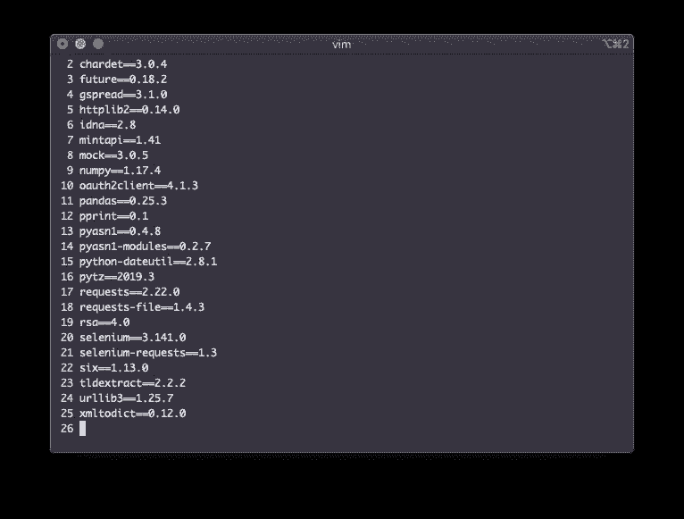
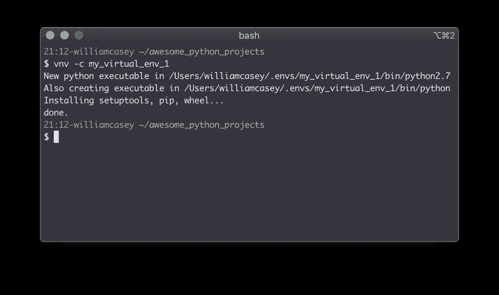
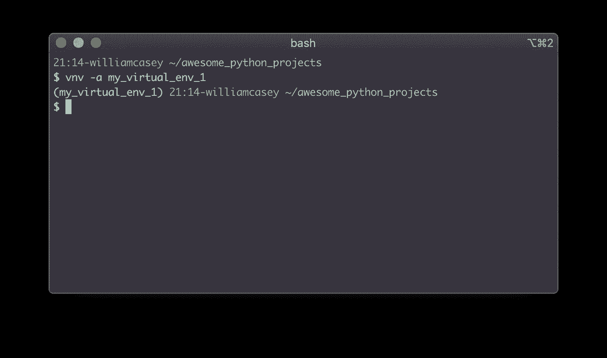
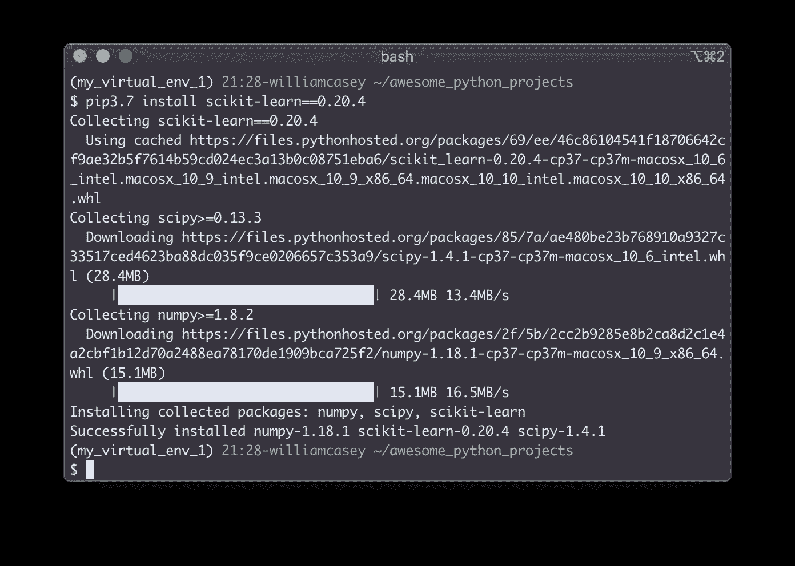
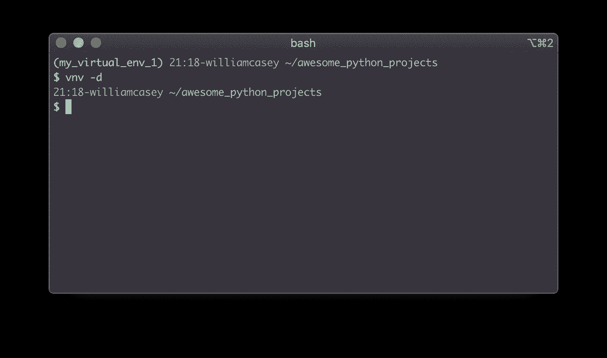

# Python 虚拟环境的极简方法

> 原文：<https://towardsdatascience.com/a-minimalist-approach-to-python-virtual-environments-f5dacf76bfad?source=collection_archive---------13----------------------->

Python 虚拟环境对于数据科学家来说是一个非常有用的工具，但是有时候使用和管理它们会很痛苦。
当然，现在已经有很多管理虚拟环境的解决方案，为什么还要创建一个新的呢？
因为我是一个简单的人，喜欢简单的东西——不需要太多思考并且容易使用的东西，这样我就可以把注意力集中在更复杂的问题上。我发现大多数成熟的工具都是多余的，我需要一些我可以随意使用的东西。



# 虚拟环境快速介绍

虚拟环境有时会被误解，并且缺乏你为什么想要使用它们的背景。为了清楚起见，这里有一个超级简单的(虚构的)场景来说明为什么您需要使用虚拟环境。

**一个虚构的例子**
假设您正在本地机器上使用 awesome _ python _ package 版构建一个模型(免责声明:不是一个真正的包)，并且您有以下代码行:

```
y = “one” + “two”
print(y)
```

显然， *awesome_python_package* 的开发者在*版本 2.0* 中做了一个更新，将数字串读取为数字。

现在想象一下，您已经完成了您的模型，并且需要将它部署到生产环境中，以便您的模型可以在现实世界中生活和玩耍。
但问题是这个生产环境没有使用*awesome _ python _ package 2.0 版*。它使用的是*1.0 版*，不幸的是*1.0 版*不具备将数字串读取为数字的能力。那么会发生什么呢？当您的代码试图在生产环境中运行时，它将返回一个错误，世界将真正结束。

这就是虚拟环境的用武之地。他们允许你在隔离的容器里工作

> “电脑，这个项目请用 awesome _ python _ package 版”
> -virtualenv

这样，当您在这个特定的项目上工作时(在虚拟环境中)，您将使用正确的包版本。

总而言之，虚拟环境是一个干净、隔离的石板，你可以在这里安装项目所需的软件包和版本，而不会破坏世界。

# **我们得到了“*为什么”*，但是“*如何”*呢？**

现在，我们已经了解了为什么要使用虚拟环境，让我们来讨论如何管理它们。
**我们要用一个极简的命令行工具，叫做 venvtool。**

## **设置**

1.  首先，如果你还没有 virtualenv，那么你需要安装它。

```
pip install virtualenv
```

你可以单独使用 virtualenv 工具，实现你所有最疯狂的虚拟环境梦想，但管理它们将取决于你自己。

> 所以下一步就是“极简主义”的部分了。

2.使用 **venvtool** 来帮助你管理你的虚拟环境
你可以在这里 下载 [**并按照说明进行设置。**](https://github.com/willcasey/venvtool)

## 使用 venvtool

一旦您运行 venvtool 的设置脚本，它将在您的主路径中创建一个目录，所有未来的虚拟环境都将存储在该目录中。现在你已经准备好创建你的第一个虚拟环境了。

```
vnv -c my_virtual_environment
```



现在您已经创建了您的虚拟环境，您可能会想要使用它。您需要使用以下命令来激活它:

```
vnv -a my_virtual_environment
```



您现在正在虚拟环境中工作。这是您可以开始使用 pip 安装所需软件包的地方。



当您完成了所有令人惊叹的建模并需要继续生活时，您可以使用以下方式停用当前的虚拟环境:

```
vnv -d
```



**大功告成！**
突然间，使用虚拟环境变得超级简单。它们都在一个地方，你只需几个命令就能与它们互动。
创建、激活和取消激活只是使用 venvtool 可以执行的几个命令。你也可以列出，复制和删除。

**感谢您的阅读，并祝您在未来管理虚拟环境的努力中好运！**

这里是 [venvtool](https://github.com/willcasey/venvtool) 的链接