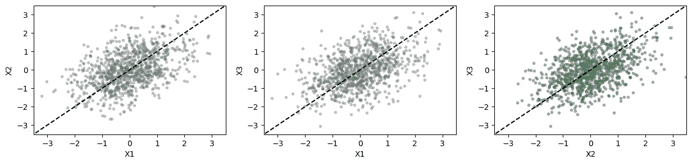
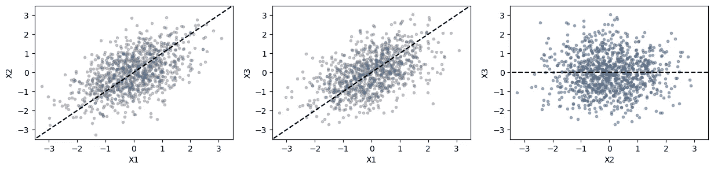
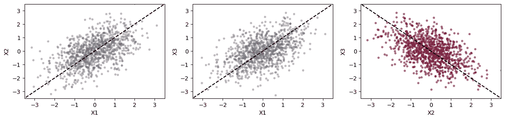
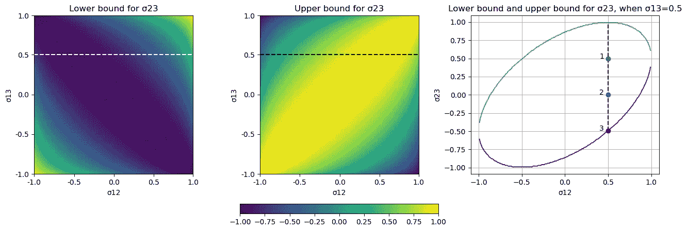

# 对相关性的误解

> 原文：<https://towardsdatascience.com/a-misinterpretation-of-correlations-147bd1164887?source=collection_archive---------55----------------------->

## 给定两个随机变量与第三个随机变量的相关性，我们知道它们的相关性是什么？

*“x₂*和 *X₃* 都在 *X₁* 增加时增加”；如果这些变量之间存在确定性关系，那么这样的陈述在逻辑上意味着当 *X₃* 增加*时， *X₂* 也增加。*然而，一旦我们转向概率设置，并在第一个陈述中添加副词“平均”,其含义就不再正确了！

# 三种情况

在概率设置中，*s 是随机变量，“平均增加”相当于正相关。考虑一个简单的样本设置，并假设 *X₁* 和 *X₂* 之间的相关性和 *X₁* 和 *X₃* 之间的相关性相同并等于 0.5。要有一个直觉，两个相关性几乎等于 0.5 的随机变量的一个著名例子是一个父亲的身高和他儿子的身高。*

*对于我们的简单样本设置，有三种可能的场景:*

*   ***情景 1:** 与我们的直觉一致， *X₃增加*x₂.增加*

****

****图一。**第一个场景。显示了 X₁ *、X₂和 X₃.的 1000 个样品每个图显示了一对随机变量之间的关系。***

*   ****场景二:** *X₂* 和 *X₃* 不相关！**

****

****图二。**第二种情况— 1000 个样本。**

*   ****场景三:**出人意料的是， *X₂* 和 *X₃* 负相关！**

****

****图 3。**第三种情况— 1000 个样本。**

**基本结论:概率设置违背我们的直觉！但是，现在我们应该问一下，关于*x₁*和 *X₂* 、*和*与 *X₁* 和 *X₃* 之间存在正相关关系的说法，是否有任何信息**

# **有什么信息吗？**

**为了找到额外的信息，我们必须做一些更正式的分析。为此，让我们考虑[相关矩阵](https://en.wikipedia.org/wiki/Covariance_matrix#Relation_to_the_correlation_matrix)**

****

**那么，我们问题的正式陈述是:给定σ₁₂和σ₁₃的值，我们能找到σ₂₃值的界限吗？答案是肯定的！**

**作为相关矩阵，σ需要[正半定](https://en.wikipedia.org/wiki/Definiteness_of_a_matrix)。利用这个条件，人们可以找到σ₂₃:值的以下(相对较弱的)界限**

*   **每当σ₁₂和σ₁₃有相同的星座(即σ₁₂×σ₁₃>0):**

****

*   **每当σ₁₂和σ₁₃有相反的符号(即σ₁₂×σ₁₃ <0):**

****

**The simple but interesting conclusion is that as long as we have (|σ₁₂|+|σ₁₃|)²> 2，我们至少可以肯定σ₂₃的符号；显然，对于我们的范例设置来说，情况并非如此。**

# **数解**

**我们可以进一步找到，对于每一对σ₁₂和σ₁₃，σ保持正半定的σ₂₃的最小值和最大值。这些值在图 4 中显示为热图。右图显示了σ₁₃固定且等于 0.5 的情况下的界限，对应于热图上的虚线。第一部分中的三个不同场景由位于上限和下限之间的三个圆圈表示。**

****

****图 4。**左边和中间图:每对σ₁₂和σ₁₃.的σ₂₃的下限和上限虚线对应于σ₁₃=0.5.的情况右图:与热图上的虚线相对应的切片的 1D 图。第一部分中的三个不同场景由位于上限和下限之间的三个圆圈表示。**

# **结论**

**一个快速而简单的结论是:除了极端情况(热图中靠近角落的情况)，鉴于σ₁₂和σ₁₃.，我们不能说太多关于σ₂₃的情况**

## **代码:**

**分析的代码(用 [Julia](https://julialang.org/) 语言)可以在这里找到[。](https://github.com/modirshanechi/medium_notes/blob/master/MediumRandomNotes/notebooks/Correlation%20Analysis.ipynb)**

## **脚注:**

**见[此处](/how-the-fathers-height-influences-the-son-s-height-62ea0339638d#:~:text=For%20every%201%20SD%20increase,increases%20by%20merely%200.5%20SD.&text=If%20you%20are%20a%20man,coincide%20at%20the%20average%20heights.)供参考。**

**对于感兴趣的读者来说，边界的推导仍然是一个练习。**