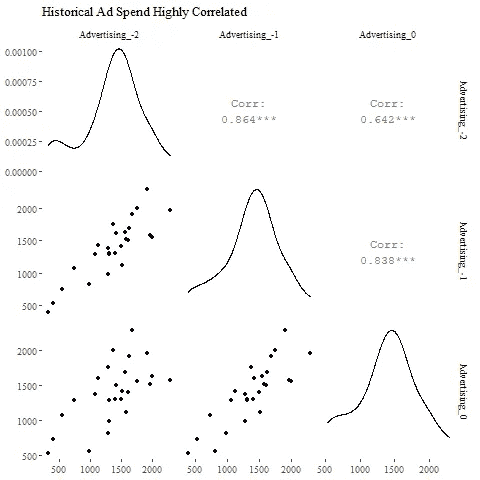

# 高级管理人员的模型

> 原文：<https://towardsdatascience.com/a-model-for-the-c-suite-2031a0cecc6d?source=collection_archive---------47----------------------->

## 量化 R&D 和营销支出的财务影响的贝叶斯网络

我们都见过一张抓住利益相关者观众的好照片。

让我们都注意到，前排右侧的女士并没有被黑板上的图像所吸引(照片由[克里斯蒂娜@ wocintechchat.com](https://unsplash.com/@wocintechchat?utm_source=unsplash&utm_medium=referral&utm_content=creditCopyText)在 [Unsplash](https://unsplash.com/s/photos/conference-room?utm_source=unsplash&utm_medium=referral&utm_content=creditCopyText) 上拍摄)

这种效果如此强烈，以至于[爱德华·塔夫特](https://www.edwardtufte.com/tufte/)以解构它为生。当一个伟大的视觉形象被用在演讲中时，它对整个团队有一种磁性的吸引力；它会引发讨论和深入研究(我认为在一次典型的会议中，对一张持续超过 30 秒左右的图片的关注就相当于深入研究)。在正确的上下文中，一些图表可以作为完整、独立的执行摘要。

网络模型提供了这种清晰和引人注目的可视化，使它们非常适合管理人员。但是这些模型不仅仅是一幅美丽的图画。它们是生成模型，允许使用高效的自动模型发现方法进行模拟和推理。在普遍接受的因果框架下，网络模型估计因果效应。这些属性中的任何一个都是值得使用的分析工具，但是在一个方法中拥有所有这三个属性是非常特别的

为了展示网络模型的威力，本文将通过一个简单的英特尔财务网络模型进行演示。我们主要关注净收入与研发和广告费用之间的联系。

下面就从简单的网络开始吧。

[一个图形模型](https://lorenze3.github.io/networkExamples/initialNetwork.html)

在没有任何指导的情况下，我敢打赌你马上就能理解左边图片的关键点:每个命名的点(“节点”)是一个量，箭头(“边”)表示这些量之间的关系，你可能会猜到箭头是从原因指向结果的。

这些节点是英特尔财务报告以及公司关键市场之一的全球零售销售(单位)的最小框架。大多数标签是不言自明的，但 g&A 可能不是。它是从报告的广告、一般和管理费用行项目中计算出来的，减去广告支出以使广告支出与其他两项分开。这里的英特尔数据来源于在[SEC.gov](https://www.sec.gov/cgi-bin/browse-edgar?action=getcompany&CIK=0000050863&type=10-K&dateb=&owner=include&count=40&search_text=)上发现的 28 份年度 10-K 申报文件，涵盖 1992 年至 2019 年。同年的全球个人电脑销量可以在[维基百科](https://en.wikipedia.org/wiki/Market_share_of_personal_computer_vendors)和 [ars technica](https://arstechnica.com/features/2005/12/total-share/8/) 上找到。所有数值均以百万计，美元数值已根据通货膨胀调整为 2000 年的美元值。

在网络中，变量被标记为 _0，以表示所有这些都代表相同的时间步长；即该网络表示同一年中的值之间的关系。

使用 AIC 作为优化度量，通过带有重新启动和一些修整的简单爬山算法从数据中学习网络结构。我已经使用 R 的 [bnlearn](https://www.bnlearn.com/documentation/man/bnlearn-package.html) 包的 tabu()函数做到了这一点。这种方法速度很快(适用于大型网络)，但不能保证找到真正的全局最优解。但这可以对我们有利，让我们有空间应用业务知识，并仍然获得一个不比“最优”模型差的模型。

网络模型的核心是显示变量之间的关系，甚至是非常复杂的关系。如果一个变量是一个可控制的数量(如广告支出)，那么网络会显示哪些数量会因改变可控制的数量而受到影响。如果网络中的两个节点之间不存在路径(我们网络中的任何节点对都不是这种情况)，那么这两个量在实际上(即我们不能改变一个来影响另一个)和概率上(即一个以另一个为条件的分布与第一个量的分布相同)都是相互独立的。如果两个节点之间确实有路径，则有证据表明关于一个节点的信息对另一个节点有影响。

在我们的示例网络中，我们可以看到 R&D 费用驱动除广告以外的所有其他价值，并且广告驱动净收入和总 PC 销售。虽然这本身很有趣，但我想我们都同意这是意料之中的。也许一个更难的问题是，广告和研究费用有持久(即多年)的影响吗？

这个模型很容易扩展来解决这个问题；我们简单地添加节点来覆盖前几年的值。我再给我们的模型加两年，看看会有什么结果。在下面的可视化中，后缀“_ 1”意味着在“_0”值之前 1 年的变量值。

[多年网络:AIC = -3589](https://lorenze3.github.io/networkExamples/3YearTabuSearch.html)

当你探索多年的关系时(标题中的链接将带你到一个互动图，可能有助于使关系更加可视化)，你会看到去年的 R&D 和两年前的间接 R&D(通过前几年的净收入)的持续影响。

我们还发现，一年之内，每一层的关系都不一样——这让人觉得有问题。例如，如果年份是 2018 年，当前的广告支出会影响净收入。但一旦当前年份是 2019 年，2018 年的支出就不再影响 2018 年的净收入了？

坦白地说，这没有什么意义。因为我承诺了一个立即有意义的模型，我们需要用一些专家的建议来帮助结构学习算法。我建议保持所有年份中的年内关系与初始模型相同，并让年间关系通过算法来识别。这很容易做到，只需将一年网络的边缘作为白名单数据帧传递给 bnlearn 的结构查找函数。

[单年关系守恒:AIC = -3584](https://lorenze3.github.io/networkExamples/modified3YrV2.html)

现在我们看到原来的关系是守恒的。我们也看到更多年份之间的联系(这里每一层是一年)。更多的箭头意味着更多的参数，因此需要注意的是，这个修改模型的 AIC 非常接近自动学习模型的 AIC。

因此，这“证明”R&D 和广告支出具有持久的商业影响。这些职能部门的高管认为，今年削减预算会让业务在未来几年受到阻碍。

想必，任何想出名的高管团队都会立即跟进:“如果我们裁员，业务会受到多大影响？“幸运的是，我们的网络模型允许通过简单地设置这些决策节点的值、our(广告和 R&D 预算)以及对利益结果(比如净收入)的最终分布进行采样来进行推断和模拟。

如果模型中考虑了所有相关变量，那么随着决策节点值的变化，结果期望值的差异就是改变决策的因果影响。通过将 2019 年净收入的预期值与过去 3 年的实际支出水平进行比较，我们可以很容易地找到 R&D 和广告支出的历史因果影响。

嗯...是时候解雇市场部了？

嗯，这当然是一个意想不到的结果！一项快速调查显示，年内广告系数为正(如预期)，但年间广告系数总是为负。我想我们可以这样合理化，即推动今年销售的广告正在窃取下一年的销售。。。但我们也可以注意到，第 0 年的广告支出与第 1 年和第 2 年的支出高度相关。这表明对给定净收入节点的当前和过去广告支出的估计受到共线性的不利影响。

有时，您可以使用高度相关的特征进行建模。有时候不行。

鉴于高相关性和不合理的估计，我们可以简单地禁止前几年的广告对当前净收入产生直接影响。这仍然为通过例如前几年的净收入进行间接影响留有余地。最终网络如下图所示。

[去除年度间广告支出的弧线:AIC = -3607](https://lorenze3.github.io/networkExamples/removeBadArcs.html)

AIC 低于我们的最后一个模型，所以我们没有破坏我们的模型删除违规的边缘！

现在，我们可以像以前一样应用同样的“关掉它”方法来获得 R&D 和广告效应对净收入的因果影响。这一模式显示出积极的影响，符合常识，并给 CMO 带来一些缓解。有趣的是，R&D 现在对收入的正面影响比以前大得多。所以大家都打算更喜欢这种模式！

每个人都保住了工作！

总结一下，让我们注意这里给出的模型是有意简单的，并且在某种程度上受到示例中使用的公开可用数据的限制。

为了方便起见，我们使用了 bnlearn 内置的拟合函数，该函数将连续变量限制为高斯分布。这不是网络模型的必要假设。更复杂的网络可能具有不同的节点分布(bnlearn 可以通过离散化连续变量来处理这个问题，其他软件可以直接模拟不同的分布)。此外(但不是附加的)，节点之间的关系可以是非线性的，而在这些例子中，每个节点平均值是其父节点平均值的线性组合。

从分析角度来看，寻找 R&D 总支出的全球影响很难(也许资本支出和工作支出应该分开？也许大的计划应该用不同的持续时间分别建模？)或广告支出(随着时间的推移，B2B 和直接面向消费者的活动肯定会产生不同的效果吧？).也许我们需要更多的网络时间来解释长期的影响？几乎可以肯定的是，我们应该加入更多的外部因素(竞争对手的广告支出？服务器销售？计算机制造商的合并和收购活动？)添加到模型中，然后声称我们已经包含了影响净收入的所有相关变量。

但是我们的简化示例用来展示图模型的灵活性和实用性。在此过程中，它强调了像共线性这样的基本数据问题是多么重要，因为无论构建什么模型，它们都很重要。

我希望我已经使你相信了网络图本身的价值。对于获得观众对模特的认同来说，怎么强调都不为过。因为观众真的能看到模型，他们几乎立刻就能对它的推理感到舒服。

想象一下，在最后一次演示中，大部分对话都是关于你的建议，而不是你的模型是什么——这难道不是一个很好的转变吗？

这只狗展示了你和你的网络模型在一起会有多开心！(由[德莱尼·道森](https://unsplash.com/@delaneykate_?utm_source=unsplash&utm_medium=referral&utm_content=creditCopyText)在 [Unsplash](https://unsplash.com/s/photos/happy-analyst?utm_source=unsplash&utm_medium=referral&utm_content=creditCopyText) 上拍摄)

我将为此撰写一篇如何编写代码的配套文章，并在以后撰写关于其他方法的文章；请在媒体上关注我的最新消息。