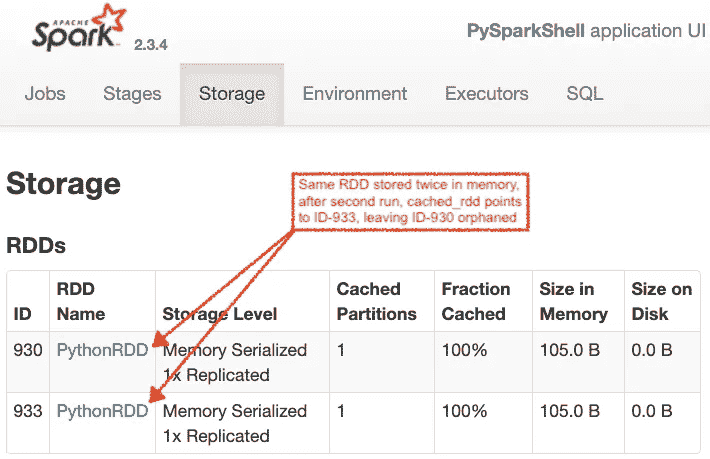

# Spark RDDs 的现代指南

> 原文：<https://towardsdatascience.com/a-modern-guide-to-spark-rdds-725cd7c14059?source=collection_archive---------36----------------------->

作者照片。2011 年春天，西班牙阿尔特亚。

## 每天都有机会发挥 PySpark 的全部潜力

网络上充满了 Apache Spark 教程、备忘单、技巧和诀窍。最近，他们中的大多数人都在关注 [Spark SQL 和 Dataframes](https://spark.apache.org/docs/latest/sql-programming-guide.html) ，因为它们提供了一个温和的学习曲线，具有熟悉的 SQL 语法，而不是旧的 [RDD API](https://spark.apache.org/docs/latest/rdd-programming-guide.html) 所需的陡峭曲线。然而，正是 rdd 的多功能性和稳定性点燃了 2015 年 Spark 的采用，并使其成为分布式数据处理的主导框架。

随着您成为 Spark 的正式用户，主要有三种情况会让您考虑 RDD API:

*   访问原始非结构化数据源
*   执行比 SQL 更适合通用编程语言的数据操作。避免 UDF
*   并行执行第三方库

这份固执己见的材料涵盖了这种情况以及由此经常产生的问题，因此您可以充分享受 PySpark 的潜力。

# 目录

[关于样式](#c5f3)
— [垂直扩展您的函数式 python](#78aa)
—[将 Spark 类型附加到变量名](#645c)

[将数据帧转换成 rdd&反之亦然](#c7c6)
— [数据帧到 RDD](#e69f)
— [RDD 到数据帧](#c178)

[富于表现力的 Python 字典](#c047)
— [单行字典转换](#25aa)
— [Python 集合&字典不可修改](#c1df)

[缓存&广播](#9638)
— [缓存 RDDs](#2a90)
— [不持久化 RDDs](#7b71)
— [清理整个 RDD 缓存](#bf34)

[Python 库的分布式执行](#4aec)
— [Numpy —一种通用方法](#f7cd)
— [NLTK —分区设置](#b154)

# 关于风格的一点注记

当函数式编程遇到大数据时，代码可读性尤其重要，一方面是因为传统的 IDE 调试工具是围绕命令式编程设计的，另一方面是因为为了调试目的而运行多个代码既昂贵又耗时。

## 垂直发展您的功能 Python

火花逻辑被定义为[Dag](https://data-flair.training/blogs/dag-in-apache-spark/)。通过在每个[转换](https://spark.apache.org/docs/latest/rdd-programming-guide.html#transformations)或[动作](https://spark.apache.org/docs/latest/rdd-programming-guide.html#actions)之后用**反斜杠“\”**换行，保持代码的简洁以提高可读性。

## 将火花类型附加到变量名

分布式数据主要属于以下三种类型之一:

*   [RDD](https://spark.apache.org/docs/latest/rdd-programming-guide.html)
*   [数据帧](https://spark.apache.org/docs/latest/sql-programming-guide.html)
*   [广播变量](https://spark.apache.org/docs/latest/rdd-programming-guide.html#broadcast-variables)

# 将数据帧转换成 rdd，反之亦然

数据帧的主干是一个 RDD[ [行](https://spark.apache.org/docs/2.3.4/api/python/pyspark.sql.html?highlight=row#pyspark.sql.Row) ]，一个 Spark 类型，其行为非常类似于 Python 字典。正如您在下面看到的，这个[行](https://spark.apache.org/docs/2.3.4/api/python/pyspark.sql.html?highlight=row#pyspark.sql.Row)类型充当了两个 API 之间的桥梁。

## RDD 的数据帧

*   **方法:** Dataframe - > RDD【排】- > RDD【排】

## RDD 到数据帧

*   **方法一:**【字典】- > RDD【排】- > Dataframe

*   **方法 B:** RDD【元组】- >数据框架

# 富有表现力的 Python 词典

随着 RDD 上的操作链越来越长，保持代码的可读性和逻辑的可理解性变得越来越困难。Python 字典在这方面起着关键作用。与 Scala 元组相反，它们允许通过名称而不是位置来访问字段，与 Scala Case 类相反，它们可以在没有外部定义的情况下内联创建。

## 单行字典转换

Lambda 函数在语法上被限制为单个表达式。在需要 RDD[dict]转换的常见场景中，考虑这些单行 lambdas。注意， ****old_dict** 导致了浅层复制，但是在 RDD 操作中不需要[深层复制操作](https://docs.python.org/3/library/copy.html)，因为 PySpark 保证了新字典是完全独立的，即**rdd 是不可变的**。

## Python 集合和字典是不可混淆的类型

诸如 [groupByKey](https://spark.apache.org/docs/latest/api/python/pyspark.html#pyspark.RDD.groupByKey) 和 [reduceByKey](https://spark.apache.org/docs/latest/api/python/pyspark.html#pyspark.RDD.reduceByKey) 之类的 RDD 聚合要求密钥为可散列类型，以便进行混洗。因此，避免使用 Python 字典和集合作为混排键。如果必须的话，考虑使用 **frozensets。**

# 缓存和广播

学习如何定制 Spark 的分布式内存处理，可以为 ETL 和 ML 培训作业带来最佳的资源使用。此外，对于 [Jupyter](https://jupyter.org/) 和 [Zeppelin](https://zeppelin.apache.org/) 笔记本来说，这也是快速流畅的 [REPL](https://en.wikipedia.org/wiki/Read%E2%80%93eval%E2%80%93print_loop) 体验的关键要素。

## 缓存 rdd

持久化到内存的常见用例见 [RDD.cache](http://spark.apache.org/docs/latest/api/python/pyspark.html?highlight=cache#pyspark.RDD.cache) ，其他存储级别见 [RDD.persist](http://spark.apache.org/docs/latest/api/python/pyspark.html?highlight=cache#pyspark.RDD.persist) 。请注意，下面的**行 4** 设置了缓存指令，但只有像**行 6** 这样的动作才会触发 DAG 执行和随后的内存存储。

## 不持久 rdd

调用 [RDD.unpersist](http://spark.apache.org/docs/latest/api/python/pyspark.html?highlight=cache#pyspark.RDD.unpersist) 并从内存和磁盘中移除其所有块主要有两个原因:

1.  你已经用完了 RDD。依赖于 RDD 的所有[操作](https://spark.apache.org/docs/latest/rdd-programming-guide.html#actions)都已经执行，您想要释放存储空间，以用于管道或 ETL 作业中的后续步骤。
2.  你想*修改*持久化的 RDD，这是在 Jupyter/Zeppelin 笔记本上工作时的一个常见用例。鉴于 RDD 是不可变的，您可以做的是重用 RDD 名称来指向新的 RDD。因此，如果上面的代码运行两次，您将在同一个 **cached_rdd** 的内存中得到两次分配。第一次运行后， **cached_rdd** 将指向下面的第一个分配，然后指向第二个分配，使第一个分配成为孤儿。

为了避免重复的内存分配，在初始化 RDD 的 Jupyter 段落前添加一个 **try-unpersist** (下面的第 1–4 行):

## 清理 RDD 缓存

取消所有 rdd 的持久性可以通过以下方式实现:

# Python 库的分布式执行

RDDs 的灵活性允许在运行几乎任何 Python 代码时分发有效负载。对于计算成本较低的任务，如 **O(n)** 及以下任务，需要真正的大数据才能让并行化的优势显而易见。然而，对于线性以上的复杂性，并行化可以轻松地将中型数据作业的几小时变成几分钟，或者将小型数据作业的几分钟变成几秒钟。

## Numpy —一种通用方法

为了并行执行库，如 [statsmodels](https://www.statsmodels.org/) 、 [scikit-learn](https://scikit-learn.org/) 、 [numpy](https://numpy.org/) ，只需从一个**映射**、**平面映射**、**过滤器**或任何其他[转换](https://spark.apache.org/docs/latest/rdd-programming-guide.html#transformations)内部调用它们。在下面的例子中， **np.median** 调用在 RDD 映射中，因此，它将在每个 Spark 执行器中本地运行:

## NLTK —分区设置

除了导入之外，自然语言工具包( [NLTK](https://www.nltk.org/) )库还需要进一步设置。下面例子中的 [nltk.download](https://www.nltk.org/api/nltk.html#nltk.downloader.download) 调用必须在**的每个执行器**中运行，以保证本地 nltk 数据的可用性。在这种情况下，考虑使用 [RDD.mapPartitions](https://spark.apache.org/docs/latest/api/python/pyspark.html?highlight=mappartitions#pyspark.RDD.mapPartitions) 来避免在同一个执行器中对 nltk.download 的多余调用。RDD 映射分区调用允许对每个分区的 RDD 条目的整个列表进行操作，而 RDD 映射/平面映射/过滤器对每个 RDD 条目进行操作，并且不提供该条目属于哪个分区的可见性:

**…更多章节即将推出。**