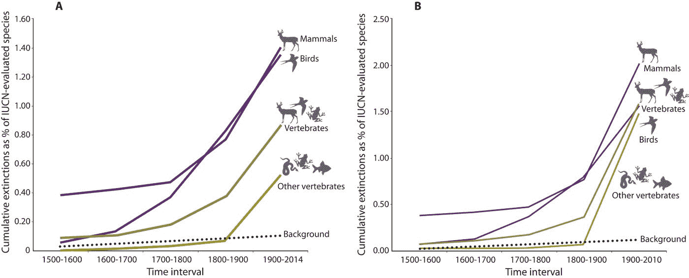

# 生物多样性和恢复的多边人工智能策略

> 原文：<https://towardsdatascience.com/a-multilateral-ai-strategy-for-biodiversity-and-restoration-422ca8f70515?source=collection_archive---------26----------------------->

南非图乌斯河阿奎拉野生动物园私人禁猎区图片来自— [@bellaskova](https://unsplash.com/@bellaskova)

## 我们必须质疑现有的国际战略，并在人工智能领域达成新的共识

## 摘要

**我们星球上的动植物物种正在迅速消亡。我们在与人工智能相关的战略中没有更多地关注这一点，这似乎很奇怪，但考虑到对少数拥有专业知识的开发人员进行人工智能开发和运营的财务吸引力，这也就不足为奇了。我们可以用人工智能来分析生物量；减轻线性基础设施的影响；以及通过监测进行海洋保护。我们必须问自己这样一个问题:我们是否在以正确的优先级使用人工智能。葡萄牙的国家人工智能战略是为数不多的谈到“人工智能促进生物多样性，从森林和绿色经济到海洋物种和蓝色经济”的国家战略之一。他们将此作为第三个优先考虑的方面，但我们必须考虑是否应该在我们的全球议程上进一步推进这一点。恢复我们的环境需要在技术行业和其他部门进行同样的多边合作，作为解决日益增多的问题的综合方法的一部分。**

人工智能最明显的用途似乎是用于进一步的提取、消费和生产。然而，在气候危机中，随着生态系统的恶化，物种正在死亡。我绝对没有提出人工智能可以成为帮助我们恢复地球的神奇银弹(远非如此)，然而当所有这些策略被制定时，我发现很少有人提到使用人工智能来恢复环境是很奇怪的。

大多数珊瑚礁正在死亡:

 [## 所有的珊瑚礁都可能在 80 年内死亡

### 一项新的模拟显示，到 2100 年，可生存的珊瑚地点将几乎全部消失。科学家们正竞相保存…

www.popularmechanics.com](https://www.popularmechanics.com/science/a31024955/coral-reef-restoration-sites-climate-change/) 

造成损失的原因是多方面的。

 [## 物种灭绝的驱动因素本质上是多方面的

### 联合国环境规划署执行主任英格·安德森在第 18 届……

www.unenvironment.org](https://www.unenvironment.org/news-and-stories/speech/drivers-species-loss-are-multilateral-nature) 

物种数量急剧减少:

**IUCN(2012)记录的已灭绝或已灭绝的野生脊椎动物累计物种，摘自** [**科学进展**](https://advances.sciencemag.org/content/1/5/e1400253) **的研究文章。**

有计划正在进行，试图减少物种的损失。

我以前曾思考过，如何从启发性的角度考虑人工智能，从超越人类的更广阔的角度来看，人工智能更负责任:

 [## 以地球为中心的人工智能方法

### 让人工智能为我们的共享生态服务

medium.com](https://medium.com/@alexmoltzau/a-planet-centered-approach-to-artificial-intelligence-a33de6bc7d44) 

其他时候我问人工智能的和平战略在哪里:

 [## AI 和平战略在哪里？

### 对国家人工智能战略症结的简短思考

towardsdatascience.com](/where-is-the-ai-strategy-for-peace-a89c1c681fe9) 

这些问题似乎没有得到应有的重视。

那么为什么这不是重点呢？

我们投资保持健康，投资能源。

人工智能人才也被吸引到各种其他领域。

也就是说，在许多其他行业，你会发现更多的资金，如开采。

我最近问一位人工智能高管，为什么我们不更多地关注这个领域。

简单的回答是:“这个领域几乎没有钱。”

生物信息学领域最聪明的人可能会去制药行业。

地球观测或石油工业地质学方面的最佳人选。

如果你擅长自动化和机器人技术——采矿就有机会。

如此等等，我可以继续下去。

当然，也有人选择超越这些界限，选择一个潜在的低工资级别来解决与自然相关的问题，以保持生物多样性。我并不是说能效不重要，而是说编程领域的不同人才可能会在薪酬最高的行业中选择有趣的问题。

这没有什么新奇的。在阳光下没有什么是新的，因为在实现我们社会中提出的规范方面，人才可能会走有利于他们的更高程度的道路。

另一方面，我确实希望我们能够在自动化恢复工作方面投入更多的精力。

尽管我们必须确保这需要技术行业全心全意地努力，以确保更好地利用基础设施，并让技术用户意识到大量数据与物理产品相关的足迹。

 [## 气候危机&为什么数据不能成为新的石油

### 人工智能和数据存储的足迹

towardsdatascience.com](/the-climate-crisis-why-data-must-not-become-the-new-oil-32d2429b8657) 

## 生物量分析

认为我们可以用 **BIODISCOVER** 机器自动给昆虫分类是有希望的。来自 Tempere 大学、芬兰 Jyvaskyla 大学、丹麦奥尔胡斯大学和芬兰环境研究所的科学家团队设计了一种可以自动拍摄和分析昆虫的机器人。我在杰克·克拉克的人工智能时事通讯中读到了这些消息:

> 他们写道:“我们提议用一种基于图像的自动技术来取代人类专家分类和识别的标准手动方法”。“可靠的物种鉴定至关重要，但由于其固有的缓慢性和高成本，传统的手动鉴定在生物评估过程中造成了瓶颈”

 [## 基于图像的无脊椎动物自动识别和生物量估计

### 了解生物群落如何响应环境变化是生态学和生态系统的一个关键挑战…

arxiv.org](https://arxiv.org/abs/2002.03807) 

其他领域也取得了进展。然而，我们知道我们对这个星球上的其他物种做的事情并不幸运。

## 减轻线性基础设施的影响

人们可以想象在一个给定的区域追踪野生动物的可能性，以确定实施一个项目是否可行，这已经在做了。缓解物种沿

联合国在《需求》中提到了减轻公路和铁路等线性基础设施对移栖物种影响的工具的指导和实施。

 [## 联合国关于野生动物的重要会议旨在解决对迁徙物种的严重威胁

### 2020 年 2 月 17 日，甘地讷格尔----联合国防治荒漠化公约缔约方大会第十三次会议

www.unenvironment.org](https://www.unenvironment.org/news-and-stories/press-release/major-un-meeting-wildlife-address-critical-threats-migratory-species) 

## 通过监测保护海洋

在国家捕鱼作业中进一步实施减少海洋哺乳动物副渔获物的措施。机器学习在这个领域的应用。有一些利用人工智能来保护濒危物种的项目。

 [## NOAA 将使用微软人工智能推进濒危物种保护

### 国家海洋和大气管理局的研究科学家正在开发人工智能…

www.nextgov.com](https://www.nextgov.com/emerging-tech/2020/02/noaa-use-microsoft-ai-advance-protection-endangered-species/163208/) 

倾听虎鲸的声音:

 [## 谷歌的新人工智能模型“倾听”虎鲸的声音，以帮助保护该物种

### 谷歌的人工智能团队开发了一种新的模式来保护濒危物种虎鲸，在世界上被称为虎鲸。

thenextweb.com](https://thenextweb.com/artificial-intelligence/2020/01/29/googles-new-ai-model-listens-to-killer-whales-to-help-protect-the-species/) 

识别非法拖网渔船:

 [## 从太空捕捉工业捕鱼侵入非洲近海水域

### 小规模渔业为沿海社区提供了生计和…

onlinelibrary.wiley.com](https://onlinelibrary.wiley.com/doi/abs/10.1111/faf.12436) 

## AI 有哪些重要的应用？

我们必须批判性地问自己，我们如何才能让人工智能以更深刻的方式发挥作用，而不是在错误的方向上跑得更快。我确实认为，如果我们选择将这些想法付诸行动，我们就能有所作为。然而，与这些方面有关的问题不仅仅是地方性的，而是国际性的，需要多边合作。

考虑到葡萄牙的战略已经将重点放在了生物多样性上，葡萄牙可以在这方面起带头作用:

 [## 葡萄牙的国家人工智能战略

### 环境和生物多样性的人工智能:从森林和绿色经济到海洋物种和蓝色…

medium.com](https://medium.com/dataseries/portugals-national-ai-strategy-747b39671f2c) 

战略中概述的生活实验室七个方面中的第三个方面:

> ㈢人工智能促进生物多样性，从森林和绿色经济到海洋物种和蓝色经济；

我认为这应该是当务之急，因为如果我们要恢复和考虑更广泛的经济影响以及更大的长期生态责任，这必须被推到议程的更高位置。

这是#500daysofAI，您正在阅读第 261 条。500 天来，我每天都在写一篇关于或与人工智能相关的新文章。我目前 100 天 200-300 的重点是人工智能的国家和国际战略。