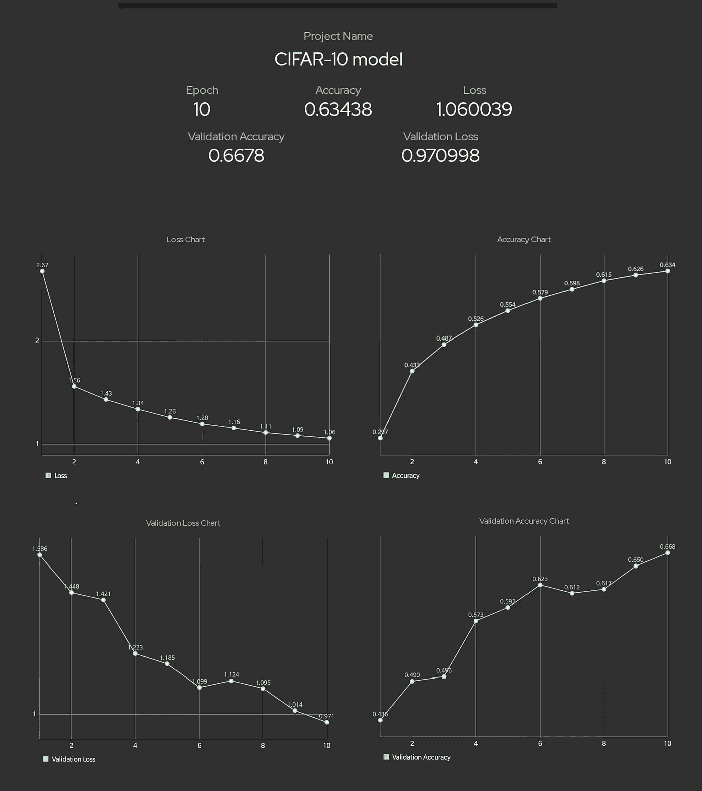

# 每个数据科学家的必备工具

> 原文：<https://towardsdatascience.com/a-must-have-tool-for-every-data-scientist-5e7c76f1916f?source=collection_archive---------10----------------------->

## TensorDash——一款远程监控机器学习模型的应用

卢克·切瑟在 Unsplash[上的照片](https://unsplash.com/s/photos/monitoring?utm_source=unsplash&utm_medium=referral&utm_content=creditCopyText)

让我们面对它；训练一个机器学习模型是非常耗时的。即使在过去几年中计算能力有所提高，训练机器学习模型也需要很多时间。即使是最普通的模型也有超过一百万个参数。在更大的范围内，这些模型有超过 10 亿个参数(GPT-3 有超过 1750 亿个参数！)，训练这些模型需要几天，如果不是几周的话。作为一名数据科学家，我们希望关注模型的指标，以了解模型是否按照预期执行。但是坐在你的电脑旁边，几个小时监控这些指标是没有意义的。如果我们能在你的手机上得到所有这些数据，那不是很好吗？

你最后一次让你的模型训练几个小时然后离开那个地方，但是当你回来的时候你的模型已经中途坠毁了是什么时候？这令人沮丧，完全是浪费时间。由于大多数人没有能力在本地训练机器学习模型，所以像 GCP、谷歌实验室、AWS 和 Azure 这样的云服务是用户按使用付费的首选。在这种情况下，如果模型在训练过程中崩溃了，你就要为没有使用的服务付费。如果你被告知你的模特身份，这将有助于你避免 FOMO。

## TensorDash

TensorDash 是一款免费使用的开源应用程序，可以让你通过所有指标的详细图表来远程监控你的机器学习模型。它还会在训练完成或模型崩溃时通知您。它支持所有主要的机器学习框架，如 TensorFlow、Pytorch、Keras 和 Fastai。

现在你不必紧张地坐在电脑前，祈祷精确度提高。你可以在家里舒舒服服地做这件事。

TensorDash 示例(图片由作者提供)

## 使用 TensorDash

1.  从 play store 安装 [TensorDash](https://play.google.com/store/apps/details?id=tech.tensordash.tensordash&hl=en_AU) 应用程序。对 iOS 设备的支持即将推出。
2.  创建一个帐户。
3.  使用命令`pip install tensor-dash`安装 TensorDash python 包。
4.  按照下面的说明将 TensorDash 用于您各自的框架。

## Keras/tf.keras 支持

Keras 和 tf.keras 的远程监控使用回调函数。进口 Tensordash。使用模型名称、您的帐户电子邮件 ID 和密码作为参数来定义 TensorDash 对象。通过 fit()函数中的回调来传递 TensorDash 对象。要在模型崩溃时得到通知，请在异常处理下添加 fit()函数，并在 except 中调用 sendCrash()方法。

**下面是在 Keras/tf.keras 上使用 TensorDash 的示例代码**

示例 Keras/tf.keras 代码

## PyTorch 支持

从 Tensordash 包中导入 Torchdash。创建一个 Torchdash 对象，将模型名称、电子邮件 ID 和密码作为参数。使用训练循环中对象的 sendLoss()方法将模型指标发送到您的帐户。将损失、准确性、验证损失和验证准确性度量作为参数传递(请注意，您必须至少添加一个度量)。要在模型崩溃时得到通知，请在异常处理下添加训练循环，并在 except 中调用 sendCrash()方法。

**下面是在 PyTorch 上使用 TensorDash 的示例代码**

PyTorch 代码示例

## Fast.ai 支持

fast.ai 的远程监控通过回调来实现。进口 Fastdash。使用模型名称、您的帐户电子邮件 ID 和密码作为参数来定义 Fastdash 对象。通过 fit()函数中的回调传递 Fastdash 对象。要在模型崩溃时得到通知，请在异常处理下添加 fit()函数，并在 except 中调用 sendCrash()方法。

**下面是使用 Fast.ai** 的样例代码

fast.ai 代码示例

## 张量流支持

从 Tensordash 包导入 Customdash。创建一个 Customdash 对象，将模型名称、电子邮件 ID 和密码作为参数。使用训练循环中对象的 sendLoss()方法将模型指标发送到您的帐户。将损失、准确性、验证损失和验证准确性度量作为参数传递(请注意，您必须至少添加一个度量)。要在模型崩溃时得到通知，请在异常处理下添加训练循环，并在 except 中调用 sendCrash()方法。

请注意，Customdash 可以与任何指定自定义训练循环的框架一起使用。

**下面是在 TensorFlow 自定义循环上使用 TensorDash 的示例代码**

样本张量流代码

## 结论

TensorDash 是完全免费和开源的。欢迎发布和投稿。点击这里查看存储库[，点击这里](https://github.com/CleanPegasus/TensorDash)查看详细文档[。](https://cleanpegasus.github.io/TensorDash/)

我和 Harshit Maheshwari 建立了这个工具来解决我们在人工智能研究期间的监控问题。我希望这能像帮助我们一样帮助你。

## 关于我

我喜欢写一些在人工智能中很少被谈论的话题。关注我，了解最新动态。

你可以在 [Twitter](https://twitter.com/CleanPegasus) 、 [LinkedIn](https://www.linkedin.com/in/arunkumar-l/) 和 [Github](https://github.com/CleanPegasus) 上找到我。