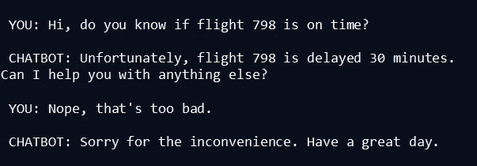
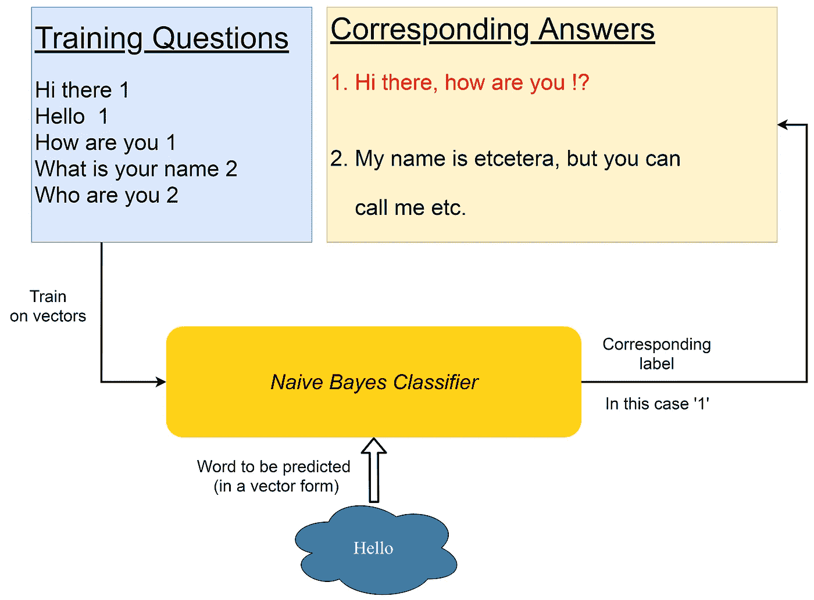
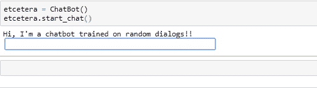

# 创建封闭域聊天机器人的朴素贝叶斯方法！

> 原文：<https://towardsdatascience.com/a-naive-bayes-approach-towards-creating-closed-domain-chatbots-f93e7ac33358?source=collection_archive---------19----------------------->

## 机器学习|自然语言处理

## 顾名思义，聊天机器人是一种设计用来进行对话或讨论的软件。它们被广泛应用于各种行业，以实现各种功能，从提供客户服务到协助治疗，再到仅仅是一种乐趣。


[亚历山大·奈特](https://unsplash.com/@agkdesign?utm_source=medium&utm_medium=referral)在 [Unsplash](https://unsplash.com?utm_source=medium&utm_medium=referral) 上拍照

你有没有在网上订餐时寻求客户支持帮助的经历？你的第一次互动很有可能是和聊天机器人。许多公司使用基于规则或基于检索的聊天机器人，这些机器人是为特定主题训练的，这些被称为封闭域聊天机器人。例如，如果您想查看您的航班状态，您可以像这样聊天:



在上面的对话中，chatbot 给出了一个对它来说最有意义或与所提问题非常相似的回答。这个聊天机器人是专门为处理客户报告或航班查询而训练的。

当基于检索的聊天机器人使用*意图分类、实体识别和响应选择*来进行真实对话时，基于规则的聊天机器人使用 RE(正则表达式)模式来匹配输入用户响应和它被训练用来与人进行对话的响应。

# 朴素贝叶斯方法介绍！

有一种简单有效的方法来创建使用朴素贝叶斯分类器的封闭域聊天机器人。在该方法中，形成包含问题/用户响应和相应答案的封闭域数据集，其中每个问题/用户响应被给予一个标签，该标签将问题与其答案相关联。因为多个问题可能有相同的回答，所以可能有多个问题有相同的答案。为了拨开云雾，让我们看看这个例子。

```
hi there 1
hello how are you 1
what is your name 2
who are you 2
you are who 2
my name is 2
how old are you 3
what is your age 3
are you getting older 3
what about your age 3
```

末尾的标签/数字只是答案数据集中答案的索引。

```
Hi there, how are you !?
My name is etcetera, but you can call me etc.
I'm 22 years old
```

前两个问题包含标签“1 ”,因此它们指的是回答“嗨，你好吗！?'。同样，后四个问题指的是‘我 22 岁’。

> 这里的概念是朴素贝叶斯分类器将根据我们给它的输入来预测标签。因此，当你说“嗨”时，我们的分类器将预测标签“1”，反过来我们可以用它来找到一个合适的答案。当输入是“你的年龄是多少？”分类器会预测标签‘3’，这是答案‘我 22 岁’的一个索引。

下图将消除你对这个概念的任何疑虑。



解释系统流程的图

# 现在让我们进入编码部分！

## 准备培训数据

如果我们在一个名为“que.txt”的文件中设置了如上格式的问题，在一个名为“ans.txt”的文件中设置了答案，我们可以借助以下代码准备包含问题、标签和答案的单独列表:

```
labels = []
questions = []
for line in open('que.txt', encoding="utf8"):
    labels.append(line.strip().split(" ")[-1])
    que.append(" ".join(line.strip().split(" ")[:-1]))
answers = []
for line in open('ans.txt', encoding="utf8"):
    ans.append(line.strip())
```

每个标签都在问题的最后，我们可以如上图获取。在此之后，我们将在一个名为“问题”的列表中包含所有用于训练的问题，并在一个名为“标签”的列表中包含这些问题的标签。记住，问题的标签把它们和它们的答案联系起来。“答案”列表中会存储所有可能的答案。

*注意:在这里，问题末尾的标号从 1 开始，但是为了将它们映射到‘答案’列表中的答案，我们必须从标号中减去 1，因为 python 列表索引从 0 开始。*

现在，我们需要将我们的训练问题转换成向量，以便将它们提供给我们的分类器。为此，我们将使用来自机器学习库 *sci-kit learn* 的*计数矢量器*。下面是执行此操作的代码片段:

```
from sklearn.feature_extraction.text import CountVectorizer
bow_vectorizer = CountVectorizer()
training_vectors = bow_vectorizer.fit_transform(questions)
```

*bow_vectorizer* 中的‘bow’代表单词包。*。 *CountVectorizer()* 的 fit_transform()* 方法做两件事:1 .2)训练特征字典—训练语料库中所有唯一单词的字典。)将每个问题转换成特征字典大小的向量，该向量在除了问题中使用的单词之外的所有地方都包含零

如果你没有理解上面的解释，让我们举个例子。

```
#our sentence
sentence = “Help my fly fish fly away”#example features dictionary based on the training corpus
features_dictionary = {'all':0,'my':1, 'fish':2, 'fly':3, 'away':4, 'help':5, 'me':6, 'open':7}#Our vector for the sentence above will be
vector = [0, 1, 1, 2, 1, 1, 0, 0] 
#size of vector = size of features dictionary
```

特征字典包含来自训练语料库的所有唯一单词作为关键字，以及它们的索引作为值。“fly”这个词在我们的句子中出现了两次。如果我们查看“fly”的特征字典，我们发现它的索引是 3。所以，当我们看向量时，我们希望索引 3 处的数字是 2。如上所示， *CountVectorizer()* 为我们的问题提供了向量。

*注意:这里，我们在一个包含 10 个答案和 37 个问题的非常小的数据集上训练我们的分类器，只是为了保持简单。尺寸可以根据不同的应用而不同。*

## 进入培训部分

现在我们有了训练向量，是时候创建我们的朴素贝叶斯分类器了。为此，我们将使用 sci-kit learn 的 *MultinomialNB()* 。

```
from sklearn.naive_bayes import MultinomialNB
classifier = MultinomialNB()
classifier.fit(training_vectors, labels)
```

我们使用*训练我们的分类器。fit()* 方法，传入训练向量和相应的标签。

现在，我们的分类器可以进行预测了。我们可以从用户那里获取输入，在我们之前创建的矢量器的帮助下将其转换为矢量，并从我们的分类器中获得标签的预测。

## 创建聊天机器人类

是时候创建一个聊天机器人类了，它包含了进行对话的所有方法。 *start_chat()* 方法是开始谈话。 *chat()* 方法检查退出命令，如“退出”或“再见”,如果在用户的响应中发现任何这些词，就停止对话。

```
class ChatBot:
  exit_commands = ("quit", "pause", "exit", "goodbye", "bye", "later", "stop")
  def start_chat(self):
    user_response = input("Hi, I'm a chatbot trained on random dialogs!!\n")
    self.chat(user_response)

  def chat(self, reply):
    while not self.make_exit(reply):
      reply = input(self.generate_response(reply)+"\n")
    return

  def generate_response(self, sentence):
    input_vector = bow_vectorizer.transform([sentence])
    predict = classifier.predict(input_vector)
    index = int(predict[0])
    print("Accurate:",str(classifier.predict_proba(input_vector)[0][index-1] * 100)[:5] + "%")
    return answers[index-1]

  def make_exit(self, reply):
    for exit_command in self.exit_commands:
      if exit_command in reply:
        print("Ok, have a great day!")
        return True
    return False
```

让我们创建一个*聊天机器人*类的实例，并测试我们的工作。

```
etcetera = ChatBot()
etcetera.start_chat()
```

当我们调用*时。start_chat()* 最终通话转到*。chat()* 用于检查退出单词，然后到*。生成 _ 响应()。。generate_response()* 方法将用户响应作为输入，将其转换为基于训练语料库的向量，并将其提供给我们的分类器，以获得标签的预测，这反过来将为我们提供给用户的答案的索引。记住，这里我们要通过*索引*减去*一个*来访问*答案*列表。



与聊天机器人的对话

上面的 GIF 显示了 chatbot 如何响应天气查询。在训练数据中，有一个用户响应/问题——“告诉我今天的天气报告 8”，其中包含标签“8”。在答案数据集中，第 8 行是回答——“今天的温度将是 37 摄氏度，全天都是晴朗的”。很明显，这里的响应是硬编码的，可以有一些函数来完成从用户响应(“天气”)中识别实体的工作，并使用可用的 API 从 web 中获取实时数据。

我们的聊天机器人准备好了。上面的输出还显示了预测的准确性，但是对于本项目，由于使用了最小数据集，准确性相对较低。尽管如此，它工作得还不错。公司可以通过替换他们更大的封闭领域数据集来简单地采用这个系统。

GitHub 这个项目的链接是 [this](https://github.com/jackfrost1411/naive_bayes_chatbot) 。你可以从那里得到上面所有的代码，你可以在 LinkedIn 上找到我[这里](https://www.linkedin.com/in/dhruvilshah28/)。

# 未来范围

*意图分类*和*实体识别*可以集成到该方法中，以服务于诸如支付账单或基于不同流派建议歌曲或提供用户指定的航班状态的应用。词性标注可以用于此。

# 限制

这种方法不能应用于开放域应用程序，在开放域应用程序中，用户响应可能因各种应用程序而异。这种方法严格地适用于封闭领域的应用程序，在这些应用程序中，可以预先确定响应，并且我们可以将问题映射到它们。

# 结论

总之，聊天机器人可以使用朴素贝叶斯方法来构建，在这种方法中，我们只需给每个训练问题一个相应的答案标签号，我们的分类器将预测用户输入的标签。这个标签号是我们的答案数据集中相应回答的索引。这样，我们不需要像基于规则的聊天机器人那样担心正则表达式模式匹配。上面构建的聊天机器人是在一个非常小的数据集上训练的，因为这应该是对新方法的简单解释。这些公司可以根据特定的应用来创建他们的数据集。

对于一个生产系统，您会想要考虑一个现有的 bot 框架，并将这种方法集成到其中；这样，你不必从头开始。互联网上有很多资源，读完这篇文章后，你可能想创建一个自己的聊天机器人。