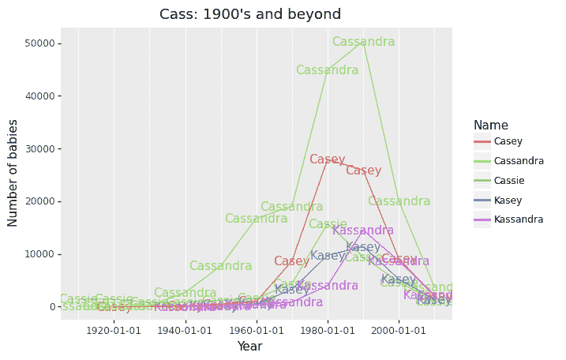
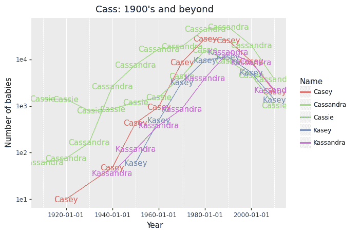
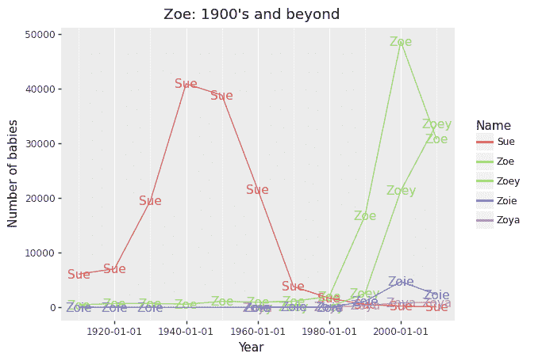
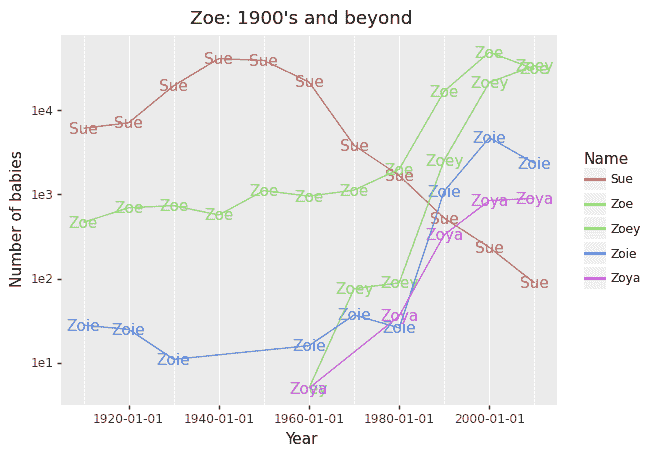

# 跨越时间和数字的名字

> 原文：<https://towardsdatascience.com/a-name-across-time-and-numbers-a9f432c3981b?source=collection_archive---------40----------------------->

这篇文章是对我女儿充满爱意的致敬，在这些黑暗和不安的夜晚，她的眼睛是闪亮的星星。

名字不断演变。父母会从流行文化、历史、体育、时事或神圣的经文中取一个名字，并加入他们自己的想法。起名的行为既唤起了原来名字的含义，也给新生儿留下了空白页来写。

以卡珊德拉为例。还有更短的变种如 Cass。一些辅音可能会被替换。在某些国家，可以用 k 代替 c，比如 Kassandra。有趣的是，在菲律宾，例如，在拼写(Cassandhra)中添加一个“h”是很常见的。这是一个随时间变化的图表。


请继续阅读，看看我是如何做到的！[这是卡格尔笔记本，如果有人感兴趣的话。](https://www.kaggle.com/krsnewwave/our-baby-s-name-and-its-variants)

## 识别变体

有了数据，我们可以看到姓名及其变体如何随着时间的推移而流行。我使用了从美国社会保障数据中收集的[美国婴儿名字数据集](https://www.kaggle.com/kaggle/us-baby-names)。然后，我使用双变音算法将单词按照它们的英语发音组合在一起。劳伦斯·菲利普斯在 1990 年设计的原始[变音算法](https://en.wikipedia.org/wiki/Metaphone)通过元音和辅音发音变化的复杂规则进行语音匹配。从那以后，该算法有过两次更新。对我们来说幸运的是，有一个来自 C/C++代码的 Python 端口，即[模糊](https://pypi.org/project/Fuzzy/)库。结果是一组单词，如:

```
Mark -> MRK 
Marc -> MRK 
Marck -> MRK 
Marco -> MRK
```

在下面的代码中，我们首先获取数据中所有姓名的指纹(也称为哈希代码):

```
names = df["Name"].unique()
fingerprint_algo = fuzzy.DMetaphone()

list_fingerprint = []
for n **in** names:
    list_fingerprint.append(fingerprint_algo(n)[0])
```

结果是每个名字都有一个索引。然后通过简单的过滤，我们可以提取 Cassandra 和 Cass 的变体。

```
def get_subset(df, df_fp, names):
    fingerprint_candidates = []
    for name in names:
        matches = df_fp[df_fp["name"] == name]["fingerprint"]
        fingerprint_candidates.extend(matches.values.tolist())

    name_candidates = df_fp.loc[df_fp["fingerprint"].isin(
fingerprint_candidates), "name"]

    df_subset = df[(df["Name"].isin(name_candidates)) & (df["Gender"] == "F")]
    return df_subset

# using my function
df_fp_names = pd.DataFrame([list_fingerprint, names]).T df_fp_names.columns=["fingerprint", "name"] df_subset = get_subset(df, df_fp_names, ["Cass", "Cassandra"])
```

## 卡珊德拉的变体

然后我们可以画出整个 20 世纪最流行的卡珊德拉变体。我还绘制了一个对数比例版本，这样我们可以更好地看到那些在包中间的。我正在使用 plotnine 库，所以我可以做 ggplot 风格的代码。

```
ggplot(df_top_n_global, 
aes(x = "Year", y = "Count", colour = "Name")) + \
    geom_text(aes(label = "Name"), show_legend = False) +\
    geom_line() +\
    labs(y = 'Number of babies', title = 'Cass: 1900\'s and beyond') +\
    scale_y_continuous(trans='log10') +\
    theme(panel_grid_minor_y=element_blank(),
           panel_grid_major_y=element_blank())
```

看起来卡桑德拉这个名字和几乎所有它最流行的变体在 90 年代达到了顶峰，但从那以后急剧下降。我曾经读到过，在 90 年代，这个名字甚至进入了美国前 70 名。其他受欢迎的变体包括凯西、凯西和卡桑德拉，这些变体的受欢迎程度都在下降。



## 佐伊最受欢迎的变体

佐伊的情况有所不同，我们发现她在 2000 年代的受欢迎程度大幅上升。也许佐伊 101 和这个节目有关？还有那部经典的 rom-com，2009 年夏天 500 天…

然而，自 20 世纪 50 年代以来，一种被确认的变体 Sue 的受欢迎程度急剧下降。我很确定他们有不同的发音。双重变音错误地将它们索引在一起。



研究名字如何随着时间的推移而演变、变得更流行、变得更稀少，这是非常有趣的。著名的人和事件总是与它有关，因此名字成为时代的反映。我记得有一种趋势，父母给他们的孩子取名 Danaerys，或者在名字的某个地方加一个 Jon。我猜测，截至这篇文章的写作时间，可能有很多安东尼的出生。甚至 X A-*12*都是时代的标志。

因为我只使用美国的数据，所以看到每个国家的趋势和变化会更有意思。每个国家的命名风格是什么？命名风格的异花授粉是什么样子的？中性名字越来越受欢迎了吗？这些都是值得探索的迷人问题！

*原载于 2020 年 9 月 19 日*[*【http://itstherealdyl.com】*](https://itstherealdyl.com/2020/09/19/a-name-across-time-and-numbers/)*。*