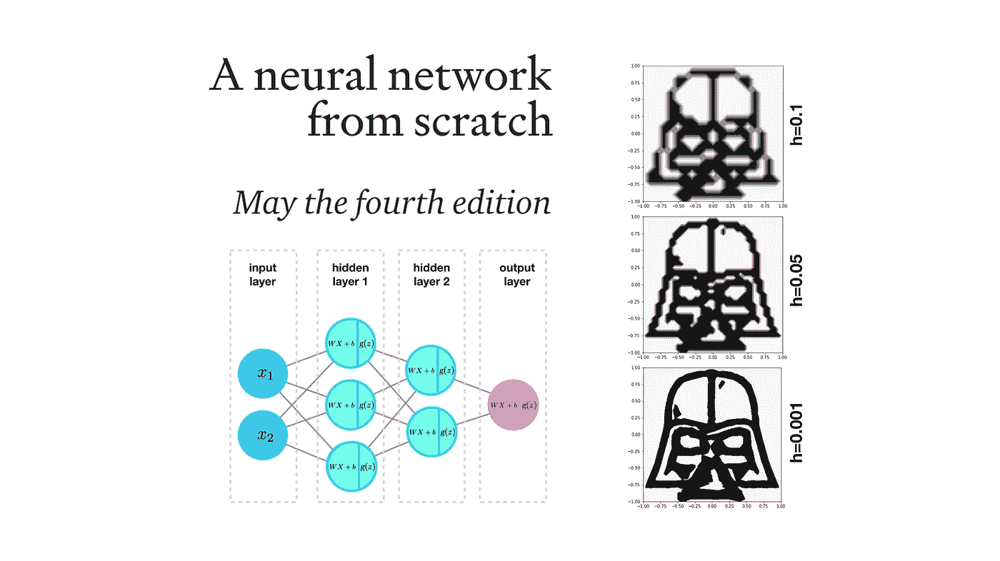
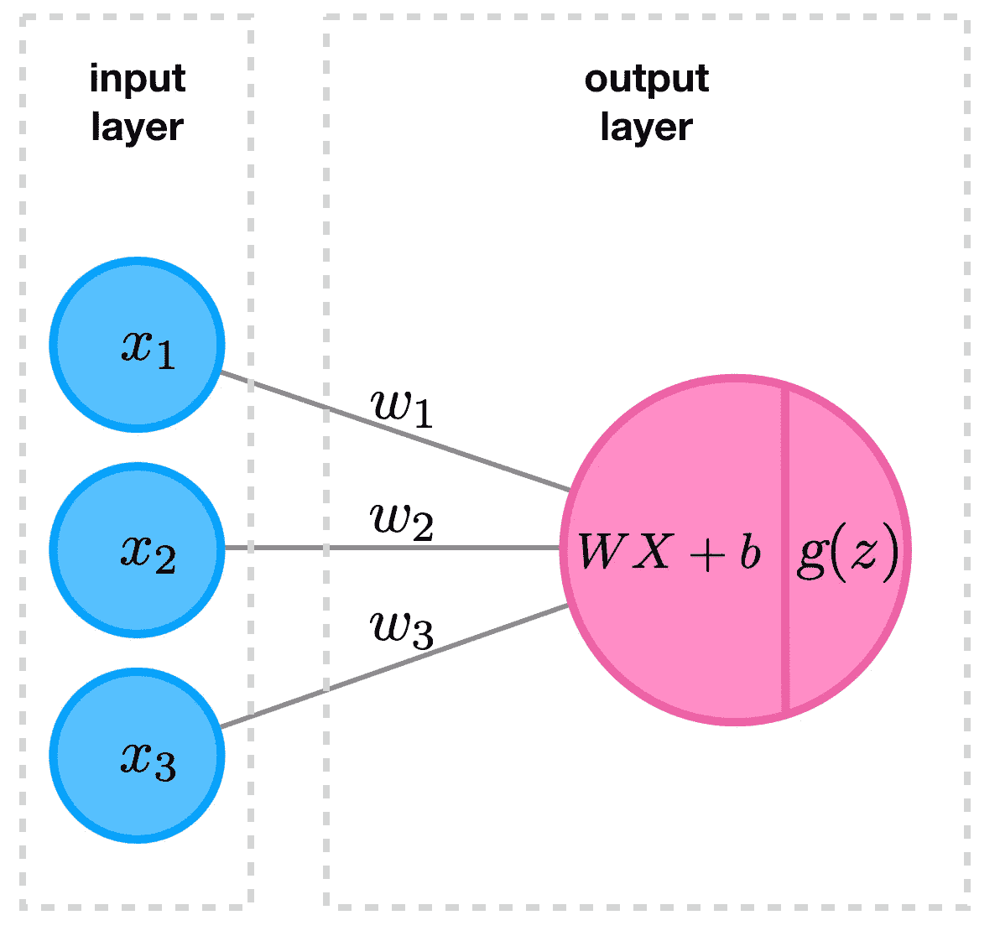
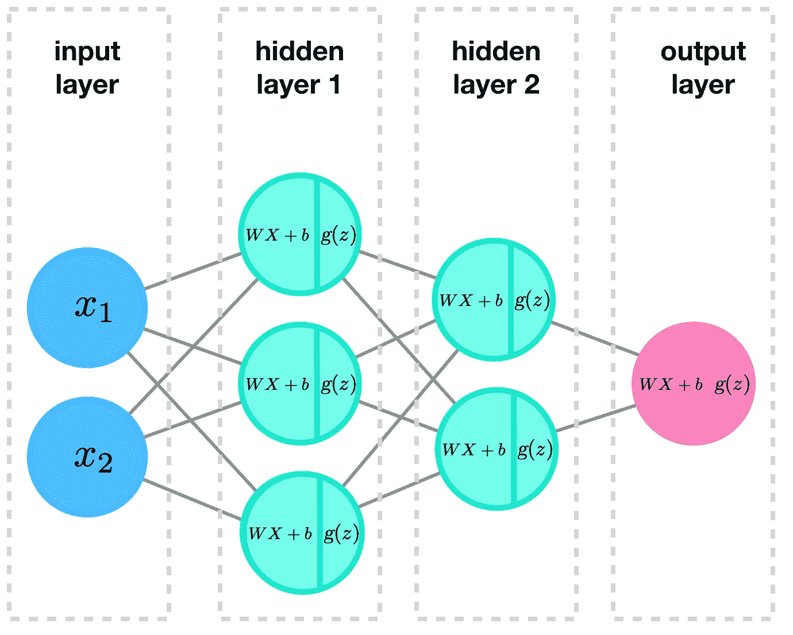
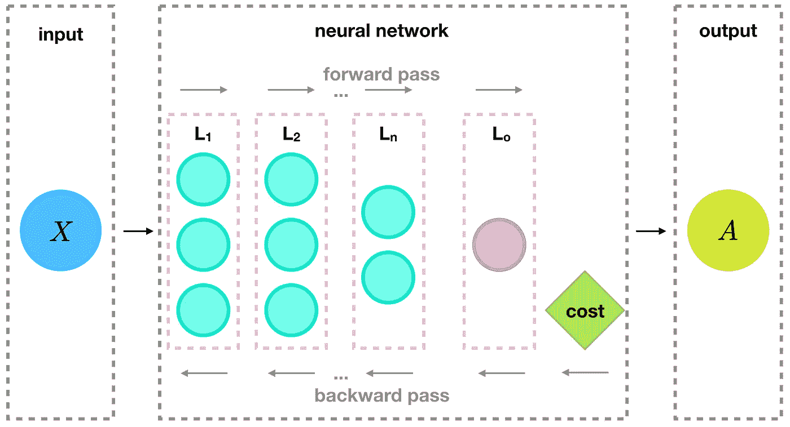
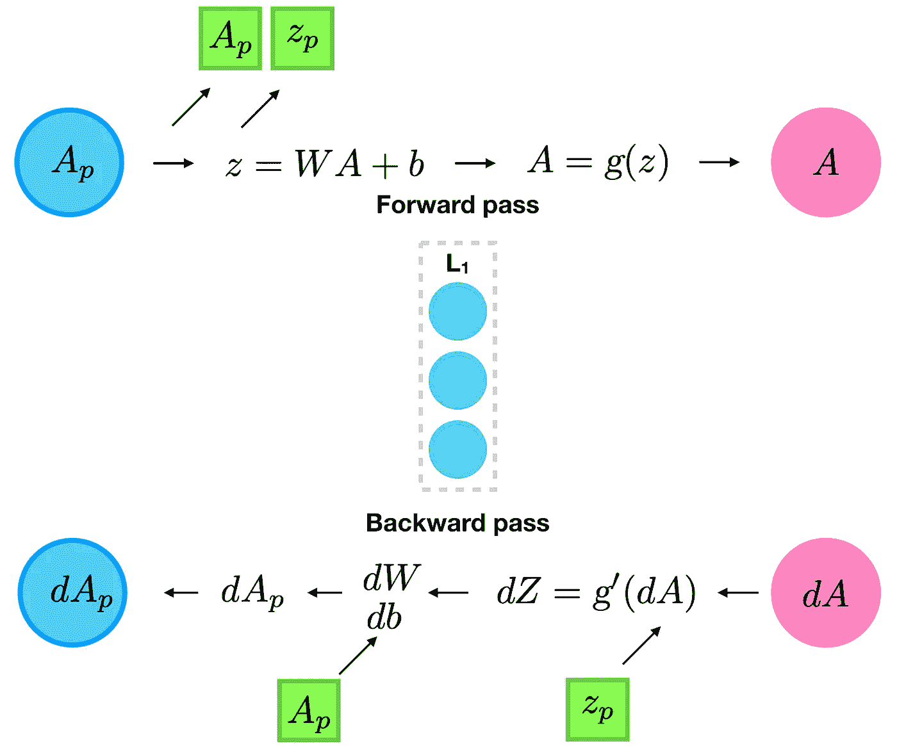
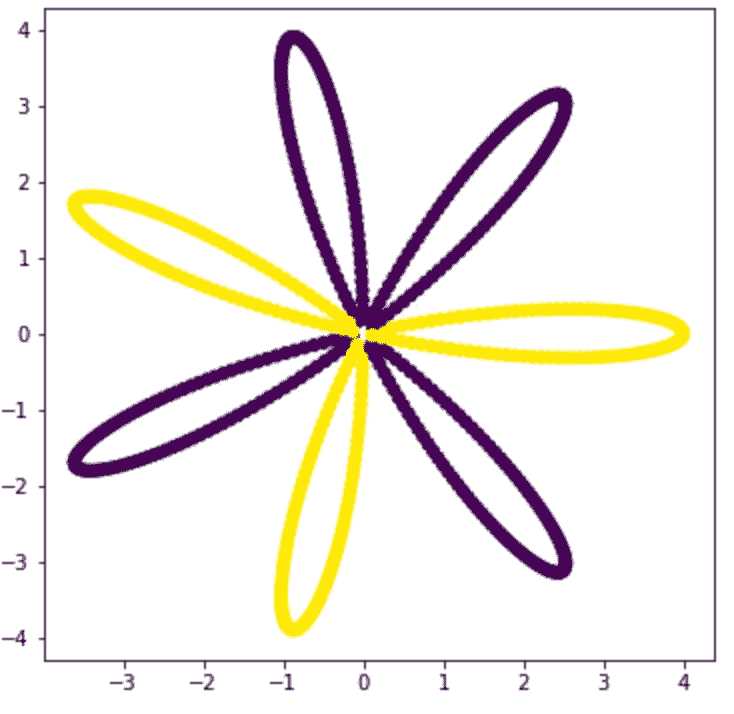
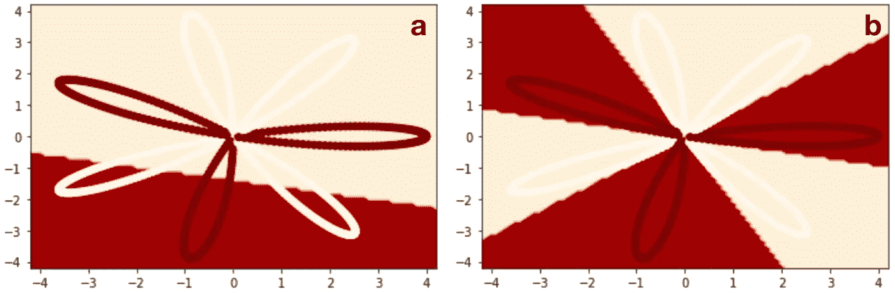
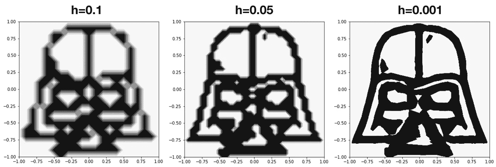

# 从零开始的神经网络

> 原文：<https://towardsdatascience.com/a-neural-network-from-scratch-c09fd2dea45d?source=collection_archive---------31----------------------->



## 用神经元、Python 和 Numpy 预测达斯·维德

在这篇文章中，我将向你展示如何用 Python 从头开始创建一个神经网络。我们将使用的唯一外部库是 Numpy，用于一些线性代数。因为今天是 5 月 4 日*，*作为奖励，我们将使用这个新创建的神经网络来拟合一条复杂的消息，这条消息是从*穆斯塔法*截取的。一步一步地编写神经网络代码将有助于您理解内部工作方式，这与 Torch 和 Tensorflow 等流行框架非常相似。就我个人而言，我认为从零开始构建东西是掌握一个主题的最好方法，当然也很有趣！

> “就是这条路”——丁·贾林

这篇文章在我的 Github 上也可以作为[的 Jupyter 笔记本](https://github.com/dennisbakhuis/Tutorials/blob/master/2_Neural_Network/Artificial_Neural_Network.ipynb)获得，所以你可以边阅读边编码。

如果你是 Python 和 Jupyter 的新手，[这里有一个关于我如何管理我的 Python 环境和包的简短说明](/environments-conda-pip-aaaaah-d2503877884c)。

👉Pip，conda，aaah 是我每天 10 分钟 Python 课程的一部分！

**我们将讨论的主题的简短概述:**

1.  神经网络和逻辑回归
2.  多层网络的一般化
3.  逐步实施
4.  它做了它应该做的事情吗？
5.  符合从穆斯塔法截获的信息

# 1.神经网络和逻辑回归

当我们随机问一个人关于机器学习的问题时，很有可能会提到神经网络。这些术语不仅发挥了我们的想象力，而且这些数学结构也证明了它们能够解决复杂的任务。这种任务的例子是对象检测、音频转录和文本翻译。神经网络可以相对较小，如图 1 所示，但仍然很强大，可以预测复杂的系统。


图 1:一个典型的神经网络，由一个输入层、两个隐藏层和一个输出层组成。

在图中，我们展示了一个人工神经网络(ANN)，或简称为神经网络(NN)，它有三层。按照惯例，我们不计算输入层，稍后我们会看到，图中的这一层表示您输入到神经网络的输入数据。这个特殊的神经网络有两个隐藏层。虽然我不确定为什么它被称为隐藏层，但我可以想象一个原因是这些层对用户是“隐藏”的。用户通过输入层输入数据，并从输出层获得结果，因此不会与隐藏层进行交互。对于用户来说，一个系统有一个或二十个隐藏层是没有区别的。与输入层相反，输出是一个实际的层，在我们的例子中是一个单个神经元，它“收集”来自前一个隐藏层的结果。

在我之前的教程中，我试图解释逻辑回归(和一点线性回归)是如何工作的。逻辑回归可以被看作是最小的神经网络，只有一层，由一个神经元组成。可能最好首先简要回顾一下图 2 所示的逻辑模型。



图 2:一个逻辑回归模型的例子。这个例子有三个输入特征供给单个神经元。神经元本身分为两个操作，线性部分和非线性激活函数。请注意，线性方程中使用的权重是输出图层的一部分。

对于这个例子，第一步是对输入数据进行*按摩*，使个体*特征* ( *𝑥* 1、 *𝑥* 2、 *𝑥* 3)在我们输入向量 *𝑋* 的行中，列是*实例*(训练样本)。这个输入向量 *𝑋* 用于我们单个神经元的前向传递。这个神经元分为两个操作。先是一个线性运算(线性回归)，*z*=*𝑋𝑊*+*𝑏*，接着是一个激活函数*𝐴*=*𝑔*(*𝑧*)。在逻辑回归教程中，我们执行了二元逻辑回归。这具体使用了 Sigmoid 激活函数*𝜎*(*𝑧*)= 1/(1+exp(*𝑧))*，因此我们在这里将其表示为 *𝜎* ( *𝑧* )。在这里，我们通过使用 *𝑔* ( *𝑧* )来表示激活函数来概括这一点。我们必须定义我们将使用哪个激活函数。正如我们今天将要学习的，有许多激活功能可供选择。

激活函数使用来自神经元线性部分的结果作为输入。这是权重向量 *𝑊* 和输入向量 *𝑋* 的内积(也叫点积)，加上了偏置项 *𝑏* 。偏差项 *𝑏* 和权向量 *𝑊* (由 *𝑤* 1、 *𝑤* 2、 *𝑤* 3 组成)是该系统的可训练参数。每个可训练权重( *𝑤* 1、 *𝑤* 2、 *𝑤* 3)对应于一个输入特征( *𝑥* 1、 *𝑥* 2、 *𝑥* 3)，并表示该特征添加到问题中的“权重”。在图表中，这些权重显示在输出图层的虚线框内，这意味着这些权重与该图层相关联。

我希望这个简短的回顾是清楚的，否则，我可以推荐[我以前的 Jupyter 笔记本](/environments-conda-pip-aaaaah-d2503877884c)来获得更全面的解释和 Numpy 中的一步一步的例子。

虽然逻辑回归是一个很好的工具，但它只能将参数空间分成一条线，至少在我们这里给出的形式中是这样。例如，如果你有两个特征 *𝑥* 1 和 *𝑥* 2，它们将用于预测 *𝑦* ，逻辑分类器只能在两个参数之间有一个线性边界。如果这没有意义，也不要担心，因为我们将通过一个例子来说明这个问题。



图 3:一个神经网络可以被看作是一堆逻辑回归单元的组合。

为了让系统预测更复杂的关系，我们可以向一层添加更多的神经元，或者向我们的网络添加更多的层。每个神经元都是某种逻辑回归单元，其中许多结合起来可以预测高度非线性的关系(见图 3)。我说*类似于*，因为在常规逻辑回归中，我们通常使用 Sigmoid 激活函数，而在神经网络中，许多其他激活函数的性能要好得多。

在我们开始概括一个神经网络和所用的层之前，请观察图 3 中不同的神经元是如何连接的。您会注意到每个节点都连接到下一层的所有节点。这被称为密集连接(有时是完全连接)，这样的层通常被称为“密集层”。在下一节中，我们将尝试概括网络并确定所需的结构。

# 2.多层网络的一般化

在我们开始编码我们的系统之前，让我们首先尝试概括所需的步骤。本教程的目标是创建一个通用的神经网络类，我们可以在其中添加任意数量的层，包含任意数量的神经元。稍后，我们将在具有不同复杂性的各种问题上测试这种结构。

当我们想到输入层时，我们已经发现它不是神经网络的实际层，而是以正确形式重新整形的输入数据。因此，输入“层”不是我们架构的一部分。当然，输入数据具有许多特征，因此定义了我们的第一层的至少一个维度。

神经网络将由任意数量的层组成。这些结构的行为方式相似，并且是相互连续的。这意味着我们将有一个层结构，以及某种父结构来保存所有的层。当进行正向传递时，我们将遍历所有层，并将前一层的输出用作下一层的输入。最终层的输出，也称为最终激活 *𝐴* 是神经网络的输出。这意味着，如果神经网络用于预测二进制值，则输出必须转换(或舍入)为实际预测值。

为了测试我们的预测，我们需要定义一个成本函数。成本函数是对模型预测效果的衡量，因此需要预测值和真实值。在最正式的意义上，我们需要定义一个损失函数，该函数计算单个示例的预测误差，并将所有这些损失合并到一个成本函数中，以获得我们输入到模型中的整个批次的一个度量。损失和成本函数只需要一次，而不是在每一层中，因此，它应该在父结构中实现。

为了优化权重并有希望改进模型，我们需要使用向后传递来计算梯度。首先我们需要计算父类中损失函数的梯度。这将是最后一层的输入，从这一点，我们向后循环计算梯度 *𝑑𝑊* 和 *𝑑𝑏* ，随着每次迭代，前一层的输入将是下一层的输入。为了计算梯度，我们需要来自向前传递的输入，为此我们可以做一个聪明的技巧，在向前传递期间缓存 *𝑧* 和 *𝐴* 的值。这看起来有点吓人，但这些步骤主要是记账。所有这些步骤都可以在图 4 中看到。



图 4:我们的神经网络结构的概述。完整的结构，包括输出层 *𝐿𝑜* 在我们的神经网络框架内。正向传递循环通过每一层，并输出最终激活的结果。进行反向传递时，首先计算成本函数的梯度，然后我们通过所有层反向迭代，计算梯度。

在我们计算了每一层的梯度后，我们可以做一个更新步骤，并执行梯度下降步骤。这一步实际上与我们在逻辑回归教程中讨论的一步相同，在逻辑回归教程中，我们使用学习率将权重向真实结果“移动”一步。然而，这一次，我们必须对神经网络中的每一层都这样做。

我们现在应该认识到，网络中的所有层在根本上是相同的。它们可以在节点数量或激活功能上有所不同，但第一层 *𝐿* 1 和输出层 *𝐿𝑜* 之间没有结构上的区别。这意味着我们可以创建一个层结构作为神经网络的一个构建模块。

我们的神经网络将只由密集层组成，即所有神经元都完全连接到下一层神经元的层，因此我们将只制作单层结构。在这个结构中，我们必须计算向前传递、向后传递和更新步骤。每一层的输入都是前一层的输出。显然，对于第一层，这是输入向量。对于反向传递，我们按相反方向依次通过网络。然而，这里我们需要做一个额外的步骤，因为我们需要计算关于定义的损失函数的梯度。为此，我们需要在反向传递期间输入真实标签 *𝑌* 和预测输出 *𝐴* 。在这之后，我们有一个层期望的值，我们称之为 *𝑑𝐴* 。每一层都以完全相同的方式处理向后传递。



图 5:显示单层向前和向后传递的图表。在向前传递过程中，我们缓存 A 和 z 的值，以便在向后传递过程中使用。

每一层的向前和向后传递如图 5 所示。让我们一步一步地走过每一关。在前向传递中，它期望前一层的输出 *𝐴𝑝* (或输入向量 *𝑋* )作为输入。在线性方程之前，输入 *𝐴𝑝* 被缓存用于向后传递。接下来，我们计算单个矢量化内积中的线性部分。这是对该层中的所有神经元以单一步骤完成的。在内积之后，加上偏置项。接下来，我们还缓存了向后传递的 *𝑧𝑝* 的值。最后，我们将计算激活函数，并将结果传递给下一层(或者如果这是最后一层，这就是输出)。

向后传递只是反向的向前传递，但是期望前一个渐变作为输入。首先我们需要计算激活函数的微分。这些都比较容易计算(或者在网上找)。我们使用缓存的𝐴𝑝的值和𝑧𝑝的值来计算梯度。作为最后一步，我们计算 *𝑑𝐴𝑝* ，这将是下一层的输入。虽然数学与之前的教程相似，但现在更加简化了。我不想过多地关注实际的差异，但会在代码中多解释一些。如果你真的想知道这些微分是怎么算出来的，我会建议你拿纸笔试着算一下。他们并不难，Wolfram Alpha 可以帮助你:-)。

最后一点，你应该意识到，在向后传球中，我们正在做所有[链式规则](https://en.wikipedia.org/wiki/Chain_rule)之母。为了计算第一层的梯度，我们必须将所有其他的微分链接在一起。如果不完全清楚每个步骤在做什么，*不要太担心*。我会试着解释编码过程中的每一步。经验和理解来自实验。

> “我已经说过了”——库伊尔

# 逐步实施

在我们开始编码之前，让我们先对我们计划做的事情做一个简短的总结。这个想法是创建两个结构，在这个例子中是类。一个类定义层，而另一个类充当父类并保存完整神经网络的所有层。

## 密集层类

*   结构来保存任意数量的节点
*   将具有各种激活功能
*   将通过单层执行正向传递
*   反向传递的缓存值
*   将对该层执行向后传递
*   将对图层执行更新步骤

## 神经网络类

*   结构来保存任意数量的层
*   将在所有层中顺序执行向前传递
*   将计算各种损失函数的成本
*   将执行反向传递并计算所有梯度
*   将对所有图层进行更新(梯度下降步骤)

## **让我们开始吧！**

我们将使用 Numpy 的线性代数例程，因此需要导入它。此外，定义有意义的错误是一种好的做法，因此我们将定义几个异常。另一种方法是使用 Python 的日志模块，这是另一个很好的工具。

## 致密层:

接下来，让我们创建名为 DenseLayer 的新类。该类采用一个带有两个必需参数和两个可选参数的构造函数:

*   inputDimension，即输入向量的特征数，或前一层的单元数。
*   单位，即该层神经元的数量。
*   激活:在这里你可以指出层应该使用什么激活。定义了“sigmoid”、“relu”、“tanh”和“”。空字符串表示没有激活，意味着我们只有一个回归。
*   randomMultiplier 是随机权重相乘的值。通常，0.01 就可以了，但有时调整这个数字会有所帮助。

由于可能有不同的激活函数，并且我们不想检查我们使用了 if 语句的哪个激活，我们在 init 语句中引用所使用的激活函数。

在 initialize 方法中，权重被初始化。注意，神经元的数量 *nh* (单位)在行中，输入特征的数量 nx 是列。这是使我们的点积稍后工作所必需的。

最近学到的另一件事是 Python 中‘self’的用法。虽然我认为我理解这个概念，但我并不完全理解其后果。类的定义与每个实例的值是分开的。这些值存储在自身对象中，即实例本身的对象中。在其他编程语言中，通常在类本身中定义类型。然而，在 Python 中，您必须在 init-method 中定义它们。如果不这样做，该变量将在所有实例中共享，您可能会得到奇怪的结果。我刚刚发现这篇[博文](/python-pitfall-mutable-default-arguments-9385e8265422)，其中唐·克罗斯有一个非常清晰的解释。有兴趣推荐阅读！

接下来，我们定义所有使用的激活函数。我们在前面的教程中已经知道了 Sigmoid，但是，我们还包括 Tanh 和 Relu，它们也是非常常用的激活函数。

双曲正切函数是一个类似于 Sigmoid 的函数，但是它将所有实数值映射到-1 和+1 之间的值。在 Relu 函数登上舞台之前，它已经非常流行了。

Relu，代表整流线性单位，可能是目前最流行的激活函数。它的计算速度很快，而且通常比双曲正切函数的结果更好。因此，如果你不确定，Relu 函数是一个很好的开始。Relu 函数将所有小于 0 的值映射为零，并将所有大于 0 的值映射为值本身。

我们将介绍的最后一个激活函数称为线性函数。这和没有激活功能是一样的，只是一个占位符。什么进来，什么出来，我们用它来测试我们之前的线性回归练习。

向后传递需要所有这些函数的微分，这些微分带有 Grad 后缀。请随意检查这些差速器是否正确。请注意，每个函数都有一个额外的步骤，它不是函数微分本身的一部分，但需要应用[链规则](https://en.wikipedia.org/wiki/Differentiation_rules#The_chain_rule)。我们将输入的差分乘以计算出的差分。这个步骤在整个反向传播中连续运行。

接下来，我们定义正向传播步骤，这对于逻辑回归版本来说应该非常熟悉:

我们首先计算线性部分。存储 Z 和 A 的值，供以后在反向传播中使用，然后应用激活函数。

反向传播应该看起来也很熟悉，但是，我们已经将激活函数的微分部分拆分为函数本身。此外，该函数期望 *dA* 作为输入，这是多层的更一般化的形式。在我们之前的单层示例中，我们在这一步中合并了损失函数的微分。这一步现在包含在我们的父类中，而不是每个层中，因为它只在最后一层之前需要。

梯度存储在每个图层中，以后可由执行梯度下降步骤的更新函数使用。反向传递将每一层链接在一起，我们将在后面处理父类时看到。剩下唯一需要的函数是 update 函数，它执行梯度下降步骤。没什么了不起的，但它期望一个学习率。

虽然不是必需的，但这些 next 函数有助于打印模型并返回输出节点的数量，这些节点用作下一层的输入维度。

## 神经网络类:

好吧，搞定一个，还有一个。接下来，我们将创建一个类来合并这些层。它还将保存损失函数，并且必须计算损失的梯度。为了方便起见，我们还将添加一个包装器来添加层，并添加一种方法来漂亮地打印我们的模型。

首先，我们再次从构造函数开始，它有两个选项，要使用的损失函数和用于新层的 randomMultiplier。损失函数再次在函数引用中创建，并使用包装函数调用。模型初始化时没有层(空)。

下一个方法是一个帮助器函数，用于向模型添加层。您需要给出输入维度，即第一层的输入要素的数量。对于第二层和更深的层，它将查找前一层并将其用作输入维度。

你必须指定层(单元)中神经元的数量以及使用哪个激活函数。如果你不指定激活函数，它将不会使用激活函数，你将得到一个线性系统。

接下来，我们定义损失函数及其微分。请随意检查差速器是否正确。成本方法是一个包装器，用于在训练循环中调用适当的成本函数，我们将在后面定义。

前进、后退和更新方法非常相似，因为它们在所有层上循环。只有后向通道必须首先计算损失函数的梯度，然后将其用作第一层(从右侧开始)的输入。

后两种方法非常简单，用于漂亮的打印，一种用于打印可训练参数。没什么特别的。

好了，课程结束了。现在我们需要对这些类进行测试。虽然它看起来非常有序，但其中一个差速器的小错误会使我们的整个系统变得毫无用处。因此，我们将在下一节中分步进行测试。期待旋转！

如果想一次复制所有的类，可以从 [my Github](https://github.com/dennisbakhuis/Tutorials/tree/master/2_Neural_Network) 下载。

# 4.它做了它应该做的事情吗？

没有什么比空等更烦人的了。因此，重要的是首先测试容易的东西，而不是花几个小时训练，看看你在损失函数中犯了一个错误。让我们重复上次实验中做过的实验。

## 线性回归:25 再来一遍

我们用几个输入值 *𝑋* 创建了一个数组。接下来我们用超级复杂的公式 *𝑦* =2 *𝑥* +1 提供 *𝑌* 。在 Numpy 中是这样的:

现在，我们将构建我们的模型，该模型将尝试找到我们的困难公式并匹配 25 的真实值。为此，我们将启动我们的新类，并将损失设置为均方误差。接下来，我们将添加一个单层，只有一个神经元，没有激活功能。让我们也试试我们漂亮的印刷:-)

现在我们将再次需要我们的训练循环。上次的逻辑回归模型看起来很熟悉:

成本如预期的那样下降，并且由于长时间的训练，该值接近机器精度。当我们在 forward 方法中输入 12 时，我们会再次找到 25 吗？

```
array([[25.00000019]])
```

当然，我们有！

## 逻辑回归:泰坦尼克号数据集的又一次尝试

坏消息，泰坦尼克号又沉了，我们需要一个二元逻辑分类器。没有过多评论，我们导入数据(来源: [Kaggle 泰坦尼克号比赛/由 Azeem Bootwala](https://www.kaggle.com/azeembootwala/titanic) 预处理):

我们需要创建一个有 14 个输入特征的模型，当然还有 sigmoid 激活函数。损失函数将是交叉熵，这是默认的，所以我们不需要指定它。

在创建训练循环之前，我们像上次一样定义一个精度函数来快速计算精度。上次我们有大约 80%的准确率。

现在，让我们运行训练循环，看看我们是否能匹配前面的结果。

```
cost: 0.6912384614194468 	accuracy: 58.7%
cost: 0.5140056920509907 	accuracy: 75.9%
cost: 0.4824062497934128 	accuracy: 79.5%
cost: 0.4697113881273363 	accuracy: 79.5%
cost: 0.46275860969195476 	accuracy: 79.8%
cost: 0.45807429458700816 	accuracy: 79.8%
cost: 0.4544915367177524 	accuracy: 79.8%
cost: 0.4515471545581365 	accuracy: 80.8%
```

如你所见，一点也不差。

## 更多的神经元和层:复杂的花朵

酷的东西从更复杂的功能开始。来自吴恩达的[深度学习课程](https://www.coursera.org/learn/neural-networks-deep-learning?specialization=deep-learning)展示了一种使用多节点模型预测[玫瑰函数](https://en.wikipedia.org/wiki/Rose_(mathematics))的方法。让我们也试试吧！

首先，我们需要导入数据。生成数据的代码在 [Github](https://github.com/dennisbakhuis/Tutorials/tree/master/2_Neural_Network) 上的 Jupyter 笔记本里。



图 7:输入数据的可视化。

数学方程式创造了美丽的花状结构，如图 7 所示。我们已经将 7 个花瓣中的 3 个着色为不同的值，现在将使用我们的神经网络来预测 x，y 坐标上的值应该是 0 还是 1(颜色)。

但在此之前，让我们先展示一下，当我们试图用一个过于简单的模型来预测时会发生什么，比如逻辑回归，它只能有一个线性边界。在下一个代码片段中，我包含了模型创建、训练循环和可视化结果的帮助函数。

结果显示在图 8 的左侧。肯定不是很合适，而且明显是一条线。现在让我们添加另一个有四个单元的层到模型中，最后一层是相同的 Sigmoid 层。我们保留的这个模型的激活函数与 Andrew 的相似，它有一个 Tanh 激活函数。



图 8:同一花形函数的两种拟合。在图 8a 中，逻辑回归模型只能拟合一条线，而图 8b 中的两层模型可以拟合花的复杂形状。

这真的让我很惊讶。再多一层，我们就有能力学习这个更复杂的功能。非常棒的东西！

# 5.符合从穆斯塔法截获的信息

因为今天是 5 月 4 日(与你同在)，我们截获了一份来自穆斯塔法的秘密电报，这不可能是巧合。最重要的是，我们用这些数据训练我们的模型，这样我们的 ai (read: model)就可以完全理解这种传输的本质。

第一步是导入数据，即 2d 传输数据。我还创建了一些辅助函数来创建模型，一个训练循环，以及一个可视化和分析传输的函数。

当你创建更大的模型，尤其是更复杂的模型时，你会发现超参数的数量会大大增加。有关于如何选择它们的指导方针，但没有金科玉律，因此，你经常要尝试很多。

我做了一个参数扫描，其中我自动搜索以找到最佳的层数、单元数和迭代数。我做得很粗糙，花了 15 个小时运行了近 100 个模型。参数搜索包含在 Jupyter 笔记本的附录部分。以下参数给出了很好的结果，损耗低于 0.09。损失值本身没有意义，它只是预测值与真实值匹配程度的度量，应该最小化。你可以自己尝试这些设置。如果发现更好的参数，请分享给我:-)。

```
[
  1 -> Dense layer (nx=2, nh=27, activation=relu)
  2 -> Dense layer (nx=27, nh=31, activation=relu)
  3 -> Dense layer (nx=31, nh=31, activation=relu)
  4 -> Dense layer (nx=31, nh=1, activation=sigmoid)
]
There are 1973 trainable parameters in the model.
```

我们的模型有四个连续的层。前三个有许多单元和 Relu 激活功能。最后一层是简单的逻辑层。我们的实现没有 pyTorch 或 Tensorflow 中提供的所有功能(可以随意添加)。一件很棒的事情是在训练时调整学习速度。首先以较大的学习速率开始，当你接近收敛点时降低学习速率。下面的方法就是模拟这一点。

```
1000 -> cost: 0.42574001278351997
2000 -> cost: 0.310616390460577
2000 -> cost: 0.21932529403735668
2000 -> cost: 0.15604826952436227
4000 -> cost: 0.11089920071653515
5000 -> cost: 0.09616265347246447
8000 -> cost: 0.09046567290400138
4000 -> cost: 0.08879263912657591
```

经过 28000 次迭代后，我们达到了一个足以分析数据的收敛状态。为此，我们将使用 testModel 函数。使用 *h* 参数，我们可以[增强我们消息的分辨率](https://www.youtube.com/watch?v=Vxq9yj2pVWk)。各种“增强”的结果如图 9 所示。



图 9:现在我们发现了一个可怕的事实:这条信息是关于西斯尊主本人的！

哦，天哪，是黑魔王本人！啊啊！当然，没有提高分辨率这样的事情，我们只是用更大的网格来填充神经网络。结果还是蛮牛逼的，我必须说我自己:-)。

下一个很酷的尝试是使用 RGB 图像作为输入。为此，您需要调整输入图像的形状，使 RGB 通道垂直堆叠。对于我们当前的输入图像，这意味着三倍长的输入向量(三个通道)。创建和操作输入数据的程序可在 [Jupyter 笔记本](https://github.com/dennisbakhuis/Tutorials/tree/master/2_Neural_Network)中找到。输入图像的剪贴画源是从[niceclipart.com](http://niceclipart.com/6378/star-wars-darth-vader.html)下载的。

# 围捕

我希望你们玩得开心，写自己的神经网络。在我看来，从头开始写这些东西是了解它实际上是如何工作的最好方法。我希望你能看到这些系统并不神奇，只是简单的矩阵乘法，不幸的是它们非常多。最困难的部分当然是反向传播，我们需要计算梯度。我们简单的神经网络是相当可行的，但增加更多的层和不同类型的层，会使它变得有点麻烦。尽管如此，本质还是和我们今天所做的非常相似。

我的建议是尝试一下这些结构，重写它们的一部分，或者更好，从头开始写你自己的！

> 这是一条路

如果您有任何意见，请告诉我！在 [LinkedIn](https://linkedin.com/in/dennisbakhuis) 上随意联系。