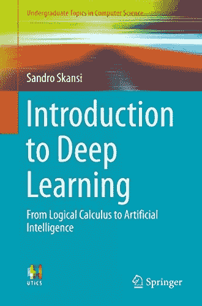
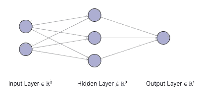
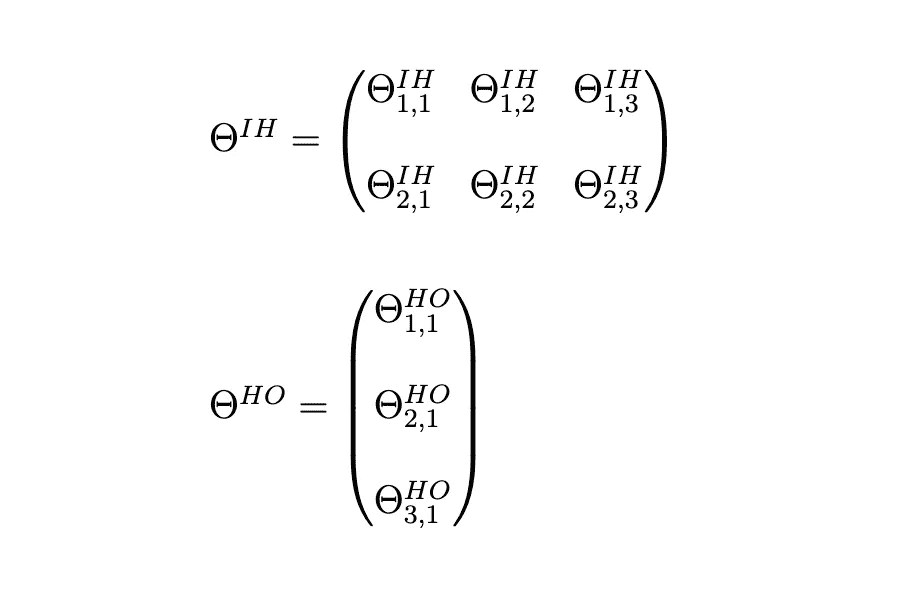
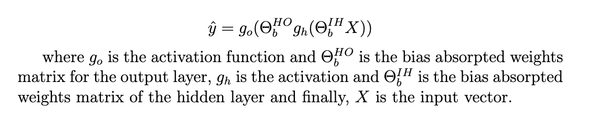
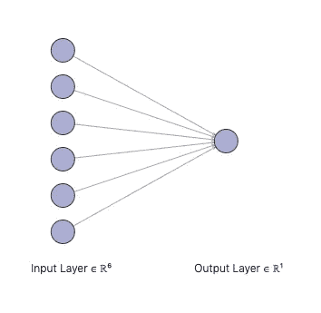
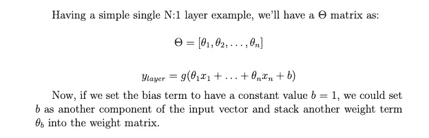
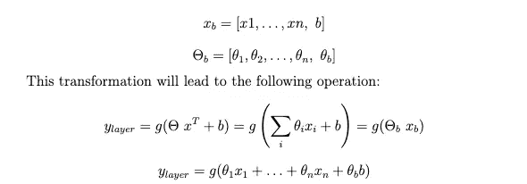
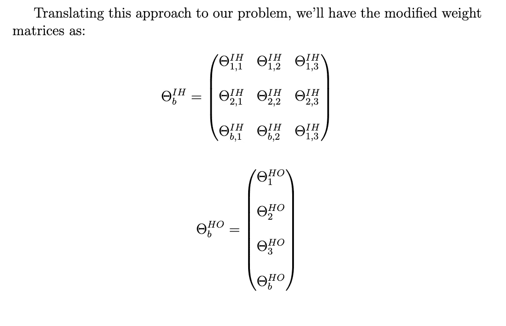
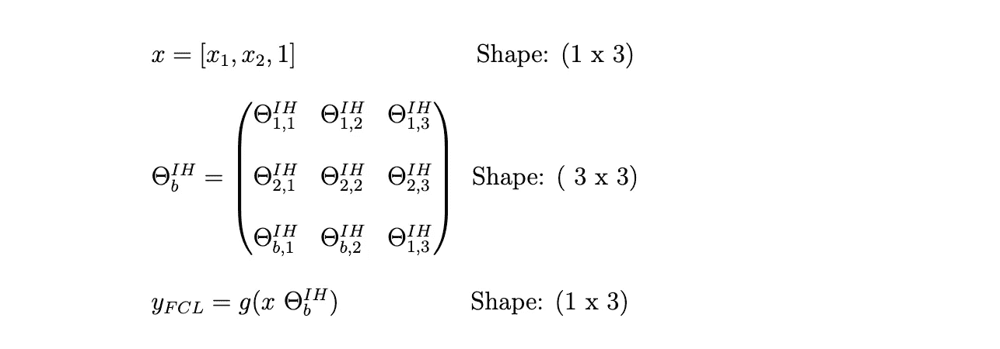

# 如何用 Numpy 从零开始构建神经网络！(第一部分)

> 原文：<https://towardsdatascience.com/a-neural-network-implementation-part-i-eb31f4ea470?source=collection_archive---------43----------------------->


图一。我关于反向传播的笔记。我拍的照片。

## 仅使用 Numpy 的前馈实现！

神经网络是**深度学习的核心。**它们为伯特或 GPT-3 等卓越模型奠定了基础。为了对**变形金刚**的功能有一个非常肤浅的了解，我认为有必要学习如何从零开始建立一个神经网络，使用现有的最基本的数学工具。

基于此，我决定投资一些时间和代码**我自己的神经网络实现**。你可以在我的 Github 页面( [**neuralnet**](https://github.com/next-manuelmartin5/neural-network-implementation) )看看完整的项目。是的…我知道，这不是一个非常原始的名字👻！

我将在几篇不同的博文中讨论这个话题。

# **理论第一**

我想做的第一件事，是向前和向后传播背后的精确的数学运算。我不想看也不想复制其他帖子的实现，所以我选择了*****桑德罗·斯坎西*** (来自斯普林格出版社)的《深度学习入门》，这本书似乎正适合这个任务。**

****

***图二。桑德罗·斯坎西的《深度学习导论》封面。图片来自* [*亚马逊*](https://www.amazon.es/Introduction-Deep-Learning-Intelligence-Undergraduate-ebook/dp/B079M3D7JF)**

**在第四章有一个关于浅层前馈神经网络的精彩解释。我研究了一下，先用手开发了方程，这样开发的时候就不用挤破头了。(事实上，帖子顶部的图片是我的真实笔记，我花了一个下午的时间把整个算法做对了)。当你对自己想要创造的东西有了一个明确的想法时，最好开始编码。此外，当你进行科学编程时。**

**您会注意到，我的项目明显带有“*Keras API-based”*偏见。我从它那里借用了一些概念来封装元素，比如*层*抽象。最后，是最合理的方式来揭露神经网络的建设。**

# **基本概念**

**现在，我将总结实现网络的这一系列文章中将要涉及的主题。将有数学表达式和相关代码的解释。**

**这一部分将涉及的主题有:**

****前馈传播****

*   **层权重**
*   **激活功能**
*   **向量化偏置吸收**
*   **全正向传播**

**以下几点将在即将到来的第二部分中解释！😄**

*   **优化:梯度下降**
*   **损失函数**
*   **反向传播和链式法则**
*   **权重初始化**

# **正向传播**

**从这一步开始，我们将关注一个**二进制分类问题**，使用一个基本的前馈架构作为构建代码的基础。我们会使用这个设置，因为这是机器学习中**最常见的问题**之一，也是最容易解释这个概念的。**

**正如下面图 3 的描述，我们的网络在输入层由 2 个神经元组成，这意味着网络将接受 2 个分量的向量，然后是隐藏层的 3 个和输出层的 1 个。我们将在后面看到，通过使用激活函数，输出神经元将返回输入观察值属于这一类或那一类的概率。**

****

**图 3。浅层前馈神经网络**

## *****层权重*****

**每条线和每个箭头表示权重矩阵，该权重矩阵关于每一层将神经元相互关联。这些权重将**考虑**前一个输入或层输出的“多少”将被转移到下一个。我们可以用数学方法写出这些矩阵，如下所示。**

**表示输入层和隐藏层之间的权重关系的矩阵将被表示为θIH，隐藏层和输出层之间的权重被表示为θHO。**

****

**图 4。每层的权重矩阵。**

**然后，为了明确定义从每一层到下一层的转换，我们需要定义什么是激活函数。**

## *****激活功能*****

**基于生物启发模型来阅读激活函数的定义是很常见的。但是让我们忽略一部分，因为我认为这有点令人困惑。**

> ***关于生物学和哲学基础的一些注释可以在论文* [*“关于深度学习的起源*](https://arxiv.org/pdf/1702.07800.pdf) *”中阅读，该论文用非常精辟和系统的方法解释了这些初级概念化。***

**我更喜欢将激活函数视为非线性的(实际上，除了在[感知器](https://en.wikipedia.org/wiki/Perceptron)上，总是非线性的)转换，这种转换将它们的输出压缩到某个范围内(近似概率分布)，并最终允许神经网络证明它们是**通用函数近似器*。*** 这个理论解释了为什么神经网络表现出如此**高的表示能力**。**

> **关于*普适近似理论*的一个很酷的解释可以在这里读到[。](/the-approximation-power-of-neural-networks-with-python-codes-ddfc250bdb58)**

**在我的实现中，我选择了 *sigmoid* 激活函数，它很长时间以来一直是标准的激活函数(尽管最近它已经被 ReLu 及其所有派生函数所取代)。**

****

**图 5。乙状结肠激活功能。**

**代码实现如下所示。**

## *****偏置吸收*****

**现在，我们有了几乎所有的工具来了解如何计算前向传播。让我们先看看表达式在 2 层前馈架构上是什么样子的:**

****

**图 6。浅层网络上的前向传播。**

**可以清楚地看到，正向传播的形式似乎很简单。这只是一种**类型的功能组合**。**

***在这篇文章中，我们继承了用神经元和它们的联系来展示什么是神经网络的传统，但最终如果你看一下上面的表达式，就很容易理解网络的基础是什么。如果应用于输入 X，表达式的输出将是该输入属于第一类的概率。**

> ***为什么*θIH 和θHO 有 **b** 下标？→因为我们正在利用**偏置吸收**实现正向和反向传播。这不是一个非常流行的概念，但我认为它在计算方面更有效，因为它允许完全矢量化的实现。**

**偏置吸收基本上是将**偏置项视为各层的另一个输入**，并迫使它们为 1。然后，权重将被叠加到图层权重中，以便对其进行估计以符合数据。**

***我们之所以需要使用偏差项，是因为它提高了模型适应不同数据点的灵活性。**

**让我们用一个**简单的例子来解释这个:****

****

**图 7。单层感知器**

**想象具有上面在图 7 中定义的架构:**

****

**如果我们对输入向量和权重应用偏置吸收，**

****

**然后，把这个想法带到我们最初的问题和网络架构中，**

****

**注意，我们已经在两个矩阵中添加了一个**新行来处理点积，我们将在下一步解释。****

## *****正向传播的定义*****

**现在，我们有了一切来显示如何计算前向传播。让我们看一下代码。**

**函数 *add_bias* 基本上是将一列 1 叠加到给定的向量上，以允许层内的偏置吸收。然后在 *FullyConnectedLayer* 类中，我们有*激活*，它是之前定义的 *sigmoid* 函数的封装，还有*权重*属性，它应该由一个更高级别的类 *NeuralNet* (将在后面介绍)通过使用方法 *initialize_weights* 来初始化。在这一点上，只要认为权重是从正态分布中随机初始化的。**

**虽然我在上面的要点中删除了一些样板代码，你会注意到有一些痕迹。这是因为它应该处理不同的初始化技术或激活功能，但对所有这些功能保持相同的接口。走 [*这里*](https://github.com/next-manuelmartin5/neural-network-implementation/blob/develop/neuralnet/layers.py) *为完整代码。***

**然后，我们有了 ***前进*** 的方法。该方法应该在承载它的层上执行传播。将这一行代码转换成数学表达式将会产生类似于:**

****

**由 *yFCL* 表示的最后一个表达式，它只是 *FullyConnectedLayer* 的首字母缩略词，它所做的正是 *forward* 方法所显示的。它应用输入 *x* 和权重矩阵*θIHb 的点积。***

***** 您可能已经注意到，在权重和输入顺序方面，该表达式与图 6 中的表达式并不完全相同。只要你的向量和矩阵适当地适应矩阵乘积，这是完全有效的。**

****注意形状**对于正确实施来说，这是非常重要的一点。您应该知道输入所需的形状，以及它们将如何在网络的各层之间相乘和转换。**

**这只是对单层转发的解释，但是，**如何处理输入*信号*端到端的传播，直到网络的末端？**如果我们回想起展示 2 层网络上完全正向传播的数学表达式的图:**

****

**图 6。浅层网络上的前向传播。**

**这是一个简单的编码操作，可以毫不费力地推广到 N 层。这是它在 Python 中的样子。**

**简单总结一下我们在这里做的事情， *_build_layers* 方法负责设置在实例化类 *NeuralNet* 时定义的层。您应该做类似于以下的事情:**

```
**nn = NeuralNet(
    layer_shapes=(
        (2, 3),
        (3, 1)
    )
)**
```

**通过这样做，你只是在每层之间定义权重的初始形状。然后，在 *__init__* 中，那些形状被转换成吸收的 bias 版本，也就是在初始形状上增加一个新行(就像我们之前解释过的一样！).**

```
**def set_bias_as_weight(shape):
    return shape[0] + 1, shape[1]**
```

**在有了合适的权重形状后，通过使用一种叫做 [*和普通*](https://medium.com/@prateekvishnu/xavier-and-he-normal-he-et-al-initialization-8e3d7a087528) 初始化的技术，它们被**初始化**。每一层都集成在我称之为*层链*中(类似于 Keras 提供的*顺序*类)。它基本上是一个增强的*列表*对象，具有一些功能来简化整个层的操作。**

**你可以在 *NeuralNet* 类中看到我们如何使用这个类**来遍历所有层以执行完整的传播**。另外，澄清一下，这个实现是**完全矢量化的**。这样做的根本原因是训练基于神经网络的模型是通过*梯度下降以**分批迭代**的方式完成的。这给了我们利用并行处理和矩阵运算来优化代码效率空间。因此，尽管我们在整篇文章中一直在使用单个观察示例，但是如果不是一个观察，而是将 N 个观察堆叠到同一个向量 *x* 中，所有的计算也将有效地工作。***

**正向*方法的输出将用于**反向传播，以计算我们相对于目标产生的误差，并且一旦我们训练了我们的神经网络，也用于进行推断。***

***这就是第一部分的全部内容！希望你喜欢它，一切都很清楚！第二部分见。***