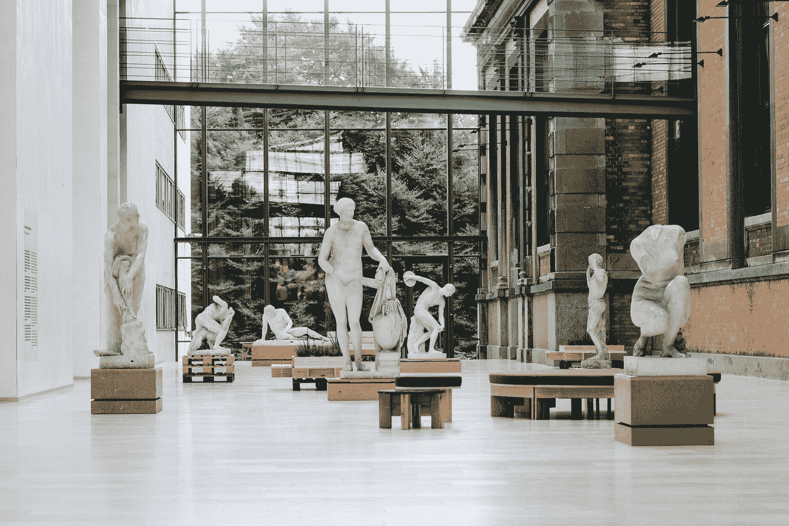
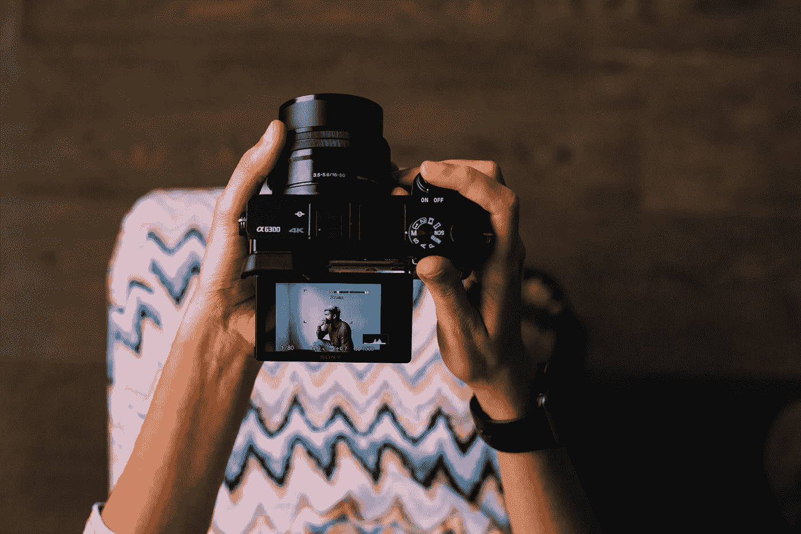
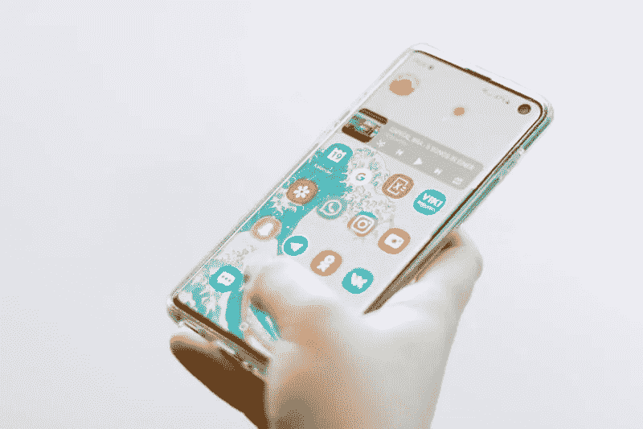

# 新文化时代

> 原文：<https://towardsdatascience.com/a-new-culture-time-f555fcd351aa?source=collection_archive---------78----------------------->

## 如何在疫情之后继续在线运营

乔纳斯·史密斯在 [Unsplash](https://unsplash.com?utm_source=medium&utm_medium=referral) 上拍摄的照片

一个新的文化时间音频版本

人们对文化活动有了一种新的时间观念，这种观念矛盾地源于新冠肺炎疫情带来的限制。这种对时间的新理解的关键是数字内容。随着限制慢慢但小心翼翼地放松，一种新的规范开始形成尽管是短期的，我们非常清楚新冠肺炎对集体思维的影响就在那里。同样基于新兴趋势的最新迹象表明，封闭和受限的空间可能是最后一个吸引观众的空间，因为公园和开放空间与我们在过去几周和几个月养成的健康意识更加同步。在这种情况下，数字和社会媒体已经成为一个重要的工具…几乎一夜之间！

继续前进类似于声明演出必须继续。当我们寻求与我们的新常态接触时，这些是帮助你调整风帆的一些想法和主意。在这篇文章中，我们重点关注可以用来缓解我们目前面临的一些挑战的数字工具。

# **1。我们谁也没想到会这样！**

在过去的几十年里，媒体让我们接触到了全球性的灾难，但大多数灾难都发生在电视屏幕的另一端。现在的疫情不同了。它像晴天霹雳一样击中了我们，而且就发生在我们的后院。没有任何文化机构或创意对此有所准备——你不是唯一一个在这个时候感到失落的人。保持相关性并利用可用的渠道做到这一点至关重要。

盘点手头的数字和非数字内容非常重要。你感觉到的反映了你的工作，你是谁，你作为一个组织或创意者在做什么。社交媒体可能会成为你新的最好的朋友，因为它是最有效的分销渠道之一。但不管你选择哪种渠道，最重要的是做你自己。

其中一个受到高度赞扬的在线营销和推广活动来自一个小博物馆——美国奥克兰的国家牛仔和西部遗产博物馆。博物馆要求其安全负责人(对社交媒体知之甚少)交流和分享经验。他不断请求他的听众帮助他，并参与听众感兴趣的谈话和演讲。所以不要害怕寻求帮助。联系你的支持者，让他们关注你的内容。

由[普拉桑娜·库马尔](https://unsplash.com/@prasannasnap?utm_source=unsplash&utm_medium=referral&utm_content=creditCopyText)在 [Unsplash](https://unsplash.com/@prasannasnap?utm_source=unsplash&utm_medium=referral&utm_content=creditCopyText) 上拍摄的照片

# **2。通过社交媒体参与和交流**

这就是创造力发挥作用的地方。创造力是没有限制和界限的，尽管很大程度上取决于受众和媒介。作为开始，考虑你的专长和知识作为出发点。有些知识只有你自己掌握，可以让你的内容脱颖而出——你独特的卖点。

先说现代手机。这使得用户可以拍摄比平时更宽的全景照片。实际上，你可以在一张图片中填满整个房间的四面墙。这些照片可以展示分散在房间各处的许多细节，非常适合展示周围环境，并邀请人们寻找类似于“发现隐藏物品”游戏的细节。视频也可以在网上分享，其影响范围比照片要广得多。为您的数字内容选择合适的平台需要一些思考，这在很大程度上取决于您所追求的受众。

社交平台迎合不同的受众。这些受众有他们自己的期望，这反过来会影响你的活动的成功(或失败)。因此，让我们引导您了解不同的平台，从您可能最熟悉的平台开始。

[**脸书**](https://www.facebook.com) 是全球最大的社交媒体平台，拥有超过 10 亿用户账户。它允许你创建你自己的网页，在那里你可以推广你的产品。最成功的帖子似乎是视频和现场表演，其中包括操作指南、总结和演讲。第二个最成功的是策划职位。这可能包括您创建的内容或您从其他网站上重新分享的内容，这些网站的观众有着相似的品味。一份成功的《脸书邮报》必须用简单明了的文字在视觉上引人注目。它还必须包括一个行动号召，比如要求人们点击一个链接(也许是访问你的网站)或者订阅一个邮件列表。最后，人们喜欢免费赠品，所以考虑给他们一些回报。它可能是一个免费文档的下载链接，可能是购买你的产品的折扣，或者只是你下一个大项目的预告片。文章应该少于 160 个字符，还将包括一些标签。标签只是一个以#开头的单词，这样更容易在网上找到文章。如果有疑问，像 best-hashtags.com[这样的网站会帮你找出你的帖子最受欢迎的标签。](http://best-hashtags.com/)

> 我们选择的脸书最佳实践— [梵高博物馆](https://www.facebook.com/VanGoghMuseum/)

Youtube 是互联网上最大的视频库，也是第二大搜索引擎。这意味着当人们需要寻找某样东西时，他们倾向于参考 YouTube。除了存储视频，像 YouTube 这样的平台还允许一些令人兴奋的变化。一个视频还可以链接到其他视频，因此在一个位置的漫游可能会让您选择进入不同的房间。互动视频可以充当跨越不同地点的“寻宝游戏”。对于更喜欢冒险的人来说，视频可以作为一个你自己选择的冒险故事，演员表演一个场景，最后，用户必须做出决定。事实上，进入门槛很低，因为你只需要一部手机，其中许多手机可以拍摄非常高分辨率的视频。

> 我们选择的 Youtube 最佳实践— [洛杉矶国家艺术博物馆](https://www.youtube.com/channel/UCBrtMtJE5tqHLpCCqoPw-lg)

[**Instagram**](https://www.instagram.com) 是另一个非常注重审美的流行社交网络。这是一个理想的平台，你可以在这里发布你的作品或产品的高分辨率图像、幕后信息以及用户生成的内容(需要得到相关所有者的许可)。Instagram 上的热门内容包括励志名言。理想情况下，寻找支持你使命的最佳引语，并使用合适的图片来突出你的文章。在 [Unsplash](https://unsplash.com) 、 [Pexels](https://www.pexels.com) 和 [Pixabay](https://pixabay.com) 等平台上都有质量好的图片，其中很多都是免费使用的。像 [Canva](https://www.canva.com) 这样的在线应用也可以让你免费进行专业编辑。Instagram 中另一个有趣的功能是故事。这些帖子的生命周期为 24 小时。它们可以有效地用于讲故事，推广博客文章，宣布限时优惠，提供赠品，分享数据，发送更新…实际上可能性的列表是无穷无尽的！

> 我们选择的 Instagram 最佳实践— [大都会艺术博物馆](https://www.instagram.com/metmuseum/?hl=en)

[**Twitter**](https://twitter.com/) 帖子也值得关注，尽管这更小众。然而，这是一个很好的工具，从哪里可以获得你的最新消息。事实上，几乎 80%的 Twitter 用户声称他们的最新更新是从该平台获得的。与脸书非常相似，Twitter 允许用户分享他们的帖子，但每条帖子有 280 个字符的严格限制。正因为如此，它比其他任何平台都更适合每天分享零碎的博客文章。它还支持链接到其他网站和媒体，包括图像，照片，视频或 gif。视频也有 140 秒的限制。顺便提一下，gif 代表图形交换格式，但它们只是可以使用程序制作动画的图像，例如 [Canva](https://www.canva.com) 、 [Ezgif](https://ezgif.com) 或 [Giphy](https://giphy.com) 等等。

> 我们选择的 Twitter 最佳实践— [大英博物馆](https://twitter.com/britishmuseum?lang=en)

LinkedIn 更像是一个专业的网络平台，更适合展示组织文化、经验和成就。带有图片的帖子通常比文本帖子的参与度高 98%。LinkedIn 的用户似乎也喜欢网络研讨会、咨询文件和研究。

> 我们选择的 LinkedIn 最佳实践— [应用艺术与科学博物馆](https://www.linkedin.com/company/museum-of-applied-arts-and-sciences/?originalSubdomain=mt)

[**Pinterest**](https://www.pinterest.com) 是另一个与 Instagram 非常相似的可视化社交平台。它非常适合垂直图像和信息图(快速清晰地呈现信息的可视化表示)。它们可以很容易地用免费程序创建，如 Picktochart 或 Venngage。Pinterest 也更适合那些自己动手的帖子、食物和设计。

> 我们选择的 Pinterest 最佳实践— [现代艺术博物馆](https://www.pinterest.com/momadesignstore/)

抖音相对来说是一个新人，但却是一个非常受欢迎的社交网络(比 Instagram 更大)，更重要的是拥有年轻得多的受众。事实上，超过 40%的用户年龄小于 25 岁。这是一个短循环视频(15 到 60 秒之间)的平台，允许用户编辑视频，添加音乐，插入滤镜和各种视觉内容。帖子有一种典型的轻松感，这使它成为诙谐笑话、有趣事实和其他轻松对话的理想选择。抖音也非常适合通过竞赛让年轻人参与进来，让他们创造有趣的内容。

> 我们选择的抖音最佳实践— [自然历史博物馆](https://www.tiktok.com/@carnegiemnh/video/6782977615532788998?referer_url=https%3A%2F%2Fwww.museumnext.com%2Farticle%2Fnatural-history-museum-reaches-millions-with-tiktok%2F&referer_video_id=6782977615532788998)

[**缩放**](https://zoom.us) **，** [**Skype**](https://skype.com) **，**[**Messenger**](https://www.messenger.com)**和** [**微软团队**](https://www.microsoft.com/en/microsoft-365/microsoft-teams/group-chat-software) 都不是社交网络平台。这些主要用作视频会议平台，是专家会谈或讨论的理想选择，因此，理论上，它们仍然是可以考虑的工具。其中大多数几乎自动保存活动视频，用户可以反复播放。这些系统也是参与者较少的更亲密环境的理想选择，因此可以与主扬声器进行更好的互动。然而，他们也可以扩大规模，其中一些计划提供最多 100 人参加的免费视频会议。

正如一个人所能收集到的，机会就在那里。可供选择的平台不止一个。对于你的需求和目的，有些可能比其他的更好。其他人更少，尽管这很大程度上取决于你的信息和环境。不用说，你试验得越多，你就越能更好地理解什么对你最有效。

照片由[威廉·艾文](https://unsplash.com/@firmbee?utm_source=unsplash&utm_medium=referral&utm_content=creditCopyText)在 [Unsplash](https://unsplash.com/s/photos/design-marker-desk?utm_source=unsplash&utm_medium=referral&utm_content=creditCopyText) 上拍摄

# **3。利用数字优先方法**

数字优先是一种传播理论，它认为出版商应该首先将内容发布到新的媒体渠道，而不是直接印刷。鉴于我们已经变得更加习惯于通过手机、平板电脑和其他小工具获取信息，这种看法源于连通性的增加。因此，在线内容消费有所增加。正因为如此，博物馆或文化体验的第一步最有可能，而且在未来肯定会更是如此，数字优先。第一个接触点，与体验的第一个联系，应该越来越在线。除了传统的营销要求和实体展览或文化表演的界面，这也意味着许多额外的东西。也有好的例子可以效仿。博物馆和剧院也经常探索以学习体验为特色的合作创意项目。

数字优先的方法可以帮助你保持相关性，但它也可以帮助你在事情回归新常态时提前宣传你的工作。事实上，这可能是在网上推广你的作品或预测你在不久的将来可能提供的产品或服务的好时机。不要因为目前的情况看不到明确的结果而感到沮丧。

克里斯蒂安·威迪格在 [Unsplash](https://unsplash.com/s/photos/phone-in-hand-apps?utm_source=unsplash&utm_medium=referral&utm_content=creditCopyText) 上拍摄的照片

# **4。体验赚钱**

这可能是迄今为止最大的挑战，尤其是考虑到网上有太多的内容，可能太多了。有各种方法可以做到这一点。首先，一些在线活动可以是基于捐赠的，人们可以免费参加，但被礼貌地要求捐赠，即使这只是他们选择的象征性捐赠。如果你设法为你的工作或服务协商一笔费用，那么你可以很容易地与网上资金转移设施合作，作为回报，你可以将链接发送到活动。像 Paypal 或 Revolut 这样的应用程序使得在线汇款和收款变得非常容易。你也可以通过分发内容(比如 YouTube 上的视频)来赚钱，但要想成功，你的受欢迎程度需要相对较高。

一些平台通过换位思考来解决服务付费问题。有些人要求捐赠，同时也让用户根据其当前的财务状况来支付。同理心是处理这种情况的最佳工具，这是与你未来的公众和观众建立信任的黄金机会。

由[耶稣·基特克](https://unsplash.com/@jesuskiteque?utm_source=unsplash&utm_medium=referral&utm_content=creditCopyText)在 [Unsplash](https://unsplash.com/s/photos/laptop-glasses-mouse?utm_source=unsplash&utm_medium=referral&utm_content=creditCopyText) 上拍摄的照片

# **5。现在是时候了！**

社交媒体的快速发展已经伴随我们多年了，它对我们的生活产生了决定性的影响。我们可能很少注意到这一点，也许是因为我们更多地被日常琐事所占据，这让我们无法在这个未知的领域进行更多的冒险。但现在是时候了！这并不像你第一印象中想象的那么复杂。所讨论的平台相对容易使用，正如俗话所说，熟能生巧！当我们走出困境时，这个疫情将有希望成为过去，你会给你的文化活动一个新的生命。

*文章由* [*阿列克谢丁力*](https://medium.com/u/bf0896f581c2?source=post_page-----f555fcd351aa--------------------------------) *和* [*桑德罗德邦*](https://medium.com/u/750fffac4ab2?source=post_page-----f555fcd351aa--------------------------------) *撰写。它最初发表在 https://www.businesstoday.com.mt**上*

* [## 重塑办公室之外的工作场所

### 如何在家中舒适地高效工作

towardsdatascience.com](/reinventing-the-workplace-beyond-the-office-3a41c42b426c)  [## 空荡荡的博物馆

### 以及大流行后的博物馆景观

medium.com](https://medium.com/the-neo-humanist-museum/the-empty-museum-8ed23c1431d1) 

[**阿列克谢·丁力教授**](http://www.dingli.org/) 是马耳他[大学](https://www.um.edu.mt/)的 AI 教授。二十多年来，他一直在人工智能领域进行研究和工作，协助不同的公司实施人工智能解决方案。他的工作被国际专家评为世界级，并赢得了几个当地和国际奖项(如欧洲航天局、世界知识产权组织和联合国等)。他出版了几本同行评审的出版物，并且是马耳他[的一部分。由马耳他政府成立的人工智能工作组，旨在使马耳他成为世界上人工智能水平最高的国家之一。](https://malta.ai/)

[**桑德罗·德博诺**](https://medium.com/@sandrodebono) (生于 1970 年)是一位博物馆思想家和文化战略家。他是 muża——马尔他国家社区艺术博物馆——的幕后策划者，他是该博物馆的先锋，并为其开发了最初的指导性愿景。他是马耳他共和国总统的文化顾问，欧洲博物馆学会的国家代表，也是博物馆创新者和变革者国际平台 We Are Museums 的顾问委员会成员。他还是马耳他大学艺术、开放社区和成人教育系以及其他系的客座讲师。他经常受邀在欧洲各大学和博物馆、国际会议和活动中演讲。*