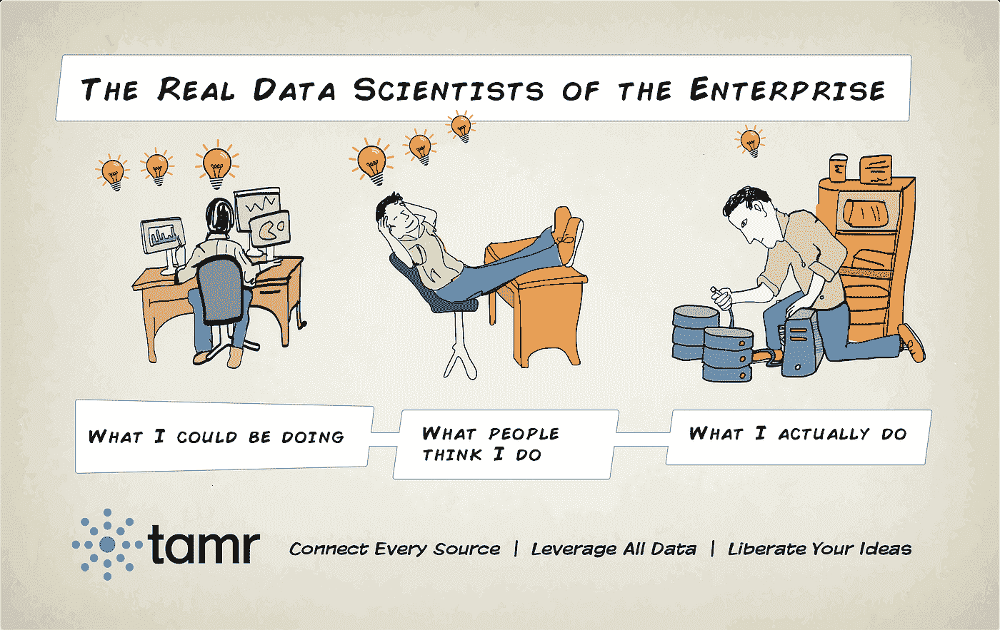
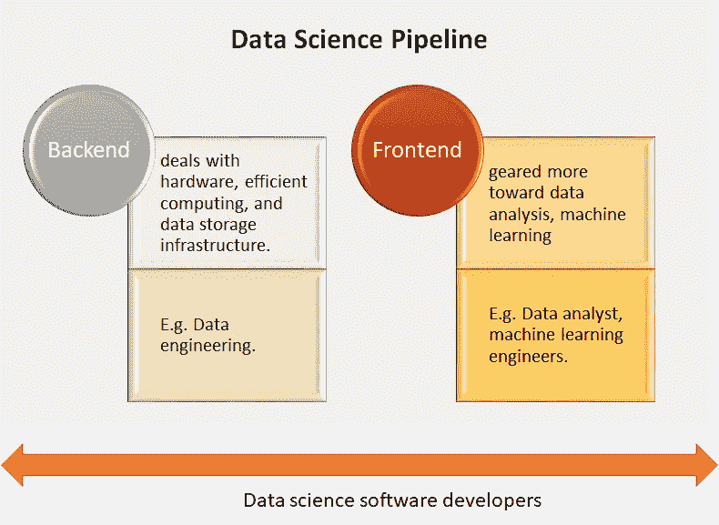
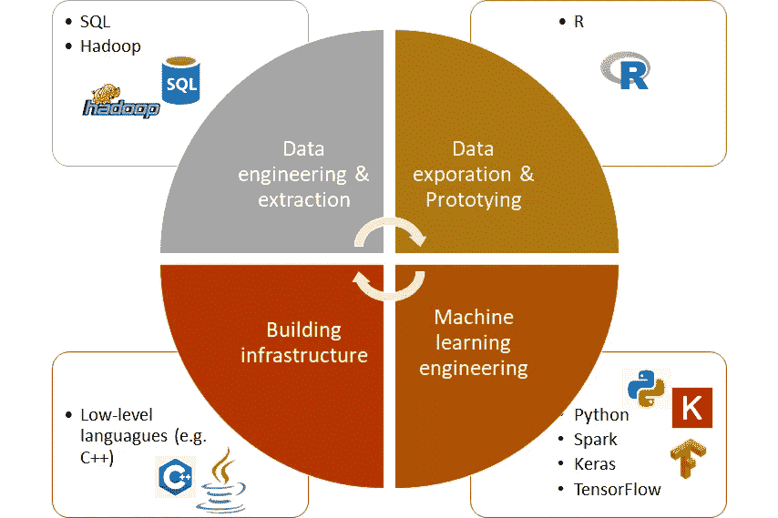

# 学术项目中数据科学的新定义

> 原文：<https://towardsdatascience.com/a-new-definition-of-data-science-in-academic-programs-2d48ad6db8b7?source=collection_archive---------9----------------------->

## 是时候更具体地了解数据科学需要什么了。

D 过去几年的 ata science 已经被用来指代几乎所有与数据相关的事物(数据分析、数据挖掘、机器学习等。).越来越多的人寻求数据科学教育，越来越多的大学和在线平台争相开发这样的课程。然而，数据科学和数据科学家的定义缺乏清晰度显然伤害了每个人，无论他们听起来多么时髦。每个人都把自己想要的投射到角色上:

*申请人*:“我对在海量数据集上进行机器学习感兴趣。所以我在申请一份数据科学家的工作！”

*业务*:“我需要一个能从这些 Excel 工作簿中构建一个不错的管理仪表板的人，所以我会雇佣一名数据科学家！”

因此，申请数据科学家工作的人不高兴，因为他们最终做的是数据提取和仪表板，而不是任何机器学习。与此同时，企业意识到，除了拥有一些优秀的数据分析师，他们并没有获得更多的价值。我个人非常不愿意称自己为数据科学家，尽管我用数据做了很多“事情”。

数据科学家是做什么的？[来源](https://www.quora.com/What-are-the-downsides-of-being-a-data-scientist)。

# 那么应该如何定义数据科学呢？

几周前发表的一篇麻省理工学院的文章提出了数据科学的新定义和数据科学项目的设计。他们认为数据科学不是一个单一的学科。更确切地说，这是一个**总括** ( **通用)术语** **，描述了一个拥有非重叠技能的数据科学家团队中的复杂流程**。考虑到当今从数据中提取价值所涉及的广泛活动和多个步骤，假设一个数据科学家拥有所有必要的专业知识是不合理的。

更清晰地了解数据科学需要什么不仅有助于学术项目更好地设计课程，也有助于学习者和企业更好地理解这些项目到底需要什么和期望什么。

# 后端和前端数据科学

这篇文章认为，后端和前端数据科学之间需要明确的区别。我把他们的想法总结如下:

后端和前端数据科学(作者基于麻省理工学院[文章](https://hdsr.mitpress.mit.edu/pub/gg6swfqh)举例说明)。

数据科学管道中涉及的主要角色有:

*   **数据工程师**负责处理硬件、高效计算和数据存储基础设施。
*   **数据分析师**，他们争论、探索、质量评估、使模型符合数据、执行统计推断以及开发原型。
*   **机器学习工程师**，他们构建和评估预测算法，并为许多用户提供可扩展和健壮的解决方案。
*   **数据科学软件开发人员**他们不直接参与数据科学管道的生产，而是开发促进数据科学的软件工具。例如 Hadoop、R、RStudio、IPython 笔记本、TensorFlow、D3、pandas 和 tidyverse 等的开发者。

这些角色中的每一个都需要非常不同的专业知识，在数据科学学术项目中应该有完全不同的方向。

我还认为，在现实中，有更多可能的数据科学角色。比如一个*数据科学翻译员/通信员(？)*谁拥有沟通管理团队和数据科学团队的技能。他/她可以通过可视化或演示，熟练地向外行人解释复杂的数据科学概念。许多数据科学项目被推迟或得不到资助，因为管理层没有完全理解背后的想法。另一个角色可能是某人(*数据科学业务开发人员*？)拥有丰富的领域专业知识，同时对数据科学概念有很深的了解。他善于将点点滴滴联系起来，发现可能给企业带来好处的有价值的数据科学机会。

# 数据科学教育需要什么

通过上面的概述，您可以看到数据科学实际上非常广泛，而机器学习和建模只是拼图中相当小的一部分。这意味着学术界需要更好地定义他们的课程提供什么，学习者需要更好地定义他们的目标，企业需要更好地了解他们在寻找什么。

文章建议学术界通过以下方式为学习者提供更好的准备:

*   *三个不同的方向:*提供对应于数据科学不同方面的具体方向:数据工程师、数据分析师、机器学习工程师、数据科学软件开发人员等。
*   *突出应用:*强调现实世界应用的必要性和问题的主题。课程需要联系实际实施。
*   *实际经验:*对于那些有兴趣成为数据科学软件开发人员的人来说，开发软件包的顶点项目课程是他们在项目中寻找的。此外，学习者能够生成可靠且可重复的代码也非常重要，因为数据科学管道或应用程序需要为许多用户工作。这是一个经常被学术界忽视的培训方面。
*   *实用编程技能:*针对特定角色和任务的适当语言的强大编程培训:

作者基于[麻省理工学院文章](https://hdsr.mitpress.mit.edu/pub/gg6swfqh)的插图。

*   *关注研究生水平的项目:*数据科学学位建议针对硕士或博士水平，而不是本科水平。

**如果你是一名正在寻找数据科学教育的学习者**，问自己以下问题非常重要:

*   你希望自己扮演什么样的角色？
*   你需要获得哪些相关技能？
*   一旦你有了这些问题的答案，看看课程，看看它是否符合你的需求和期望。

**如果你正在为一家企业**招聘员工，务必小心使用数据科学家术语，并在工作描述中尽可能具体。从长远来看，每个人都能从中受益。

感谢您的阅读。享受学习！