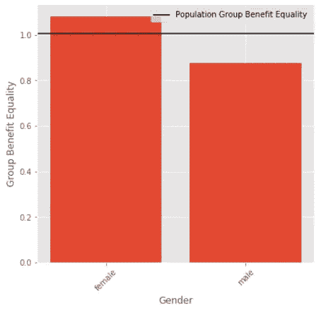
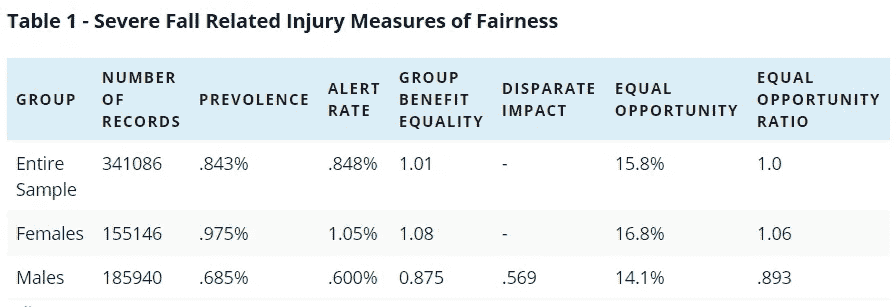
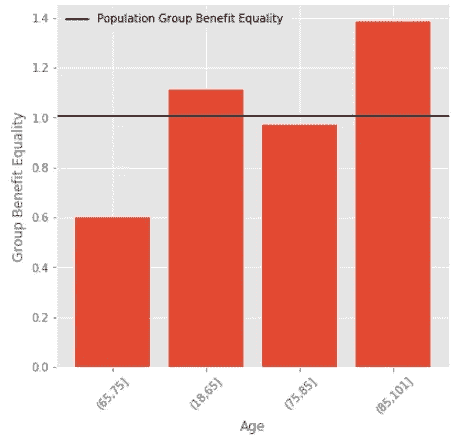
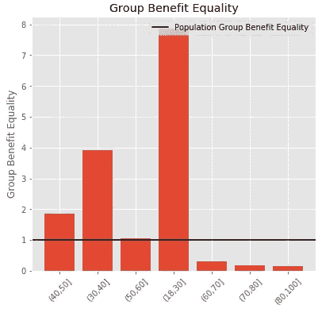
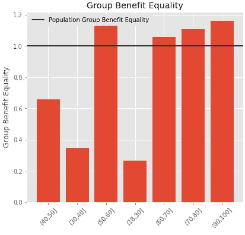
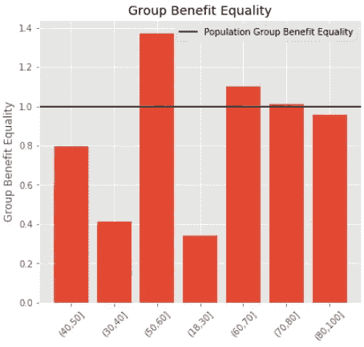

# 量化医疗保健中机器学习公平性的新指标——closed loop . ai

> 原文：<https://towardsdatascience.com/a-new-metric-for-quantifying-machine-learning-fairness-in-healthcare-closedloop-ai-fc07b9c83487?source=collection_archive---------51----------------------->

最近几起备受瞩目的不公平人工智能算法案件凸显了在任何人工智能系统开发的早期解决偏见的重要性。在大多数情况下，算法中不会出现偏见，这是因为创建算法的个人怀有恶意。偏见来自于在确保人工智能系统对每个人都公平方面缺乏勤奋。为了消除偏见，必须以与问题背景相关的方式来衡量。在医疗保健行业，偏差检测的“黄金标准”并不合适。正因为如此，ClosedLoop 开发了一种新的衡量医疗保健偏差的指标。

最近，有大量的努力来衡量和打击算法偏差。在他们 2018 年的论文[1]中，维尔马和鲁宾提出了一系列丰富的公平指标，并定义了所有公平指标使用的基本统计指标。这些指标各有优缺点，部署算法的环境决定了哪些指标是合适的。通常，实现公平的方法是基于*不同影响*【2】【3】的法律标准。当对不同群体的预测结果不同时，就会产生不同的影响。使用这一指标的例子有累犯[4]、雇佣[5][6]和贷款申请[2]。这个标准指标只考虑了一个因素:算法预测一个人应该从特定分类中受益的比率。

在医疗保健的背景下，不同影响的标准是完全不合适的。上述例子有一个共同的特点；该算法所适用的每一个人都将从正面标签中受益。如果人们不在乎结果，他们不会申请假释、工作或贷款。在医疗保健领域，尤其是人口健康领域，预测被用来分配资源，但是不同的群体受益不同。只有那些将遭受特定结果的个体从模型的干预中受益。在大多数情况下，特定结果的发生率在性别、种族和社会经济分组之间有显著差异。明显的例子是乳腺癌，不到 1%的病例发生在男性[7]，或镰状细胞病不成比例地影响美国黑人[8]。不太明显的情况是跌倒伤害，女性发病率较高[9]，或自杀率，性别和种族差异较大[10]。对于许多其他疾病，会出现更细微的差异，但差异仍然具有统计学意义。公平的常识概念当然不会期望偶数的男性和女性被确定为具有乳腺癌高风险，但这正是基于*不同* *影响*的指标所优化的。因此，ClosedLoop 开发了一种专门适用于医疗保健的新的公平量化指标。

# 群体利益平等

我们提出了一种新的衡量公平的方法，称为“群体利益平等”。群体利益平等旨在衡量特定事件在子群体中的预测发生率与其实际发生率的比较。假设有一个带有预测标签*y’*和真实结果 *y* 的预测器。一个群体受益于该算法，因为在他们有一个肯定的预测(*y’*= 1)的情况下，提供者给予这些个体关注。在以下情况下，预测者被认为具有完美的群体利益均等性:

P(*y '*= 1 | C =*C*)= P(*y*= 1 | C =*C*)对于 C 中的所有 *c*

这里， *c* 是分区变量 C 的一个子组，C 可以是应该被检查保护的任何分区，包括种族、性别、年龄、医疗补助状态(收入的一个代理)和残疾状态。群体利益平等可以转化为比率 P(*y '*= 1 | C =*C*)/P(*y*= 1 | C =*C*)。在标准的准确性测量方面，组利益均等是(tp + fp)/(tp+fn)，其中 tp 是真阳性的数量，fp 是假阳性的数量，fn 是假阴性的数量。如果该比率波动较低，这意味着该亚组被标记为以低于该亚组内事件发生率的速率进行干预。如果这个数字足够低于 1.0，这意味着该模型有可能通过拒绝向他们提供资源来损害这些子群体。因此，应该采取措施减少这种偏向，或者在分配资源时考虑到这种偏向。如果该比率波动较大，这意味着资源以高于该组需求的速度分配给该组。只要不引起另一组的第一种波动，这种波动是可以接受的。使用 0.8 的阈值将一个群体标记为潜在偏见，这来自不同影响的法律标准。

图 1——预测医疗保险受益人严重跌倒相关伤害的模型的群体利益平等，按性别划分。

为了了解如何使用这一指标，我们评估了其在一个模型中的应用，该模型用于预测未来 30 天内医疗保险患者的严重跌倒相关损伤。图 1 描述了一个预测严重跌倒相关伤害的模型的群体受益均等性。据观察，2010 年医疗保险记录样本的患病率为整个样本的 0.843%。如果我们按性别划分，我们观察到女性为. 975%,男性为. 686%。出于一致性的目的，选择一个阈值，使得整个样本的群体利益均等非常接近 1.0(在这种情况下，p>=.071 的决策阈值导致群体利益均等为 1.005)。该阈值意味着该模型将标记与观察到的伤害发生大致相同数量的处于危险中的个体。表 1 总结了这个阈值的性能和公平性。请注意，女性亚人群的患病率约为男性的 1.5 倍。可以看出，模型预测反映了这种不平等。不同影响的值是 0.569，远低于 0.8 的标准阈值；这意味着按照这个标准，这个模型对男性有偏见。相反，如果计算团体福利平等，则观察到 0.875 的分数。虽然在为这部分人口提供服务方面还有改进的空间，但人们不会认为这种模式对男性有偏见。

# 与现有指标的比较

群体利益平等类似于现有的“机会平等”措施。当两组的敏感度相同时(tp/(tp+fn))，机会均等。我们的度量在数学上的不同之处在于分子中存在假阳性项。如果存在这样一个相似的术语，为什么人们会选择使用不同的度量来报告公平性呢？群体利益平等的优势在于其透明度和易于解释。群体利益平等的一个巨大优势是有一个调整决策阈值的默认目标。即使大多数提供者选择在略高于事件流行率的报警率下运行，我们设定的阈值使人群的受益均等为 1.0。对于平等机会，没有规定这样的准则。没有机会均等的默认水平为实践者提供了改变他们的决策阈值的机会，以使他们的模型公平看起来更好。

群体利益平等也得益于对公平更直观的解释。此度量直接衡量针对某个组发出的警报及其发生率。虽然人们可以看到所有子群体的平等机会，但对于什么构成不可接受的偏见，并没有明确的界限。这类似于皮尔逊相关或回归中误差平方和的差值。虽然两者都量化了模型的性能，但前者更容易理解和解释；不出所料，这是大多数人用来描述回归模型的指标。为了实现这种效果，许多公平性度量被表示为受保护子组与基本子组的商[2]。由于医疗保健的目标是向那些需要干预的个人提供干预，选择参考亚组意味着模型将使公平性评估对基础类别的警报率过低的情况视而不见。在大多数情况下，男性是性别的基本类别，因此使用这种方法，公平性评估将完全无视该亚群体的潜在缺点。

图 2——根据年龄划分，预测医疗保险接受者严重跌倒相关伤害的模型的群体受益均等性。

这个模型的最后一个优点是警报的内在经济观点。图 1 描述了数据集中几个年龄组的群体福利平等。查看该图，可以发现 65-74 岁人群的得分很低。该模型建立在医疗保险账单数据的基础上，因此该群组实际上代表了数据中最大的群体。从分布来看，这个亚组中较低的预测率是由 18-64 岁和 85-100 岁组中较高的预测率直接造成的。由于这一模型来自医疗保险数据，18-64 岁范围内的个体通常因严重的医疗并发症而残疾。另一组，85-100 岁，是最老的，也是最容易受到这类伤害的人群。通过这种方式，对预测高风险人群有偏见的解释使得在我们大部分人口中较低的预测更容易理解。

# 个案研究

为了抗击新冠肺炎，ClosedLoop 建立了一个开源工具，用于量化由于新冠肺炎感染导致的严重并发症的脆弱性，称为 [CV19 指数](/open-source-data-science-to-fight-covid-19-corona-virus-95bf4ebcb52c)。众所周知，新冠肺炎老年人的死亡率很高。ClosedLoop 构建了 CV19 索引的多个实例。一个模型针对医疗保险人群，一个针对医疗补助人群。这两个群体有非常不同的动态，因此跨年龄线看公平是这一措施的自然分解。该模型的第一个实例是在医疗保险人口的 5%样本上训练的。图 3 显示了该人群的群体利益平等。有趣的是，在混合人群中 3%的警戒率下，这个模型低估了年轻人群。要理解这一点，重要的是要记住医疗保险主要是 65 岁以上的个人。医疗保险确实允许这个年龄以下的人被纳入，但是这些人有严重的健康状况。结果是，当这个模型应用于一般人群时，它高估了年轻人的健康脆弱性。

图 3——基于医疗保险数据的新冠肺炎模型的群体福利平等。

类似地，我们可以检验根据一般人群的医疗补助数据训练的模型的性能，如图 4 所示。有趣的是，完全相反的组在较低水平被触发。恰恰相反的动态在起作用。65 岁以上的人通常享受医疗保险，而不是医疗补助。然而，一些有严重医疗需求的个人有双重资格。结果很明显，这是为什么将模型应用于相同人群非常重要的例证。

图 4——根据医疗补助数据训练的模型在一般人群中测量的新冠肺炎模型的群体利益平等。

为了有一个在一般人群中执行的模型，我们创建了一个混合模型，如图 5 所示。一旦一个人年满 65 岁，就从医疗补助模式转换到医疗保险模式，并按比例调整医疗补助预测，从而混合了这些模式。在这里，我们观察到大多数年龄组的总体良好表现。对于最年轻的人群来说，这是相当直观的。大多数年轻人不会有严重的新冠肺炎并发症，即使有，数据也支持这种不可预测的观点。随着更多关于经历这种并发症的年轻个体的信息出现，将这些信息纳入这些模型是高度优先的。

图 5——根据来自医疗保险和医疗补助数据的整体模型，在普通人群中测量的群体福利平等。

# 结论

没有一个单一的指标是对抗算法偏差的灵丹妙药。从业者应该计算几个偏差指标，如群体利益平等和机会平等，并批判性地思考可能观察到的任何差异的影响。也就是说，拥有一个易于解释的单一指标是有帮助的，它受益于一个透明的过程，并且当一个模型存在潜在偏差时，它具有定义良好的目标值和阈值。群体利益平等唯一满足所有这些要求，是医疗保健中量化算法公平性的最佳指标。

# 参考

[1]维尔马，萨赫勒和朱莉娅鲁宾。"解释了公平的定义。" *2018 IEEE/ACM 软件公平性国际研讨会(FairWare)* 。IEEE，2018。

[2] IBM 云。“公平指标概述”。【https://cloud.ibm.com/docs/ai-openscale? topic = ai-open scale-anlz _ metrics _ fairness

[3]费尔德曼，迈克尔等人，“证明和消除完全不同的影响。”*第 21 届 ACM SIGKDD 知识发现和数据挖掘国际会议论文集*。2015.

[4]亚历山德拉·乔尔德乔娃。"具有不同影响的公平预测:对累犯预测工具偏差的研究."*大数据*5.2(2017):153–163。

[5]杰弗瑞·达斯廷。“亚马逊废弃了对女性有偏见的秘密人工智能招聘工具”。[https://www . Reuters . com/article/us-Amazon-com-jobs-automation-insight/Amazon-scraps-secret-ai-recruiting-tool-that-show-bias-against-women-iduskcn 1 MK 08g](https://www.reuters.com/article/us-amazon-com-jobs-automation-insight/amazon-scraps-secret-ai-recruiting-tool-that-showed-bias-against-women-idUSKCN1MK08G)

[6] Ajunwa，Ifeoma 等人，“通过算法招聘:预测和防止完全不同的影响”*在 SSRN* (2016)上市。

[7] Anderson，William F .等人，“男性乳腺癌:与女性乳腺癌的基于人群的比较。”*临床肿瘤学杂志* 28.2 (2010): 232。

[8]疾病控制和预防中心。“镰状细胞病的数据和统计”。【https://www.cdc.gov/ncbddd/sicklecell/data.html 

[9]史蒂文斯、朱迪·a 和埃伦·d·索戈洛。“老年人非致命意外跌落相关伤害的性别差异。”*伤害预防*11.2(2005):115–119。

[10]莎莉·柯廷和玛格丽特·华纳。"按种族和族裔分列的女性和男性自杀率:美国，1999 年和 2014 年"。国家健康统计中心。[https://www . CDC . gov/nchs/data/hestat/suitary/rates _ 1999 _ 2014 . htm](https://www.cdc.gov/nchs/data/hestat/suicide/rates_1999_2014.htm)

*原载于 2020 年 3 月 2 日*[*https://closed loop . ai*](https://closedloop.ai/a-new-metric-for-quantifying-fairness-in-healthcare/)*。*