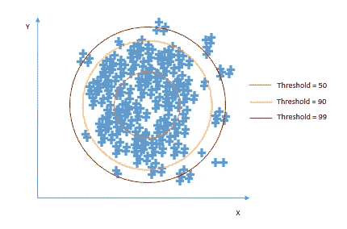
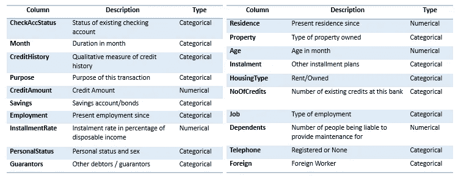
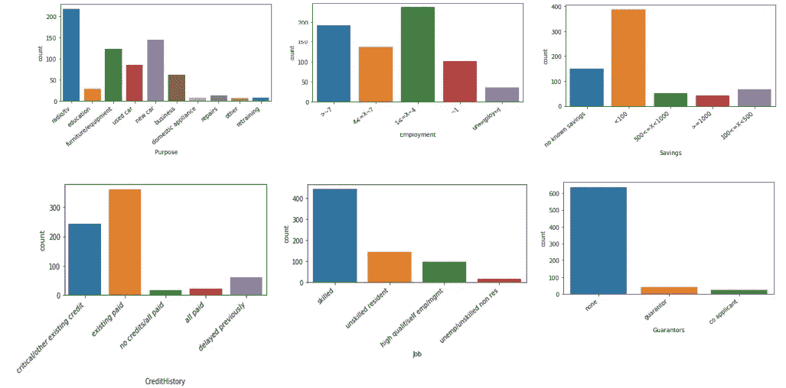
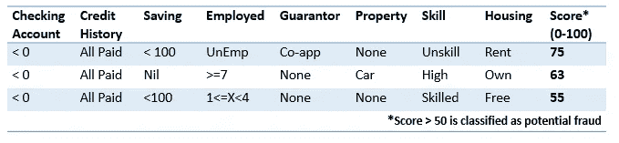
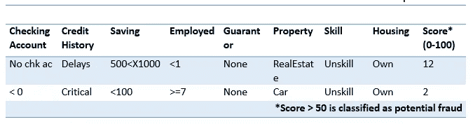

# 一个新的 Python 包:如何检测异常？

> 原文：<https://towardsdatascience.com/a-new-python-package-how-to-detect-an-anomaly-fcff730778a3?source=collection_archive---------18----------------------->


[来源](https://unsplash.com/photos/iYRVoRTEp-o)

## 背景

每次我从新设备或新位置登录 Gmail 收件箱时，它都会发出一个标记，警告我可能存在未经授权的访问。每当我收到这样的通知，我就会想，为什么每次我去一个新的地方，谷歌都要发送这样的通知。想象一下，如果我的工作需要我经常出差到一个新的地方，我的收件箱就会充满这些安全警报——用数据科学的说法就是误报。

## 假阳性的问题

这些误报是所有数据科学项目中的常见问题，是一种潜在风险，尤其是对于异常检测用例。在这种情况下，大量的误报会导致解决方案不可用。问题变得更加复杂，因为一般来说，这些数据集没有大量的真阳性可以用来训练机器。

一个很好的例子是银行欺诈检测系统，在大多数情况下，在数百万次批准的交易中，实际欺诈交易不到 1%。此外，如果您遇到这些交易的特征，大多数都是分类特征，唯一真正的数字特征是付款或交易金额。

基于规则的欺诈检测系统主要依靠“交易金额”功能来检测异常交易。这就是为什么你每次高价购买时都会接到银行的电话。然而，这些高价值的购买在所有小额购买中并不常见，因为平均来说，人们每 2 到 3 年才会买一次 iPhone。

因此，仅仅根据交易金额来标记交易必然会导致大量的误报。实际上，这个基于规则的系统并没有试图标记真正的异常，而只是试图保护银行免受巨大的美元损失。

相反，数据中的分类特征具有有限数量的可能值，例如，您将向一组国家/地区付款，而一个新的国家/地区可能是异常的。同样，这可能是高假阳性的来源。就像我们之前的 Gmail 功能一样。

因此，需要一种基于客户行为的动态性而不是纯粹基于新值进行标记的算法来克服高阳性的问题。一个新的 Python 库就是解决方案: **CategoricalOutlier** 。

这里是 [Github](https://github.com/akashbaj03/Categoricaloutlier) 的代码链接。

**简介**

该软件包的目标是纯粹基于分类特征对异常值进行评分。该算法的训练要求您提供数据中所有分类特征的列表以及 0 到 100 之间的阈值。阈值非常重要，因为它决定了你愿意承担的风险。价值越高，风险越小。对于每个新的观察，预测是 0 到 1 之间的异常分数。



对二维模型的阈值意义的直观解释。对于 50 的阈值，最内圈之外的任何东西都将是异常的。对于 99 的阈值，最外圈之外的任何东西都将是异常的——图片由作者提供

理论讲得够多了，让我们来谈实质的东西吧。

出于演示目的，我将使用从[这里的](https://weka.8497.n7.nabble.com/file/n23121/credit_fruad.arff)获得的信用卡交易数据。我将提供数据集的概述，之后我们将在数据上训练我们的算法，并对测试支付进行预测。

**数据**

该数据是德国信用卡交易数据，具有以下特征及其相应的类型



数据集中的要素-按作者分类的影像

如您所见，20 个特征中有 15 个是绝对的，可以提供关于潜在欺诈付款的重要信息。

这个博客和软件包的范围仅限于预测异常的分类特征，因此，我将忽略数字特征。此外，目前大多数其他异常检测方法都集中在数字特征上。这是一种根据分类特征对观察结果进行评分的算法。

从数据集中，我接受了付款，这些付款被批准为真实的，由数据中的最后一列确定。这些付款将用于建立付款档案，新交易将根据该档案进行评分。该算法的一个主要优点是，它只需要批准的交易，而不依赖于历史欺诈交易来获得新的支付。它会自动消除冷启动问题。

## 形象化

在构建模型之前，让我们对分类特征进行一些可视化处理，并查看分布情况，以了解更多关于支付性质的信息。以下是一些重要的特征-



分类特征的分布—按作者分类的图像

一些观察-

信用记录——很少有付款的信用记录是“全部付清”

目的——支付目的通常是家用物品，如电视

就业——失业人数不多

担保人——有担保人是很少见的

## **训练模特**

下一步是对所有批准的交易训练一个模型。我选择的阈值是 95。使用从*类别输出者*库中导入的 *TrainOutlier* 类来执行训练。cat_cols 是数据帧中所有分类变量的列表。

```
cat_cols = [‘CheckAccStatus’, ‘CreditHistory’, ‘Purpose’, ‘Savings’, ‘Employment’, ‘PersonalStatus’, ‘Guarantors’, ‘Property’, Installment’, ‘HousingType’, ‘Job’, ‘Telephone’, ‘Foreign’]**from categoricaloutlier import TrainOutlier, PredictOutlier**trainedprofile = TrainOutlier(95,cat_cols)
trainedprofile.train(df_train)
```

为了简单起见，训练是在具有大约 700 个观察值的相对较小的数据集上进行的。对于用于训练的数据观察的最小数量没有限制，但是，观察越多，从观察构建轮廓就越好。

*trainedprofile* 对象是对所有已批准的付款进行训练的模型，该模型将用于对新付款进行评分。

## 对欺诈交易评分

现在我们已经有了训练好的模型，让我们使用这个模型对一个新的交易进行评分，看看它的表现如何。我从同一数据集中选择了 3 笔被归类为欺诈的付款，以检查模型预测的内容。这些支付不是训练数据集的一部分。



对实际欺诈付款的评分-按作者排序的图片

***交易 1*** —由具有良好信用记录并有担保人的人支付，这在训练数据中相当少见。因此，使用基于规则的系统很难将此标记为欺诈交易。然而，该模型很好地将其归类为风险交易，得分为 75 分。

***交易 2*** —该支付发起人在就业、技能、财产所有权方面有着良好的历史。但是，这个人没有存款，这对于一个信用记录很好的人来说是很少见的。这解释了该模型不仅仅基于一个特征进行预测，而是结合多个特征来得出风险分数。支付得到 63 分，这是潜在的欺诈。

***交易 3*** —另一笔付款，与第一笔类似，但是，个人有更好的技能和就业历史。然而，他住在免费的住处。该模型生成的分数为 55，接近阈值，表明该特征并不罕见。

这 3 个事务给出了模型性能的一个合理的概念。这里值得注意的一点是，该模型能够完全基于分类特征来标记交易。结合数值特征的集合技术肯定会进一步提高解决方案的性能。

## **得分误报**

我想测试的一件事是检查模型对最初被归类为误报的付款的性能。也就是说，被标记为潜在欺诈的交易结果却是真实的交易。不幸的是，数据集没有明确提供任何例子。

为了测试误报的性能，我挑选了几笔交易，由于它们的历史，这些交易会被标记为潜在的欺诈。我将在这里讨论两个这样的交易以及该模型生成的相应分数



误报评分-按作者排序的图片

***交易 1*** —付款由没有支票账户的个人进行，代表延迟偿还其先前的信用，并且没有技能。更有可能是潜在的欺诈交易；然而，该模型给它的评分很低，为 12。它提供了一个避免虚惊一场的好例子。

***交易 2*** —基于规则的引擎会标记此人执行的大多数交易，因为他的信用记录不佳。然而，该模型给出了一个 2 分的低分数，引用了他在住房、储蓄和就业方面的有力凭证。

## 结论

到目前为止，该模型给了我合理的结果，并对每笔交易进行了内在的解释。我想让你试试这个算法，告诉我这种方法是否有缺点。我很想纠正它。您可以直接从 PyPi 资源库下载，或者在 GitHub 中派生代码。