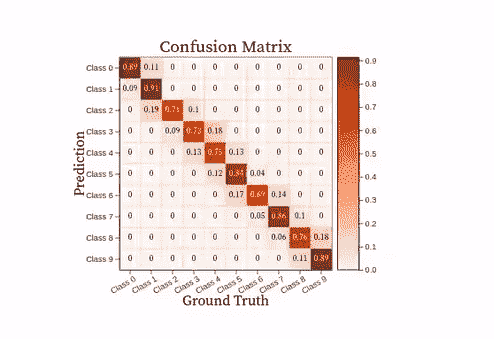
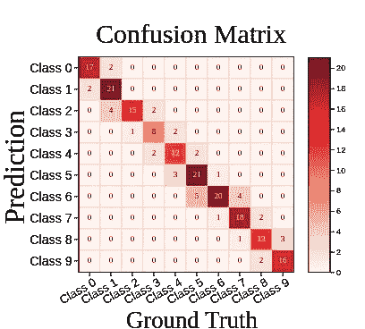
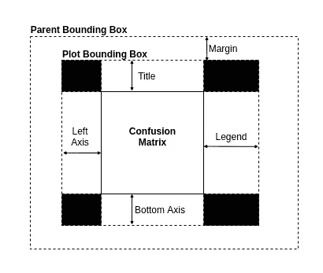
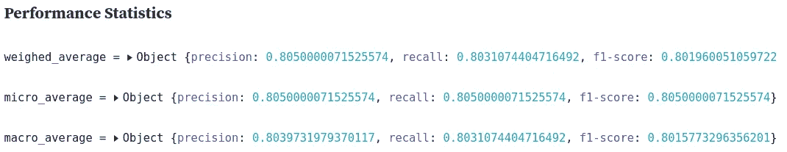
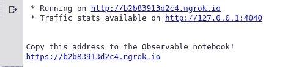

# 为您的下一个机器学习数据可视化项目提供新的技术堆栈

> 原文：<https://towardsdatascience.com/a-new-tech-stack-for-your-next-machine-learning-data-visualization-project-ea64e3de3241?source=collection_archive---------19----------------------->

作者 Gif

## Observable/D3.js 和 Google Colab/Python 技术栈— [设计交互式、可配置、动态数据可视化的案例](https://observablehq.com/@burrussmp/designing-a-customizable-confusion-matrix-in-d3)

数据可视化是交流结果和制定决策的最重要工具之一。没有它们，我们只能看原始数据，这显然不好玩。设计动态和交互式数据可视化的最有效和最流行的工具之一是 **D3** JavaScript 库。[虽然众所周知程序员在学习和使用 D3 的低级 API](https://medium.com/dailyjs/the-trouble-with-d3-4a84f7de011f) 方面有很多问题，但熟悉其复杂性的人会知道，它仍然是设计交互式和动态可视化最有效的工具。尽管如此，如果你曾经遇到过你的研究顾问或经理批评可视化的一个小方面，如颜色或缺少图例，你知道可视化，即使是由 Excel 这样的高级应用程序创建的，更新起来也是一件令人沮丧的事情。此外，当人们想到数据科学编程语言时，大多数人会想到使用 R 或 Python，很少有人会想到 JavaScript。因此，与 D3.js 的情况一样，可视化与可能有问题的机器学习算法是分开的。如果我们把它翻过来，只剩下 Python，我们通常会局限于在 Matplotlib 中设计静态可视化，这可能是笨重的、静态的、难以调整的。

很明显，需要灵活的数据可视化；然而，这种对灵活性的需求不仅仅是外观和编程语言。我们还需要知道与数据可视化相关的权衡。例如，如果我们使用一个回归任务的线图，我们应该显示误差线吗？我们的直方图中的数据是否应该归一化，这个决定的确切后果是什么？数据可视化本身应该能够回答这些问题，并为其推理提供正当理由。最后，我们的可视化需要是动态的！Excel 很棒，但是我们经常从其他来源导入或复制粘贴数据。如果这个来源改变了，我们的可视化将保持不变，如果我们使用这个可视化积极地做决策，这可能是一个问题。

很明显，我们需要一个有效的技术堆栈来考虑所有这些问题。以此为动机，我将描述我最喜欢的机器学习数据可视化技术栈，最终结果看起来相当不错

[…看看这里！](https://observablehq.com/@burrussmp/designing-a-customizable-confusion-matrix-in-d3)

## 这篇文章涵盖了什么

1.  Observable/D3.js，Google Colab/Python 技术栈
2.  案例:混淆矩阵
3.  将 Observable 连接到 Google Colab 笔记本

## 资源

1.  [**可观察笔记本**](https://observablehq.com/@burrussmp/designing-a-customizable-confusion-matrix-in-d3) **:** D3 数据可视化的一个混乱矩阵

# 第一节。一个有效的可视化技术栈

## 机器学习数据可视化技术栈

**数据可视化环境:** [Observable](https://observablehq.com/about) 是一个在 JavaScript 笔记本环境下设计数据可视化的网站。笔记本中的每个单元都由代码块组成，这些代码块可用于功能(如操作数据、导入包等)或操作 DOM(如通过 HTML 或 SVG 创建可视化)。可观察的快速介绍可以在[这里](https://observablehq.com/@observablehq/five-minute-introduction)找到。Observable 的主要优势是它的易用性、可读性和社区支持。

JavaScript 仍然是设计数据可视化最流行的语言。这个技术栈将使用 D3.js，这是一个流行的 JavaScript 库，用于创建交互式和动态可视化以及编辑 Observable 中的 DOM。D3 的优势在于它是开源的、轻量级的，并且提供了一个低级的 API(虽然也有更高级的 API，比如 [D3FC](https://d3fc.io/) ),随着数据可视化变得更加复杂，这个 API 变得越来越重要。

**机器学习/数据生成环境:**数据分析通常需要一台比大多数个人程序员所能获得的更强大的计算机。幸运的是， [Google Colab](https://colab.research.google.com/notebooks/intro.ipynb) 提供了一个免费的、GPU 支持的笔记本运行时环境，可以在 Google 的云上执行 Python 代码。除了强大的 GPU 后端之外，Google Colab 的优势还在于可以将 Google Drive 安装为存储设备来保存结果，使协作和共享变得容易，并且因为它运行在云上，所以您不需要担心在自己的机器上安装庞大的 Python 包，如 Tensorflow、Keras 或 PyTorch！Python 的主要优势是其庞大的数据科学社区支持、各种高级包、可读性和易开发性。

## 机器学习数据可视化设计目标

一般来说，在设计数据可视化时，无论使用何种技术，都应该考虑一些经验法则:

1.  虽然简单往往更好，但交互式可视化可能更有效。
2.  只有数据生成源尽可能靠近数据可视化，才能实现实时、动态的可视化。
3.  可视化，就像算法一样，伴随着权衡，这应该由可视化本身来清楚地解释。
4.  改变可视化的风格(字体大小，颜色等)应该很容易，而不是一个时间水槽。大部分时间和决策应该是在可视化的信息方面。

考虑到这些目标，让我们看看如何使用 Observable/D3.js 和 Google Colab/Python 环境来创建有效的机器学习数据可视化。

# 第二节。案例:混淆矩阵

这种技术堆栈的有效性将通过设计可视化来分析监督任务中分类模型的性能来显示(即，我们在带标签的数据集上训练模型来分类未知实例)。用于分析分类模型的性能的最流行的数据可视化之一是[混淆矩阵](/understanding-confusion-matrix-a9ad42dcfd62)，对于具有 *k* 个可能类别的监督任务，它由一个 *k x k* 矩阵组成，该矩阵被设计成矩阵的列代表基本事实，行代表模型的预测。例如，第*I*列和第*j*行中的单元格描述了模型预测类 *i* 实例的相对次数，如标签 *j* 所示。矩阵的对角线(即 *j=i)* 显示了每类的真实阳性率。图 1 显示了混淆矩阵的一个例子。

**图一。**D3 . js 可视化在 Observable 中的最终结果。(来源:作者)

为了加速开发，首先设计数据可视化的概要通常是有用的。混淆矩阵可视化的主要部分可以在下面的**图 2** 中找到。虽然我不会深入研究用于设计如图 2**所示的数据可视化的 JavaScript 代码。**(可以在[可观察笔记本](https://observablehq.com/@burrussmp/designing-a-customizable-confusion-matrix-in-d3)中找到)，我将描述这个技术堆栈如何让我增强可视化的灵活性、交互性和可解释性。

**图一。**混淆矩阵可视化主要组件的基本布局。(来源:作者)

## 灵活性和交互性

D3.js 用于实现灵活性和交互性。首先，数据可视化的标签(包括标题和轴标签)是使用 JavaScript 抽象的，以允许用户交互。例如，用户可以使用滚轮(即双指滚动)来增大/减小字体大小，或者通过拖动动作来平移标签。我还在 Observable 中创建了单独的单元格，允许用户在必要时更改这些标签的文本。此外，轴刻度字体大小也可以使用滚轮增大/减小，图例也可以通过拖动进行转换。Observable notebook 中的输入单元格还允许您调整图形的颜色(目前支持蓝色、绿色、橙色和红色)。

除了微小的外观修改之外，其他输入单元格对图表的功能性影响更大。例如，一个单元格提供切换输入来确定文本是否应该出现在单元格中以显示单元格的值。如果有很多类，这个文本会造成混乱，因此需要禁用；然而，在很少出现类的情况下，该文本提供了可能对数据科学家有用的附加信息。在另一个输入单元格中，您可以选择如何(如果有的话)规范化填充混淆矩阵中单元格的数据。这个决定的后果在可观察笔记中有解释。

## 可解释性

可解释性不仅仅意味着提供有用的数据可视化——它意味着理解可视化背后的权衡，提供可以回答不同问题的替代方案，然后解释这个问题到底是什么。这就是 Observable 的降价/latex 支持派上用场的地方。

**图三。**如果你刚刚看到这些各种各样的统计数据，你会知道它们意味着什么吗？我也没有。(来源:作者)

例如，通常在数据科学中，单变量(单个变量)统计是首选的，如均值或标准差，因为它们简单且易于比较。虽然混淆矩阵提供了模型性能的整体视图，但是仅使用它们的混淆矩阵来比较各种分类器可能是困难的。因此，数据科学家经常将混淆矩阵与精确度、召回率和 F1 分数等统计指标结合起来(在可观察笔记中有解释)。将这些统计数据简化为单变量指标；然而，我们必须对每类度量的 *k* 取平均值，当然，平均技术会产生提供不同信息的不同统计数据。唷！

幸运的是，在 Observable 中，我们能够用 Markdown 来注释可视化，以解释决策，并使用 Latex 来简洁地描述底层数学。因此，我们可以充分解释设计决策，例如使用加权平均值与微平均值(**提示**加权平均值通常是首选)，或者跨列而不是行进行标准化。[我知道我一直在说它，但如果你还没有检查过可观察的笔记本，我强烈推荐它来看看我的意思](https://observablehq.com/@burrussmp/designing-a-customizable-confusion-matrix-in-d3)！Observable 通过为开发人员提供解释工具，在使事情变得更容易理解方面做了大量工作。虽然可能需要更多的时间来开发，但是提供各种度量标准的简短解释将有助于为将来使用可视化的任何人节省大量时间。

## 分享你的想象！

Observable 的一个主要优点是可视化很容易发布和共享。例如，如果您需要与同事分享您的可视化效果，该怎么办？一种方法是通过点击可视化旁边的*省略号*将可视化导出为静态实体，然后将可视化下载为 SVG 或 PNG。然而，如果您需要可视化来保持动态呢？这里你有几个选择。首先，您可以发布可视化，在这种情况下，可视化现在是公开的(像我一样)，或者您可以简单地将链接复制并粘贴到同事，在这种情况下，可视化对拥有链接的人保持私有。在开发人员方面，Observable 允许用户派生项目进行自己的编辑。Observable 甚至支持自己的版本控制类型，尽管我承认无法合并令人沮丧。尽管有这个缺点，一旦你在 Observable 中制作了一个可视化的东西，分享、编辑和发布就很容易了！

# 第三节。将 Observable 连接到 Google Colab 笔记本

如果你碰巧在早些时候检查了可观察的笔记本，你可能会看到它被虚假的数据填充；但是，上传自己的静态数据或者将笔记本连接到动态数据是很容易的！这就是 Google Colab 和 Python 发挥作用的地方，允许您将可视化直接与机器学习算法和数据源进行通信。

另外，上传静态数据就像上传一个 JSON 文件到 Observable notebook 并使用这个简单的一行程序`data = (await FileAttachment('YOURFILENAME.json').json()).data`在单元格中正确引用它一样简单。

然而，更有趣(也更有用)的场景是将数据可视化直接连接到数据生成源。为了实现这一点，我们使用 HTTP 请求。下面的代码片段创建了一个 JavaScript 块，可以添加到 Observable 中，每 6000 秒从某个端点获取动态数据。

**代码片段 1。**每 6000 秒在/data 获取内容，动态更新*响应变量单元。*

现在，剩下的就是创建一个 Python 服务器，在 Google Colab 运行时的后台运行。为了实现这一点，我使用了 **Flask** 和 **Ngrok** ，前者是一个简单的 web 框架，为处理 HTTP 请求提供后端支持，后者为能够绕过 NAT/防火墙的本地主机提供安全隧道。为什么这是必要的？为了让 Observable 到达一个端点，它必须是公开的和安全的(例如 HTTPS)。Ngrok 提供了一个安全的、公共的、基于云的端点，Observable 可以访问并使用该端点隧道连接到本地 Flask 主机，在这个场景中，本地 Flask 主机位于 Google 的云环境中。这看起来很多，但是当使用 **flask-ngrok** 时，这实际上是一行程序。以下代码片段可用于在 Google Colab 笔记本的后台运行服务器，该服务器在公共 URL 上提供数据。注意:服务器是在一个线程中执行的，因此 Colab 环境中的其他单元可以并发执行。

来自 2020–07–11 16–46–04**代码片段 2 的截图。**在 Google Colab 环境中的公共托管 ngrok 服务器上运行 flask 服务器。

一旦成功执行，**代码片段 2。**会在 Google Colab 环境的输出中打印出类似下面的东西。

**图 4。**这意味着你的服务器已经启动并运行在 Google Colab 上。

就是这样！您的服务器现在可以在打印的公共 URL 的`data`路径上提供数据了。你所要做的就是更新 Observable notebook，创建一个指向公共地址的`server_url`单元格(上例中的*https://B2B 83913 d2c 4 . ngrok . io*)。在 Google Colab 环境中更新`YOURDATA`变量取决于您，这个变量实际上存储了您想要发送给 Observable 的数据。在**代码片段 2 中。**，我将数据变量指定为全局，以便其他单元格可以操纵它；然而，对于更安全或更复杂的应用程序，您可能需要将数据隐藏在以数据库为目标的单独查询之后。最后，当您使用完服务器或需要重启它时，在 Google Colab 的另一个单元格中运行`kill_server()`。

我应该注意到，虽然我使用了 GET 请求，但是可以向 Colab 环境发送命令，从而改变 Python 代码的行为。这在我们的可视化实际上用于支持学习算法的训练而不是简单地分析其性能的场景中是有用的。POST 请求可以用于实际修改模型的学习方式，并支持人工监督的学习！

# 第三节。结论

数据可视化是交流复杂信息的重要方式，但是它们很难有效地设计。因此，利用现有最佳工具的优势非常重要。在这篇文章中，我描述了一种新的技术栈来完成各种机器学习数据可视化任务。该堆栈使用 Google Colab/Python 来执行机器学习/数据生成任务，这可能包括监控机器学习算法、评估已训练模型的性能或执行数据探索，如降维或聚类。然后，通过将数据源直接链接到 Observable/D3 数据可视化环境，可以实现灵活、交互式和动态的数据可视化，这可以用于共享、发布或进一步的协作。

希望你能找到这些技术的一些用途——感谢阅读！