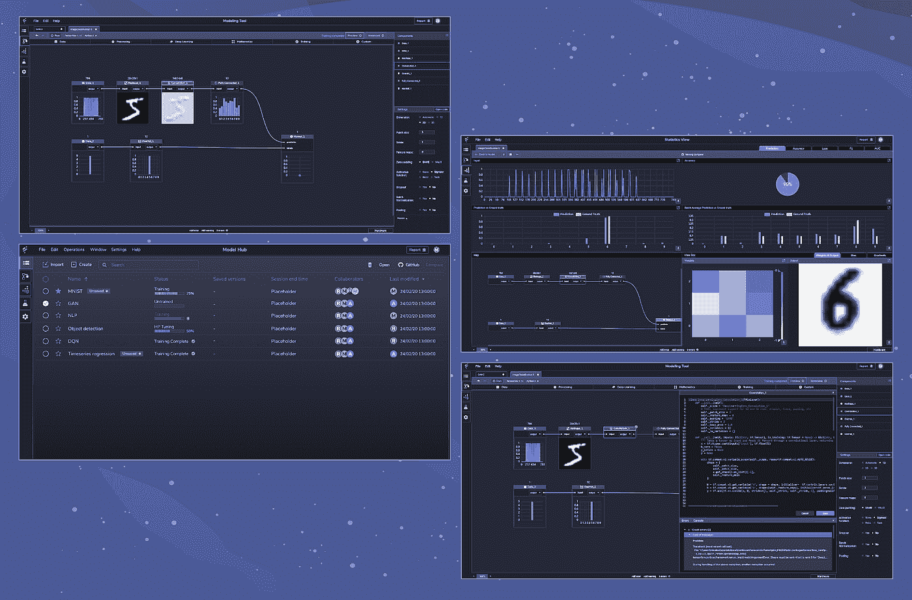
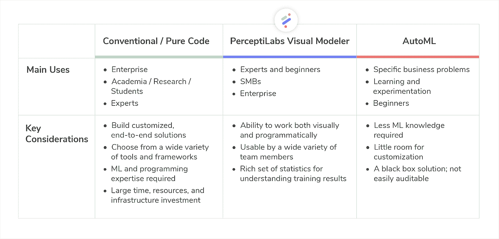

# 一种新的机器学习建模可视化方法

> 原文：<https://towardsdatascience.com/a-new-visual-approach-to-machine-learning-modeling-87d620b56cae?source=collection_archive---------54----------------------->

机器学习(ML)工具正在爆炸和专门化，为用户提供了以不同方式构建和管理 ML 模型的选择，从编写代码、依赖框架到使用自动化解决方案，每种方式都有其优缺点。好消息是，PerceptiLabs 通过我们的可视化建模器开发了下一代 ML 工具，使模型构建更容易、更快，并且更广泛的用户都可以使用，无论您是专家还是初学者。

为了理解这个工具的重要性，让我们后退一步，回顾一下 ML 是如何发展的。

一开始，人工智能(AI)是为那些只用纯代码开发算法的博士们保留的。他们必须运用想象力在头脑中想象他们的模型。随着人工智能和人工智能的发展，人工智能从业者的经验水平多样化，将人工智能民主化的努力变成了一套丰富的开源框架和数据集。

这些产品中的许多都需要高级知识，并且仍然依赖专家来编写端到端的 ML 解决方案。在构建定制解决方案时，这可能有一些优势，但可能需要在资源、基础设施和维护方面进行大量投资。

最近推出了各种 AutoML 工具，这些工具承诺端到端的能力，其中输入数据，调整参数，并生成经过充分训练的可部署 ML 模型。这听起来很简单——实际上在某些场景中是合适的——但是，通过 AutoML 创建的 ML 模型通常缺乏对其性能和可解释性的透明性(例如，它们为什么产生某些结果)。同样，AutoML 解决方案经常限制用户只能使用几种 ML 技术。

**下一代 ML 建模**

我们已经看到 [TensorFlow](https://www.tensorflow.org/) 成长为最流行的 ML 框架。我们也明白，并不是每个 ML 领域的人都在模型构建方面有丰富的经验。因此，我们开始创造一种更好的方式来授权给更大范围的用户，从专家到初学者。

我们将我们的工具设计成基于 [TensorFlow](https://www.perceptilabs.com/docs/overview) 之上的可视化 API。这为开发人员提供了对低级 TensorFlow API 的完全访问，以及引入其他 Python 模块的自由，同时为初学者提供了一个具有 AutoML 的一些简单性的易于使用的 GUI。

让用户完全透明地了解他们的模型是如何构建的，以及他们的模型是如何执行的，这一点非常重要。结果是一种新的可视化方法，它提供了纯代码的灵活性、拖放 UI 的简易性，以及连接组件、生成模型架构以及调整设置和超参数的一些自动化。

*图 PerceptiLabs 截图。左上:用于设计模型的建模工具；左下角:用于管理模型的模型中心屏幕；右上:培训期间显示的统计视图；右下:代码编辑器和调试窗口。图像由***感知。**

***ML 建模方法一览***

**

*纯代码与 AutoML 以及感知器实验室的适用范围。图像由[感知实验室](http://www.perceptilabs.com)提供。*

*在构建机器学习模型时，你有很多选择，每种方法都需要根据你可用的资源进行仔细评估。*

*这就是为什么在 PerceptiLabs，我们认为我们建立机器学习模型的新的视觉方法，在广泛的 ML 用户中取得了恰到好处的平衡，同时提供了更好的可解释性，复杂性和可用性。这是一种灵活而全面的方法，让您根据自己的经验和项目需求选择想要的工作方式。*

*如果这听起来很吸引人，你可以从我们免费的、功能齐全的个人版 PerceptiLabs 开始。查看我们的[快速入门指南](https://www.perceptilabs.com/docs/quickstartguide)了解更多信息。*