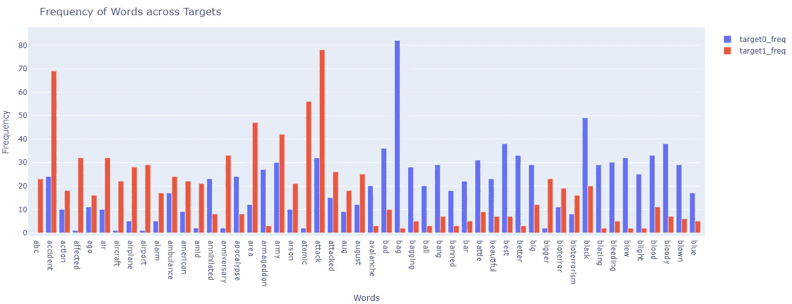

# 一种新的 BOW 分析方法&特征工程(一)

> 原文：<https://towardsdatascience.com/a-new-way-to-bow-analysis-feature-engineering-part1-e012eba90ef?source=collection_archive---------63----------------------->

## 在不建立 ML 模型的情况下，比较跨标签的频率分布。


卢克·切瑟在 [Unsplash](https://unsplash.com?utm_source=medium&utm_medium=referral) 上的照片

我的一个朋友问了我一个问题——“我们如何在不同的类别或标签之间比较蝴蝶结？其中类别或标签可以是情绪或状态或某个客户群。

我的直觉反应是——为每个类别创建一个词频条形图。这确实是一个易于实现的解决方案，但是有各种缺点，其中一些是:

*   从事这项工作的数据科学家/分析师需要比较所有类别中的单词及其频率，在某些情况下，如国家或地区，可能会轻松超过 100 个
*   比较频率可能不会给出任何见解。例如，我们有一个词——“数据”，它在标签 1 和标签 2 上的出现频率分别是 150 和 100。是的，的确有 50 英镑的差别，但这种差别有意义吗？
*   如果——我想知道在没有建立模型/分类器的情况下，区分这些类别的最热门的词是什么，有没有一种方法可以分辨出来？

然后下一个想法是创建一个单词云，但即使它也没有解决上述问题。

经过一段时间的思考，我知道解决方案在于比较不同类别的频率，但在一键编码或计数矢量化或 TF-IDF 中找不到答案，因为在使用这些方法时存在一个常见问题。

问题是这些为每个文档创建特性和它们的值，然后我们如何在标签/类别级别上进行汇总？甚至让我们以计数矢量器为例——我们将获得每个文档中出现的单词的频率——但是要在标签/类别级别进行任何分析，我们将需要合计计数并汇总到类别级别。一旦我们积累起来，我们肯定可以使不同标签上的词的频率有所不同，但同样——这不能解决上面提到的第三个问题。也就是说，如果单词“数据”的频率差是 50，它告诉我们什么？这有意义吗？

现在，你可以猜测我们正在走向哪里——我们在频率上有差异，我们想知道这些差异是否显著。随之而来的是帮助我们的**统计数据**。

我假设你知道各种测试，如 z-测试，t-测试，方差分析等。我们使用这些测试来比较多个平均值或分布，这与我们在这里试图解决的问题是一致的。

下表包含一个词在标签上的出现频率—目标 0 和目标 1。，也就是分布图。我们可以很容易地使用像 z-检验，t-检验等测试。并且比较这些分布，并且如果差异被证明是显著的(给定显著性水平),我们可以说这样的词在标签上具有不同的分布，并且因此可以是模型中的区分因素。


标签中单词的出现频率—目标 0 和目标 1

因此，这样我们甚至可以将这种技术用于特征工程，并减少模型中的特征数量。

简单对吗？是的，确实只有在我们处理完最后一点之后。

**z 检验**、 **t 检验、**或 **ANCOVA** 是**参数**检验，这意味着它们对数据做出假设，其中一个主要假设是数据呈正态分布。

但是，这种假设可能对数据集中的所有特征/单词都成立，也可能不成立。因此，我们将不得不依靠一些**非参数**测试，这些测试不做任何这样的假设。

我们很少有这样的测试，我们将使用的唯一测试是**曼惠特尼 U 测试**。该测试一次比较两个分布，非常适合我们使用**二项式**标签的情况，以及使用**多项式**的情况，我们可以使用**克鲁斯卡尔-沃利斯测试**。

Kruskal-Wallis 检验类似于 ANOVA，它告诉我们标签之间的分布是否相同，但它不告诉哪些标签的分布不同，为了得到相同的结果，我们可以应用成对的 Mann Whitney U 检验。

让我们应用所有的学习，同样的，来自 Kaggle 的**灾难推文分类**数据集也被使用。

读取数据集。

```
train_df = pd.read_csv("/kaggle/input/nlp-getting-started/train.csv")[['target', 'text']]print("Size of the data: ", train_df.shape[0])
train_df.head(2)
```


一些样本记录

现在，我们将使用 CrazyTokenizer 将数据集中的句子转换为单词包。此外，一些额外的清理是在下面的预处理函数中完成的。

该函数将被传递给 CountVectorizer，它将给出输入数据集中每条记录的单词频率。

```
ctokenizer = CrazyTokenizer(lowercase=True, normalize=1, remove_punct=True, ignore_stopwords=True, stem='lemm', 
                            remove_breaks=True, hashtags=' ', twitter_handles=' ', urls=' ')ctokenizer.tokenize("There's an emergency evacuation happening now in the building across the street")
```


句子的结尾

```
# the preprocessor function for CountVectorizer
def preprocessor(text):# split the sentence into tokens
    tokens = ctokenizer.tokenize(text)# remove any numeric character
    tokens = [re.sub(r'[0-9-]+', '', token) for token in tokens]# remove stop words or any token having size <3
    tokens = [token for token in tokens if len(token) >= 3]

    return " ".join(tokens)# create the CountVectorizer object
cvectorizer = CountVectorizer(preprocessor=preprocessor, min_df=20)# to get the features
features = cvectorizer.fit_transform(train_df['text'])# create a dataframe of features
features = pd.DataFrame(features.toarray(), columns=cvectorizer.get_feature_names())
features.head(5)
```


使用计数矢量器创建的要素

现在让我们把目标变量和特性一起带来。

```
# merge features with the reviews_data to get labels
train_df_w_ft = pd.concat([train_df[['target']], features], axis=1)
train_df_w_ft.head(5)
```


具有目标变量的特征数据

现在，我们将绘制一个条形图，显示属于每个目标值的前 30 个单词。

```
def plot_bar_graph(xs, ys, names, xlabel, ylabel, title):# create figure object
    fig = go.Figure()# create bar chart for each of the series provided 
    for (x, y), name in zip(zip(xs, ys), names):fig.add_trace(go.Bar(x=x, y=y, name=name, orientation='v'))# Here we modify the tickangle of the xaxis, resulting in rotated labels.
    fig.update_layout(
        barmode='group',
        autosize=False,
        width=1300,
        height=500,
        margin=dict(l=5, r=5, b=5, t=50, pad=5),
        xaxis={'type': 'category', 'title': xlabel},
        yaxis_title=ylabel,
        title=title
    )
    fig.show()top_x = 30words_lists = []
frequencies = []
targets = []for target in train_df_w_ft['target'].unique():# add label name
    targets.append("Target-{}".format(target))# get the top words
    word_freq = train_df_w_ft[train_df_w_ft['target'] == target].iloc[:, 1:].sum(axis=0)
    word_freq = sorted(word_freq.to_dict().items(), key=lambda x: x[1], reverse=True)[: top_x]# append the words
    words_lists.append([x[0] for x in word_freq])# append the frequencies
    frequencies.append([x[1] for x in word_freq])plot_bar_graph(words_lists, frequencies, targets, "Words", "Frequency", "Frequency of Words across Targets")
```


目标值中前 30 个词的出现频率。

在上图中，我突出了两个词——“火灾”和“紧急情况”。对于单词“fire ”,目标之间的频率差异很大(~ 180 °),而对于单词“emergency ”,差异非常非常小。

正如我们上面讨论的，我们的目的是确定这些差异是否显著，这很重要，因为两个单词都出现在两个目标值的句子中。我们想知道它是否使这些特征变得无关紧要，即它们在决定一个句子是属于目标 0 还是目标 1 时是否有发言权。

下面是单词“fire”的曼-惠特尼 U 检验结果。

```
fire_data0 = train_df_w_ft[train_df_w_ft['target'] == 0]['fire']
fire_data1 = train_df_w_ft[train_df_w_ft['target'] == 1]['fire']mannwhitneyu(fire_data0, fire_data1)
```


从测试中，我们得到了小于 0.05(我们的显著性水平)的～0 的 p 值，因此，我们可以得出结论，“火灾”的频率分布在目标值之间有显著差异(置信度为 95%)。

让我们来看看同样的“紧急情况”。

```
emergency_data0 = train_df_w_ft[train_df_w_ft['target'] == 0]['emergency']
emergency_data1 = train_df_w_ft[train_df_w_ft['target'] == 1]['emergency']mannwhitneyu(emergency_data0, emergency_data1)
```


此处，p 值为 0.07，大于 0.05 的显著性水平，因此我们可以得出结论，“紧急事件”的频率分布相似，置信度为 95%。

现在，该是沙漠的时候了——也就是说，让我们来看看那些在目标上有显著不同分布的单词，这是我们想要解决的问题。

下面的代码将对数据集中的所有单词应用 Mann Whitney U 检验，并将记录那些具有不同分布的单词。同样，将策划这样的 50 个字。

```
words_significance = []for word in cvectorizer.get_feature_names():# get the pvalue
    _, pval = mannwhitneyu(
        train_df_w_ft[train_df_w_ft['target'] == 0][word],
        train_df_w_ft[train_df_w_ft['target'] == 1][word]
    )# check for significance
    if pval < 0.05:
        words_significance.append((word, pval))print("Total Number of words: ", len(cvectorizer.get_feature_names()))
print("Number of words having different distributions with confidence of 95%: ", len(words_significance))# plot the top words by pvalue
top_x = 50# seperate the word and pvalues
words_list = [x[0] for x in words_significance][: top_x]
significance = [0.05 - x[1] for x in words_significance][: top_x]# get the total frequencies of significantly different words across labels
freq_label0 = [train_df_w_ft[train_df_w_ft['target'] == 0][x[0]].sum() for x in words_significance]
freq_label1 = [train_df_w_ft[train_df_w_ft['target'] == 1][x[0]].sum() for x in words_significance]# plot the bar graph
plot_bar_graph([words_list, words_list], [freq_label0, freq_label1], ['target0_freq', 'target1_freq'], "Words", "Frequency", "Frequency of Words across Targets")
```



从上面的图表中我们可以看到，有些词同时出现在两个目标值中，但是频率的差异是显著的。

我们也只剩下 633 个单词中的 451 个，这是原始特征的 71%,因此这可以用作特征选择的技术之一。

我还绘制了 0.05 的差值和上述单词的 p 值。因此，具有更接近 0 的 y 轴值的单词将指示它们的 p 值更接近显著性水平，因此相对来说不如 y 轴值更接近 0.05 的单词重要，因为这指示它们的 p 值接近 0。


像“ago”、“big”、“blue”这样的词与其他词相比意义较低。

这些都是为了现在的分析。我将很快写另一篇文章，在这篇文章中，我将建立两个模型，一个具有所有的特征，另一个仅具有重要的单词，并将比较这两个模型的准确性。

**更新:**请点击分析第二部分[的链接。](https://medium.com/@prateekkrjain/a-new-way-to-bow-analysis-feature-engineering-part2-451d586566c6)

上述分析的代码可在 Kaggle 上找到，并可通过[https://www . ka ggle . com/pikkupr/a-new-way-to-bow-analysis-and-feature-engg](https://www.kaggle.com/pikkupr/a-new-way-to-bow-analysis-and-feature-engg)访问

希望你觉得我的上述工作有价值，请分享你对这种方法的看法，如果有任何改进的建议，请提出意见，我很想听听你的想法:)