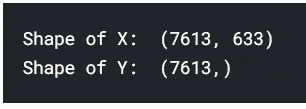
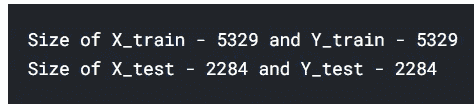
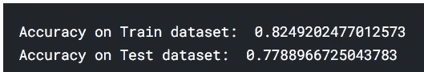
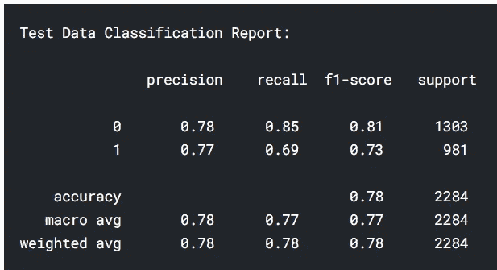
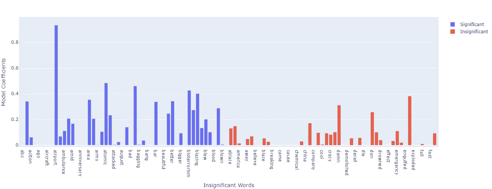
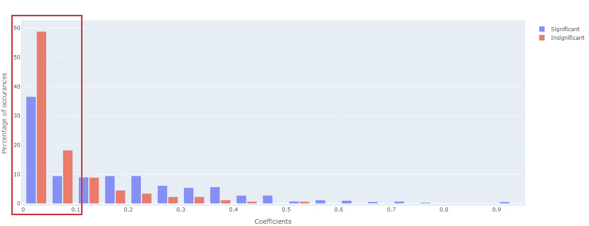
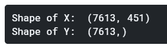
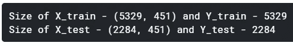
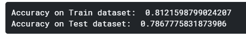
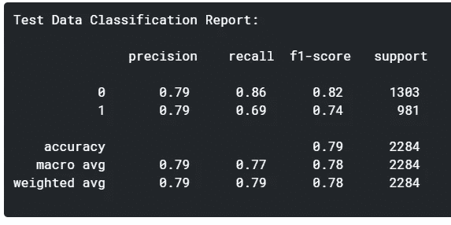

# 一种新的 BOW 分析方法&特征工程(二)

> 原文：<https://towardsdatascience.com/a-new-way-to-bow-analysis-feature-engineering-part2-451d586566c6?source=collection_archive---------50----------------------->

## 使用统计技术为您的模型选择正确的特征。


由 [Unsplash](https://unsplash.com?utm_source=medium&utm_medium=referral) 上的 [Katarzyna Pe](https://unsplash.com/@kasiape?utm_source=medium&utm_medium=referral) 拍摄

*这是由两部分组成的系列文章的第二部分。你应该先读完* [*第一部分*](https://medium.com/@prateekkrjain/a-new-way-to-bow-analysis-feature-engineering-part1-e012eba90ef) *。*

我们正在讨论一种方法，在不建立机器学习模型的情况下，跨类别比较单词包，并进行特征工程。

到目前为止，我们已经了解了:

1.  将跨类别的词频视为单独的分布
2.  应用 Mann-Whitney U 检验——对每个词的分布进行非参数检验，以检验它们的显著性
3.  分析结果，即比较重要单词的频率和 p 值

看了结果之后，我们确实对这种方法有了一些信心，但是它还不完整。我的意思是使用这种技术来减少我们必须衡量模型性能影响的特征，无论它们是否是训练数据集的一部分。这是我们在这一部分将要研究的内容。

# 测试 1-用所有特征训练模型

*   首先，我将使用从 CountVectorizer 获得的所有特征建立一个模型，并检查单词的系数，这些系数在它们的频率分布中没有显著差异。
*   这样做的目的是检查我们是否得到非常低的系数值(接近 0 ),并且这将证明我们的假设，即这些特征/单词是否确实可以从模型中排除。
*   此外，我将使用套索，因为它给不重要的功能 0 权重

```
# split the data into test and trainX = train_df_w_ft.iloc[:, 1:]
Y = train_df_w_ft.iloc[:, 0]

print("Shape of X: ", X.shape)
print("Shape of Y: ", Y.shape)
```



```
X_train, X_test, Y_train, Y_test = train_test_split(X, Y, stratify=Y, test_size=0.3, random_state=42)

print("Size of X_train - **{}** and Y_train - **{}**".format(X_train.shape[0], Y_train.shape[0]))
print("Size of X_test - **{}** and Y_test - **{}**".format(X_test.shape[0], Y_test.shape[0]))
```



```
# training a Logistic Regression model with L1-penalty (Lasso)log_reg1 = LogisticRegression(penalty='l1', random_state=42)\
            .fit(X_train, Y_train)

print("Accuracy on Train dataset: ", accuracy_score(Y_train, log_reg1.predict(X_train)))
print("Accuracy on Test dataset: ", accuracy_score(Y_test, log_reg1.predict(X_test)))
```



训练和测试数据集的准确性

```
print("Test Data Classification Report:**\n\n**", classification_report(Y_test, log_reg1.predict(X_test)))
```



跨目标的精确度、召回率和 F1 分数

现在，我们将比较重要和不重要单词的系数。

LR 的系数在范围(-INF，+INF)内，其中-INF 系数表示这种特征与目标/因变量成反比关系。远离 0 的系数表示特征越重要，0 表示根本不重要。因此，我们将取系数的绝对值，然后将它们归一化，使它们具有可比性。

```
def normalize_coefs(coefs):
    *# normalizing the coefficients*

    abs_coef = [abs(x) for x **in** coefs]

    _max = max(abs_coef)
    _min = min(abs_coef)

    return [(x - _min)/(_max - _min) for x **in** abs_coef]

feature_coef = dict([(ft, coef) for ft, coef **in** zip(X_train.columns, normalize_coefs(log_reg1.coef_[0]))]) *## get the list of words which were not significant and their coefficients from the mode*

top_x = 50

*# get the list of significant words*
sig_words= [x[0] for x **in** words_significance]
sig_words_coef = [feature_coef[ft] for ft **in** X_train.columns if ft **in** sig_words]

*# get the list of insignificant words and their coefficients*
insig_words = [ft for ft **in** X_train.columns if ft **not** **in** sig_words]
insig_words_coef = [feature_coef[ft] for ft **in** X_train.columns if ft **not** **in** sig_words]

*# plot the words and their coefficients*
plot_bar_graph([sig_words[: top_x], insig_words[: top_x]], [sig_words_coef[: top_x], insig_words_coef[: top_x]], 
               ['Significant', 'Insignificant'], "Insignificant Words", "Model Coefficients", "")
```



输入要素的系数图

上面是一些重要和不重要特征的图，可以观察到，与不重要的特征相比，更重要的特征(蓝色)的值更接近 1。同样，这些只是一些特征，可能有点偏差，因此，下面是重要和不重要特征的系数直方图，以获得更多的清晰度。

```
# to plot the histograms
def plot_histograms(xs, names, xlabel, ylabel, title, _min=0.0, _max=1.0, step=0.05):# create figure object
    fig = go.Figure()# create bar chart for each of the series provided 
    for x, name in zip(xs, names):fig.add_trace(go.Histogram(
            x=x, 
            histnorm='percent', 
            name=name, 
            xbins=dict(start=_min, end=_max, size=step), 
            opacity=0.75)
        )# Here we modify the tickangle of the xaxis, resulting in rotated labels.
    fig.update_layout(
        barmode='group',
        autosize=False,
        width=1300,
        height=500,
        margin=dict(l=5, r=5, b=5, t=50, pad=5),
        yaxis_title=ylabel,
        xaxis_title=xlabel,
        title=title,
        bargap=0.2,
        bargroupgap=0.1
    )
    fig.show()plot_histograms([sig_words_coef, insig_words_coef], ['Significant', 'Insignificant'], "Coefficients", "Percentage of occurances", "")
```



重要和不重要特征的系数直方图

在上图中，左侧不重要特征的密度较高，表示不重要集合中有更多系数非常低的特征，其中低系数值表示预测/分类目标值的重要性较低。

因此，这表明，从模型本身来看，这些特征的系数确实很低。现在，剩下的就是检查对模型性能的影响，我们将在下面看到。

# 测试 2-仅使用重要特征训练模型，并比较精确度

```
# split the data into train and testX = train_df_w_ft.loc[:, sig_words]
Y = train_df_w_ft.iloc[:, 0]

print("Shape of X: ", X.shape)
print("Shape of Y: ", Y.shape)
```



```
X_train, X_test, Y_train, Y_test = train_test_split(X, Y, stratify=Y, test_size=0.3, random_state=42)print("Size of X_train - {} and Y_train - {}".format(X_train.shape, Y_train.shape[0]))print("Size of X_test - {} and Y_test - {}".format(X_test.shape, Y_test.shape[0]))
```



```
# train the Logistic Regression only on the Significant featureslog_reg_sig = LogisticRegression(penalty='l1', random_state=42)\
            .fit(X_train, Y_train)print("Accuracy on Train dataset: ", accuracy_score(Y_train, log_reg_sig.predict(X_train)))print("Accuracy on Test dataset: ", accuracy_score(Y_test, log_reg_sig.predict(X_test)))
```



之前我们的训练精度是 0.824，测试精度是 0.778。因此，训练数据集的准确性降低了大约 1%。但是，在测试数据的准确性方面有大约 1%的改进。还有，我们来看看分类报告。

```
print("Test Data Classification Report:\n\n", classification_report(Y_test, log_reg_sig.predict(X_test)))
```



之前，我们对目标 0 的 f1 评分为 0.81，对目标 1 的 f1 评分为 0.73。在这里，我们可以清楚地看到两个目标班级的 f1 分数都提高了 0.01。

因此，我们对这种方法的最终结论是:

1.  我们观察到精确度有微小的提高和下降，但是，当我们比较两个目标的 f1 分数(“0”和“1”)时，它们有 0.01 的微小提高。
2.  我们可以得出结论，在使用问题中的技术移除特征之后，对模型的性能没有显著影响，因此，它可以用作特征选择的技术之一。在我们有成千上万个特性的情况下，它肯定可以减少训练时间，而不会对性能产生太大影响。
3.  我相信这也适用于连续变量，我一定会在这样的数据上进行测试，并与大家分享结果。

分析的工作代码保存在 Kaggle 上，可以使用链接[https://www . ka ggle . com/pikk UPR/a-new-way-to-bow-analysis-and-feature-engg](https://www.kaggle.com/pikkupr/a-new-way-to-bow-analysis-and-feature-engg)进行参考

希望你发现这个分析是有帮助的，如果你最终在你的分析中实现了这个，请分享你的故事。

我很想听听你的想法和建议，所以，请留下你的评论。