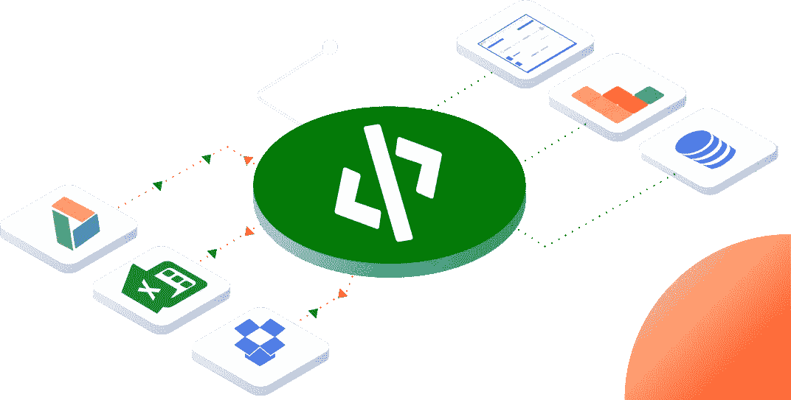
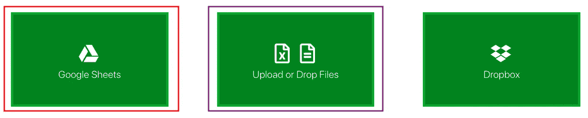
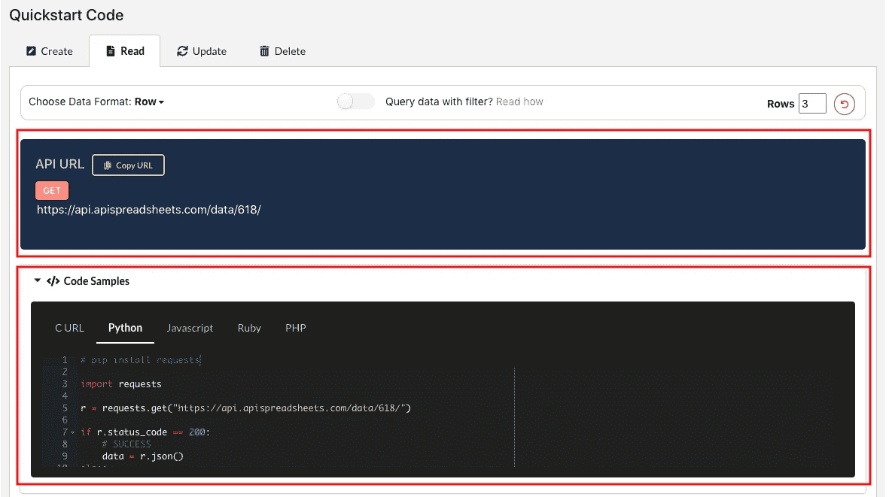
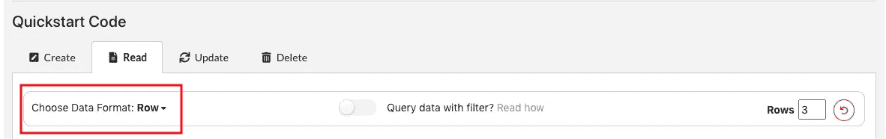
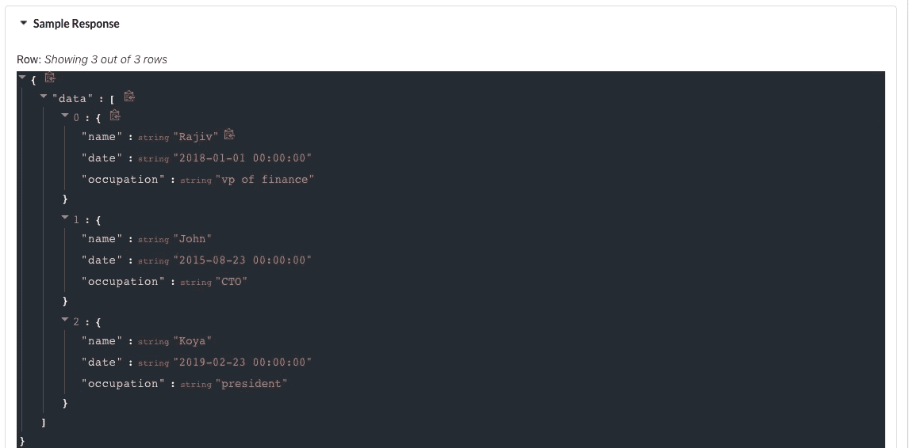
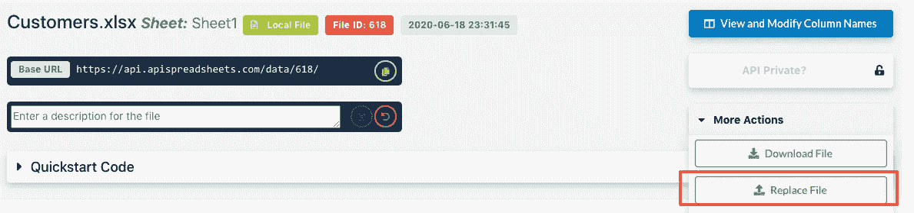

# 共享电子表格数据的新方法

> 原文：<https://towardsdatascience.com/a-new-way-to-share-spreadsheet-data-eab276c24310?source=collection_archive---------47----------------------->

## 来回发送电子表格已经成为过去

*声明:这涉及到我做的一个工具，* [*API 电子表格*](http://www.apispreadsheets.com/) *。有人告诉我，这是一种在团队中共享电子表格数据的简单明了的方法:)*

您目前如何与其他数据人员共享您的电子表格数据？让我猜猜，你下载了你的 Google Sheet 或者 Dropbox 文件。或者等一下，你邮件里的文件是 3 天前发的吗？糟糕，是在你的工作电脑上，不是吗？好吧，你找到文件了。

现在你发邮件给约翰，让他做些分析。他运行他的分析。他会把它寄回给你。你重新运行你的旧模型…..又是什么鬼？！这些数字不再有意义，哦，我的上帝，你的老板会生气的，你花了这么多时间做这个。啊啊啊。

照片由[安德鲁·尼尔](https://unsplash.com/@andrewtneel?utm_source=medium&utm_medium=referral)在 [Unsplash](https://unsplash.com?utm_source=medium&utm_medium=referral) 上拍摄

好吧，结果是约翰添加了一些新数据，打乱了你的计算。一旦你考虑到这一点，一切都会好的。唷。危机解除。

> 但是危机本来就不应该发生

# 输入 API 电子表格

如果您可以对电子表格数据使用相同的真实来源会怎么样？即使数据改变了，你的代码也不会改变。你还可以阅读最新的电子表格数据。

即使电子表格在 Dropbox、Google Sheet 或你的本地电脑上。

我的工具， [API 电子表格](http://www.apispreadsheets.com/)，让你做到这一点。

# 怎么会？

它利用 API 的力量创建一个指向你的电子表格数据的 URL，无论是在 Google Sheets、Dropbox 还是本地。那么无论发生什么，该 URL 都保持最新。

所以你、John 和 Koya 都可以在你的 Python 代码中拥有相同的 URL。当数据发生变化时，您什么都不用做:)

*如果你不知道什么是 API，可以随意查看我公司描述*[*API*](https://medium.com/@lovespreadsheets/what-the-hell-is-an-api-how-can-it-help-me-and-how-the-heck-can-i-use-it-8757ec250b6a)*的文章。*

# 好吧，听起来很有趣。但是它实际上是如何工作的呢？

让我们来看一个场景。

你是数据分析团队的团队领导。John 和 Koya 是你们的直接下属，你们三个用 Python 做实验性建模，找出顾客可能离开的原因。

您的销售团队每周都会向您发送一份 **Customers.xlsx** 文件。你的团队在 Google Sheets 上维护一个**地区**文件。这两者对你的建模都是必不可少的。

因此，你可以使用 [API 电子表格](http://www.apispreadsheets.com/)为你的每个文件获取一个 URL，而不是每次数据改变时都重新下载并通过电子邮件发送给每个人。

你挑选一个人负责创建网址。只有一个负责数据治理的领导者非常重要。

这个人在 [API 电子表格](http://www.apispreadsheets.com/)上创建一个帐户，然后上传 **Customers.xlsx** 文件，并连接到 Google Sheets 上的 **Regions** 文件。

你点击谷歌表单，上传或删除文件，连接到你的两个文件

文件上传并连接后，您将获得一个 API URL。以及如何读取数据的 Python 代码片段。

您可以尝试数据格式，看看您希望如何读取数据。您可以在**示例响应**中看到每种数据格式的外观。

现在，你们三个都可以使用相同的 Python 代码来读取数据了！

# 等等，那么数据将如何自动更新呢？

对于 Google Sheets，当你添加、删除或更新任何行时，数据总是会自动更新。

对于 Excel 文件，在这种情况下， **Customers.xlsx，**数据管理员需要在 [API 电子表格](http://www.apispreadsheets.com/)的仪表板中用新版本替换当前版本。

这非常简单，它维护您的 API URL。这意味着你的 Python 代码不需要修改。

1.  转到**文件**选项卡

2.转到您的 **Customers.xlsx** 文件，点击**更多选项，**点击**替换文件**并替换为您当前的版本

这将保留 URL，但用新文件更新数据！

就是这样！现在您的 **Customers.xlsx** 文件是最新的，您的 URL 将为您提供最新的数据。

# 就是这样！

我希望这对你的帮助和对其他用户的帮助一样多。如果你有任何问题，请随时发邮件到 info@apispreadsheets.com 给我们！