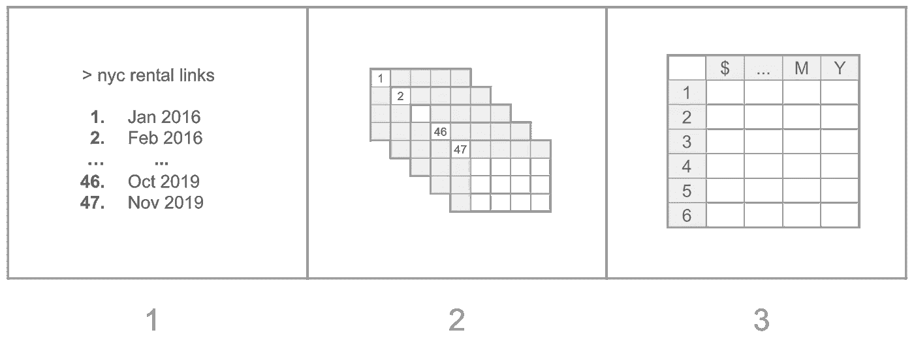
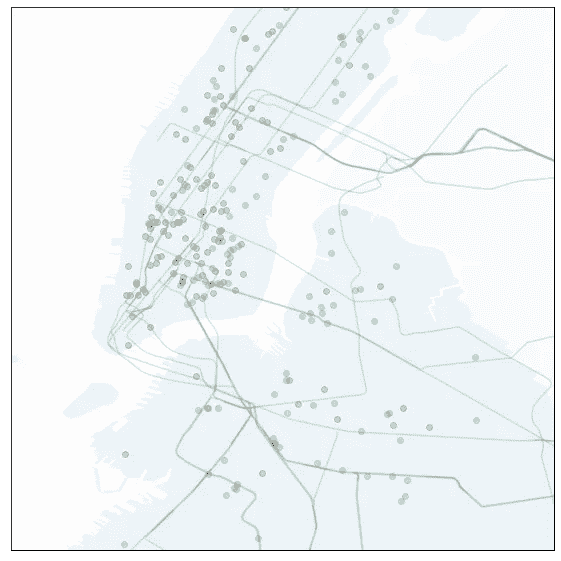
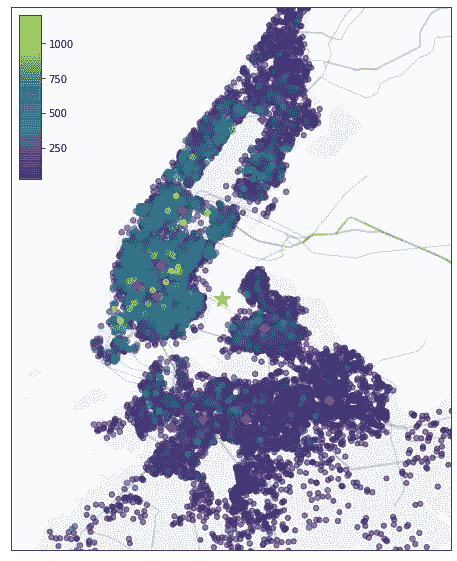
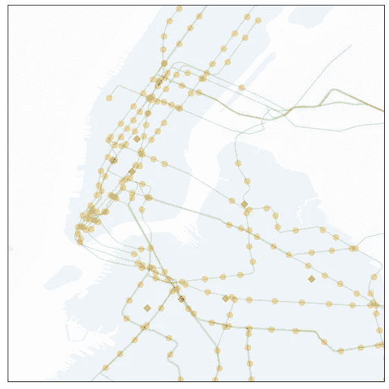
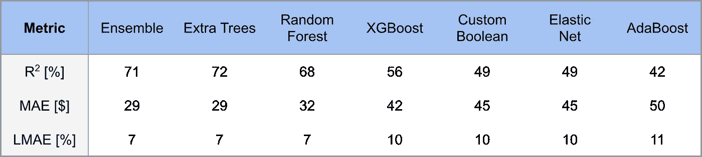
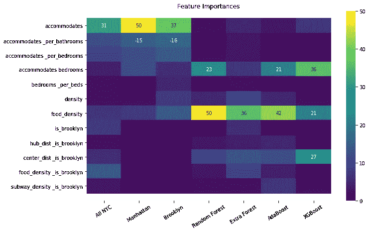

# 《纽约客》Airbnb 定价指南

> 原文：<https://towardsdatascience.com/a-new-yorkers-guide-to-airbnb-pricing-59ef9b097478?source=collection_archive---------40----------------------->

## 机器学习流水线的迭代方法


照片由 [@mikenusbaum](https://500px.com/photo/144166669/Night-time-Brooklyn-Bridge-Panorama-by-mikenusbaum)

你想尝一口大苹果吗？你想在一个不睡觉的城市醒来吗？你不在乎是在唐人街还是在河边。你不是第一个。这座城市每年有 1000 万居民和 6000 万游客，相当一部分人穿过了 JFK 或 LGA 的大门。

对于这 6000 万的年度访客来说，许多人可能会住在 Airbnb 的 50k 租房中。这提出了一个有趣的问题，即使用纽约可用的[数据集](https://opendata.cityofnewyork.us/)来准确地为 Airbnb 全年的租金定价。我们将用迭代的方法来解决这个问题，我们首先建立一个模型，然后逐步改进它。

最终的结果是一个实时定价租金的 web 应用程序: [**Pad Pricer**](https://djsegal.github.io/pad_pricer) 。

# 第一步:搜集 Airbnb 的月度房源

正如你可能已经猜到的，Airbnb 租赁定价的第一步是从 Airbnb 获得租赁清单。幸运的是，Airbnb 非常乐意提供这些数据(每月一次)。然而，为了达到我们能够预测租赁价格的程度，我们需要采取三步走的方法:

1.  获取所有纽约市租赁的链接(过去 50 个月)
2.  将 50 个链接下载到 50 个熊猫数据框中
3.  将 50 个数据帧编译成一个单独的*清洁过的*数据帧



## 第 1.1 步:获取 Airbnb 纽约租房链接

为了从 Airbnb 的[数据存储](http://insideairbnb.com/get-the-data.html)中获得所有纽约的月租金，我们将使用`BeautifulSoup`从网站的索引页面中抓取链接，然后将 URL 以及月份和年份存储在`pandas`数据框架中。对于这个过程，月和年是基于与每个 url 相关联的*日期时间*字符串来计算的。`get_airbnb_links`代码可以在 [github](https://github.com/djsegal/metis/blob/master/X_airbnb_revisited/airbnb_pricer/airbnb/get_airbnb_links.py) 上找到，结果如下:

Airbnb 链接数据框的前几行

## 步骤 1.2:并行下载月租链接

下一步是使用 panda 的`read_csv`函数将上述列表中的所有`url`读入它们自己的数据帧。预计到下一步，我们将删除许多不需要的[列](https://raw.githubusercontent.com/djsegal/metis/master/X_airbnb_revisited/airbnb_pricer/airbnb/skipped_columns.py)，因为它们只是占用空间。因为下载`csv`文件的过程相对较慢，我们可以使用下面的代码片段异步运行它们:

```
from concurrent.futures import ThreadPoolExecutor
from tqdm.auto import tqdmdef async_run(f, my_iter):
    with ThreadPoolExecutor(max_workers=6) as executor:
      results = list(tqdm(
          executor.map(f, my_iter), total=len(my_iter)
      )) return results
```

此步骤的代码可从以下位置获得:

[](https://github.com/djsegal/metis/blob/master/X_airbnb_revisited/airbnb_pricer/airbnb/load_airbnb_links.py) [## load_airbnb_links.py

### Airbnb 月租相关的 URL 下载表(并行)

github.com](https://github.com/djsegal/metis/blob/master/X_airbnb_revisited/airbnb_pricer/airbnb/load_airbnb_links.py) 

## 步骤 1.3:编译干净的定价数据集


纽约和布鲁克林的 Airbnbs 价格地图，用橙色显示火车线路。请注意剧院区、村庄和威廉斯堡周围的群集。

构建初始 Airbnb 定价数据集的最后一步是汇编最后一步中生成的 48 个数据框架。通过这些数据帧的简单连接，我们还必须清理结果表。这包括两个方面:将许多列更新为它们最近的值(例如对于`bed`和`rating`)以及对数据集进行一些过滤。

为了清楚起见，我们的数据集最初包含 200 万个唯一条目(成对的:`id`、`month`和`year`)。根据以下标准进行过滤后，我们只剩下 30 万英镑，降幅为 85%。

**租赁选择标准**

*   房产类型:公寓
*   房间类型:整个单元
*   价格:每晚 25 美元到 1250 美元之间
*   月:至少上市三个月
*   评级:超过 60%来自评论
*   审查频率:至少每 8 个月一次
*   自治市:曼哈顿还是布鲁克林
*   容纳:1 至 8 人
*   亚达亚达

虽然这些限制可能看起来很严格，但这样做是为了只关注该领域的做市商，淘汰一些更业余的主持人。实际代码可以在 [github](https://github.com/djsegal/metis/blob/master/X_airbnb_revisited/airbnb_pricer/airbnb/compile_airbnb_data.py) 上查看。

# 第二步:回归定价 Airbnb 租金

我们有了数据，现在让我们建立一个模型。我们的目标是首先创建最简单的原子模型。然后增加它的复杂性，直到我们有一个集成回归拟合，其中包含来自 Airbnb(租赁)、纽约市卫生局(食品)、Yelp(咖啡馆/酒吧)和 MTA(火车)的数据。但首先，让我们从头开始…

## 步骤 2.1:构建原子数据集

奥卡姆剃刀说“最简单的解决方案几乎总是最好的。”尽管在这里不会出现这种情况，但这通常是最好的起点。从上一步开始，我们在 Airbnb 纽约价格数据集中有大约 30 万个条目(涵盖过去 4 年)。

我们纽约 Airbnb 租赁数据集的前 7 个条目

从这个表中可以看出，`id`与多行相关联。除了`price`、`month`和`year`，其他栏目都包含大量冗余信息。因此，我们将把这个数据集一分为三，每个数据集都有一个`id`列(用于连接)以及以下各列:

1.  价格数据集(`price`、`month`和`year`)
2.  租赁数据集(`accommodates`、`bathrooms`、`bedrooms`、`beds`)
3.  位置数据集(`geometry`、`zipcode`、`is_brooklyn`、`density`)

从最接近原始表的表开始，`Price`数据集就是第一步中删除了所有常量字段的表(即现在只有价格、月份和年份)。然后`Rental`数据就是*假定的与每个纽约公寓相关的*常量字段:住宿、浴室、卧室和床。为了清楚起见，`Rental`数据的长度比`Price`数据的长度小 **20x** ！

`Location`数据集需要更多的解释。首先，`zipcode`实际上是在初始数据集中给出的。`is_brooklyn`旗指的是我们如何关注曼哈顿和布鲁克林。接下来，`geometry`是存储租赁的纬度和经度的字段；这实际上意味着我们将使用一个 [GeoPandas](http://geopandas.org/) 数据框架来执行 *GIS* 探索。最后，`density`是我们从 ZipAtlas [ [1](http://zipatlas.com/us/ny/new-york/zip-code-comparison/population-density.htm) ， [2](http://zipatlas.com/us/ny/brooklyn/zip-code-comparison/population-density.htm) ]的表上连接得到的字段。

尽管我们在这里似乎变得更复杂了，但这是为了构建最简单的模型做准备:一个基于`Price`数据集的模型。

## 步骤 2.2:训练最简单的模型

我们的目标是得到一个基于月份和年份来预测租金的模型。正如您可能已经猜到的那样，这将表现得非常糟糕。然而，它将提供一个引导点来开始(过度)复杂化我们的模型。

```
from sklearn.linear_model import LinearRegressioncur_target = "price"cur_X = price_data.drop(columns=["id", cur_target])
cur_y = price_data[cur_target]cur_model = LinearRegression()
cur_model.fit(cur_X, cur_y)R_2 = cur_model.score(cur_X, cur_y)
```

你由此得到的`R^2`就是 **0.14%** ！这是一个真正可怕的模型。它只能解释不到 0 . 25%的租赁夜价格差异。这是有道理的，因为它基本上是说价格必须只与两者线性相关:月和年——这是完全不正确的。

更好的——尽管仍然很糟糕——模式是为每个月和每年添加一面旗帜。这反过来解开了月和年之间的耦合。更简单地说，不是一个可以是 1 到 12 之间任何数字的`month`变量，而是有 12 个变量是`True`或`False`(例如`is_jan`、`is_feb`等)。).实际上，我们从一个有两个特性`month`和`year`的表发展到 16 个布尔表。这 16 个月来自我们的数据集涵盖的 12 个月和 4 年。

通过代码，我们使用 Scikit-learn 的`OneHotEncoder`完成了从 2 个变量到 16 个变量的扩展。为了形式化我们的构建过程，我们将使用一个`Pipeline`将这个编码器与之前的`LinearRegression`模型结合起来。虽然只是将`R^2`提高到 0.15%，但我们现在已经真正开始取得一些进展了。

```
from sklearn.preprocessing import OneHotEncoder
from sklearn.pipeline import Pipelinecur_one_hot = OneHotEncoder(categories="auto")cur_pipeline = Pipeline([
    ("one_hot", cur_one_hot),
    ("lin_reg", LinearRegression())
])cur_pipeline.fit(cur_X, cur_y)
R_2 = cur_pipeline.score(cur_X, cur_y)
```

**编辑:**除了昙花一现的几个月之外，另一种方法是将`month`视为一种周期性特征——正如这篇[博文](http://blog.davidkaleko.com/feature-engineering-cyclical-features.html)所展示的那样。

## 步骤 2.3:加入租赁数据

既然我们已经将数据集原子化并构建了一个简单的模型，那么是时候开始重新添加来自`Rental`和`Location`数据集的数据以及其他基于地理的指标了。特别是对于这一步(和子步骤),我们将只添加租赁数据，即住宿、卧室、浴室和床。这将需要对管道进行一些调整，但最终我们会有一个真正开始竞争的模型。

在看下面这个庞然大物之前，清楚地说明我们现在在做什么是很重要的。我们首先将我们的`Price`数据集与`Rental`数据集合并。接下来，我们一次加热`month`和`year`，同时保持其他功能完全相同(参见:`remainder="passthrough"`)。然后，只需对管道做一点小小的更改，我们就可以恢复运行了！

```
from sklearn.compose import ColumnTransformercur_X = price_data.merge(rental_data, on="id")
cur_X.drop(columns=["id", cur_target], inplace=True)cur_transformer = ColumnTransformer([
    ("one_hot", cur_one_hot, ["month", "year"])
], remainder="passthrough")cur_pipeline = Pipeline([
    ("transformer", cur_transformer),
    ("lin_reg", LinearRegression())
])cur_pipeline.fit(cur_X, cur_y)
R_2 = cur_pipeline.score(cur_X, cur_y)
```

如果你看一下`R^2`值，我们现在是 25%！这比我们最初的*哑*模型提高了两个数量级以上。然而，在我们从这场胜利中获得太多安慰之前，我们必须更加认真地对待数据科学。



我们的模型在纽约 Airbnb 数据集上表现如何的地图。请注意，蓝绿色圆圈代表 125 个最佳预测租金，而红色圆圈代表 125 个最差租金。很明显，在这里，红色标记大量聚集在曼哈顿下城！因此，一些地理数据可能会改进模型(敬请关注……)

# 步骤 3:认真对待数据科学

虽然我们可能会对一个获得 25%的`R^2`的模型感到自豪，但它很难说明它在野外的表现有多好。事实上，我们可以通过简单地记忆数据(可能使用决策树)来拟合一个 90%以上的模型。然而，在新数据上，它会做得非常糟糕。因此，我们现在将进一步完善我们的渠道，更加认真地对待数据科学。

## 步骤 3.1:创建测试集

学会信任我们的新模型的第一步是将数据分成两组:`train`和`test`。这允许我们使用一组在*和*上训练模型，然后使用另一组进行测试。对于像我们这样的中型数据集，训练和测试之间的 80/20 分割通常是惯例。(一些阵营甚至会与一个名为`validation`的新组织争夺 60/20/20 的分成，这使得`test`数据只能在最后用作部署的保障。)

从初始数据集创建训练和测试数据集的最简单方法是使用 Scikit-learn 的`train_test_split`函数和`test_size = 0.2`。然而，这将导致两个问题:

1.  每个长期租赁都很有可能在两个数据集中有一个月的记录(这是一种数据泄漏的形式)
2.  目标价值(即每晚的租金价格)可能会偶然出现偏差

为了解决第一个问题，我们在`id`计数上使用了宁滨，并选择了 10%的唯一`id`(基于它们的 bin 计数)。接下来，为了获得测试集的另外 10%,我们实际上使用了来自 Scikit-learn 的`train_test_split`——我们只是输入了`stratify`参数，以允许我们绑定`price`!

基于 id 和价格的定制培训/测试分割

使用上面和下面的代码，我们现在看到模型仍然徘徊在 25%的`R^2`附近。实际上，`R^2`并没有改变！这实际上意味着我们可能低估了模型。如果误差与上一步相比确实发生了巨大变化——即如果`test`分数明显比`train`分数差——我们将处于过度拟合模型的情况。

```
X_train, X_test, y_train, y_test = custom_train_test_split(
    price_data.merge(rental_data, on="id")
)...cur_pipeline.fit(X_train, y_train)
R_2 = cur_pipeline.score(X_test, y_test)# R_2 still around 25% !
```

//这只能说明我们还有改进的空间

## 步骤 3.2:缩放各种功能

现在，我们有了一个经过认证的欠适应模型，它既有训练数据集，也有测试数据集。为了提高拟合度，我们将从缩放各种特征开始。从目标开始，我们将做一个简单的日志转换。这是因为租赁价格根据对数正态分布而变化，这意味着衡量误差的更好方法是相对大小。这可以使用以下更新来添加:

```
import numpy as npfrom sklearn.compose import TransformedTargetRegressorcur_regressor = TransformedTargetRegressor(
    regressor=LinearRegression(),
    func=np.log, inverse_func=np.exp
)cur_pipeline = Pipeline([
    ("transformer", cur_transformer),
    ("regressor", cur_regressor)
])
```

执行这个操作——并将`y`改为引用它——实际上将`R^2`从 25%减少到 22%。这就是强调`R^2`对于建模者来说是一个有用的度量标准的重要之处，但是对于行业来说真正有价值的度量标准可能是非常不同的(例如`MAE`或`RMSE`)。为方便起见，在拟合价格时，我们将关注模型的平均绝对误差(`MAE`)。该值以美元为单位，显示每个预测的平均值。(注意，即使对于 log MAE 的情况，我们也不会使用 log-dollars。)

```
def mae(vec_1, vec_2):
    assert len(vec_1) == len(vec_2)
    vec_3 = np.abs( vec_1 - vec_2 )

    return np.sum(vec_3) / len(vec_3)

lin_predict = lin_pipeline.predict(X_test)
log_predict = log_pipeline.predict(X_test)

# mae(y_test, lin_predict) ~ $62
# mae(y_test, log_predict) ~ $60
```

因此，即使目标上的`R_2`从对数转换中下降，它的`MAE`也一样。这是一个度量权衡很重要的例子！接下来，我们将使用 Box-Cox 幂变换来变换这些特征。这样做的目的是将要素修改为更正态分布(线性回归的核心假设之一)。不过，俗话说:天下没有免费的午餐。在这种情况下，你为改进的模型所付出的代价通常是可解释性的降低。

在我们刚才在目标上添加 log 转换之前，我们的模型实际上非常简单。它对其 20 个特征变量(和偏差补偿)具有线性关系。这实际上意味着每个变量都与一个简单的`per_unit`值相关联——这里用美元来衡量。例如，一套公寓每多容纳一个人，每晚租金就会增加 10 美元。

一旦我们转移到对数转换，这些效果就从线性`$/unit`值转换成标量，从而扩大或缩小目标(想想从总和到乘积)。当我们对变量进行幂变换时，解释会变得更加困难。最后，当我们添加模型集合时，解释将变得更加困难。关键是在每一步都要问一问这种交换是否值得。

与这种可解释性的想法相联系的是变量实际上意味着什么*和*你真正能控制它们的是什么。例如，月和年是由您在托管时设置的变量。然而，一年一热的特点使你无法预测未来的年份(而`month`则不能)。因此，去掉`year`功能，但保留`month`功能可能是有意义的

同样，如何将信息传递给最终用户也是一个问题。在上表中:每间浴室的租金增加了 110 美元/晚，而每间卧室只给你 30 美元。这并不意味着你应该把卧室变成浴室。可能发生的是`bathrooms`正在成为平方英尺的代表。而`bedrooms`可能正纠结于住宿和床位的数量。

在进入下一步之前，必须展示 Scikit-learn 的电源变压器(例如 Box-Cox 变压器)如何适应管道:

```
from sklearn.preprocessing import PowerTransformercur_pipeline = Pipeline([
    ("transformer", cur_transformer),
    ("normalizer", PowerTransformer()),
    ("regressor", cur_regressor)
])
```

一旦你做了这个修改，`R^2`实际上会下降一点！因此，如果它继续降低性能，在某个时候移除它可能是有意义的(例如，它是`GridSearchCV`的潜在超参数)。

## 步骤 3.3:添加特征工程

在这一点上，我们有一个好的模型，它有一些功能缩放。我们现在将通过改变为多项式回归(相对于简单的线性回归)来推进特征工程过程。这实际上意味着，我们现在将拥有像`accommodates_per_bathrooms`这样的术语，或许能够捕捉到更微妙的细微差别。为了防止参数爆炸的问题——即维数灾难——我们需要引入正则化。


到目前为止，我们有一个相对简单的管道(考虑到所有的事情)。几个月来一直有一些一次性的事情发生。然后做一些幂变换，使特征更高斯。然后我们用一个线性回归来总结它——用对数标度的目标来完成。

现在我们要让它稍微复杂一点…

为了让每个人都在同一个页面上，此时我们有一个数据框架，其中每一行都是一个租赁列表(给定月份)，具有以下特征:

1.  身份证明
2.  价格
3.  月
4.  容纳
5.  浴室
6.  卧室
7.  床

`month`特征被选择用一个热向量来处理(例如`is_jan`、`is_feb`、…、`is_dec`)。`price`是目标，用一个日志转换来处理。现在我们要对最后四个特性做一些事情:`accommodates`、`bathrooms`、`bedrooms`、`beds`。

这四个变量将为我们设计子管道提供一个出口。我的意思是，我们将利用`ColumnTransformer`为这四列(例如，住宿和床位)传输某些命令。如下所示:

```
from sklearn.preprocessing import PolynomialFeatures
from sklearn.feature_selection import VarianceThresholdcur_poly_feats = PolynomialFeatures(
    degree=2, include_bias=False, interaction_only=True
)cur_sub_pipeline = Pipeline([
    ("reciprocal", ReciprocalFeatures()),
    ("polynomial", cur_poly_feats),
    ("cancel", VarianceThreshold()),
    ("clean", CleanFeatures()),
    ("box_cox", PowerTransformer(method="box-cox"))
])
```

那么这个(子)管道是做什么的呢？第一部分是为四个值，即`per_accommodates`和`per_bathrooms`设置互逆特征的步骤。这个自定义代码可以在: [github](https://gist.github.com/djsegal/3db97acec43ccf75d6313db4aa5af15c) 上获得。接下来，我们用最少的新特性做一个简单的 2 次多项式展开。此外，在我们对数据进行 Box-Cox 幂变换之前，我们[移除](https://gist.github.com/djsegal/54d6047cd1495925517896f51d5dea2d):

*   无信息特征:`cur_data["bed _per_bed"] ~ 1.0`
*   互逆特征:`beds_per_accommodates` & `accommodates_per_beds`

为了将这个新的 sub_pipeline 与现有的 sub _ pipeline 连接起来，我们现在需要修改主管道中使用的`ColumnTransformer`:

```
one_hot_cols = ["month"]
poly_cols = rental_data.columns.drop("id").tolist()cur_one_hot = OneHotEncoder(categories="auto")cur_col_transformers = [
    ("one_hot", cur_one_hot, one_hot_cols),
    ("poly_feats", cur_sub_pipeline, poly_cols)
]cur_transformer = ColumnTransformer(cur_col_transformers)
```

好吧，那么现在我们肯定有太多的特性让`LinearRegression`不合适了。维数灾难表明，我们现在可能正面临严重的过度拟合情况。即使情况并非如此，也就是说，我们可能仍然有一个糟糕的模型，每个训练批次的系数可能变化如此之大，以至于数据集合之间几乎没有一致性。这是坏事！

因此，我们将在模型中添加特征选择，以降低特征创建的影响。实际上，这意味着将线性回归替换为两步过程:

1.  特征选择
2.  正则回归

该功能选择将通过包裹在 Scikit-learn 的`SelectFromModel`中的`LassoCV`来完成。在这里，Lasso(参见: [L1 范数](https://en.wikipedia.org/wiki/Taxicab_geometry))是一种正则化的回归技术，它剔除了不会改进模型的特征(CV 代表交叉验证)。另一方面，SelectFromModel 是一个运行`LassoCV`的函数，目标是挤出不重要的特性。在实践中，这可以移除超过 60%的特征(从 100 多个初始特征的列表中)。

下一步是使用`ElasticNetCV`而不是`LassoCV`的实际求解器。这样做是因为它添加了岭回归(L2 范数)的一些元素，这在经验上提高了`R^2`值。在继续之前，有必要指出另外两个问题。首先，我们现在使用一个定制的[LogTransformedTargetRegressor](https://gist.github.com/djsegal/8ef31dfc8e3e861c363e858b359f71d9)来处理 SelectFromModel。

其次，这些正则化回归技术(即套索、山脊和弹性网)要求对要素进行缩放。例如，如果不按比例缩放，我们的模型将尝试比计量的模型更严格地缩放公里量 1000 倍(如果我们添加了地理特征)。因此，我们添加了一个`StandardScalar`,它将所有特征转换为平均值为 0，标准偏差为 1。这条新管道如下:

```
from sklearn.linear_model import LassoCV, ElasticNetCV
from sklearn.feature_selection import SelectFromModel
from sklearn.preprocessing import StandardScalercur_selector = SelectFromModel(
    LogTransformedTargetRegressor(
        LassoCV(cv=4, n_jobs=-1, max_iter=5e4)
    ), threshold=1e-6
)cur_regressor = LogTransformedTargetRegressor(
    ElasticNetCV(cv=4, n_jobs=-1, max_iter=5e4)
)cur_pipeline = Pipeline([
    ("transformer", cur_transformer),
    ("scalar", StandardScaler()),
    ("selector", cur_selector),
    ("regressor", cur_regressor)
])cur_pipeline.fit(X_train, y_train)
```

现在，如果我们检查`train`和`test`组的`R_2`，两者都在 23%左右。我们实际上稍微改进了模型，使两个分数更加接近。后者证明我们现在有一个相对通用的模型(与过度拟合模型相反)。现在是时候将`R_2`提高不止一个百分点了！

# 步骤 4:使用纽约市地理信息

我们对 Airbnb 租赁进行高精度定价的下一步是添加一些与纽约及其运作方式相关的 GIS(地理信息系统)数据。这可以包括更明显的细节，如:人口密度和租赁是否在布鲁克林。但也可以涉及更多内容，例如查找从租赁点到最近地铁站的距离或附近有多少寿司店。

## 步骤 4.1:将位置数据带回到图片中

在步骤 2.1 中，我们将`location`特征提取到它们自己的数据集中。其中包括:`geometry`、`zipcode`、`is_brooklyn`和`density`。现在，我们将关注以下参数:人口密度和检查是否在布鲁克林租房。这意味着我们目前将忽略几何图形和邮政编码。

忽略邮政编码的原因是因为邮政编码可能需要一次性处理，而且邮政编码太多了，所以不相关。然而，它们被用来获得`density`值。另一方面，`geometry`字段在这个阶段没有用，因为线性拟合纬度和经度通常不是一个好主意。但是，我们稍后将使用它来检查到各个位置的距离，例如公园、地铁入口和餐馆。

而且就像 [**那个**](https://gist.github.com/djsegal/25ca2a2526b5d13bcc86686a2d8aba67) ，我们把我们的`R^2`增加到了 **35%** ！这还不算太糟:10%的绝对增长和 40%的相对增长。查看我们当前的参数重要性，可以为我们的模型提供一些线索:

那么这告诉我们什么呢？airbnb 租金价格的第一指标是它能容纳多少人，以及他们之间有多少浴室(和卧室)。Is-Brooklyn 接着补充了一个明显的效果，即曼哈顿是最昂贵的行政区，而`density`与我们想象的方向相反。我的意思是，我们最初期望密度跟踪人们想去的热门地区。

`density`与我们希望的方向相反，这表明我们的模型仍有改进的空间。我们现在将添加地铁和餐馆地理数据，以更好地了解不同租赁提供了多少娱乐。

最后要指出的一点是，我们的初始参数(每月一次)现在在列表的底部。它们基本上意味着寒冷的月份稍微便宜一些，而夏天的月份稍微贵一些。这可能支持使用季节性的一个热点媒介，而不是 12 个月一个。

## 步骤 4.2:寻找最昂贵的热点

在引入新的数据源之前，我认为我们可以从位置数据库中获得更多的信息。使用平均每晚房价，我相信我们可以找到与每晚住宿最高的景点相关的聚类。这类似于卡尔·安德森在重新划分美国大陆时面临的问题。

//完成类比:夜间价格现在是人口的替代品



纽约市地图，以彩色显示 Airbnb 每夜平均租金。在这里，红色和橙色标记突出了城市中最昂贵的景点。

好的，那么产生热点的[方法](https://gist.github.com/djsegal/12a0ed89558005f6aa64adf73799903f)——显示为橙色和红色——是使用 KMeans 聚类进行无监督学习。虽然这可能值得在管道中，我们说它从一开始就添加了字段(甚至在`test_train_split`之前)。

因此，该图的聚类是实际选择的聚类！这 10 颗红钻是这两个区的最高价格集中度。而橙色的星星是整个数据集的质量中心:城市中(*平均值*)最昂贵的地方。

布鲁克林和纽约聚类标记(`is_bkn` =是布鲁克林)。此外，还有一个面向两个区的质心(`is_com`)点。这些是我们的模型中使用的点。

将这些无监督聚类节点合并到模型中的方法是找到每个租赁点和红色标记之间的最小距离(*和*以及每个租赁点到橙色中心星形标记的距离)。这将给我们带来两个新特性:`dist_to_center`和`dist_to_hub`。两者都需要被转换成更高斯的。虽然一个简单的`log`可能适用于 center，但我们将再次使用 Box-Cox，并考虑重新缩放(因为我们添加了更多的`dist`功能)。

好的，我们需要计算租赁列表和聚类列表之间的距离。这里，距离将是欧几里德距离，其中`latitude`和`longitude`用来自[堆栈溢出](https://stackoverflow.com/a/39540339/5187080)的简单关系进行缩放:

```
ave_nyc_latitude = 40.731 * (2*pi/360)
meter_per_degree__longitude = cos(ave_nyc_latitude) * (40075/360) kmmeter_per_degree__latitude ≈ 70 miles
meter_per_degree__longitude ≈ 50 miles
```

在“[获取到聚类](https://github.com/djsegal/metis/blob/master/X_airbnb_revisited/airbnb_pricer/utils/get_dist_to_clusters.py)的距离”函数中使用这些知识后，等待一分钟的运行时间，我们得到了与上面聚类图中橙色和红色标记相关的距离列表！获得新的`R^2`值之前的最后一步是将特征添加到主`DataFrame`中，并更新用于适应它的`Pipeline`:

```
cur_data = price_data.copy()
cur_data = cur_data.merge(geo_data, on="id")...geo_cols = ["hub_dist", "center_dist"]mentioned_cols = [ 
    "id", "price", *pass_cols, 
    *one_hot_cols, *drop_cols, 
    *poly_cols, *geo_cols
]...cur_col_transformers = [
    ("one_hot", cur_one_hot, one_hot_cols),
    ("poly_feats", cur_sub_pipeline, poly_cols),
    ("geo_feats", PowerTransformer(method="box-cox"), geo_cols),
    ("passthrough", [PassThroughTransformer](https://gist.github.com/djsegal/237d96c0eef26002c4aaf6c6ef957374)(), pass_cols)
]...R_2 ≈ 45%
```

就这样，我们接近了 50% `R_2`点！使用聚类信息将这一准确性指标从 35%提高到了 45%，而我们才刚刚开始。然而，在下一步添加地铁和餐馆信息之前，通过查看测试数据，指出我们的无监督聚类确实作弊是有用的。对于生产，可能会建议将此引入到管道中(以及添加 Queens 以增加租赁主体的大小)。

**编辑:**我们可以使用[贝叶斯高斯混合](https://scikit-learn.org/stable/modules/mixture.html)，而不是使用 KMeans 对热点进行聚类。这将允许星系团呈长方形并以任意角度定向，而不是圆形且大小大致相等。

## 步骤 4.3:集成纽约开放数据源

我们现在正处于添加更多数据的最后阶段。我们的最后一个子步骤是通过收集一些纽约市公开的数据集来扩充 GIS 数据库。这些包括:MTA 所有地铁[](https://data.cityofnewyork.us/Transportation/Subway-Stations/arq3-7z49)**站的清单，以及曼哈顿和布鲁克林所有符合卫生部要求的 [**餐厅**](https://data.cityofnewyork.us/Health/DOHMH-New-York-City-Restaurant-Inspection-Results/43nn-pn8j) 的集合。这让我们在理解 Airbnb 每夜租金价格时，又多了两个考虑的尺度。**

**为了清楚起见，在前面的子集中，我们基本上循环了 15k(唯一的)租赁列表，以找到它们与 10 个菱形集群中心以及橙色星星(表示高成本中心)的距离。这在计算上意味着我们一次遍历两个列表:租金和聚类中心。在 Big-O 符号中，我们对最小距离的搜索花费了 O(N M)左右，其中 N 是租赁的数量，M 是另一个地理位置列表的大小**

**到目前为止，对于橙色和红色，M 分别为 1 和 10。对于火车和餐馆，这些将是 O(100)和 O(10k)，所以在*规模*建立一个解决这个问题的框架是有意义的。这是因为简单的情况，如 M ≤ 10，仍然需要一分钟来运行。在讨论如何构建解决此问题所需的可扩展 k-d 树之前，再次强调 N 和 M 的以下数量级是有用的:**

**如图所示，我们有一组数据(M ),其数量级在 1 到 N(即 15k)之间**

**这其中的一个主要含义是:距离(1D)和面密度(2D)之间的重要性权衡。对于之前的两个集群示例，即 M=1 和 M=10，只有距离是真正相关的。当你越靠近餐厅的一端，O(N)~O(M)，密度就变得越重要:半英里半径内有多少家餐厅？然后，这个半英里半径成为一个超级参数，`**r_bubble**`，它可以被调整以获得一个城市如何重视距离的更好的视角。**

**要做的另一个评论是，像地铁站一样，我们没有使用餐馆数据集中的所有信息。例如，我们可以使用地铁站的线路信息(即 L 列车、A/C/E 列车等。)以及烹饪类型(例如，河粉、咖啡和墨西哥玉米卷)，以将其他尺度和文化数据引入混合。现在，让我们只对火车和餐馆进行简单的距离和计数…**

****

**正如人们可能会怀疑的那样，聚类步骤中 10 个最昂贵的 Airbnb 区域与重要的地铁站交叉口相吻合。整洁！**

**在不把这份文件弄得太乱的情况下，我们基本上是在搜集纽约市的公开数据，然后在我们认为合适的地方进行清理。这可能是为了:糟糕的卫生等级餐馆或只是为了删除与地铁站相关的不必要的列。**

**这两个刮刀的代码可以在 Github 上找到:一个用于[餐馆](https://github.com/djsegal/metis/blob/54b84108a58d3e95679b519eb361e6916a693709/X_airbnb_revisited/airbnb_pricer/restaurant_data.py#L26-L86)，另一个用于[地铁站](https://github.com/djsegal/metis/blob/54b84108a58d3e95679b519eb361e6916a693709/X_airbnb_revisited/airbnb_pricer/subway/subway_data.py#L29-L67)。我们现在的目标是围绕地理空间数据集建立 k-d 树，最终加快我们的距离和计数测量。**

**简而言之，k-d 树是一种可以快速进行空间搜索的数据结构。为了简化这些树的制作，我们将使用下面的辅助函数:**

```
from pysal.lib.cg import KDTree, RADIUS_EARTH_MILESdef custom_KDTree(cur_data):
    cur_geom = cur_data.geometry.map(
        lambda tmp_geom: (tmp_geom.x, tmp_geom.y)
    ) cur_tree = KDTree(
        cur_geom, distance_metric="Arc", 
        radius=RADIUS_EARTH_MILES
    ) return cur_tree
```

**请注意，我们使用 PySAL 的 KDTrees 实现来方便地将我们的纬度/经度度量转换为英制英里。**

**我们表现如何？请击鼓… 48%。在做了一堆繁重的工作后，我们得到了几个微不足道的百分点——这可能是噪音造成的。为什么会这样？很可能是因为这个线性模型在系统中看到了太多的共线性。因此，它最重视两个极端:**

*   **食物密度**
*   **离市中心的距离(米~1)**

**然后，它强调了我们从 35%和 25% `R^2`模型中学到的事实。从前者中，我们了解到租金价格随着人口密度而下降，如果你在曼哈顿以外(即在布鲁克林)。后者强调了容纳功能的重要性:**

1.  **容纳**
2.  **住宿/浴室**
3.  **住宿/卧室**

# **步骤 5:最终确定模型管道**

**到目前为止，这是一次有趣的旅行。我们从一个糟糕到连 1%的 T1 都得不到的模型开始。然后我们转到了 25%的人口密度和 35%的人口密度，以及对行政区的检查。为了达到 50%,我们添加了一系列与租赁的纬度/经度相关的功能，但此后似乎没有任何进展。**

**现在我们将尝试另外三个选项:**

*   **基于行政区分割数据**
*   **尝试其他回归模型**
*   **构建集成方法**

**一旦我们尝试了一切，我们将后退一步，简化模型，提取我们实际学到的东西。**

## **步骤 5.1:根据行政区分割数据**

**在尝试一堆新模型并对它们进行集成之前，有趣的是看看我们数据集中唯一的真实布尔变量:`is_brooklyn`。该功能非常巧妙地将数据集一分为二，并且——如步骤 4.3 末尾的表格所示——极大地影响了 Airbnb 公寓的每夜租金。我们将尝试解决这个问题的两种方法是:**

1.  **在我们的距离和密度上添加一个`is_brooklyn`筛子**
2.  **将我们的回归变量一分为二:一个用于布鲁克林，一个用于曼哈顿**

**第一个例子是由一个定制的 BooleanProduct 处理的。这允许变量有一点额外的伸缩(就像如果`food_density`对布鲁克林人来说更重要)。在实践中，这意味着您最终会得到类似于:"`food_density _is_brooklyn`"的特性。第二种方法需要另一个定制的 BooleanForkRegressor，寻找最接近相等的数据划分布尔变量；这里是`is_brooklyn`字段。**

**请击鼓，基本上还是 50%。看起来，如果不找到一个新的数据源，我们就无法提升到下一个 10%的水平。幸运的是，我们还没有尝试 Scikit-learn 提供的大量其他回归模型。**

## **步骤 5.2:尝试其他回归模型**

**我们收集了所有的数据，做了功能工程，但似乎无法超过 50% `R^2`的阈值。不要害怕！Scikit-learn 提供了一长串回归算法，当`ElasticNetCV`(我们一直在使用的那个)停止切割芥末时。我们要关注的是:随机森林和增强方法。例如，这不包括 SVM 和神经网络回归方案，因为前者对于拟合来说太慢，而后者需要太多的调整(为了本教程)。**

**在将这些回归量添加到管道之前，查看它们的形式*和*评估指标是有用的。这些可以在下面的代码和表格中看到:**

```
regressor_list = [
    ElasticNetCV(cv=4, n_jobs=-1, max_iter=5e4, n_alphas=256),
    BooleanForkRegressor(HuberRegressor(max_iter=250, tol=1e-4)),
    RandomForestRegressor(n_estimators=48, n_jobs=-1, max_depth=20),
    ExtraTreesRegressor(n_estimators=64, n_jobs=-1, max_depth=24),
    AdaBoostRegressor(n_estimators=128, learning_rate=0.6),
    XGBRegressor(n_estimators=256, n_jobs=-1)
]
```

****

**我们 7 个回归模型的评估指标。除了 R2——我们可以解释的模型中方差的百分比——还有另外两个指标:MAE 和 LMAE。MAE 是衡量平均绝对误差的行业标准(单位:美元)。LMAE 是日志空间(目标上)中的 MAE，因此是一个百分比。**

**从这里你可以看到，到目前为止我们一直在研究的两个模型实际上是性能较差的。随机森林和它们更多的同类表现最好——到目前为止。然后在默认参数下，`XGBoost`似乎比我们的模型表现更好，而`AdaBoost`表现稍差。这现在需要一个集合方法的解释，它似乎表现得和最好的模型一样好。**

**为了清楚起见，集成方法是利用几个不同的模型并将它们的答案缝合在一起的方法。这些科学怪人将他们的结果组合在一起的方式决定了他们的多样性:简单的*平均*用于**打包**回归变量，一个*元回归变量*用于**堆叠**回归变量。在这种情况下，元回归元是根据其他回归元的结果而不是根据特征训练的另一个回归元！为了清楚起见，我们的系综[方法](https://gist.github.com/djsegal/637d46a5ac04cc05832a3793c4b0299a)——在上表中——是一个带有`RidgeCV`元回归变量的叠加回归变量。**

**退一步说，现在一个明显的问题可能是:为什么？为什么模型这么复杂？我们需要做所有这些步骤吗？我们实际学到了什么？作为一个怀疑论者，我认为这些都是好问题。这个模型可能被过度设计了。除了以美元为单位的误差测量，我们在可用性方面还有很多不足之处。在这一过程中，我们只有一两个真知灼见，比基于原始特征(如住宿和位置)的简单随机森林得出了更好的答案。**

**下一个子步骤将尝试做一些路线修正，简化我们的模型，并提供一些最终用户的可解释性。在此之前，强调我们所有工作中的一件好事似乎是有价值的。如下所示，我们现在有了每个使用的模型的特征重要性的集合！我们之前说的重要变量，主要还是相关的。然而，似乎一个新的特性变得对树方法很重要，即`accommodates*bedrooms`。这个特性可能是一个衡量标准:越大越好/越贵。**

****

**我们的 6 个(+1)模型的 12 个最强预测变量。请注意，在取绝对值后，每列总和为 100%。当方法使用系数(即线性回归)时，会出现负值。曼哈顿和布鲁克林的空行是因为它们是整个纽约市的准分裂版本。**

## **步骤 5.3:处理经度和纬度**

**价格预测难题的最后一块是正确处理纬度和经度。到目前为止，它一直被视为一个隐式变量，一种测量到各种位置(如火车、餐馆和热点)的距离的方法。现在我们将解释为什么这样做，然后把添加它的练习留给读者。**

**我们最初从回归模型中剔除经度和纬度的原因是因为它们最初都是线性的。除非价格随着向北的距离严格增加，否则将这种行为描述为线性是没有意义的。实际上，这意味着纬度可能会改善像纽约这样的城市的预测——它是建立在美国网格系统上的。但可能无法捕捉到欧洲城市的任何细微差别，欧洲城市通常有一个辐射/极地系统，价格从市中心下降。**

**另一方面，树模型，如随机森林和 XGBoost，是非线性模型。他们可以毫不费力地消除金融城昂贵的泡沫。通常有 16 层(2⁴)的深度，一棵树可以识别像村庄、剧院区和威廉斯堡这样的地方。因此，我们可以简单地将纬度和经度添加到每个森林(即非线性)回归模型中。**

**然而，这对于线性模型来说似乎有点不公平，所以我们可以给它们每一个来自弱学习者的结果，该弱学习者只给出基于纬度和经度的价格预测。这些调整就是我的 4 城市价格预测工具所使用的:[**Pad Pricer**](https://djsegal.github.io/pad_pricer/)**–**它涵盖了纽约、旧金山、柏林和巴黎**。********

## ****结论****

****倒带时间。*记录刮痕*你可能想知道我们是怎么来的。是的，那是我们的模型。想想第一步有多简单，有点疯狂。时间/脚步去了哪里。我们现在在第 5.3 步。对于我们的工作，我们有一些东西要展示(例如，一个可以预测平均每晚租金在 30 美元以内的模型)，但它很复杂，似乎表现得和一个非常简单的随机森林一样好。然而，我们不会为此而自责，而是会从我们所做的事情中吸取教训，简单，简单。****

****极简主义是好的机器学习模型的标志。就像欠装配/过装配一样，您需要足够的基础设施来完成 90%的工作，但不足以让读者感到厌烦。现在有必要列出我们的模型的哪些方面带来了快乐/价值:****

*   ****容纳****
*   ****住宿/浴室****
*   ****容纳*间卧室****
*   ****食物密度****
*   ****距离价格[吸引点](https://en.wikipedia.org/wiki/Attractor)(例如华盛顿广场、剧院区)****

****这意味着我们可以丢弃:所有地铁数据、季节数据和其他表现不佳的特性。此外，我们现在将只使用随机森林，而不是我们以前使用的所有森林(即我们最初的 ElasticNet 森林)。****

****最终产品是一个非常简单的模型，可以用 [javascript](https://github.com/djsegal/pad_pricer) 而不是 python 来编写！这就是 [**Pad Pricer**](https://djsegal.github.io/pad_pricer/) 如何实时更新费率。****