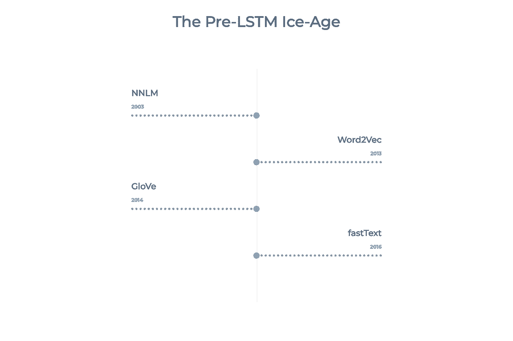

# 大多数自然语言处理模型的简明指南——前 LSTM 冰河时期——(R)NNLM，GloVe，Word2Vec & fastText

> 原文：<https://towardsdatascience.com/a-no-frills-guide-to-most-natural-language-processing-models-part-1-the-pre-lstm-ice-age-86055dd5d67c?source=collection_archive---------23----------------------->

## 对前 LSTM 语言模型的起源、用例以及优缺点的总结:(R)NNLM、GloVe、Word2Vec & fastText。

随着我对自然语言处理(NLP)的了解越来越多，我意识到关于最近模型的信息特别分散，很难获得。我希望集中概括每个不同的主要模型的起源、用例以及优缺点。在这篇文章中，我总结了四个主要的模型。

虽然这可能仍然包含一些无法解释的术语，但是通过其他帖子可以很容易地获得关于各种概念的信息。

强调“LSTM 时代”之前四种主要模式的时间表

# **(R)NNLM —(递归)神经网络语言模型(有时也称为本吉奥神经语言模型)**

这是一个非常早期的想法，也是最早的嵌入模型之一。该模型同时学习每个单词的表示和相邻单词序列的概率函数。它能够“理解”句子的语义。这项训练是以连续不断的单词袋为基础的。

假设模型输入一个句子，输出一个嵌入，它可能会考虑上下文。然而，架构仍然很简单。

最初的版本不是基于递归神经网络(RNN)，而是后来开发了一种依赖于后者的替代方案(既不是基于门控递归单元(GRUs)，也不是基于长短期记忆(LSTM)，而是真正基于“香草”RNN)。虽然 rnn 速度较慢，并且在保存长期依赖关系的信息方面经常有问题，但它允许 NNLM 模型克服其一些限制，例如需要指定其输入的长度，或者尽管输入较长，但仍能保持模型的大小不变。

谷歌已经开源了一个针对大多数语言的预训练嵌入模型(英文版在这里是)。该模型使用三个隐藏层的前馈神经网络，并在英文 Google News 200B 语料库上训练，输出 128 维嵌入。

**优点:** -简单性:训练和生成嵌入很快(对于大多数简单的应用来说可能就足够了)
-预训练的版本可以在多种语言中使用

**缺点:** 

Yoshua Bengio，Réjean Ducharme，Pascal Vincent，Christian Jauvin， [*一个神经概率语言模型*](http://www.jmlr.org/papers/volume3/bengio03a/bengio03a.pdf) (2003)，《机器学习研究杂志》

# **Word2Vec**

它起源于 Google，通常被视为 NLP 语言模型的转折点。

为了训练模型，广泛采用的 Word2Vec 版本摆脱了 NNLM 的连续单词袋，采用了跳格和负采样。本质上，模型不是试图预测下一个单词，而是试图预测周围的单词。为了使训练变得复杂，给出了许多否定的例子(通常是 4:1 ),并且该模型解决了一个简单的分类任务(两个单词在相同的上下文中吗？)使用只有一个隐藏层的神经网络。

Word2Vec 的“可解释性”让每个人都感到惊讶(例如:女人和男人经常被一个向量分开，这个向量非常类似于区分国王和王后的向量，因此可以被解释为“性别”向量)。

虽然很有影响力，但是 Word2Vec 嵌入本身并没有真正被使用，因为它们已经被后继者所取代。

预先训练好的模型可以在线获得，并且可以使用 gensim python 库导入。

**优点:**
-非常简单的架构:前馈，1 个输入，1 个隐藏层，1 个输出
-简单性:训练和生成嵌入很快(甚至是你自己的！)这对于简单的应用来说可能就足够了
-嵌入“有意义”:它可以允许破译偏差
-该方法可以扩展到许多其他领域/问题(即 lda2vec)

**缺点:
-** 在单词级训练:没有关于句子或单词使用的上下文的信息
-共现被忽略，意味着该模型在技术上忽略了单词根据其使用的上下文可能具有非常不同的含义(主要原因 GloVe 通常比 Word2Vec 更受欢迎)
-不能很好地处理未知和罕见的单词

托马斯·米科洛夫、程凯、格雷戈·科拉多、杰弗里·迪恩， [*向量空间中词表征的高效估计*](https://arxiv.org/abs/1301.3781) (2013)，学习表征国际会议

# **手套**

GloVe 通常与 Word2Vec 联系非常紧密，因为它们几乎同时出现，并且依赖于一些相同的关键概念(即嵌入向量的可解释性)。然而，它们有一些重要的区别。

在 Word2Vec 中，单词的共现频率并不十分重要，它只是帮助生成额外的训练样本。然而，对于 GloVe 来说，它是指导学习的一条中心信息。

手套未使用神经网络/跳格图/等进行训练。相反，该模型使用随机梯度下降来最小化单词嵌入的乘积和同现概率的对数之间的差异。

在斯坦福大学网站的专门页面上可以很容易地找到手套嵌入物

**优点:**
-非常简单的架构:没有神经网络
-简单:它很快(多个预先训练的嵌入)，这对于简单的应用来说可能足够了
- GloVe 通过增加单词的共现频率来改进 Word2Vec，并且在大多数基准测试中的表现优于 word 2 vec
-嵌入“有意义”:它可以允许破译偏差

**缺点:
-** 虽然共现矩阵提供了全局信息，但 GloVe 仍然在单词级别上接受训练，并且在使用单词的句子或上下文中具有相对较少的信息(特别是与我们将在未来帖子中看到的一些模型相比)
-不能很好地处理未知和罕见的单词

Jeffrey Pennington、Richard Socher 和 Christopher D. Manning， [*GloVe:单词表示的全局向量*](https://nlp.stanford.edu/pubs/glove.pdf) (2014)，自然语言处理中的经验方法

# **快速文本**

fastText 最初创建于脸书，通过将每个单词视为由“字符 n 元语法”组成的来扩展 Word2Vec。本质上，单词向量是其所有 n 元语法的总和(例如:“他们”可能有“th”、“he”、“ey”、“the”、“hey”，这取决于超参数)。

因此，对于不太频繁的单词，单词嵌入往往更好(假设它们共享一些 n 元语法)。因此，该模型还能够为未知单词生成嵌入(与 Word2Vec 和 GloVe 相反),假设它通过它们的 n 元语法来分解它们。

在多个不同的基准测试中，fastText 的性能都优于 Word2Vec 和 GloVe。

157 种不同语言的预训练模型在这里[可用](https://fasttext.cc/)

**优点:**
-相对简单的架构:前馈、1 个输入、1 个隐藏层、1 个输出(尽管 n 元语法增加了生成嵌入的复杂性)
-嵌入“有意义”:它可以允许破译偏差
-由于其 n 元语法方法，嵌入在罕见和不在词汇表中的单词上的表现比 GloVe 和 Word2Vec 好得多

**缺点:
-** 在单词级训练:没有关于该单词使用的句子或上下文的信息
-共现被忽略，这意味着该模型在技术上忽略了一个单词根据其使用的上下文可能具有非常不同的含义(手套可能是首选的主要原因)

Armand Joulin，Edouard Grave，Piotr Bojanowski and Tomas Mikolov， [*高效文本分类的锦囊妙计*](https://arxiv.org/abs/1607.01759) (2016)，计算语言学协会欧洲分会

正如您所看到的，所有四个模型都有很多相似之处，但是它们中的每一个都应该在不同的环境中使用。不幸的是，这一点经常被忽视。我希望这个指南将使你的模型决策更加明智，并引导你获得更好的结果。

*PS:我现在是伯克利的工程硕士，我还在学习这方面的知识。如果有什么需要改正或不清楚的地方，请告诉我。也可以邮件我* [*这里*](mailto:ilias.miraoui@gmail.com) *。*