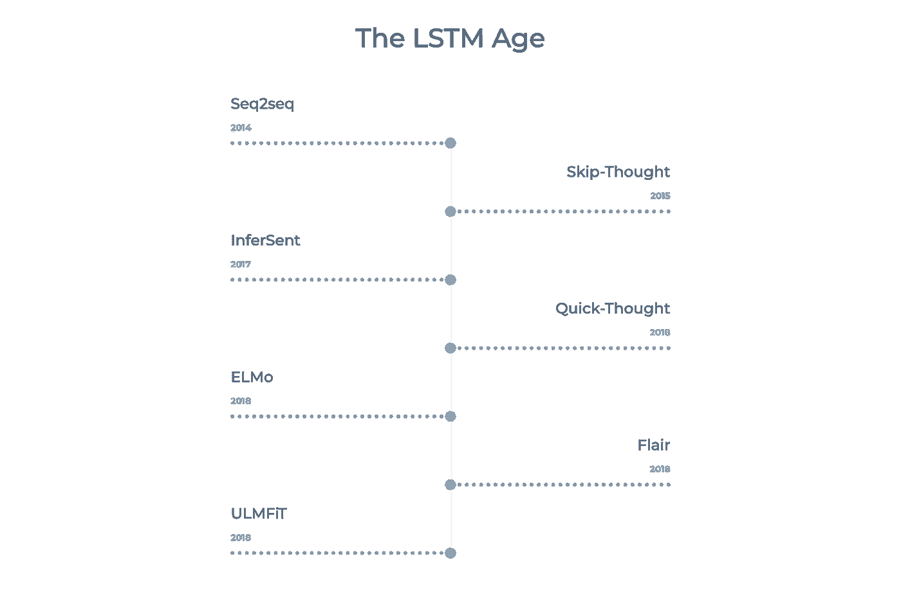
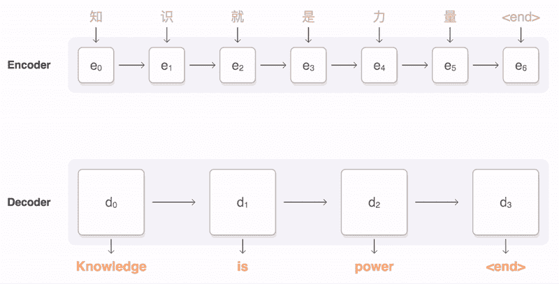

# 大多数自然语言处理模型的简明指南——LSTM 时代——seq 2 seq、InferSent、Skip-Thought、Quick-Thought、ELMo、Flair 和 ULMFiT

> 原文：<https://towardsdatascience.com/a-no-frills-guide-to-most-natural-language-processing-models-the-lstm-age-seq2seq-infersent-3af80e77687?source=collection_archive---------21----------------------->

## 总结了 LSTM 语言模型的起源、使用案例和优缺点:Seq2Seq、Skip-think、Quick think、InferSent、ELMo、Flair 和 ULMFiT

随着 LSTMs 越来越流行，NLP 社区通过从仅部分考虑单词上下文的浅层静态嵌入转移到利用周围上下文创建更深层表示的更上下文化/动态的单词表示，改进了语言模型。

虽然这可能仍然包含一些无法解释的术语，但是通过其他帖子可以很容易地获得关于各种概念的信息。

突显“LSTM 时代”七种主要模式的时间线

# Seq2seq

**没有嵌入**

Seq2seq 在这个列表中很突出，因为它本身不生成嵌入。然而，它可以成为一个人的 NLP 工具包中的一个有价值的武器，因为它可以很容易地适应特定的用例。

Google 在机器翻译的背景下引入了 Seq2seq。这是第一个使用注意力的模型(被最近的 transformer 架构广泛利用)。该结构在编码器/解码器之间划分，并且它们中的两个使用波束搜索与注意力层相关(参见下图或[吴恩达的自由序列模型课程](https://www.coursera.org/learn/nlp-sequence-models/home/welcome)以获得关于注意力机制的更多细节)。

图片来自[谷歌的 seq2seq GitHub](https://github.com/google/seq2seq)

Seq2seq 因彻底改变了机器翻译而闻名(在谷歌翻译上几个月内超过了统计学家多年的工作)。它也可以很容易地调整为其他任务，其中输出是一个序列(即会话或总结)。

**优点:**
-生成序列的卓越性能(它奠定了 transformer 模型的基础)
-与“传统”LSTM 模型相比，注意力层允许更好地处理长期依赖性

**缺点:** 

Ilya Sutskever，Oriol Vinyals，Quoc V. Le，[用神经网络进行序列对序列学习](https://arxiv.org/abs/1409.3215)(2014)，NIPS

# 跳过思维向量(奖励:思维敏捷)

句子级嵌入

Skip-Thought Vectors 基于静态单词嵌入中使用的 skip-gram 训练方法，并将其扩展到句子。Skip-Thought 不是使用一个单词并试图预测上下文，而是使用一个句子并试图预测周围的句子。

该模型使用递归神经网络(通常是 GRU 或 LSTM)对句子中的单词进行编码。然后，它使用以编码器的输出为条件的解码器(也称为它使用与编码器相同的嵌入层)来生成最佳可能的目标输出(下一个和上一个句子)。使用实际编码的句子和预测的嵌入之间的差异，训练该模型以尽可能准确地预测其周围的句子。

Quick Thoughts 是后来开发的另一个模型，它使用类似的编码器/解码器策略。不同的是，它是在一个更经典的分类任务上训练的，更接近于 skip-gram 和负采样。对于每个句子，另一个目标句子被提供给解码器(与编码器的权重相同)，然后编码的原始句子和“解码的”句子被提供给分类器进行“比较”(即原始句子是否与目标句子相邻)。

考虑到训练中的差异，快速思维通常被认为更适合区分性任务，而跳过思维更适合生成性任务。

**优点:** -句子级嵌入对某些任务有用
-通用和健壮的句子嵌入:在许多下游任务(语义相似性、分类等)上相当准确。)

**缺点:** -LSTM 结构和嵌入在句子级别的事实使其训练缓慢，使用大量内存，并且难以训练长句
-它是第一个句子嵌入之一，因此不再被认为是最先进的(SOTA)
-它被训练的任务，即预测相邻的句子， 很难(即使对人来说也是如此)，所以通常不是最好的嵌入方式(尽管快速思考会使问题简化一点)
-使用 Skip 思想，一个句子被嵌入到一个 2400 维的向量中，比大多数其他类型的嵌入方式都要多得多
-与长期的上下文依赖作斗争(与基于 transformer 的长句模型相比)

Jamie Ryan Kiros，Yukun Zhu，Ruslan Salakhutdinov，Richard S. Zemel，Antonio Torralba，Raquel Urtasun，Sanja Fidler，[Skip-think Vectors](https://papers.nips.cc/paper/5950-skip-thought-vectors.pdf)(2015)，NIPS

Lajanugen Logeswaran，Honglak Lee，[学习句子表征的有效框架](https://arxiv.org/pdf/1803.02893.pdf) (2018)，ICLR

# InferSent

**句子级嵌入**

使用 Stanford 自然语言推理(SNLI)语料库，通过使用双 LSTM 层(具有最大池)来编码句子对(两个句子使用相同的编码器)来构建推理。添加几个密集层，并训练模型来预测这两个句子是体现“中性”、“矛盾”还是“蕴涵”。在向量被馈送到双 LSTM 层之前，单词通常首先被转换成静态单词嵌入(在原始情况下是手套嵌入)。结果，隐含嵌入提供了句子的深层语义表示。

由脸书创建的 InferSent 也可以很好地推广到其他任务，并且预先训练的版本很容易在脸书研究公司的 GitHub 上获得。

**优点:** -句子级嵌入可能对某些任务有帮助
-该模型在复述检测和蕴涵任务上表现特别好

**缺点:** -复杂的双 LSTM 结构使其训练和生成嵌入变得缓慢
-输出是 4096 维的嵌入，这显著多于几乎所有其他语言模型
-在情感分析、语义关联、标题检索等许多任务上的表现不如 ELMo 或 Flair。
-监督训练使得很难在定制数据集/更具体的上下文中重现
-与长期上下文依赖作斗争(相对于基于转换器的长句模型)

Conneau，Alexis 等人，[从自然语言推理数据](https://arxiv.org/abs/1705.02364) (2017)，计算语言学协会

# ELMo(语言模型嵌入)

**单词级嵌入**

ELMo 使用深度双 LSTM 架构来创建情境化嵌入。
如 [AllenNLP](https://allennlp.org/elmo) 所述，ELMo 表示为:“上下文”(取决于使用单词的上下文)、“深度”(通过深度神经网络训练)和“基于字符”(参见 fastText 嵌入，以便更好地处理不在词汇表中的单词)。

为了训练模型，ELMo 使用正向和反向语言建模(LSTM 的一个方向预测第一个单词，另一个方向预测最后一个单词)。

该模型包含许多层，这些层之间存在残余连接。有趣的是，每一层最终都会学习句子的不同特征，比如前几层的词性标注和后几层的词义消歧。

通过 [Tensorflow Hub](https://tfhub.dev/google/elmo/3) ，可以轻松使用在 10 亿字基准上预先训练的 ELMo 嵌入。

**优势:** ——深度的基于上下文和字符级的单词表示，适用于更复杂的任务
——在许多任务上表现得比简单的嵌入好得多
——易于使用的预训练版本

**缺点:** -复杂的双 LSTM 结构使其训练和生成嵌入非常缓慢
-类似的模型如 Flair(见下文)通常表现更好
-与长期上下文依赖作斗争(相对于长句的基于 transformer 的模型)

马修·e·彼得斯、马克·诺依曼、莫希特·伊耶、马特·加德纳、
克里斯托弗·克拉克、肯顿·李、卢克·塞特勒莫耶、  [深度语境化的词语表征](https://arxiv.org/abs/1802.05365) (2018)、NAACL

# 天资

**单词级嵌入**

随着 ELMo 的流行，Flair 由 Zalando Research 开发，并在 ELMo 的基础上通过更多地依赖角色级别进行了改进。

与 ELMo 类似，Flair 学习基于字符的双 LSTM(也使用向前和向后语言建模)。然而，此外，单词嵌入是通过将单词一个字符一个字符地给定到两个 LSTMs 中并仅保持/连接每个单词的最后状态(即，第一个和最后一个字符)来表示单词嵌入而计算的。

Flair 单词嵌入有多种语言版本，使用 [Flair python 库](https://github.com/flairNLP/flair)(构建于 PyTorch 之上)可以非常容易地生成。

**优势:** -适用于更复杂任务的深度基于上下文和字符级别的单词表示
-考虑到嵌入的特殊性，仅保留第一个和最后一个状态，嵌入尤其能很好地处理词汇外的标记，并能处理小得多的字典
-表现优于静态嵌入，通常在许多任务上 ELMo
-易于访问预训练版本

**缺点:** -复杂的双 LSTM 结构使得训练和生成嵌入非常缓慢
-与长期上下文依赖作斗争(与基于转换器的长句模型相比)

Akbik 等人，[用于序列标记的上下文字符串嵌入](https://www.aclweb.org/anthology/N19-4010.pdf) (2018)，计算语言协会 Seq2Seq

# 乌尔菲特

**单词级嵌入**

ULMFiT 源于 Fast.ai，通常被认为是第一个真正有效地将迁移学习推广到任何任务的模型。

ULMFiT 依赖于双向 LSTM 架构(向前和向后语言建模)。ULMFiT 在三个连续的任务上进行训练:在维基百科数据集上进行通用领域语言模型预训练，在 IMDb 数据集上进行特定任务语言模型微调，最后在 IMDb 数据集上进行特定任务分类器微调。

两项发展使 ULMFiT 具有出色的性能:
-随着训练的进行，ULMFiT 在微调过程中通过逐渐解冻其不同层来进行微调，以及
-它使用“倾斜三角形学习率(STLR)”，这意味着学习率开始增加，随后随着训练的进行以线性方式衰减。

ULMFiT 的主要优势在于它能够轻松适应各种任务。对迁移学习的特别关注使 ULMFiT 成为许多任务/适应的非常好的竞争者。

使用 [Fast.ai Python 库](https://github.com/fastai/fastai)和他们的[教程](https://docs.fast.ai/text.html)，可以很容易地下载和微调一个预先训练好的模型。

**优点:** -通用:一个预先训练好的模型，非常容易适应任何任务
-LSTM 模型的出色性能
-需要比其他模型少得多的数据来针对特定领域/任务进行微调
-由于 Fast.ai 的精彩教程，易于访问和使用

**缺点:** -复杂的双 LSTM 结构使得训练和生成嵌入非常缓慢
-与长期上下文依赖作斗争(与基于转换器的长句模型相比)

杰瑞米·霍华德，塞巴斯蒂安·鲁德，[文本分类通用语言模型微调](https://arxiv.org/abs/1801.06146) (2018)，计算语言学协会

与静态嵌入相比，上下文化的表示对于更复杂的任务来说要强大得多，并且知道选择哪种模型会对模型的性能产生重大影响。像往常一样，努力记住每个模型是如何被训练的，并努力找到其主要任务与应用程序的目的最相似的模型。希望这篇文章能帮助你更好地理解众多 LSTM 时代模型的优缺点和用例。

虽然基于 transformer 的模型提供了更复杂的表示，可以考虑长期的依赖性，但是 LSTM 模型在 transformer 模型的复杂性和有时过于简单的静态嵌入之间提供了一个非常相关的替代方案。

PS:我现在是伯克利的工程硕士，我还在学习这方面的知识。如果有什么需要改正或不清楚的地方，请告诉我。你也可以发邮件给我 [*这里*](mailto:ilias.miraoui@gmail.com) *。*