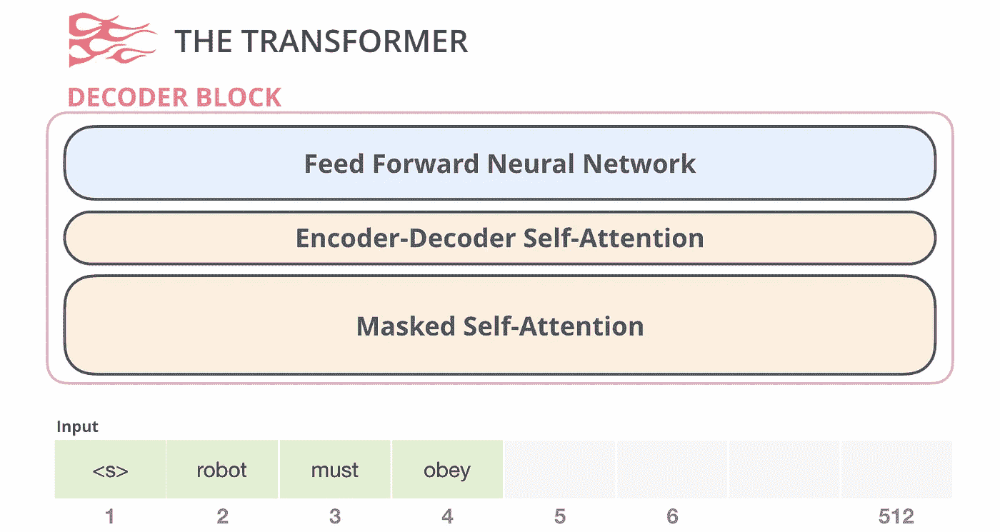
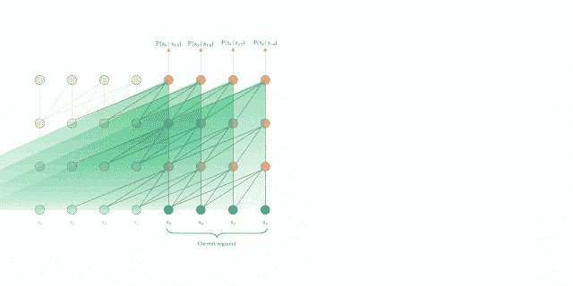
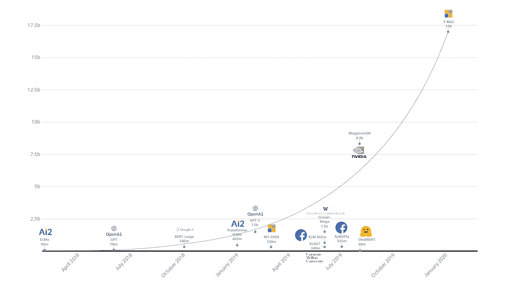

# 大多数自然语言处理模型的简明指南——Transformer(XL)时代

> 原文：<https://towardsdatascience.com/a-no-frills-guide-to-most-natural-language-processing-models-the-transformer-xl-era-ff5035f04e0f?source=collection_archive---------28----------------------->

## 从通用语句编码器到 Open-GPT2、(AL)BERT、XLNET 和图灵-NLG

LSTMs 非常受欢迎，但是它们也有很多限制。它们计算量很大，并且很难维持长期的依赖关系(尽管它们的名字如此)。2018 年，谷歌发表了一篇论文[“注意力是你所需要的一切”](https://arxiv.org/abs/1706.03762)介绍了变形金刚，表明我们可以克服递归神经网络的很多缺陷，并彻底改变语言模型领域。

*虽然这可能仍然包含一些无法解释的行话，但通过其他帖子应该很容易获得关于各种概念的信息。*

展示变形金刚时代主要型号的时间表

# 通用句子编码器

谷歌发布了通用句子编码器，旨在提供一种句子嵌入，这种句子嵌入特别适合迁移学习，可以用于各种各样的任务(因此是“通用的”)。

通用句子编码器最初发布了两个版本:一个利用深度平均网络(DANs)，另一个使用变压器。自最初实现以来，谷歌已经发布了许多基于 [DANs](https://tfhub.dev/google/universal-sentence-encoder/4) 或 [Transformers](https://tfhub.dev/google/universal-sentence-encoder-large/5) 的版本，并使它们在他们的 [Tensorflow Hub](https://tfhub.dev/) 平台上非常容易访问。所有模型都采用单词、句子或句子组，并输出 512 维的向量。

为了训练这个模型，谷歌使用了各种各样的数据源和任务，但主要的是围绕着在斯坦福自然语言推理语料库上识别相似的句子(所谓的“语义文本相似性”)。这种语言模型在这个任务上表现得特别好。

**优点:**
-该模型在句子相似度方面表现特别好
-在各种各样的“开箱即用”任务方面表现相对较好
-将您的输入转换为嵌入非常快(比大多数 LSTM 模型快得多)

**缺点:** -模型可以嵌入单词或句子。但是，它是针对句子进行训练的，因此当输入不是正确的“句子”时应该更加小心使用
-其特殊的训练(主要集中在句子相似性上)使其具有独特的地位，但也使其在各种任务(如文本生成)中的表现不如其他模型

Cer 等人[通用语句编码器](https://arxiv.org/abs/1803.11175) (2018)，ACL

# Open-GPT2

最初，OpenAI 在开发 Open-GPT2 时拒绝发布他们的模型，因为他们认为它太危险，并担心人们可能会恶意使用它。

该模型有大约 15 亿个参数，并在 OpenAI 的 WebText 数据集上进行训练，该数据集包含超过 800 万个文档和大约 40 GB 的文本数据(一些人试图复制和开源[他们的版本](https://skylion007.github.io/OpenWebTextCorpus/))。

Open-GPT2 由具有多头注意力的变压器解码器块组成，并接受语言建模训练，一次预测一个下一个令牌。由于这种训练，它特别适合文本生成。

来自 http://jalammar.github.io/illustrated-gpt2/[的图表说明了 Open-GPT2 解码器的不同层次](http://jalammar.github.io/illustrated-gpt2/)

OpenAI 最终向公众发布了这个模型，现在已经可以轻易获得了。

该模型需要大量的磁盘空间、计算和内存资源。

**优点:** -由于数据集和从左到右的语言建模训练方法，在文本生成方面表现出色(明显优于 BERT 和其他从掩蔽语言模型学习的类似模型)

**缺点:** -仅用于文本生成:该非营利组织看到了该模型在语法辅助、自动完成、创造性写作和游戏/聊天机器人创建方面的潜在用例，但这仍然有限
- GPT-2 占用超过 5Gb，需要非常高的计算和内存要求(提取的模型有所帮助，但仍在进行中)

拉德福德等人[语言模型是无监督的多任务学习者](https://d4mucfpksywv.cloudfront.net/better-language-models/language-models.pdf) (2019)

# 伯特

谷歌在 2018 年底发布了 BERT，吸引了大量关注。该模型利用多层双向变压器架构(即带有一个编码器和一个解码器)，在广泛的任务中创下了新的记录。

BERT 主要在两个任务上接受训练:
-掩蔽语言模型:该模型试图预测随机掩蔽的句子的大约 15%的单词
-识别下一个句子

BERT 占用大量内存，速度相对较慢。基础版和大版分别有 1000 万和 3.4 亿个参数。

2019 年，另一个研究团队发布了 ALBERT，引入了参数缩减技术，允许降低内存要求和提高训练速度，同时取得了明显优于 BERT 的结果，在一些主要基准上达到了最先进的水平(SOTA)。ALBERT 的参数比 BERT-large 少 18 倍，训练速度快 1.7 倍。

伯特和 T2【艾伯特都很容易访问，你可以通过 [Tensorflow Hub](https://tfhub.dev/) 轻松创建你的嵌入。

**优势:** -在多种任务(分类、句子相似度、名称实体识别、问题回答)上表现出色
-在 [Tensorflow Hub 上有超过 100 种不同语言的模型](https://tfhub.dev/)

**缺点:** 

Devlin 等人 [BERT:用于语言理解的深度双向转换器的预训练](https://arxiv.org/abs/1810.04805) (2018)，ACL

兰等[阿尔伯特:一个用于语言表征自我监督学习的 Lite BERT](https://arxiv.org/abs/1909.11942)(2019)

# XLNet

来自谷歌大脑和卡耐基梅隆大学的一组研究人员研究了 BERT 的主要缺陷，并利用新的 [Transformer-XL](https://arxiv.org/abs/1901.02860) 架构发布了 XLNet，在 18 个 NLP 任务上实现了 SOTA。

XLNet 基于 [Transformer-XL](https://arxiv.org/abs/1901.02860) 。后者对 Transformer 架构进行了改进，速度快了很多(根据 Google 的说法是 1800+),并且增加了段级递归以及相对位置编码。与标准的 transformer 架构相比，它能够处理更大的句子，并保留更长时间的依赖性。Transformer-XL 学习依赖关系的时间分别比 RNNs 和标准 Transformer 长约 80%和约 450%。

来自[https://ai . Google blog . com/2019/01/Transformer-XL-unleashing-potential-of . html](https://ai.googleblog.com/2019/01/transformer-xl-unleashing-potential-of.html)解释 Transformer-XL 的段级递归机制的图形

伯特展示了两个大问题。屏蔽的令牌出现在训练中，但不出现在微调中，导致训练测试偏斜
2。被屏蔽的令牌是并行预测的，因此它们之间的依赖关系通常不能被正确处理。

通过使用“置换语言建模”，XLNet 能够克服这一点。XLNet 不是预测下一个令牌或前一个令牌，而是以随机顺序预测令牌。假设 Transformer-XL 允许它保持位置嵌入的一致性，并且该模型将定位与嵌入的剩余部分分开，并且在尝试预测屏蔽的记号时保持其可用，则该模型仍然能够以所需的顺序处理记号。

由于 Transformer-XL 架构，以前的段被缓存和冻结，使得置换语言建模成为可能，而无需知道以前的置换顺序。

通过所有的改进，XLNet 有效地取代了(AL)BERT，成为语言模型中的新参考。该模型可以很容易地在 Tensorflow 2.0 和 PyTorch 上使用[拥抱脸的变形金刚库](https://github.com/huggingface/transformers)进行使用和调整。

**优势:** -在几乎所有任务上比(AL)BERT 表现更好
-比(AL)BERT
训练和使用速度快得多-由于其“置换语言建模”和自回归方法，在文本生成方面相当不错

**缺点:** 

杨等 [XLNet:面向语言理解的广义自回归预训练](https://arxiv.org/abs/1906.08237) (2019)

# 图灵-NLG

2020 年 2 月，微软提出了一个有 170 亿个参数的生成语言模型。该模型有 78 个变形层和 28 个注意力头。

该模型的许多成就源于微软实现的并行化，以跨 GPU 训练图灵-NLG。作者充分利用了 PyTorch 和最近的微软库/出版物，如 [DeepSpeed](https://github.com/microsoft/DeepSpeed) 和 [ZeRO](https://www.microsoft.com/en-us/research/publication/zero-memory-optimization-towards-training-a-trillion-parameter-models/) ，这些库/出版物显著改善了具有超过 10 亿个参数的深度学习模型的并行训练。

目前，作者对模型的许多细节保持沉默，提到了不同的层类型，以及它是以多任务的方式训练的。尽管如此，这种规模的模型标志着大规模深度学习语言模型的重大突破，可能是未来趋势的一个标志。

图表突出显示了来自微软研究院博客的最新模型及其参数数量([https://www . Microsoft . com/en-us/Research/Blog/turing-NLG-a-170 亿-parameter-language-model-by-Microsoft/](https://www.microsoft.com/en-us/research/blog/turing-nlg-a-17-billion-parameter-language-model-by-microsoft/))

这个模型最近才发布，但是使用[微软的 API](https://developer.msturing.org/) 来生成这个模型的嵌入是可能的。

**优点:** -在众多任务中实现 SOTA，在文本生成方面非常高效

**缺点:** ——相对难以接近，不可能训练出自己的模型
——目前还没有透露太多细节

罗赛特，科比。[图灵-NLG:微软的 170 亿参数语言模型](https://www.microsoft.com/en-us/research/blog/turing-nlg-a-17-billion-parameter-language-model-by-microsoft/) (2020)

在过去的两年里，变形金刚彻底改变了 NLP 的世界。这个领域已经从静态嵌入(我在这里写了那些[的概述](/a-no-frills-guide-to-most-natural-language-processing-models-part-1-the-pre-lstm-ice-age-86055dd5d67c))和第一个上下文化的表示(我在这里写了那些[的(其他)概述](/a-no-frills-guide-to-most-natural-language-processing-models-the-lstm-age-seq2seq-infersent-3af80e77687))走了很长的路。Transformer、Transformer-XL 和分布式计算的进步允许开发具有更多参数的模型，这些模型能够保留越来越多的长期依赖关系。一些最新的模型已经能够在许多 NLP 任务中击败人类，并且它们能够生成的文本越来越难与人类书写的文本区分开来。成为基准的新模型似乎每 6 个月就出现一次，在 NLP 中从未像现在这样令人兴奋。

如果你想从生成建模中获得乐趣并创建酷文本，我强烈推荐抱抱脸的[“用变形金刚写”](https://transformer.huggingface.co/)。

*PS:我现在是伯克利的工程硕士，我还在学习这方面的知识。如果有什么需要改正或不清楚的地方，请告诉我。你也可以发邮件给我* [*这里*](mailto:ilias.miraoui@gmail.com) *。*