# 一个关于希格斯玻色子如何赋予粒子质量的合理解释

> 原文：<https://towardsdatascience.com/a-no-nonsense-explanation-of-how-the-higgs-gives-particles-their-masses-639a0aba6d54?source=collection_archive---------8----------------------->

## 希格斯机制的简化解释

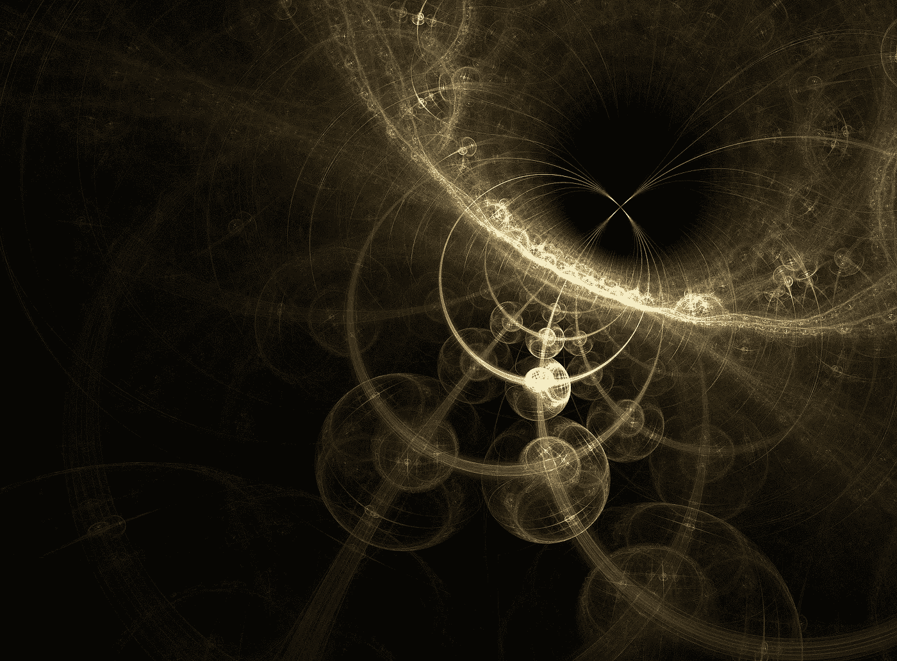

图片来自[皮克斯巴伊](https://pixabay.com/fr/?utm_source=link-attribution&utm_medium=referral&utm_campaign=image&utm_content=1280081)的[加里克·巴尔塞吉安](https://pixabay.com/fr/users/insspirito-1851261/?utm_source=link-attribution&utm_medium=referral&utm_campaign=image&utm_content=1280081)。

粒子物理学家主要在 20 世纪下半叶发展了一个优雅的理论模型，构成了我们理解宇宙中基本粒子和力的框架。这个强大的框架就是所谓的标准模型，它的主要成分之一是希格斯场，这是一个无处不在的量子场，负责给粒子赋予质量。由于量子力学中的波粒二象性，希格斯场有一个与之相关的基本粒子，即所谓的希格斯玻色子。
这篇文章的目标是为希格斯玻色子及其特性提供一个更加数学化的解释。

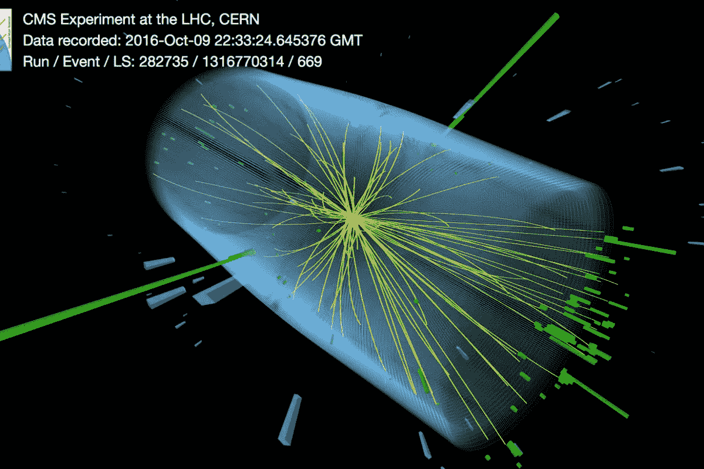

图 1: *这张图片显示了希格斯玻色子衰变为两个光子的事件，其中绿线是它们的能量沉积。这个实验让科学家缩小了希格斯粒子的质量(* [*来源*](https://newatlas.com/physics/higgs-boson-mass-measured/) *)。*

# 自发对称性破坏

正如 Zee 所观察到的，尽管自然的基本法则有几种对称，但我们所经历的世界远非对称。用物理学术语来说，我们的[拉格朗日量](https://en.wikipedia.org/wiki/Lagrangian_%28field_theory%29)是对称的，但他们描述的世界却不是。事实上，研究这种对称性如何被打破是物理学的一个中心话题。

首先，让我们考虑一个对称性破缺的例子，其中系统由相互作用的 *N* 分量标量场组成。

## 标量字段

考虑一个具有分量的 *N* 维标量场的拉格朗日量:

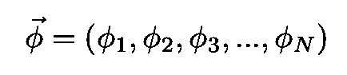

情商。1:*N*-维标量场。

用[拉格朗日*密度*T3 给出:](https://en.wikipedia.org/wiki/Lagrangian_(field_theory))

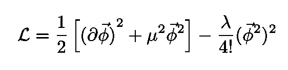

情商。2:旋转对称的拉格朗日密度(在 N 维中)。

注意质量项的符号是负的(故意的)。[拉格朗日](https://en.wikipedia.org/wiki/Lagrangian_(field_theory))是:

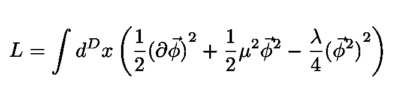

情商。3:拉格朗日密度 Eq 对应的拉格朗日。2.

**情况 *N* =1** 如果 *N* =1，则拉格朗日函数有极值

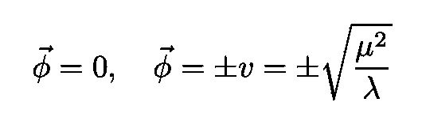

情商。4:拉格朗日 l 的极值这里，第一个 **ϕ** 是局部最大值

其中 *ϕ* =0 是最大值。其他两个 *ϕ* 中的任何一个，即 *v* 或- *v* ，都是等价的基态，我们可以选择其中一个作为我们的基态。基态被称为 VEV(真空期望值)。

注意，两个极值之间的隧道势垒是无穷大:

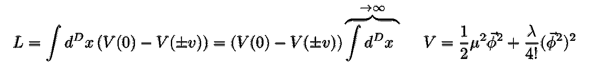

情商。5:QFT 拉格朗日 L 的极值之间的势垒是∞。

这是因为方程中的时空积分。5 是无限的。由于势垒是无限的，基态波函数**不能在极值之间**隧穿。它必须保持在由等式的正版本确定的值 *v* 。4.于是，普通[量子力学](https://en.wikipedia.org/wiki/Quantum_mechanics)中存在的反射对称性 *ϕ* → - *ϕ* 被打破。但是，正如 Zee 指出的[，对称破缺是**而不是**在 *L* 中(人为)引入新术语造成的。*ϕ*→*ϕ*对称性被“自己”打破。](https://books.google.com.br/books?id=n8Mmbjtco78C&printsec=frontcover&dq=zee+quantum+field+theory&hl=en&sa=X&ved=2ahUKEwiD-5WR6qHrAhWAIbkGHZ2wCNcQ6AEwAHoECAQQAg#v=onepage&q=zee%20quantum%20field%20theory&f=false)

**案例 *N* =2** 势，在这个案例中，就是著名的[墨西哥帽势](https://en.wikipedia.org/wiki/Spontaneous_symmetry_breaking#Mexican_hat_potential)。我们现在有无限多的物理等价极小值(或真空)。所有这些真空具有相同的(平方)值，即:

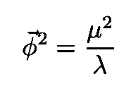

情商。6:N = 2 时所有最小值的平方值。

现在请注意，每个最小值指向不同的方向。但是结果不能取决于*的选择——所以我会跟着 Zee 的方向而选择:*

*   ****ϕ*** 要在单向(这样 *ϕ* ₂=0).*
*   *等式给出的 *ϕ* ₁=+ *v* 的值。6(正号)。*

*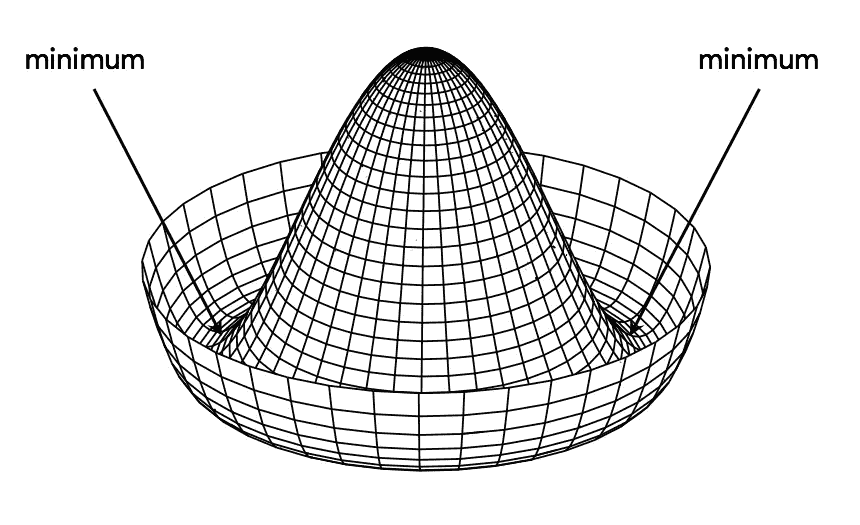*

*图 2:v(ϕ的“墨西哥帽”势函数及其无穷小值。*

*我们现在研究ϕ₁和ϕ₂的波动，把最小值写成:*

**

*情商。7:最小值附近的波动。在该电势的最小值处，1 分量在径向上波动，2 分量在圆周上波动。*

*1-分量在径向上波动，2-分量在电势的最小值处围绕圆周波动(因此，其绝对值不变)。*

*代入等式。7 在拉格朗日中我们得到:*

*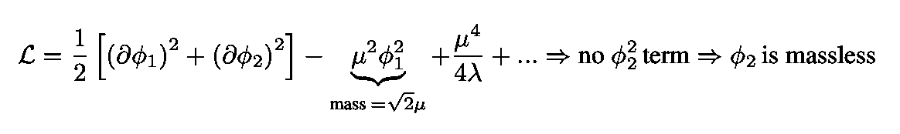*

*情商。8:**ϕ**的第二个部件是无质量的！*

*这个等式告诉我们， ***ϕ*** 的二维分量是无质量的。*

# *希格斯机制*

*我们现在将在我们的拉格朗日量中包括一个规范场 ***一个*** 。根据定义，规范理论是一种场论，它的拉格朗日量在某些类型的群的变换下是不变的。根据规范原理，它是宇宙中三个基本相互作用的基础，如果我们改变描述它的方式，物理学不应该改变。规范理论有两种类型:阿贝尔和非阿贝尔。阿贝尔规范理论的一个例子是我们熟悉的电磁理论。*

## ***电磁场***

*让我们从电场和磁场的麦克斯韦方程开始， **E** 和 **B** :*

*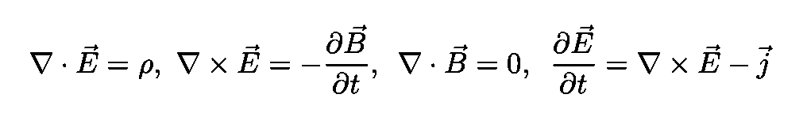*

*情商。9:电场和磁场的麦克斯韦方程组， ***E*** 和 ***B.****

*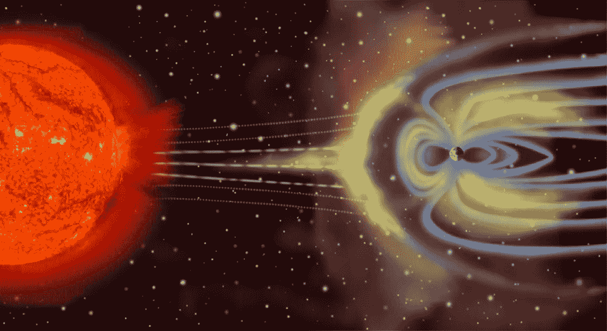*

*图 3:描绘了一场地磁暴，带电粒子通量的激增改变了地球的磁场，在大气中感应出电场。这种现象导致电网中的电涌([来源](https://en.wikipedia.org/wiki/Maxwell%27s_equations#Faraday's_law))。*

*电场和磁场可以用电势 *V* 和**A*A*表示如下:***

*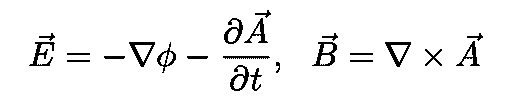*

*情商。10:用电势 *V* 和**a .写出的电场和磁场***

*我们可以将 *V* 和**A组合成矢势:***

*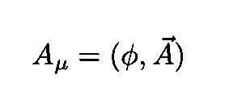*

*情商。11:四矢量(或[双矢量](https://en.wikipedia.org/wiki/Four-vector#Dual_vectors))电位。*

*与电磁场有关的拉格朗日量，它的方程在矢势的规范变换下是不变的*

*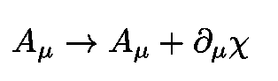*

*情商。12:规范变换，其中χ是标量函数*

*由下式给出:*

*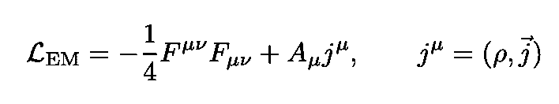*

*情商。13:电磁场的拉格朗日量。矢量 **j** 是以电荷和电流密度为分量的 4-电流。*

*而张量 ***F*** 是:*

*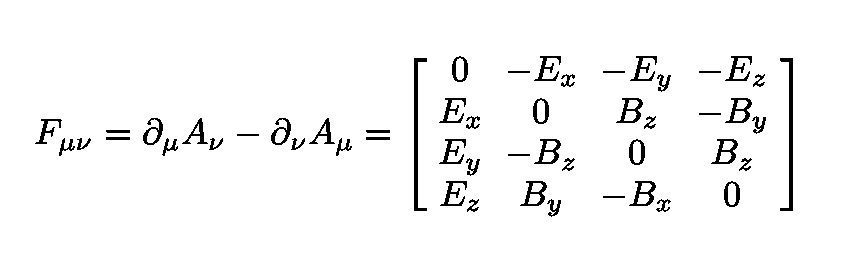*

*情商。14:电磁场张量。*

*注意 ***F*** 在规范变换 Eq 下不变。12(按建筑)。阿贝尔规范理论在 U(1)群下是全局不变的。次数为 *n* 的酉群 U( *n* )由 *n* × *n* 酉矩阵组成，具有矩阵乘法的群运算。群 U(1)也称为[圈群](https://en.wikipedia.org/wiki/Circle_group)，是所有模数为1 的复数的乘法群。*

*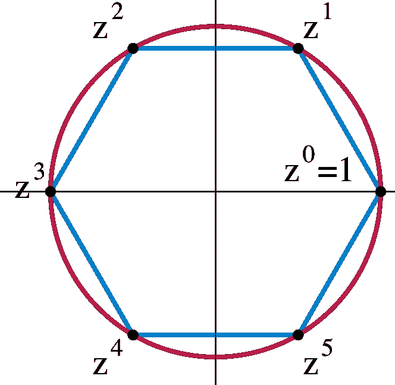*

*图 4:圆组 U(1)的图解([来源](https://en.wikipedia.org/wiki/Circle_group))。*

***狄拉克场** 狄拉克场 *ψ* 是[费米子场](https://en.wikipedia.org/wiki/Fermionic_field)的一个例子，这是一个量子场，它的量子是[费米子](https://en.wikipedia.org/wiki/Fermion)(它们服从[费米-狄拉克统计](https://en.wikipedia.org/wiki/Fermi%E2%80%93Dirac_statistics))。这种场服从正则反对易关系，与[玻色子场](https://en.wikipedia.org/wiki/Bosonic_field)相反，玻色子场服从正则对易关系。*

*电荷为 e、质量为 m、T42 的狄拉克场有如下的自由拉格朗日量*

*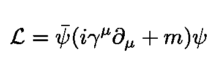*

*情商。15:自由的狄拉克拉格朗日。*

*其中:*

*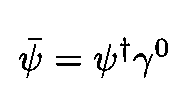*

*情商。16:狄拉克伴随。*

*是狄拉克伴随场，并且:*

*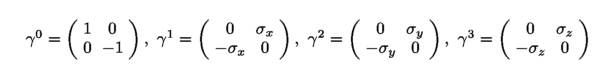*

*情商。17:伽玛矩阵的标准表示。*

*是[伽马矩阵](https://en.wikipedia.org/wiki/Gamma_matrices)的标准表示。狄拉克拉格朗日量在全局规范变换下是不变的:*

*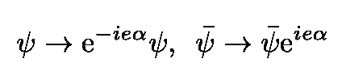*

*情商。18:全球规范转换。*

*在局部规范变换中， *α* 变成函数 *α* ( *x* )并且新的拉格朗日不变量在*

*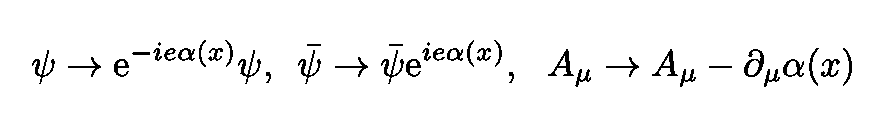*

*情商。19:局部规范变换。*

*变成了:*

*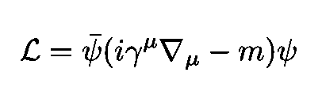*

*情商。20:局域规范变换下的自由狄拉克拉格朗日不变量。*

*其中:*

*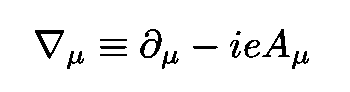*

*情商。21:协变导数。*

*包括电磁场和狄拉克场的量子电动力学(或 QED)拉格朗日量为:*

*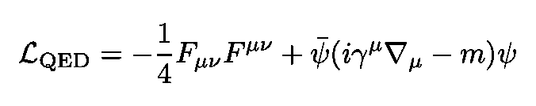*

*情商。22:量子电动力学(或 QED)拉格朗日量。*

*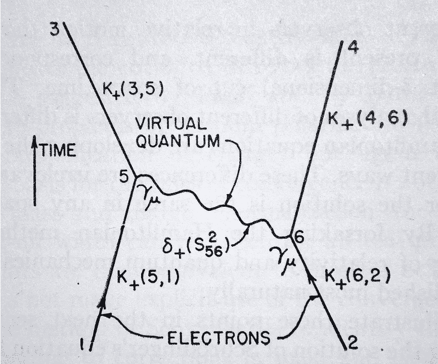*

*图 5:首次发表的费曼图，它出现在理查德·费曼的物理评论论文“量子电动力学的时空方法”([来源](https://galileo-unbound.blog/2019/03/09/feynman-and-the-dawn-of-qed/))。*

# *希格斯场和希格斯玻色子*

*如前所述，我们的世界不是规范对称的。然而，一个理论有可能具有某种对称性，即使我们对那个物理理论的经验没有反映出相应的对称性。没有大量无质量的向量场(例如电磁场)意味着规范对称性被破坏。*

*现在让我们考虑一个在规范理论中自发对称性破缺是如何发生的例子。为简单起见，我将考虑最简单的规范理论，即电磁学，它是一个 U(1)规范场，耦合到一个复杂的标量场 *ϕ.**拉格朗日量，在 Eq 下不变。18 是:**

**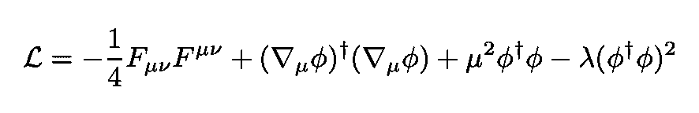**

**情商。22:耦合到复标量场的 U(1)规范场的拉格朗日量。**

**这里的组件 *ϕ* ₁和 *ϕ* ₂是**ϕ.的实部和虚部****

**现在我们将标量场写成如下形式:**

**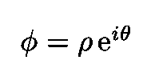**

**情商。23:用极坐标表示的标量场。**

**进行转变**

**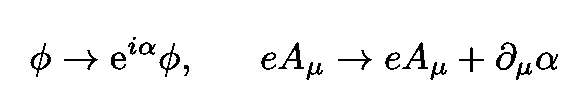**

**我们生成一个规范不变的组合:**

**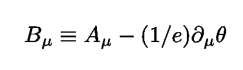**

**情商。24:规范不变组合。**

**正如我们之前所做的，我们选择**

**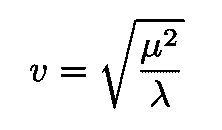**

**情商。25:标量电位最小的点。**

**电位最小的值。**

**如前所述添加波动项**

**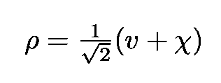**

**情商。26:为说明自发对称性破缺而增加的波动项。**

**我们得到下面的拉格朗日量:**

**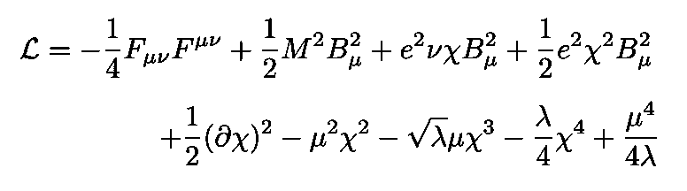**

**情商。27:拉格朗日方程。22 增加一个波动项来解释自发的对称性破缺。**

**这个拉格朗日描述了一个质量为 *M* = *ev* 的向量场 ***B*** ，它与质量为 has 的标量场χ相互作用**

**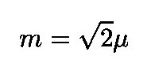**

**情商。28:标量场的质量χ。**

**注意，玻色子 *θ* 在拉格朗日中是不存在的。一说 *θ* 被规范场**T5 AT7“吃掉”变成了**BT11，现在是**大质量**。先前的无质量场 ***A*** 具有两个自由度，或者等效地，两个偏振方向(两个自旋方向)。大质量规范场获得多一个(纵向)自由度(或多一个可能的自旋状态)。这种从无质量到有质量的转变被称为希格斯机制，ϕ被称为希格斯场。而正如简介中所解释的，由于量子力学中的波粒二象性， *ϕ* 有一个与之相关的基本粒子，即所谓的**希格斯玻色子**。******

**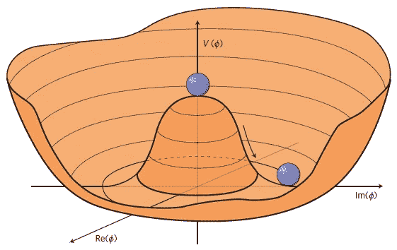**

**图 6:希格斯势。选择底部的任何一个点都会自发破坏旋转 U(1)对称性([来源](https://arxiv.org/pdf/1312.5672.pdf))。**

# **电弱理论和大质量矢量玻色子**

**电弱理论描述了电磁力和弱核力。**

**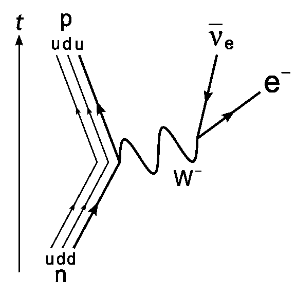**

**图 7:一个中子通过一个中间重 W 玻色子([源](https://en.wikipedia.org/wiki/Weak_interaction))β-衰变为质子、电子和电子反中微子。**

**这些力量看起来非常不同:**

*   **弱核力只在很小的距离内起作用(小于原子核)**
*   **电磁力作用于巨大的距离，并随着距离的平方而减小。**
*   **质子之间的电磁力比弱核力强 10⁶倍。**

**然而，物理学家[谢尔登·格拉肖](https://en.wikipedia.org/wiki/Sheldon_Lee_Glashow)、[阿卜杜勒·萨拉姆](https://en.wikipedia.org/wiki/Abdus_Salam)和[史蒂芬·温伯格](https://en.wikipedia.org/wiki/Steven_Weinberg)表明，在所谓的[统一能量](https://en.wikipedia.org/wiki/Electroweak_scale) (~246 [GeV](https://en.wikipedia.org/wiki/GeV) )之上，这些力会合并成一个力。**

**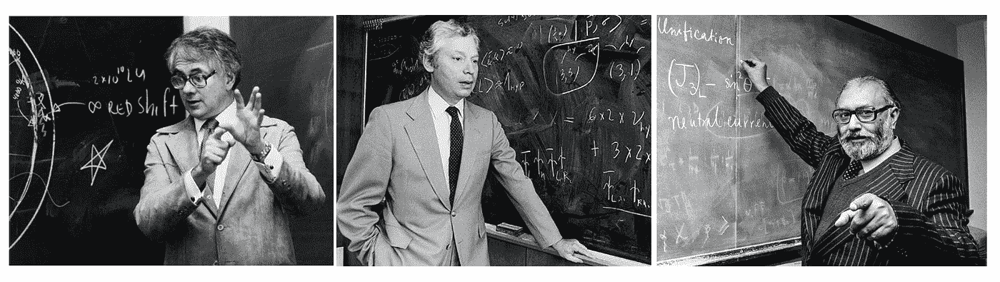**

**图 8:诺贝尔奖获得者[谢尔登·格拉肖](https://en.wikipedia.org/wiki/Sheldon_Lee_Glashow)、[史蒂芬·温伯格](https://en.wikipedia.org/wiki/Steven_Weinberg)、[阿卜杜勒·萨拉姆](https://en.wikipedia.org/wiki/Abdus_Salam)表明，在统一能量以上，电磁力和弱核力合二为一。**

**换句话说，在这个极限阈值之上，这两种力是更基本的电弱力的不同方面。无质量规范场 ***A*** 的自发对称性破缺，如上所述***g***Ives*起源于三个大质量矢量玻色子，即:***

***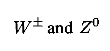***

***情商。29:无质量规范场的自发对称性破缺 ***A*** 给出了三个大质量玻色子的起源，即。***

***换句话说，希格斯机制解释了方程中弱相互作用规范玻色子的质量。29.***

***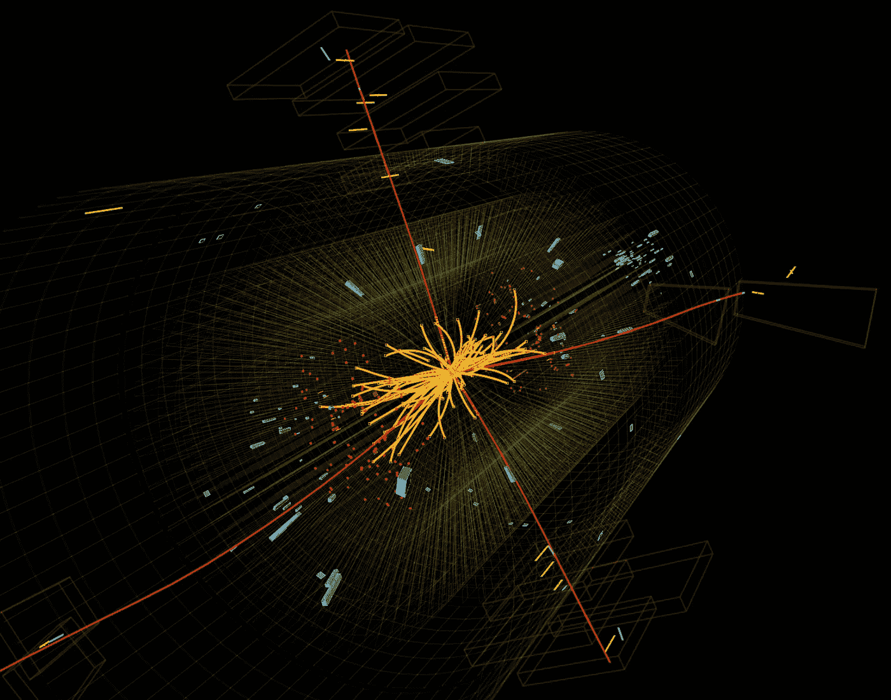***

***图 9:标准模型中的希格斯玻色子([来源](https://home.cern/science/physics/higgs-boson))。***

***感谢您的阅读，再见！一如既往，我们随时欢迎建设性的批评和反馈！***

***我的 [Linkedin](https://www.linkedin.com/in/marco-tavora/) 、个人网站 [www.marcotavora.me](http://www.marcotavora.me/) 、以及 [Github](https://github.com/marcotav) 都有一些其他关于物理以及数学、机器学习、深度学习、金融等等其他话题的有趣内容！看看他们！***