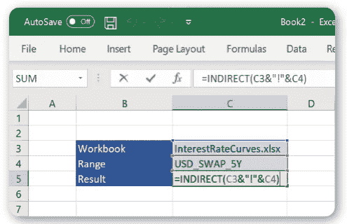
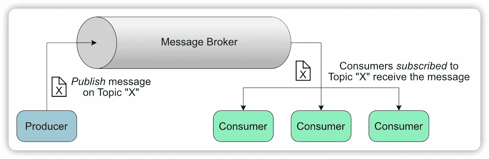
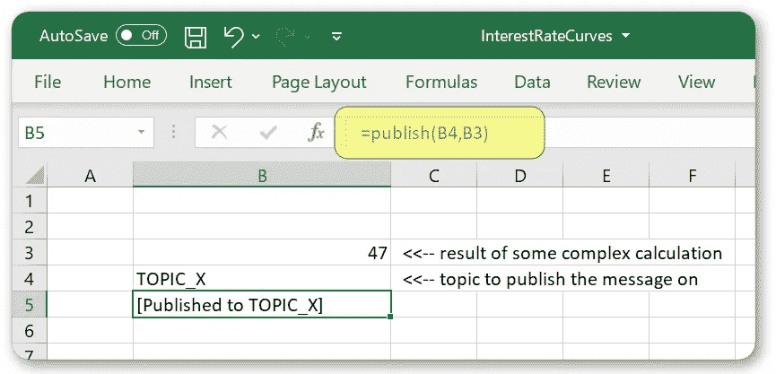
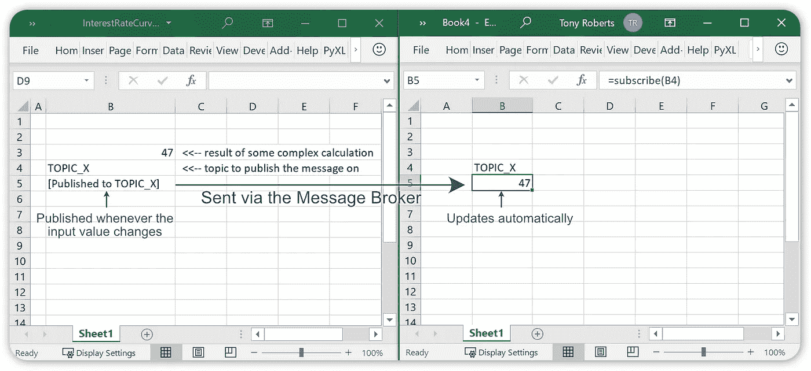

# Excel 中使用发布/订阅模式的非易失性间接替代方案

> 原文：<https://towardsdatascience.com/a-non-volatile-indirect-alternative-in-excel-using-the-pub-sub-pattern-15cea21272a3?source=collection_archive---------12----------------------->

## 显著提高电子表格的性能，并分离您的工作簿。

[图像来源](https://upload.wikimedia.org/wikipedia/commons/thumb/a/a4/Sandwich_%281%29.jpg/1200px-Sandwich_%281%29.jpg)

Excel 中的间接函数是一个棘手的问题。一方面，它非常有用，但另一方面，它也影响了许多电子表格的性能。

在本文中，我们将了解什么是间接函数，为什么它对性能如此不利，以及一个有趣的替代方法，它几乎在所有方面都是优越的。

## 间接功能的简要说明

使用 INDIRECT 从另一个工作簿获取值

INDIRECT 函数获取单元格地址并返回单元格中包含的值。

当设计一个电子表格或一组电子表格时，提前计划并保持它们井井有条是值得的。从概念上讲，结合使用间接和命名范围似乎是一种很好的方式。您可以在一个工作簿中保留一个功能区域，并通过使用间接查询与其他相关工作簿共享关键结果。

使用命名范围避免了硬编码显式地址引用，并允许我们以后重构或重新构造被引用的工作簿。

## 为什么使用间接对性能很糟糕

间接函数是一个*可变*函数。这意味着，每当工作簿中的任何内容发生更改，或者每当您按 F9 进行计算时，都会调用间接函数。就其本身而言，这可能没什么大不了的，但是因为间接函数被重复调用，并且将该函数的结果作为输入的计算也将被重复调用。

如果间接调用的结果是某个复杂计算或缓慢函数的输入，那么您的电子表格将会爬行。每次您更改任何内容时，整个计算都将重新进行，即使您所做的更改与电子表格的该部分无关。

Excel 维护一个依赖关系图，使其能够知道在进行任何更改后哪些单元格需要重新计算。这允许它在更改后重新计算工作表时进行最少的计算。这是一种非常有效的方法，可以最大限度地减少需要完成的工作，以便电子表格可以快速更新。使用间接会破坏这一点，因为每次 Excel 重新计算时，任何相关(直接或间接)都将被重新计算*。*

Excel 的开发人员这样做并非偶然。INDIRECT 函数检索指定地址的值，但它不依赖于该地址指向的单元格。如果在 Excel 的公式选项卡中使用*追踪引用单元格*，就可以看到这一点。这意味着它对参考单元格的变化不敏感。它不知道引用的单元格是否改变了，所以每次都要重新计算，这就是为什么它是一个易变函数。

## 引入间接的替代方案

如上所述使用 INDIRECT 是从一个电子表格中引用另一个电子表格中的值的常见解决方案。它将两个电子表格解耦，以便其中一个(我们称之为*生产者*)的计算可以被另一个(消费者)使用。不一定只有一个消费者，一个生产者可以有多个消费者。

需要将*生产者*与*消费者*分离的问题并不是电子表格独有的。事实上，在软件工程中，这是众所周知的，并且有一些模式可以做到这一点。

*发布/订阅*或*发布者/订阅者*模式就是这样一种模式，通常用于分离生产者和消费者。在这种模式中，消息被*发布*并且*订户*被通知这些消息。发布者和订阅者之间的消息传递由*消息代理*处理。

为了使单个消息代理可以用于不同类型的消息，通常将消息分成不同的主题。主题只是发布者和订阅者都知道的字符串。消息发布在特定的主题上，订阅者订阅一个主题。订阅者将只接收发布到他们订阅的主题的消息。

使用消息代理发布和订阅消息

在我们的电子表格中，我们可以使用这种发布/订阅模式，而不是使用间接方式从另一个工作簿中获取值。每当发生更改时，生产者工作簿将向消息代理发布值，而消费者工作簿将订阅这些消息，并仅在收到消息时进行更新。

我们将在下一节中实现这一点。

## 在 Python 中实现发布/订阅模式

我们将使用 Python 来实现发布/订阅模式。稍后我们将使用 Python Excel 插件 [PyXLL](https://www.pyxll.com?utm_source=medium) 从 Excel 调用 use this。PyXLL 是一个商业产品，它使我们能够在 Excel 中使用 Python 代码，而不是 VBA。对本文至关重要的是，它还可以用来编写 RTD 或实时数据函数。我们将在消费者工作簿中使用一个 RTD 函数，以便每当从生产者工作簿中发布消息时更新该值。

PyXLL 可以从 https://www.pyxll.com 下载，并且有 30 天的免费试用。这里介绍的相同技术也可以用另一种语言实现，只要可以用那种语言编写 Excel 工作表函数和 RTD 函数(例如，使用 [Excel-DNA](https://excel-dna.net/) 和 C#或 [Jinx](https://exceljava.com?utm_source=medium) 和 Java、Scala、Kotlin 或 Clojure)。

通常在使用发布/订阅模式时，会使用一些消息中间件，如 [Kafka、](https://kafka.apache.org/) [RabbitMQ](https://www.rabbitmq.com/) 或 [ApacheMQ](https://activemq.apache.org/) 。这在我们在应用程序之间甚至服务器之间传递消息的情况下非常有用。在我们的例子中，所有的东西都将在一个应用程序中的 Excel 中运行，所以使用这样的消息服务是多余的。我们所需要的是一种将消息从生产者传递到消费者的方法，这些过程都是相同的。

我们将从一个具有三种方法的 MessageBroker 类开始:发布、订阅和取消订阅。我们的生产者将使用*发布*方法发布消息，我们的消费者将使用*订阅*方法订阅消息。当他们不再感兴趣时，他们可以使用*取消订阅*方法。消息本身将只是 Python 对象，而消费者将是接受这些 Python 对象消息作为单个参数的 Python 函数。我们的 MessageBroker 将为订阅者维护一个主题字典。

我们做到了！使用它，我们可以订阅一个主题，并在消息发布到该主题时接收回调。希望这表明发布/订阅模式不需要复杂就能有用:)

我们还可以做一些事情来改善这一点。在我们在 Excel 表之间传递值的例子中，如果在订阅时我们得到了最后发布的值，这将是有用的。这样，如果消费者在生产者已经发布了一些东西之后订阅，它将获得最新的值，而不必等到下一个。此外，Excel 函数可以(可选地)从多个线程调用，因此如果这是我们想要做的事情，那么我们需要小心多个线程同时访问 MessageBroker。

带有这些额外改进的完整代码可以在 github 上的 [PyXLL 示例报告的“pubsub”文件夹中找到。](https://github.com/pyxll/pyxll-examples)

## 在 Excel 中汇总所有信息

提醒一下，我们走这条 pub/sub 道路的原因是为了在 Excel 中找到间接的替代方法，现在我们将回到这一点！

我们需要两个新的 Excel 函数，“发布”和“订阅”。publish 函数将从我们的 producer 工作簿中调用，带有一个主题名和我们想要发布的值。subscribe 函数将从我们希望接收值的消费者工作簿中调用。订阅方法将是 RTD 或实时数据函数。这是一种特殊类型的函数，即使在被调用后也能更新它的值。

如果您还没有下载 PyXLL，那么您现在需要下载，因为我们将使用它从 Excel 中调用上一节中的 MessageBroker 类。你可以从 https://www.pyxll.com 下载 30 天的 PyXLL 试用版。

我们将使用上面的 MessageBroker 类，并创建它的一个全局实例。我们还将添加一些方便的函数，以便可以在我们的全局 MessageBroker 实例上调用发布、订阅和取消订阅。

接下来，使用 PyXLL 我们可以编写“发布”Excel 函数，这样就可以从 Excel 工作簿中调用它。

如果您以前没有使用过 PyXLL，您可能会惊讶于这是多么容易！我们编写一个普通的 Python 函数，并简单地向它添加@xl_func 装饰器。这就是告诉 PyXLL 将我们的 Python 函数公开为 Excel 函数的原因。

为了保持简洁，我将 MessageBroker 类以及发布、订阅和取消订阅函数放在了一个模块 pubsub.py 中。你可以在 github 的 [PyXLL 示例报告的“pubsub”文件夹中找到完整的代码。](https://github.com/pyxll/pyxll-examples)

要从 Excel 调用这个函数，您需要安装 PyXLL 插件(如果您还没有这样做的话),并将您的新 pubsub_example.py 模块添加到 PyXLL 配置文件 pyxll.cfg 中

从 Excel 函数发布值

现在我们准备添加“订阅”功能。为了使用 PyXLL 编写 RTD 函数，我们创建了一个从 PyXLL 的 RTD 类派生的类。你可以在[用户指南](https://www.pyxll.com/docs/userguide/rtd.html?utm_source=medium)中了解更多信息。

RTD 类有两个方法，连接和断开。当 Excel 准备好开始接收更新和不再需要更新时，分别调用这些函数。我们将在我们的类中覆盖这些来订阅和取消订阅消息代理。当收到新消息时，我们在 RTD 对象上设置“值”属性，该属性更新 Excel 中的值。

为了在 Excel 中创建“subscribe”函数，我们像以前一样使用@xl_func 装饰器，只是这次我们返回一个 SubscriberRTD 对象。当调用@xl_func decorator 时，我们还需要向 PyXLL 提供更多的信息，以便它知道将返回值视为 RTD 对象。

这就是用 PyXLL 在 Python 中编写 RTD 函数的全部内容！我们现在可以从另一个具有相同主题的工作簿中调用这个新的 subscribe 函数，每次生产者表发布一个值时，它都会在消费者表中更新。

我们可以让多个消费者订阅同一个主题，也可以让多个生产者发布不同的主题。每当发布的值更新时，将使用主题和新值调用“发布”Excel 函数。这将导致订阅同一主题的“订阅”功能的所有结果自动更新。

由于 RTD“订阅”函数是非易失性的，因此只有当值实际改变时，才会计算任何依赖性。

使用 PyXLL，我们不仅仅局限于在工作表之间传递数字或字符串。[我们可以从 Excel 函数](https://www.pyxll.com/docs/userguide/udfs/cached-objects.html?utm_source=medium)中返回完整的 Python 对象，并以完全相同的方式发布它们。

## 重述；我们做了什么？

我们开始寻找 Excel 间接函数的替代方法，避免使用可变函数带来的性能影响。

使用 INDIRECT 函数的原因是为了将一个电子表格中产生的结果与另一个电子表格中用作输入的结果分离开来。命名范围被认为是避免对特定单元格引用进行硬编码的一种方式。

使用发布/订阅模式，我们现在可以从任何工作簿发布结果，并在另一个工作簿中订阅这些结果。使用主题字符串，我们可以同时发布和订阅多个命名值。

使用 RTD 函数来订阅主题允许我们在发布新值时更新 Excel 中的值，而不必让函数变得不稳定。

我们已经实现了解耦多个电子表格的目标，通过使用命名主题，我们避免了直接引用另一个工作簿中的单元格。通过不使用可变函数，我们确保了我们的工作簿只需要在值改变时计算所需的最小值。

## 参考

*   [PyXLL，Excel Python 插件](https://www.pyxll.com?utm_source=medium)
*   [实时数据(来自 PyXLL 用户指南)](https://www.pyxll.com/docs/userguide/rtd.html?utm_source=medium)
*   [GitHub 上的完整代码(见“pubsub”文件夹)](https://github.com/pyxll/pyxll-examples)