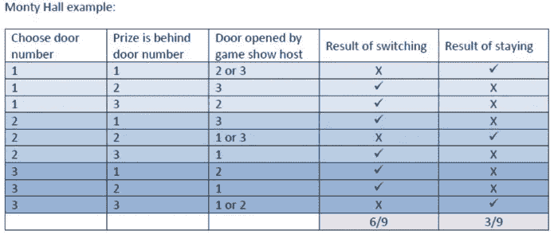

# 数据科学和机器学习管理人员注意事项

> 原文：<https://towardsdatascience.com/a-note-to-data-science-and-machine-learning-managers-bbeb820a606a?source=collection_archive---------58----------------------->

## 使用启发法，特别是那些指导你不要做什么的方法

[丹尼尔·延森](https://unsplash.com/@dallehj?utm_source=unsplash&utm_medium=referral&utm_content=creditCopyText)在 [Unsplash](https://unsplash.com/?utm_source=unsplash&utm_medium=referral&utm_content=creditCopyText) 上拍照

我不是一个喜欢提建议的人。人们很快就放弃了这种通常毫无价值的商品，事实上这是一个相当大的产业。书架上到处都是如何自助的七个步骤。那就蛇油吧！在资金管理的世界里，我发现摆脱混乱的方法是不要问我在投资方面应该做什么，这几乎总能得到一些规范性的建议，而是问你在做什么——让我看看你的钱在哪里。有趣且不令人惊讶的是，建议看起来与给出建议的人实际做的事情大相径庭。他们所做的告诉了我所有我需要知道的。这些建议往往毫无价值。

因此，在这篇笔记中，我将不再提建议，而是把重点放在我发现在复杂环境中非常有用的启发式方法上，尤其是那些指导你不要做什么的方法。以国际象棋为例，大师专注于避免失误，新手则试图获胜。正如(Taleb，Goldstein，Spitznagel，2009)所指出的，“不要做”的建议通常比“要做”的建议更有效。

因此，下面是我应用的“不要”类的经验法则的小集合:

***不找员工，青睐创业人士***

你怎么可能清楚地区分一个企业家和一个雇员呢？我发现这相当容易。创业的人，在看了事情不成功的所有原因后，会考虑如何让它成功，然后去做。另一方面，员工会寻找一些事情不工作的所有原因，并以此作为不去做的理由。它们很容易被发现。像这样的陈述；“我和我的配偶都有很高的薪水，很难放弃。”是一个明确的信号，表明你正在和一个员工打交道。如果你的组织旨在产生影响，企业家是最适合这样做的人。

***不控制，激发***

你要造船，不要鼓民采木，分工合作，发号施令。而是教他们向往浩瀚无边的大海。(德圣埃克苏佩里，2003 年)

试着找出如何通过设置适当的环境，而不是试图控制人们来获得好的结果。企业家在自由中茁壮成长，他们需要资源来取得成功，而组织的重点需要放在赋予这些人权力上。这与倾向于消耗资源、需要管理的员工形成对比。随着组织的成长，挑战也随之而来，流程被用来应对规模扩大带来的复杂性。这有削弱创新和驱逐企业家的趋势。为了应对这一点，关键是不要忽视雇佣合适的人，避免增加流程和新规则。以网飞休假政策为例；“没有政策或跟踪。网飞也没有着装规定，但没有人裸体上班。教训:你不需要事事都有政策。”(网飞，2009 年)

***不要假装你知道未来***

商业计划是江湖骗子的天意。正如约吉·贝拉曾经说过的:"很难做出预测，尤其是对未来的预测。"商业计划、商业案例之类的东西属于粪堆。现实世界太动态了，无论你认为它有多灵活，它都不符合你的普鲁克斯床。你的组织的成功将更多地依赖于它里面的人，而不是你那光鲜亮丽的文档。

***不要上当规划谬误***

在《思考的快慢》一书中，丹尼尔·卡内曼提供了一些有趣的例子来支持他所谓的“规划谬误”:

*   1997 年拟建新苏格兰议会大厦 4000 万英镑。在 2004 年完成大约 4 . 31 亿英镑
*   2005 年对 1969 年至 1998 年间全球铁路项目的研究:90%的情况下，预计使用该系统的乘客人数被高估。平均而言，规划者高估了 106%的人会使用新铁路项目。平均成本超支为 45%
*   2002 年美国房主调查发现，改造厨房的成本:平均预期:18 658 美元，平均实现:38 769 美元

(卡尼曼，2013 年)

这个故事的寓意是对预计的时间框架、预算等持怀疑态度。为事情不按计划进行做好准备。

***不要让生存取决于一个单一的结果，让选择成为你的朋友***

我将在这里讲述泰勒斯和橄榄压榨机的故事。泰勒斯是一位哲学家，是讲希腊语的爱奥尼亚人，腓尼基血统，来自小亚细亚沿海城镇米利都。我们知道泰勒斯，部分是因为亚里士多德的著作。

用亚里士多德的话来说，这个故事如下:

“当他们责备他[泰勒斯]因为他的贫穷，好像哲学是没有用的，据说，通过他的研究观察到天体会有一个大的橄榄作物，他筹集了一点资本，而它仍然是冬天，支付存款在米利都和希俄斯所有的橄榄印刷机，便宜地雇用他们，因为没有人对他出价。当适当的时候来了，有一个突然要求印刷的热潮；然后，他以自己的条件把他们雇用出去，因此赚了一大笔钱，从而证明，如果哲学家愿意，他们很容易变得富有，但他们感兴趣的不是这个。”(莫里斯·恩格尔佩辛，2015 年)

亚里士多德对泰勒斯成功的推理是在泰勒斯卓越的知识中“…通过他对天体的研究观察到将会有一个巨大的橄榄收成，…

事实是，泰勒斯进入了有记录以来的第一个选项。你看，泰勒斯有权利，但没有义务，使用橄榄压榨机，以防需求激增。橄榄压榨商有义务，而不是权利。泰雷兹为这种特权付出了很小的代价，损失有限，可能的结果很大。(Taleb，2014 年)

***不依赖直觉***

这里我喜欢用蒙蒂霍尔问题作为例子。

让我们假装我们在一个游戏节目上。有三扇门，其中一扇门后是奖品，在这种情况下是一辆新车。其他每扇门后都有一只山羊。游戏节目主持人知道每扇门后是什么。游戏节目主持人让你选一扇门，你选了 2 号门。你选择后面有车的门的概率是 1/3。

在向你展示 2 号门后面是什么之前，游戏节目主持人打开了一扇你没有选择的门，3 号门，来展示一只山羊。

有两扇门尚未揭晓，一号门和你选择的二号门。现在知道了你所知道的，要不要换个选择？有关系吗？转换你的选择会提高你的胜算吗？看起来你赢的几率是 50% —两扇门选择其中之一。但是你错了。此时将您的选择切换到 1 号门将使您赢得汽车的机会加倍。

这是怎么回事？因为我们一开始有两只山羊，所以你的第一个选择，2 号门后面的更有可能是一只山羊——一开始选择一只山羊的概率是 2/3。通过在你没有选择的一扇门后展示一只山羊，如果你改变选择，游戏节目主持人会加倍你的获胜机会。

***不要高估自己的衡量能力****【1】*

不是所有能算的都算，也不是所有能算的都算。(奥图尔，2010 年)

*不允许决策者在没有切身利益的情况下做出决策*

*在信息不透明的情况下，为了对抗道德风险，应该使用博弈中的皮肤启发式。简而言之，任何参与可能对他人造成伤害的行为的人，即使是概率上的，都应该被要求暴露在某种伤害之下，而不考虑背景。(塔勒布、桑迪斯，2013 年)*

****不要在技术和商业之间选择，你需要两者****

*在《分析型领导者的秘密》一书中，韦恩·埃克森谈到了他所谓的紫色人。埃克森将它们描述为:*

*"…..生活在不同方法和观点交汇处的人拥有更广阔的视角。他们看到了别人忽略的联系和可能性。他们说多种语言，在不同的群体和规范之间优雅地移动。他们不断地翻译、综合和统一。因此，他们想象新的方法来解决老问题，他们重新发明旧的方法来应对新的挑战。他们是强大的变革推动者和价值创造者。*

*在分析的世界里，我把这些男人和女人称为“紫色的人”。它们在业务上不是“蓝色”的，在技术上也不是“红色”的，而是两者的混合，因此是紫色的。”(埃克尔森，2012 年)*

*纯技术人员并不完全了解要解决的业务问题，纯业务人员也不具备得出问题解决方案的技术专长。正是这些紫色的人给组织带来了最大的价值。*

****不要为了自己的创作而变得多情****

*大多数人使用统计数据的方式就像一个醉汉使用灯柱一样，更多的是为了支持而不是启发。(奥图尔，2014 年)*

*虽然主要是针对那些在量化金融社区，金融建模者的宣言可以扩展到一般建模领域以外，并与之相关:*

*建模者的希波克拉底誓言(德曼，威尔莫特，2009)*

*   *我会记得世界不是我创造的，它不满足我的方程。*
*   *虽然我会大胆地使用模型来评估价值，但我不会对数学印象太深。*
*   *我永远不会为了优雅而牺牲现实，而不解释我这样做的原因。*
*   *我也不会让使用我的模型的人对它的准确性感到虚假的安慰。相反，我将明确它的假设和疏漏。*
*   *我明白我的工作可能会对社会和经济产生巨大影响，其中许多影响超出了我的理解。*

***附录:***

*[1]*

*弗兰克·奈特可能也在考虑之列:*

*经常从开尔文勋爵(Lord Kelvin)那里引用的一句话(尽管我认为这句话的实质要古老得多)“如果你不能衡量你的知识，那它就是贫乏和不令人满意的，”这句话应用在精神和社会科学中，是误导和有害的。这是另一种说法，即这些科学不是物理科学意义上的科学，也不能试图成为物理科学，否则就会丧失其应有的性质和功能。坚持具体的数量经济学意味着使用物理量的统计，其经济意义和重要性是不确定和可疑的。(即使是“小麦”也只有在经济条件下才是近似同质的。)类似的说法甚至更适用于其他社会科学。在这个领域，开尔文格言在实践中很大程度上意味着，“如果你不能度量，无论如何都要度量！”也就是说，一个人要么执行一些其他操作并将其称为测量，要么测量其他东西，而不是表面上正在讨论的东西，通常不是一种社会现象。称之为平均估计或猜测，测量似乎只是盗用了一个词的声望值。也可以指出，在人类利益和关系的领域里，我们许多最重要的知识本质上是非量化的，不可能不被破坏就以量化的形式存在。也许我们不“知道”我们的朋友真的是我们的朋友；在任何情况下，试图衡量他们的友谊几乎不会使知识更确定或更“令人满意”！*

***参考:***

*德圣埃克苏佩里(2003 年)。金沙的智慧。【书】。阿梅里奥有限公司[ISBN-13:978–0848825959]*

*德曼，e .威尔莫特，P. (2009 年)。金融建模者的宣言。[pdf]。检索自[http://www . uio . no/studier/em ner/SV/oekonomi/econ 4135/h09/undervisningsmateriale/financialmodelersmastario . pdf](http://www.uio.no/studier/emner/sv/oekonomi/ECON4135/h09/undervisningsmateriale/FinancialModelersManifesto.pdf)*

*埃克尔森，W. (2012 年)。分析型领导者的秘密:来自信息业内人士的见解(第 1 版。).工艺出版有限责任公司。[国际标准书号 10: 1935504347]*

*卡尼曼博士(2013 年)。思维忽快忽慢。【书】。法勒，斯特劳斯和吉鲁。[ISBN-13:978–0374533557]*

*奈特，F. (1940)。经济学中的“真理是什么”？。[pdf]。芝加哥大学出版社。从 http://www.jstor.org/stable/1825908[取回](http://www.jstor.org/stable/1825908)*

*网飞。(2009).自由和责任。[pdf]。从 http://www.slideshare.net/reed2001/culture-1798664[取回](http://www.slideshare.net/reed2001/culture-1798664)*

*奥图尔(2010 年)。不是所有有价值的东西都可以被计算。【网站】。检索自[http://quote investigator . com/2010/05/26/everything-counts-Einstein/](http://quoteinvestigator.com/2010/05/26/everything-counts-einstein/)*

*奥图尔(2014 年)。大多数人使用统计数据的方式就像一个醉汉使用灯柱一样，更多的是为了支持而不是启发。【网站】。从 http://quoteinvestigator.com/2014/01/15/stats-drunk/[取回](http://quoteinvestigator.com/2014/01/15/stats-drunk/)*

*南莫里斯·恩格尔佩辛(2015 年)。*哲学研究:带阅读材料的文本。*【书】。利特尔菲尔德出版社。[ISBN-13:978–1442242821]*

*北卡罗来纳州塔勒布(2014 年)。抗脆弱:从混乱中获得的东西。【书】。兰登书屋。[ISBN-13:978–0812979688]*

*北卡罗来纳州塔勒布，加利福尼亚州桑迪斯(2013 年)。游戏中的皮肤启发防止尾部事件。[pdf]]。从 http://papers.ssrn.com/sol3/papers.cfm?abstract_id=2298292[取回](http://papers.ssrn.com/sol3/papers.cfm?abstract_id=2298292)*

*塔勒布，n，戈尔茨坦。斯皮茨纳戈尔医学博士(2009 年)。管理者在风险管理中犯的六个错误。[pdf]。检索自[https://HBR . org/2009/10/the-six-mistakes-executives-make-in-risk-management](https://hbr.org/2009/10/the-six-mistakes-executives-make-in-risk-management)*