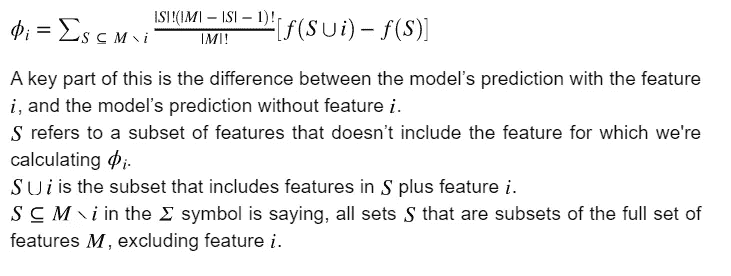
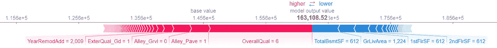
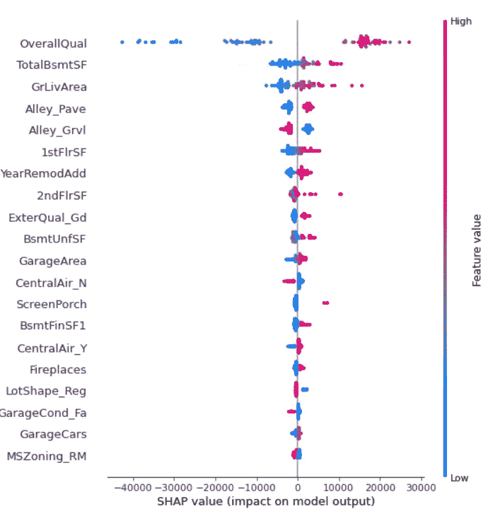
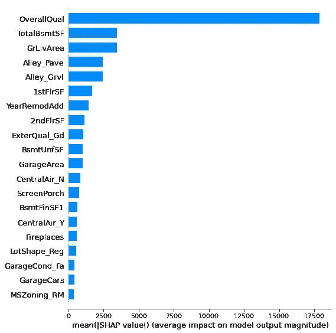

# 特征重要性的一种新方法——Shapley 附加解释

> 原文：<https://towardsdatascience.com/a-novel-approach-to-feature-importance-shapley-additive-explanations-d18af30fc21b?source=collection_archive---------2----------------------->


韦斯利·廷吉在 [Unsplash](https://unsplash.com?utm_source=medium&utm_medium=referral) 上拍摄的照片

## 最先进的功能重要性

如果你被困在付费墙后面，点击[这里](/a-novel-approach-to-feature-importance-shapley-additive-explanations-d18af30fc21b?source=friends_link&sk=631fdb6b8ee878e0f0172edfc4afbcea)获取我的朋友链接并查看这篇文章。

机器学习的可解释性在这个领域是一个越来越重要的话题。解释的意思是用可理解的术语解释或陈述。在人工智能系统的背景下，可解释性是用可理解的术语解释或呈现给人类的能力。当投资面临风险时，机构更喜欢可以解释的模型，而不是可能给出相对更好准确性的模型。事实上，更好的说法是，当你处理现实世界的问题时，机器学习的可解释性成为衡量一个好模型的一部分。

> 不要做那种把机器学习和深度学习当成黑箱，认为叠加几层就会增加准确率的人。

在商业案例应用中，出于可解释性的考虑，公司通常会选择使用简单的线性模型，而不是复杂的非线性模型。当你建立一个模型时，你需要能够理解它是如何做出预测的。这有助于您确定模型何时会运行良好，何时不会运行良好(这就是它需要人工干预的地方)。通常，你可能需要向你的客户和投资者解释你的模型，尤其是当你用这个模型管理他们的资金的时候。它不仅止于管理投资，还远远不止于此——当你在医疗保健、安全、教育等领域使用人工智能时。基本上在 jupyter 笔记本之外的任何地方，模型的可解释性都成为一个重要的因素。在本文中，我将讨论机器学习可解释性的一个方面— **特征重要性**。然而，在此期间，我将讨论一种更新颖的方法，称为 **Shapley Additives** 。我已经给出了相同的理论、数学和代码解释。

下面是这篇文章的不同部分。请随意跳到您需要访问的部分。

1.  [背景](#5744)
2.  [理论解释](#511b)
3.  [数学表达式](#baef)
4.  [代码实现](#5280)
5.  [可视化](#f2fd)

# 背景

有许多不同的方法可以增加你对模型的理解，特性重要性是其中之一。要素重要性可帮助您估计数据的每个要素对模型预测的贡献程度。执行要素重要性测试后，您可以找出哪些要素对模型决策的影响最大。您可以通过移除对模型预测影响较小的功能，并专注于对更重要的功能进行改进来实现这一点。这可以显著提高模型性能。

有许多方法可以计算特征的重要性。使用`statmodels` 和`scikit-learn`的一些基本方法已经在文章[这里](/feature-selection-techniques-1bfab5fe0784)中讨论过。然而，很多人已经写了关于传统方法的文章，因此，我想讨论一种新的方法，叫做形状附加解释(ShAP)。这种方法被认为比传统的 sckit-learn 方法稍好，因为这些方法中的许多方法可能不一致，这意味着最重要的特征可能不总是被给予最高的特征重要性分数。一个例子是，在基于树的模型中，基于使用特征完成的分裂的级别，可能给两个同等重要的特征不同的分数。首先分割模型的特征可能被给予更高的重要性。这就是使用最新的特征归因方法 Shapley 附加解释的动机。

# 介绍


图片来自 [Pixabay](https://pixabay.com/?utm_source=link-attribution&utm_medium=referral&utm_campaign=image&utm_content=1339071) 的[汉斯汉斯](https://pixabay.com/users/hans2609-1855995/?utm_source=link-attribution&utm_medium=referral&utm_campaign=image&utm_content=1339071)

让我们从一个例子开始，来获得这个方法背后的一些直觉。假设你是马克·库班，你拥有一支篮球队，比如达拉斯小牛队，你有三名球员——德克·诺维茨基(A)，迈克尔·芬利(B)，贾森·基德(C)。你想确定每个球员对球队最终得分的贡献，显然这并不意味着我们只是计算他们每个人得分的篮筐数，因为这在这里可能行得通，但从机器学习的角度来看却行不通。我们希望能够量化他们的存在对球队表现的影响，而不仅仅是计算每个球员可能得分的次数。第二个原因是，并不是所有人都打同一个位置。其中一名球员可能踢进攻位置，而另一名可能踢防守位置，我们也希望能够考虑到这一点。

一种方法是，你计算有和没有玩家 A 的团队绩效。玩家 A 的影响可以是有和没有玩家 A 的团队绩效之间的差异。

```
Impact of A = Team Performance with A - Team performance without A
```

这可以扩展到每个球员，我们可以单独计算他们的重要性。这是匀称的附加解释背后的主要直觉。对于每种功能组合，我们通过查看模型在有和没有该功能时的表现来评估模型的重要性。值得注意的是，Shapley Additive Explanations 为每个观察值计算局部特征重要性，这与 scikit-learn 中使用的计算全局特征重要性的方法不同。您可以理解某个特性的重要性在所有数据点上可能并不一致。因此，局部要素重要性计算每个数据点的每个要素的重要性。全局测量是指模型的所有特征的单一等级。在某些情况下，局部特征的重要性也变得相关，例如贷款申请，其中每个数据点都是一个人，以确保公平和公正。我还可以想到一个混合的例子，比如信用卡欺诈检测，每个人都有多次交易。虽然每个人都有不同的特征重要性等级，但是需要对所有事务进行全局测量，以检测事务中的异常值。我是从财务角度写这篇文章的，因为全球特性的重要性更相关。您可以通过聚合每个数据点的局部要素重要性来获得全局测量值。

*注意:-这只是一个例子，比较玩家统计可能不是所有者的工作，但我喜欢鲨鱼池上的马克·库班，因此，这个例子。*

这种方法根据联盟博弈理论计算出一种叫做 Shapley 值的东西。它是由 Lundberg，Scott M .和 Su-In Lee 在 2017 年首次提出的[1]。数据实例的特征值充当联盟中的参与者。Shapley 值告诉我们如何在特性之间公平地分配“支出”(=预测)。“玩家”可以是单个特征或一组特征。

## 如何计算一个特征的 Shapley 值？

该值是一个特性值在所有可能的特性组合中的平均边际贡献。让我们扩展前面的例子，看看球队在一个赛季的每场比赛中的得分。我们想知道球员 A 在一场比赛中对球队得分的贡献有多大。因此，当特征玩家 A 被添加到玩家 B 和玩家 c 的联盟时，我们将计算它的贡献。

**注意:-** 在这个实验中，我们需要在有和没有每个玩家的情况下完成所有的试验。我假设在一个赛季中会有一些比赛我们可以得到相关的数据，因为至少会有一场比赛每个球员都没有被选中，而其他两个球员却被选中了。其次，这只是一个例子，衡量标准可以是从积分差异到锦标赛排名的任何东西。为了便于解释，我只取了总分。

**步骤 1:** 没有玩家 A 的玩家 B 和玩家 C 的组合

在这种情况下，我们可以取玩家 B 和 C 比赛而玩家 A **没有比赛的所有比赛的平均分数。**我们也可以随机抽取一个样本，但我认为平均值/中值是更好的衡量标准。假设平均分等于 65 分。

**第二步:**玩家 B、玩家 A 和玩家 C 的组合

在这一步中，我们将对球员 A、B 和 C 参加的所有比赛取平均值，假设该值等于 85 分。

因此，A 的贡献是 85–65 = 20 点。够直观了吧？如果你随机抽取了一个样本，那么你应该多次进行这个实验，并计算其平均值。

Shapley 值是所有可能联盟的所有边际贡献的平均值。计算时间随着特征的数量呈指数增长。保持计算时间可管理的一个解决方案是仅计算可能联盟的几个样本的贡献。[2]



Shapley 值的数学解释[3]

你可以看看[这个笔记本](https://github.com/prakharrathi25/artificial-intelligence-for-trading/blob/master/part2_ai_algorithms_in_trading/quizzes_and_exercises/21_feature_importance/tree_shap_solution.ipynb)更详细的解释。理论够了！让我们用一些代码来弄脏我们的手。

# 代码实现

首先导入必要的库。

```
import pandas as pd
import numpy as np
import shap
from sklearn.model_selection import train_test_split
from sklearn.metrics import mean_squared_error

from sklearn.linear_model import LinearRegression
from sklearn.tree import DecisionTreeRegressor
from sklearn.ensemble import RandomForestRegressor
from xgboost.sklearn import XGBRegressor
from sklearn.preprocessing import OneHotEncoder, LabelEncoder
from sklearn import tree

import matplotlib.pyplot as plt
%matplotlib inline
import warnings
warnings.filterwarnings('ignore')
```

**读取数据并进行预处理。**

我正在处理[房价数据集](https://www.kaggle.com/c/house-prices-advanced-regression-techniques/data)，但是你可以对任何数据集使用这种方法。我不会在预处理和插补上花太多时间，但是强烈建议你这么做。

```
# Read the data 
data = pd.read_csv(‘data.csv’)# Remove features with high null values 
data.drop([‘PoolQC’, ‘MiscFeature’, ‘Fence’, ‘FireplaceQu’, 
‘LotFrontage’], inplace=True, axis=1)# Drop null values 
data.dropna(inplace=True)# Prepare X and Y 
X = pd.get_dummies(data)
X.drop([‘SalePrice’], inplace=True, axis=1)
y = data[‘SalePrice’]
```

**拟合模型**

下一步是在数据集上拟合模型。

```
model = XGBRegressor(n_estimators=1000, max_depth=10, learning_rate=0.001)# Fit the Model
model.fit(X, y)
```

## **Shapley 值特征重要性**

对于这一节，我将使用[**shap**](https://github.com/slundberg/shap)**库。这是一个非常强大的库，你应该看看他们不同的情节。首先将 JS 可视化代码加载到库中。**

```
# load JS visualization code to notebook
shap.initjs()
```

**使用 shap 解释模型的预测。收集讲解者和`shap_values`。**

```
explainer = shap.TreeExplainer(model)
shap_values = explainer.shap_values(X)
```

## **绘制我们的结果**

****力图****

```
i = 4
shap.force_plot(explainer.expected_value, shap_values[i], features=X.iloc[i], feature_names=X.columns)
```

****

**交互力图**

**上面的解释显示了将模型输出从基础值(我们传递的训练数据集的平均模型输出)推送到模型输出的每个功能。将预测值推高的要素显示为红色，将预测值推低的要素显示为蓝色。请注意，该图只能用于**一次观察**。对于这个例子，我采取了第四个观察。**

****概要图****

**为了了解哪些特征对模型最重要，我们可以绘制每个样本的每个特征的 SHAP 值。下图按所有样本的 SHAP 量值总和对要素进行排序，并使用 SHAP 值显示每个要素对模型输出的影响分布。颜色代表特征值(红色高，蓝色低)。**

```
shap.summary_plot(shap_values, features=X, feature_names=X.columns)
```

****

**每个特征的摘要图**

****汇总柱状图****

**我们也可以只取每个要素的 SHAP 值的平均绝对值来得到一个标准条形图(为多类输出生成堆积条形图):**

```
shap.summary_plot(shap_values, features=X, feature_names=X.columns, plot_type=’bar’)
```

****

**特征重要性条形图**

# **结论**

**这些图告诉我们哪些特征对于模型来说是最重要的，因此，我们可以使我们的机器学习模型更具解释性和说明性。这是您数据科学之旅中非常重要的一步。**

**我希望你能从这篇文章中学到一些东西。期待听到你的评论。**

# **参考**

1.  **斯科特·m·伦德伯格和李秀英。"解释模型预测的统一方法."神经信息处理系统进展。2017.**
2.  **克里斯托弗·莫尔纳尔。“可解释的机器学习。让黑盒模型变得可解释的指南”，2019。[https://christophm.github.io/interpretable-ml-book/](https://christophm.github.io/interpretable-ml-book/)。**
3.  **《n 人游戏的价值》对博弈论的贡献 2.28(1953):307–317。**