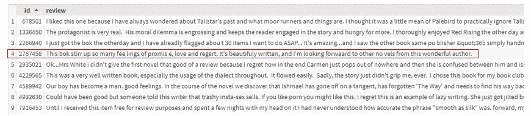
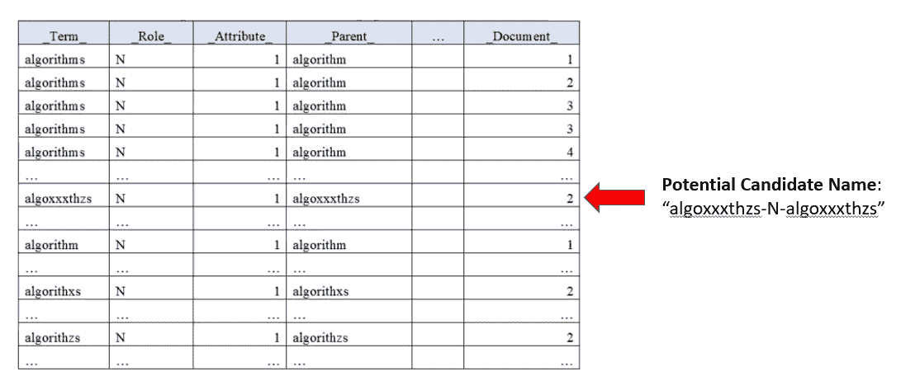
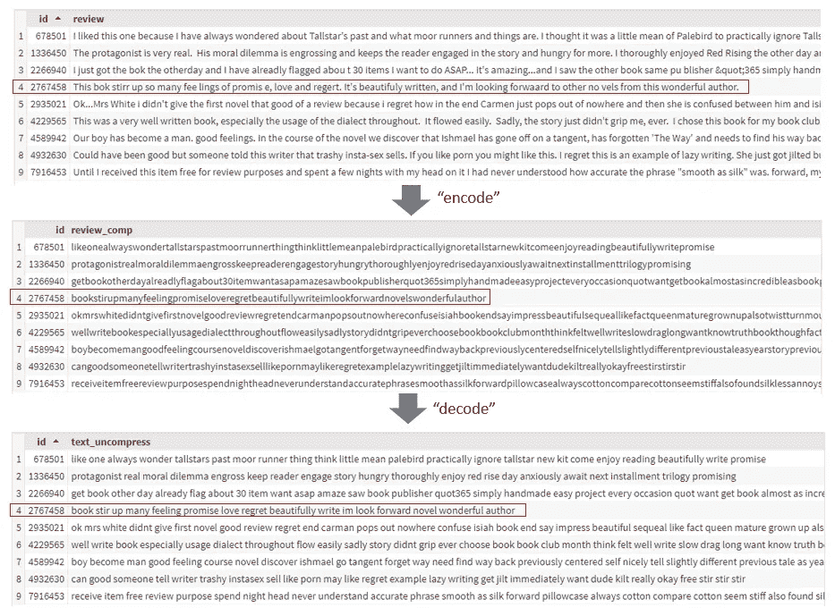

# 一种新颖的清理极脏非结构化文本的方法

> 原文：<https://towardsdatascience.com/a-novel-solution-to-cleaning-extremely-dirty-unstructured-text-490d4ba934de?source=collection_archive---------50----------------------->


你好，我是尼克🎞 on [Unsplash](https://unsplash.com?utm_source=medium&utm_medium=referral)

经过整整两周的反复试验，几乎认为这是不可能的…

**我做到了。**

我设法把这个:

> "这是一个很难解决的问题. "

变成这样:

> “这是一个很难解决的问题”

我以为在和类似[新加坡式英语](/creating-word-embeddings-for-out-of-vocabulary-oov-words-such-as-singlish-3fe33083d466)甚至[推特](/are-deeper-networks-better-a-case-study-6ee9bcb0725b)的人合作后，我已经见识了这一切。

但我从未想过我会遇到如此肮脏的非结构化文本数据。

我显然夸大了上面的例子，但问题归结为以下两点:

*   拼写错误的检测和解决
*   处理单词之间的随机空格

作为人类，我们可以很容易地将上面的陈述解读为:

**“这是一个很难解决的问题”**

然而，提出一种方法来解决这样一个数据问题被证明比预期更具挑战性。

在这篇文章中，我将介绍一个新颖的解决方案，它是我用来清理一个非常脏的非结构化文本数据集的。

以下是这些数据的大概情况:



肮脏的非结构化文本的例子

> 注意:这只是脏数据的一个例子，而不是实际的数据。

今天不会有太多的代码片段，但在这篇文章结束时，如果你曾经遇到过这种数据问题，你会对解决这种问题的方法有所了解。

# 数据质量问题 1:拼写错误的检测和解决

在我以前的一篇关于处理拼写错误的帖子中，我使用了单词向量，并进行了大量的翻译，以形成一个通用的翻译向量来处理拼写错误。

[](/using-a-generalised-translation-vector-for-handling-misspellings-and-out-of-vocabulary-oov-words-494cd142cd31) [## 使用广义翻译向量来处理拼写错误和不在词汇表中(OOV)的单词…

### 我的实验和结果是用一种新颖的方法来处理拼写错误和 OOV 单词。希望你能找到他们…

towardsdatascience.com](/using-a-generalised-translation-vector-for-handling-misspellings-and-out-of-vocabulary-oov-words-494cd142cd31) 

在这篇文章中，我将依靠算法来处理拼写错误。

这一部分包括两个部分:

1.  检测拼写错误的单词
2.  解决拼写错误的单词

我使用了 [SAS Viya 的](https://www.sas.com/en_sg/software/viya.html#products)开箱即用的拼写错误动作 **tpSpell** 来做这件事。

> 注意:SAS 与称为**动作集**的东西一起工作，动作集是 Python 包的同义词。在每个动作集中，有许多可以执行的**动作**。

## 第 1 部分:检测拼写错误的单词

在这一步中，tpSpell 动作执行所谓的**候选提取。**

候选提取将单词分为两类:

*   拼写正确的候选单词
*   拼写错误的候选单词

在运行该过程之前，由预定的参数(“最小亲本”)来确定拼写正确的候选单词。

此参数指定一个术语要被视为拼写正确的候选单词，必须出现在多少个文档中。

所有拼写正确的候选单词都采用`<term>-<role>-<parent>`的形式。

例如，参考下面的图 1:


图 1 —拼写正确的候选示例([来源](https://go.documentation.sas.com/?cdcId=pgmsascdc&cdcVersion=9.4_3.4&docsetId=casvtapg&docsetTarget=n1v6fwv203gwamn12k2plw3hsstl.htm&locale=en))

请注意，潜在的候选名称是如何将“Term”、“Role”和“Parent”列连接起来形成“algorithms-N-algorithm”的。

这是逻辑的分解。

1.  如果潜在候选名称“algorithms-N-algorithm”在 4 个文档中出现 5 次，那么它出现的文档的数量等于 4。
2.  如果称为“最小双亲”的预定参数被设置为 3，因为 4 比 3 大，所以单词“algorithms-N-algorithms”被添加到拼写正确的候选列表中。

那么，拼写错误的候选单词列表呢？那么我们如何创建这个表呢？

就像拼写正确的单词候选列表一样，还有另一个预先确定的参数要设置。

这次叫“最大子女”。

例如，请看下面的图 2:



图 2 —拼写错误的候选示例([来源](https://go.documentation.sas.com/?cdcId=pgmsascdc&cdcVersion=9.4_3.4&docsetId=casvtapg&docsetTarget=n1v6fwv203gwamn12k2plw3hsstl.htm&locale=en)

逻辑很简单。

如果“maximum children”参数设置为 3 **并且**出现类似“algoxxxthzs-N-algoxxxthzs”的潜在候选名称的文档数量小于 3，则“algoxxxthzs-N-algoxxxthzs”被添加到拼写错误的单词候选列表中。

对图 2 中指定的整个表重复这个逻辑。

现在我们已经得到了一个**拼写正确的候选列表**和一个**拼写错误的单词候选列表**，接下来是将拼写正确的单词分配给其各自的错误拼写的逻辑。

## 第 2 部分:拼写错误的解决方案

在该步骤中，执行**候选比较**以解决拼写错误。

该算法现在将对照拼写正确的列表中的所有单词来检查拼写错误的列表中的所有单词。

它将拼写错误的候选单词与每个拼写正确的候选单词进行比较，并计算它们之间的距离。

另一个被称为“最大拼写距离”的预定参数确定拼写错误的单词是否具有正确的拼写。

例如，如果单词“algoxxxthzs”是给定的拼写错误的单词**并且**单词“算法”是正确拼写的候选，那么计算出的“algoxxxthzs”和“算法”之间的距离将是 50。

如果“最大法术距离”设置为 20。由于 50 大于 20，正确拼写的候选“算法”现在被认为是单词“algoxxxthzs”的正确拼写。

您还可以在这里设置其他高级参数，以考虑多个术语，如“消防车”、“继续”或“加入”等。你可以在这里阅读文档。

虽然我在上面说得听起来很复杂…

**不是。**

下面是如何运行以上所有操作的方法。

```
proc cas;
 textParse.tpSpell /
  table={name="pos", caslib="public"}
  minParents=3
  maxChildren=6
  maxSpellDist=15
  casOut={name="tpSpell_Out", replace=true};
   run;
quit;
```

结果将是这样的:


图 3 —拼写错误的解析结果

我喜欢 SAS 编程的一点是，只用几行代码就能轻松利用复杂的算法。

是的，Python 包做同样的事情，但是有时，这些包没有 SAS 高级。

一个很好的例子是 SAS 如何优化深度学习超参数和层内参数。有趣的是，在 SAS 中进行超参数调优真的很容易。

SAS 将拉丁超立方体与用超带方法优化的遗传算法相结合，以说明资源利用率。此外，一切都是自动多线程的。

用 Python 编写 SAS 的现成代码肯定会花费更多的时间和精力，更不用说如何用 Python 分配处理、计算资源分配和利用所需的知识了——我认为大多数人对此并不熟悉。

# 数据质量问题 2:处理随机空白

这个问题确实让我测试了多种方法。所有这些都表现不好，除了我现在要讲的方法。

> 为了恢复你的记忆，你的问题就像这样

上面有几个值得指出的数据质量问题:

1.  单词之间的空格，如“probl em”
2.  缺少字符，即“锁定”
3.  交换字符，即“thsi”
4.  双重字符，即“你”
5.  问题的组合，即“m emry”——1 和 2 的组合。

我必须找到一种方法来解决单词之间的空格，同时解决拼写错误(数字 2、3 和 4)。

幸运的是，处理拼写错误相对容易，正如我在上面用 tpSpell 展示的那样。

但是问题的组合带来了复杂性(第五点)。

对于像这样的组合问题，我首先需要在应用拼写错误解决方案之前解决空白。

在思考这项工作的最佳解决方案时，我从编码器-解码器网络的工作方式中获得了灵感。

> *我能以某种方式“编码”句子，然后“解码”它们吗？*

显然我在这里用词不当。我说的“编码”实际上是指删除单词间的所有空白**。像这样:**

> *torefreshyyourmerytheekedlikethsi*

通过“解码”，我的意思是在解决拼写错误后，将单词重新分解成它们各自的单词:

> *提醒你一下，问题是这样的*

## “解码”的问题第 1 部分

我必须解决的最大问题之一是，一旦字符串被“编码”，何时插入空格。

就拿“ *torefresh* 这个词来说吧。

如何知道在“*到*和“*刷新*”之间插入一个空格？为什么不是“*到*”、“ *re* ”和“ *fresh* ”？

下面是我是如何做到的，以及我的 SAS 脚本的逻辑。

解码的单词基于单词的**最长匹配**。

例如，如果我看到单词“ *helloworld* ”，我将首先在预定义的潜在候选列表中查找单词“ *hell* ”。即字典表

直到下一个角色“ *o* 出现，既然“*hell+o*”=“*hello*”，“ *hello* ”就成了比较好的潜在候选人。

我放弃单词“ *hell* ”作为主要候选，保留单词“ *hello* ”作为新的主要候选。

随着下一个字符被读入，"*hello+w*" = "*hellow*"，由于" *hellow* "在潜在候选列表中不是一个合适的单词，所以最好的候选是" *hello* "。

一旦这些检查完成，我就在" *hello* "后面添加一个空格，并继续上面的逻辑，用于" *w* "、" *o* "、" *r* "、" *l* "和" *d* "直到我得到" *hello world* "

> 那么这个潜在候选列表是什么，我是怎么得到这本字典的？

这是我根据前面的 tpSpell 操作生成的拼写正确的单词列表创建的字典。

也就是说，所有拼写正确的单词都放在这个字典表中，以便我在“解码”每个字符串时查找。

## “解码”的问题第 2 部分

要让“解码器”工作，还有其他问题需要解决。

也就是说，我必须删除停用词，所有形式的标点符号，小写所有单词，只保留父术语。

为什么？

因为如果我不这么做，就会有很多问题浮出水面。

以这句话为例:

> *《丛书》*

在“编码”之后，它将是:

> *《系列丛书》*

回想一下，我创建的算法在“解码”过程中采用了字典中的**最长匹配**。

如果我保留所有停止字，“解码器”会将第一个字解析为“*这些*”，而不是“*这些*”。

正因为如此，单词"*se****ries***中的下一个字符" ***ries*** "将不再是我的字典中的一个单词，并将被丢弃。

这意味着“解码的”字符串将会以“*这些书*”结束，这显然是不正确的。

影响“解码器”的另一个复杂因素如下所示:

> *“自行车运动”→“自行车竞技”→“自行车港口”(错误)*

为了解决这个问题，我只在字典表中保留了**父术语**。

例子 1:自行车 **s** →自行车

示例 2:运动 **s** →运动

通过只查看父术语，我的输出如下所示:

> *“自行车运动”→“自行车运动”→“自行车运动”(正确)*

因为“*自行车* ***s*** ”已经不在我的字典里而“*自行车*在，解码器解析正确，**没有**输出“自行车端口”。

所以你有它！

我自己的“编码器-解码器”方法来清理非常肮脏的非结构化文本！😉

这不是一个完美的解决方案，但它确实足够让我开始我的下游 NLP 任务。

# 亲眼目睹这一切！

为了向您展示运行代码后的样子，我对一个存在模拟数据质量问题的图书评论语料库运行了代码。

下面是示例和流程的样子:



图 4 —数据清理过程正在进行

# 结尾注释

嗯，那就这样吧！

我希望你觉得这篇文章很有见地！😃

尽管花了将近 2 周的时间尝试了许多方法，但我从中获得了巨大的乐趣！

下次见，再见！

领英简介:[蒂莫西·谭](https://www.linkedin.com/in/timothy-tan-97587190)