# 计算机视觉一站式指南—第 1 部分

> 原文：<https://towardsdatascience.com/a-one-stop-guide-to-computer-vision-96f72025f82d?source=collection_archive---------50----------------------->

## 计算机视觉与 GluonCV 模型动物园


弗拉德·希利塔努在 [Unsplash](https://unsplash.com?utm_source=medium&utm_medium=referral) 上拍摄的照片

[第二部分](/a-one-stop-guide-to-computer-vision-part-2-f5db1b025588):设计你自己的神经网络

# 介绍

对于我们人类来说，图像很容易理解。我们能够识别一幅图像是一只狗还是一只猫，一幅图像是否有一个红球，或者计算一幅图像中的人数。这些任务对计算机来说并不容易。

# 什么是计算机视觉？

计算机视觉允许你的计算机理解图像。但是怎么做呢？

简单来说:

1.  你所有的图像都是由像素组成的。每个像素都有一个 RGB 值，分别代表红、蓝、绿。这三种颜色的组合可以创造出任何想象得到的颜色。
2.  您的计算机将这些像素“视为”数字。数字对计算机来说更容易理解。
3.  这些数字的组合形成了您的图像，因此，您的计算机现在能够“看到”您的图像。
4.  一个图像带有一个标签，以表明这个图像是什么(狗，猫，球，树，船等)。).
5.  类似于你教婴儿/狗的方法，你给电脑看一个图像，告诉他这是一只狗。你给电脑看另一张图片，告诉他这是一只猫。
6.  步骤 5 被重复数百万/数十亿次。
7.  下次当你问计算机什么是图像时，它会很有把握地给你一个答案(比如 80%是船，10%是人，10%是鸟)。

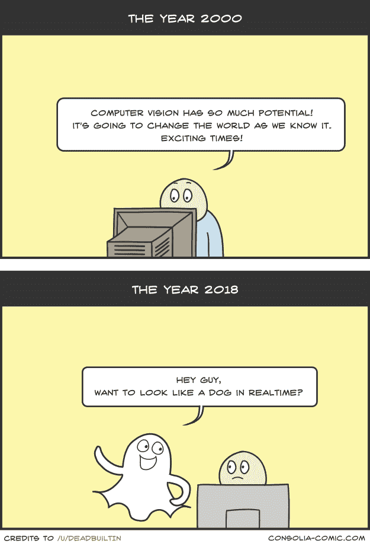

由[控制台上的](https://static.consolia-comic.com/comics/computer-vision.png) [deadbuiltin](https://www.reddit.com/user/deadBuiltIn) 拍摄的照片-漫画

## 计算机视觉有 4 个主要任务:

1.  图像分类-图像分类允许您对图像进行分类，是狗、猫、梨还是苹果。
2.  对象检测—对象检测允许您在图像中检测一个以上的对象。将绘制一个边界框来封装检测到的对象。
3.  语义分割——语义分割允许您将图像中的对象分为不同的类别，如动物、环境、食物。
4.  实例分割-实例分割是语义分割的一个更复杂的版本，在每个类别中，实例分割允许您区分同一类别下的不同对象(例如，动物-蛇、兔子、狗)。

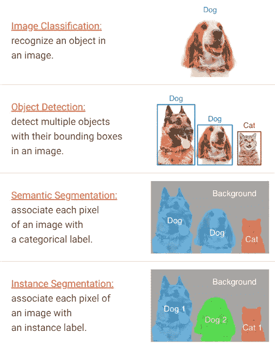

截图来自 [GluonCV](https://gluon-cv.mxnet.io/contents.html)

> 为什么我们不对每个任务都使用实例分段呢？

每个模型都有自己的权衡。越复杂，越慢，越贵。越简单越快越便宜。如果您只是希望程序检测图像中是否有球，那么使用最昂贵的实例分割是没有意义的。

# 简介:GluonCV

为了实用从零开始开发自己的计算机视觉模型是疯狂的。当您可以使用研究人员预先训练的模型获得更好的结果时，为什么要花费大量的时间和金钱来构建您自己的模型呢？

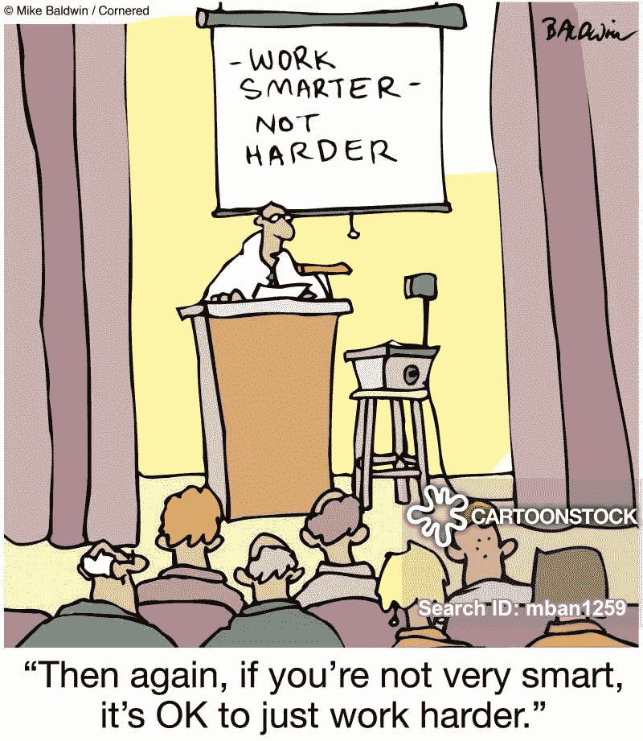

通过[卡通库存](https://www.cartoonstock.com/directory/w/work_smarter.asp)向[迈克·鲍德温](https://www.cartoonstock.com/sitesearch.asp?artists=102)致谢

MXNet 是一个开源的深度学习框架。MXNet 提供了一个名为 Gluon 的高级 API。Gluon 为几个任务提供了几个工具包:

1.  Glu oncv——计算机视觉
2.  gluonlp—用于自然语言处理
3.  GluonTS —用于时间序列处理

根据 GluonCV 的说法:

> G luonCV 提供计算机视觉领域最先进(SOTA)深度学习算法的实现。它旨在帮助工程师、研究人员和学生快速制作产品原型、验证新想法和学习计算机视觉。

GluonCV 拥有大量模型，这些模型已经由知名机构和研究人员进行了微调，这些机构和研究人员使用难以想象的计算能力和时间在数年内收集了大量数据。所有预先训练好的模型都被安置在[模型动物园](https://gluon-cv.mxnet.io/model_zoo/index.html)的 GluonCV 里。

在这篇文章之后，你应该能够用[gluo cv 和 MXNet](https://gluon-cv.mxnet.io/contents.html) 完成所有 4 个计算机视觉任务。

# 设置 MXNet 和 GluonCV

整篇文章只需要你下载 2 个包——MXNet 和 GluonCV。您可以使用以下命令来完成此操作:

```
pip install mxnet
pip install gluoncv
```

如果您想利用您的 CPU/GPU 或 TPU 进行处理，您只需[更改安装命令](https://mxnet.apache.org/get_started/?):

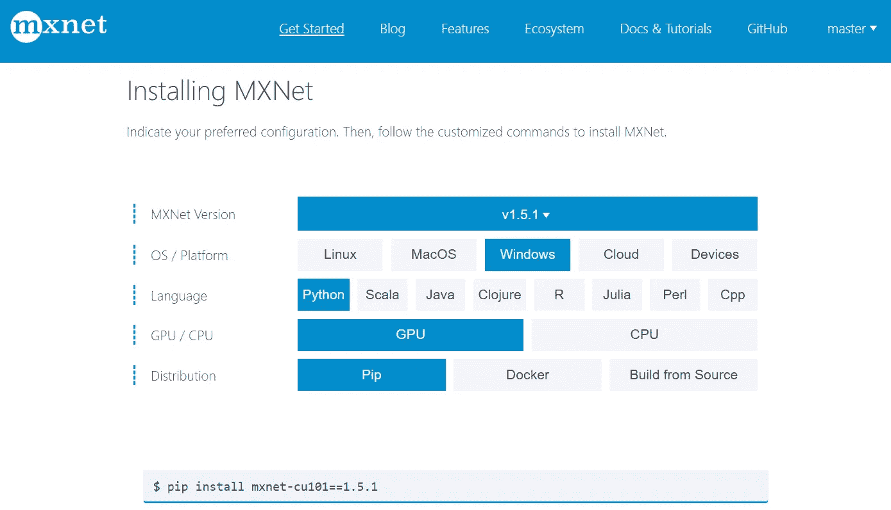

截图来自 [MXNet](https://mxnet.apache.org/get_started/?version=v1.5.1&platform=windows&language=python&processor=gpu&environ=pip&)

在我们开始之前，记得导入已安装的包(如果您还没有这样做，请下载 numpy 和 matplotlib):

```
import mxnet as mx
import gluoncv as gcv
import numpy as np
import matplotlib.pyplot as plt
```

# 图像分类

点击[这里](https://gluon-cv.mxnet.io/model_zoo/classification.html)查看文档。有许多模型可用于每个 CV 任务。这些模型中的每一个都用不同数量的图像和标签来训练，因此将具有不同的超参数集。例如，ImageNet22k 在超过 1400 万张图像上进行训练，可以预测超过 22，000 个类别。下图显示了每个型号的精度和速度之间的权衡。自然，精度越高，速度就会越低。

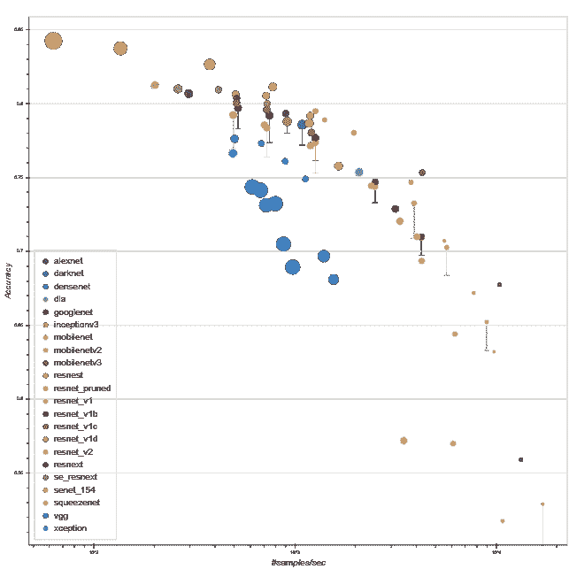

截图来自 [GluonCV](https://gluon-cv.mxnet.io/model_zoo/classification.html)

对图像进行分类只需 4 个步骤:

## 1.下载图像

```
image_url = "[https://raw.githubusercontent.com/dmlc/web-data/master/gluoncv/classification/mt_baker.jpg](https://raw.githubusercontent.com/dmlc/web-data/master/gluoncv/classification/mt_baker.jpg)"image_filepath = 'mt_baker.jpg'
gcv.utils.download(url=image_url,path = image_filepath)
```

你可以使用任何你想要的图片，只需简单地编辑链接。我们将使用贝克山的图像。接下来，我们将可视化图像并探索图像:

```
image = mx.image.imread('mt_baker.jpg')print("shape:",image.shape)
print("data type:",image.dtype)
print("min value:",image.min().asscalar())
print("max value:",image.max().asscalar())
```

第一行将我们的图像设置为一个变量。接下来的 4 行打印出图像的细节，结果如下:

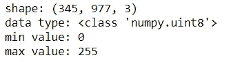

形状是三维的(HCW ),因为它由高度、宽度和通道组成。高度和宽度表示图像的垂直和水平长度，通道表示图像的深度。由于图像由 RGB 颜色组成，因此深度仅为 3:


来源: [packtpub](https://subscription.packtpub.com/book/big_data_and_business_intelligence/9781789613964/2/ch02lvl1sec21/convolution-on-rgb-images)

数据类型是用[整数](https://medium.com/p/96f72025f82d#8e3d)填充的 numpy 数组，最小值为 0，最大值为 [255](https://kb.iu.edu/d/aetf) 。最后，让我们想象一下这幅图像:

```
plt.imshow(image.asnumpy())
```

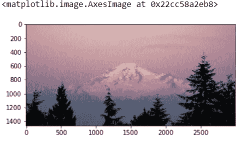

## 2.转换数据

GluonCV 要求您的图像符合以下标准:

1.  数据的形式必须是“批次数量、通道、高度、宽度(NCHW)”而不是“HWC”。通常，我们不仅仅用一幅图像来训练我们模型，我们用成千上万幅图像来训练它们。我们也不会一张一张地传入图像。我们一批一批地传入图像*。*然后在 NCHW 的 N 部分显示每批图像的数量。
2.  数据类型必须是 float 的 numpy 数组，而不是整数。
3.  图像值必须归一化，以 0 为中心，标准偏差为 1。

不用担心，所有这些步骤都可以通过一个命令完成:

```
image = gcv.data.transforms.presets.imagenet.transform_eval(image)print("shape:",image.shape)
print("data type:",image.dtype)
print("min value:",image.min().asscalar())
print("max value:",image.max().asscalar())
```

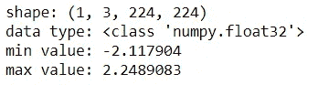

## 3.准备模型

我们将使用 ResNet 50 型号。我们将使用模型的预训练版本。

```
network = gcv.model_zoo.get_model("resnet50_v1d", pretrained=True)
```

要查找您可以使用的所有型号的列表，只需键入:

```
gcv.model_zoo.get_model_list()
```

所有模型都将下载到您的本地 mxnet 缓存中。您可以在此查看尺寸:

```
!ls -sh C:/Users/<your username>/.mxnet/models
```

## 4.给我们的形象分类

预测只需一行代码即可完成:

```
prediction = network(image)
```

由于我们只输入了 1 幅图像，我们将检索结果的第一个索引:

```
prediction = prediction[0]
```

*预测*存储该图像所属的每个类别的**原始**概率。由于 ResNet 50 能够预测 1000 个类，因此*预测*的长度将是 1000。

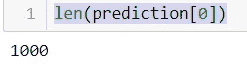

您可以检索 ResNet 50 模型能够预测的所有类的列表，应该有 1000 个:

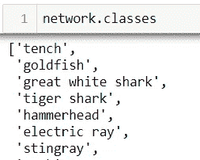

预测存储模型输出的原始概率。解释它们是没有意义的，因为有些概率是负的。因此，我们将使用一个 [softmax](https://en.wikipedia.org/wiki/Softmax_function) 函数来转换所有的概率，使其介于 0 和 1 之间:

```
probability = mx.nd.softmax(prediction)
```

现在，让我们检索前 5 个预测类:

```
k = 5
topk_indices = mx.nd.topk(probability, k=5)for i in range(k):
    class_index = topk_indices[i].astype('int').asscalar()
    class_label = network.classes[class_index]
    class_probability = probability[class_index]
    print("#{} {} ({:0.3}%)".format(i+1,class_label,class_probability.asscalar()*100))
```

结果是这样的:

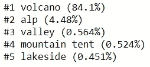

GluonCV 有 84.1%的把握预测这是一张火山的图像。因为 ResNet 50 没有专门针对贝克山的类，所以火山是我们能得到的最接近的了。

# 目标检测

点击[这里](https://gluon-cv.mxnet.io/model_zoo/detection.html)查看文档。你会发现这部分和[图像分类](https://medium.com/p/96f72025f82d#41b5)很像。然而，不使用 ResNet 50，我们将使用 [YOLO V3](/review-yolov3-you-only-look-once-object-detection-eab75d7a1ba6) ，这是一个非常快速的对象检测模型。

## 1.下载图像

让我们使用另一个包含几个对象的图像:

```
image_url = "[https://raw.githubusercontent.com/zhreshold/mxnet-ssd/master/data/demo/dog.jpg](https://raw.githubusercontent.com/zhreshold/mxnet-ssd/master/data/demo/dog.jpg)"image_filepath = 'dog.jpg'
gcv.utils.download(url=image_url,path = image_filepath)
```

我们来探究一下数据。这一部分与您之前所做的非常相似。

```
image = mx.image.imread(image_filepath)print("shape:",image.shape)
print("data type:",image.dtype)
print("min value:",image.min().asscalar())
print("max value:",image.max().asscalar())plt.imshow(image.asnumpy())
```

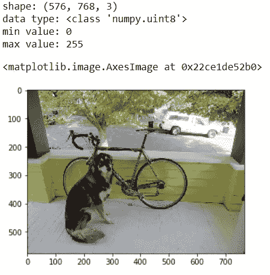

## 2.转换数据

由于我们使用的是另一种模型，我们必须将数据转换成另一种适合 YOLO V3 的格式。不用担心，这也可以用一行代码完成:

```
image, chw_image = gcv.data.transforms.presets.yolo.transform_test(image, short=512)
```

我们现在有两个图像，而不是一个变换后的图像，即*图像*和 *chw_image。图像*由您的原始图像组成，而 *chw_image c* 由您的转换图像组成。变量 *short=512* 用于指示图像的宽度，同时仍然保持纵横比。

```
print("shape:",image.shape)
print("data type:",image.dtype)
print("min value:",image.min().asscalar())
print("max value:",image.max().asscalar())
```


## 3.准备模型

这是我们将使用的模型:

```
network = gcv.model_zoo.get_model('yolo3_darknet53_coco',pretrained=True)
```

## 4.打开结果

然而，这一次，我们的预测返回给我们 3 个项目:

```
prediction = network(image)
for index,array in enumerate(prediction):
    print('#{} shape: {}'.format(index+1,array.shape))
```

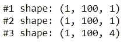

*   第一项是类别标签。它告诉我们检测到的类的索引。请记住，您可以使用 network.classes 获得类名。
*   第二项是预测概率。
*   第三个项目是一个边界框数组。因为你需要 4 个角来组成一个盒子，所以会有一个 4 坐标的列表。

此外，还有一些细微的区别:

1.  您不必对概率应用 softmax 函数。
2.  类别和概率已经为您按降序排序。

让我们看一些例子:

```
prediction = [array[0] for array in prediction] #since we only input 1 image
class_indices, probabilities, bounding_boxes = prediction #unpacking#Let's  list the top 10 items
k = 10
print(class_indices[:k])
print(probabilities[:k])
print(bounding_boxes[:k])
```

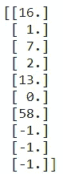

十大类指数

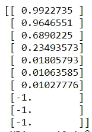

十大可能性

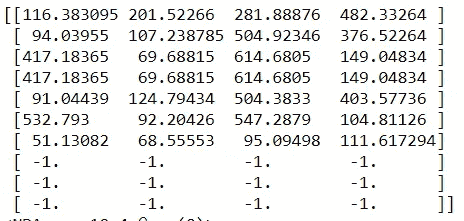

边界框的坐标

注意“-1”是一个特殊的类，这意味着没有检测到任何对象。

## 5.在对象周围绘制方框

现在我们有了坐标，让我们给我们的图像加标签吧！

```
gcv.utils.viz.plot_bbox(chw_image,
                       bounding_boxes,
                       probabilities,
                       class_indices,
                       class_names=network.classes)
```

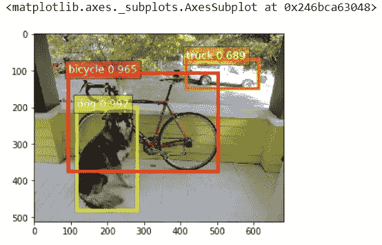

# 图象分割法

点击[这里](https://gluon-cv.mxnet.io/model_zoo/segmentation.html)查看文档。

## 语义分割

语义分割旨在对图像中的每个像素进行分类。它将在进行分段级预测之前查看图像的完整上下文。之后，该模型将使用不同的颜色来覆盖图像的所有像素，以将它们分类。在本节中，背景类被标记为-1。

本节将使用 FCN ResNet ADE，这是一个具有 ResNet 架构的全连接神经网络，在 [ADE20K](https://groups.csail.mit.edu/vision/datasets/ADE20K/) 数据集上进行训练。

## 1.下载图像

该部分与[物体检测](https://medium.com/p/96f72025f82d#dce5)完全相同。如果你愿意，可以跳过这一步

```
image_url = "[https://raw.githubusercontent.com/zhreshold/mxnet-ssd/master/data/demo/dog.jpg](https://raw.githubusercontent.com/zhreshold/mxnet-ssd/master/data/demo/dog.jpg)"image_filepath = 'dog.jpg'
gcv.utils.download(url=image_url,path = image_filepath)
```

## 2.转换数据

这一部分没有一行代码。您必须定义自己的函数来转换数据:

```
from mxnet.gluon.data.vision import transformstransform_fn = transforms.Compose([
    transforms.ToTensor(),
    transforms.Normalize([.485, .456, .406], [.229, .224, .225])
])image = transform_fn(image)
print("shape:",image.shape)
print("data type:",image.dtype)
print("min value:",image.min().asscalar())
print("max value:",image.max().asscalar())
```

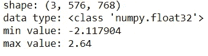

ToTensor()将图像从 HWC 格式转换为 CHW 格式，并将数据类型从 8 位整数转换为 32 位浮点数。然后根据 ImageNet one case 统计对图像进行归一化。

如前所述，我们通常逐批预测图像。尽管我们只预测了一个图像，我们仍然需要指定批量大小:

```
image = image.expand_dims(0)
```

## 3.准备模型:

```
network = gcv.model_zoo.get_model('fcn_resnet50_ade',pretrained=True)
```

## 4.打开结果

为了加快速度，我们将申请。向我们的网络演示。更长的版本可以在实例分段下找到。

```
output = network.demo(image)
print(output.shape)
```

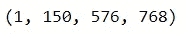

只有 1 个图像，150 个预测类，图像的宽度为 576，高度为 768。

```
output = output[0] # since there is only 1 image in this batch
prediction = mx.nd.argmax(output,0).asnumpy() # to get index of largest probability
```

## 5.给我们的形象上色

现在，让我们给我们的图像着色来分割它们:

```
from gluoncv.utils.viz import get_color_palleteprediction_image = get_color_pallete(prediction, 'ade20k')
prediction_image
```

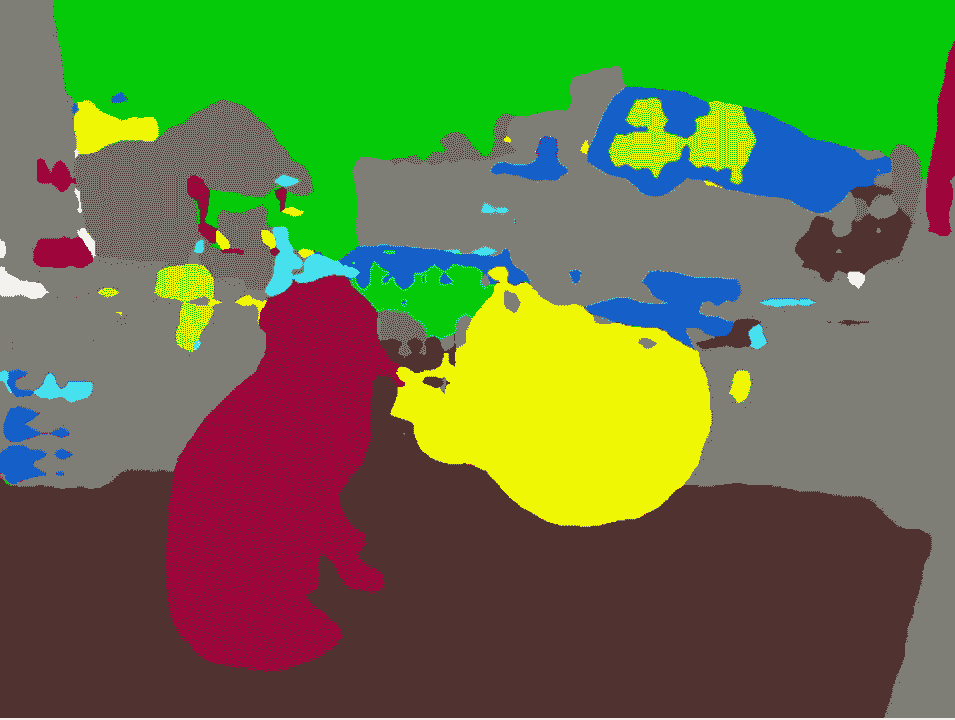

## 实例分割

实例分割能够识别一个人不同于另一个人。我们可以预测这些像素的确切边界和颜色，而不是边界框。

这要归功于 gluonvc 的原始文档:[https://gluon-cv . mxnet . io/build/examples _ instance/demo _ mask _ rcnn . html # sphx-glr-build-examples-instance-demo-mask-rcnn-py](https://gluon-cv.mxnet.io/build/examples_instance/demo_mask_rcnn.html#sphx-glr-build-examples-instance-demo-mask-rcnn-py)

## 1.下载图像

```
image = gcv.utils.download('[https://github.com/dmlc/web-data/blob/master/'](https://github.com/dmlc/web-data/blob/master/') +
                          'gluoncv/detection/biking.jpg?raw=true',
                          path='biking.jpg')
```

## 2.转换数据

```
x, orig_img = gcv.data.transforms.presets.rcnn.load_test(image)
```

## 3.准备模型

```
network = gcv.model_zoo.get_model('mask_rcnn_resnet50_v1b_coco', pretrained=True)
```

## 4.打开结果

```
ids, scores, bboxes, masks = [xx[0].asnumpy() for xx in network(x)]
```

## 5.在图像上绘画

```
# paint segmentation mask on images directly
width, height = orig_img.shape[1], orig_img.shape[0]
masks, _ = gcv.utils.viz.expand_mask(masks, bboxes, (width, height), scores)
orig_img = gcv.utils.viz.plot_mask(orig_img, masks)
plt.imshow(orig_img)
```

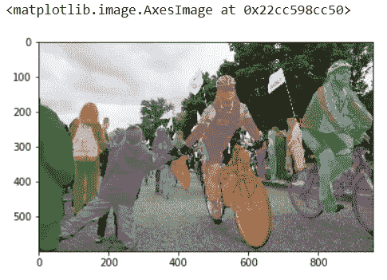

让我们添加一些框:

```
# identical to Faster RCNN object detection
fig = plt.figure(figsize=(10, 10))
ax = fig.add_subplot(1, 1, 1)
ax = gcv.utils.viz.plot_bbox(orig_img, bboxes, scores, ids,
                         class_names=network.classes, ax=ax)
plt.show()
```

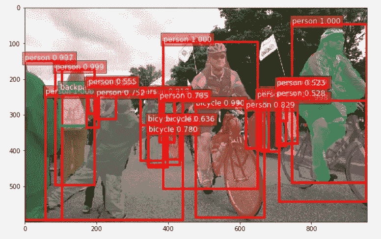

# 结论

恭喜你！你只用一个框架就完成了 4 个主要的计算机视觉任务！

一定要尝试不同的型号，确定哪种最适合你。记住:更复杂的模型不一定是最好的模型。

理解业务需求非常重要。选择最符合您目的的型号。凡事总有取舍。花一些时间浏览文档，以确定哪个模型架构和哪个类标签最适合您的需要。


来源: [kxcd](https://xkcd.com/1838/)

# 参考

1.  【https://medium.com/r/? URL = https % 3A % 2F % 2f gluon-cv . mxnet . io % 2f contents . html
2.  【https://www.coursera.org/learn/aws-computer-vision-gluoncv/ 
3.  [https://gluon-cv . mxnet . io/build/examples _ instance/demo _ mask _ rcnn . html # sphx-glr-build-examples-instance-demo-mask-rcnn-py](https://gluon-cv.mxnet.io/build/examples_instance/demo_mask_rcnn.html#sphx-glr-build-examples-instance-demo-mask-rcnn-py)