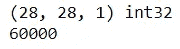
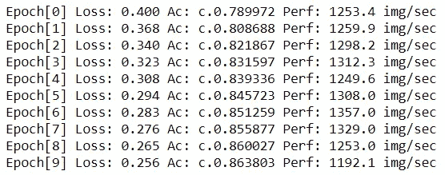

# 计算机视觉一站式指南—第二部分

> 原文：<https://towardsdatascience.com/a-one-stop-guide-to-computer-vision-part-2-f5db1b025588?source=collection_archive---------65----------------------->

## 带有 MXNet 和胶子的计算机视觉(逐行解释)


弗拉德·希利塔努在 [Unsplash](https://unsplash.com?utm_source=medium&utm_medium=referral) 上拍摄的照片

[第 1 部分](/a-one-stop-guide-to-computer-vision-96f72025f82d):使用高级 API 创建神经网络。

# 介绍

在上一篇文章中，我们学习了如何使用 GluonCV 模型动物园中预先训练好的模型来执行 4 种不同的计算机视觉任务。在本文中，我们将从头开始构建自己的模型。

这篇文章的目的是让你了解计算机视觉模型内部通常会发生什么。我们将创建一个卷积神经网络(CNN)来识别服装。是的，你没听错，我们不再识别手写数字(MNIST)或探测狗了。我们现在识别服装。

但是为什么呢？

根据[扎兰多](https://github.com/zalandoresearch/fashion-mnist):

> 事实上，MNIST 经常是研究人员尝试的第一个数据集。他们说，“如果在 MNIST 行不通，那就根本行不通”。“嗯，如果它对 MNIST 有效，对其他人也可能无效。”

再按 [Zalando](https://github.com/zalandoresearch/fashion-mnist) :

> MNIST 太容易了。卷积网在 MNIST 上可以达到 99.7%。经典的机器学习算法也能轻松做到 97%。

本文假设您对机器学习和神经网络有某种形式的基础知识，如训练测试数据、优化器、损失函数、度量、前向传播、后向传播等。如果没有，不要担心。这些概念非常基本，很多信息都可以在网上找到。我将尽力解释构建 CNN 所需的每一行代码。

# 导入库

必须导入以下库来构建我们的模型。如果您遵循了本文的第 1 部分,您将不需要安装任何额外的包。否则，一定要看看这篇文章，看看你应该下载哪两个包！(是的，你所需要的是 2 个软件包来创建你自己的神经网络)

```
from mxnet import nd,autograd,gluon,init,metricfrom mxnet.gluon import nn
from mxnet.gluon.data.vision import datasets, transformsimport matplotlib.pyplot as plt
from time import time
```

# 下载数据

胶子自带数据库。你可以用一行代码下载[时尚 MNIST](https://github.com/zalandoresearch/fashion-mnist) 。

因为我们稍后将评估我们的模型，所以我们也将通过将参数`train`设置为`False`来下载验证数据集。

```
train_data = datasets.FashionMNIST(train=True)
valid_data = datasets.FashionMNIST(train=False)X_train,y_train = train_data[0]print(X_train.shape, y_train.dtype)
print(len(train_data))
```

然后，我们可以打印出第一幅图像的形状和数据类型:

*   形状:(28，28，1)。图像的高度和宽度是 28，并且它是黑白图像，因为深度只有 1。
*   dtype: int32。图像由 32 位整数表示。

最后，我们观察到我们的训练数据中有 60，000 张图像。



# 转换数据

数据必须被转换成胶子神经网络能够消化的格式。幸运的是，胶子也为我们提供了轻松实现这一点的功能:

*   `transforms.Compose` 允许我们将几个转换函数拼接成一个函数。请注意转换的顺序很重要。
*   `transforms.ToTensor()`将您的图像从 HWC 格式更改为 CHW 格式，并将数据类型从 32 位整数更改为 32 位浮点。
*   `transforns.Normalize()`根据提供的两个参数——平均值、标准差，对图像进行归一化处理。

```
transformer = transforms.Compose([
    transforms.ToTensor(),
    transforms.Normalize(0.13,0.31)
])train_data = train_data.transform_first(transformer)
```

# 将数据加载到批中

把你的图像一张一张地发送到你的神经网络中是个坏主意。这将花费大量的时间来为你的网络提供信息。因此，我们创建一个数据加载器，将数据加载到 256 个批次中(您可以试验并更改这个批次号)。

创建数据加载器需要 4 个参数:

*   `train_data`:您的训练数据(长度 60000)
*   每一波都会有 256 张图片输入你的神经网络
*   随机打乱你的数据以减少数据间的虚假关联
*   `num_workers`:用于训练的核心数。您可以检查可用内核的数量。不同的计算机会返回不同的结果。在我的例子中，我将其设置为 4。

```
# check number of CPUs avaiable
from multiprocessing import cpu_count
print(cpu_count())batch_size = 256
train_data_batch = gluon.data.DataLoader(train_data,
                                         batch_size = batch_size,
                                         shuffle=True,
                                         num_workers=4)valid_data = gluon.data.DataLoader(valid_data.transform_first(transformer),
                                   batch_size=batch_size)
```

# 定义您的模型

我们将复制一个 LeNet-5 模型。


原始图片发表于[ [LeCun 等人](http://yann.lecun.com/exdb/lenet/)，1998]

我们首先从空白画布开始:`nn.Sequential()`

接下来，我们根据 LeNet-5 架构在我们的模型中添加一层又一层的隐藏层。

*   `nn.Conv2D`:从图像中提取特征的卷积层。
*   `nn.MaxPool2D`:减少待训练参数数量的池层。
*   `nn.Flatten`:将我们的数据展平到一维，为完全连接的层做准备
*   `nn.Dense`:全连接层
*   `network.initialize(init=init.Xavier())`:执行“ [Xavier](http://proceedings.mlr.press/v9/glorot10a/glorot10a.pdf) ”权重初始化。Xavier 初始化器有助于保持所有层的梯度比例大致相同

```
network = nn.Sequential()
with network.name_scope():
    network.add(
        nn.Conv2D(channels=6, kernel_size=5, activation='relu'),
        nn.MaxPool2D(pool_size=2, strides=2),
        nn.Conv2D(channels=16, kernel_size=3, activation='relu'),
        nn.MaxPool2D(pool_size=2, strides=2),
        nn.Flatten(),
        nn.Dense(120, activation='relu'),
        nn.Dense(84, activation='relu'),
        nn.Dense(10)
        )network.initialize(init=init.Xavier())
```

# 损失函数

为了让我们的模型确定它是否表现良好，我们需要一个损失函数。你可以认为损失函数是错误，关于我们离正确的标签/基本事实有多远。

在多项式分类问题中，我们通常会使用[交叉熵损失](https://gombru.github.io/2018/05/23/cross_entropy_loss/)函数。交叉熵损失函数通常与 softmax 成对使用，以挤压(0，1)之间的值。

```
softmax_cross_entropy = gluon.loss.SoftmaxCrossEntropyLoss()
```

# 评估指标

有了损失函数，我们需要一种方法来确定我们的模型有多好。我们通过使用指标来确定这一点。有几个指标，如 F1，召回，精度，准确性等。最常用的衡量标准是准确性。

`train_acc`允许我们创建一个对象，并不断向它反馈预测结果和实际结果。它会自动重新计算精度，直到您调用精度。这将在本文的后面部分演示。

```
train_acc = metric.Accuracy()
```

# 【计算机】优化程序

我们需要定义我们的优化器。如果我们不采取任何措施来改进我们的模型，那么了解它的表现是好是坏是没有意义的。因此，我们利用随机梯度下降来告诉我们的模型在给定当前误差/精度的情况下下一步做什么。

*   `network.collect_params()` :我们能够检索我们模型的当前权重。我们的教练需要当前的体重，以便更新。
*   `'sgd'`:我们选择随机梯度下降优化器。访问[原始文档](https://mxnet.apache.org/api/python/docs/api/optimizer/index.html#mxnet.optimizer.Optimizer)了解可用的优化器类型。
*   `learning_rate`:学习率越低，我们就越能达到最小/最大值。然而，这也导致了更长的模型训练时间。

```
trainer = gluon.Trainer(network.collect_params(),
                       'sgd', {'learning_rate':0.1})
```

# 训练循环

这一部分将我们到目前为止为训练模型所做的一切放在一起。我将逐步解释下面的代码:

1.  `for epoch in range(10):` 我们将对我们的模型进行总共 10 个纪元/时间的训练。
2.  对于每次迭代，我们将损失实例化为 0。
3.  `tic = time()`我们记录当前时间，这样我们就可以跟踪我们的模型训练需要多长时间。
4.  我们现在循环处理批量数据
5.  `with autogra.record():`我们记录模型中发生的事情
6.  `output=network(data)`通过将`data`传递给我们的`network`，也就是我们的模型，我们得到了一个预测`output`
7.  `loss=softmax_cross_entropy(output,label)`利用之前定义的损失函数，我们可以通过传入预测输出和实际输出来计算我们的损失
8.  损失通过 CNN 反向传播
9.  `trainer.step(batch_siz)`在反向传播损失后，我们向前迈出一步来更新我们的权重
10.  `train_loss += loss.mean().asscalar()`用该批数据发生的损失更新培训损失
11.  `train_acc.update(label,output)`训练精度随着这批数据的损失而更新
12.  打印报表打印每个时期的损耗、精度和性能。我们通常会将它打印出来，这样我们就可以观察并确保模型正在进展。
13.  `network.save_parameters("trained_net.params")`这一步是可选的。将模型训练成文件后，它会保存更新的权重。砝码可以随时加载到另一个环境中。

```
for epoch in range(10):
    train_loss = 0
    tic = time()
    for data, label in train_data_batch:
        with autograd.record():
            output=network(data)
            loss=softmax_cross_entropy(output,label)
        loss.backward()

        trainer.step(batch_size)

        train_loss += loss.mean().asscalar()
        train_acc.update(label,output)

    print("Epoch[%d] Loss: %.3f Acc: .%3f Perf: %.1f img/sec"%(
        epoch,train_loss/len(train_data_batch),
        train_acc.get()[1],
        len(train_data)/(time()-tic)
    ))
network.save_parameters("trained_net.params")
```

上面的代码需要相当长的时间来运行，这取决于你的计算机的能力。你可以观察到随着迭代次数的增加，损耗如何减少，精度如何增加。这说明我们的模型学习的很好。



# 模型评估

最后，我们对我们的模型进行最终评估，以了解它在看不见的数据上的表现。切记创建新的精度指标，不要重复使用`train_acc`以防止信息泄露。

解释:

1.  `network.load_parameters("trained_net.params")`加载我们之前训练的模型权重。
2.  就像我们如何传递一批批训练数据来训练我们的模型一样，我们现在传递一批批验证数据来评估我们的模型，同时更新`valid_acc`
3.  为了获得最终精度，使用`valid_acc.get()[1]`将其打印出来。我设法获得了 0.9025 的验证精度。你应该得到一个不同的号码。这意味着我们的模型在 90%的时间里预测正确的输出！

```
network.load_parameters("trained_net.params")valid_acc = metric.Accuracy()for data,label in valid_data:
    output = network(data)
    valid_acc.update(label,output)print(valid_acc.get()[1])
```

# 结论

祝贺你完成这篇文章！现在，您应该能够从头开始创建和设计自己的神经网络。还有许多其他深度学习库，如 [Tensorflow](https://www.tensorflow.org/) 、 [Keras](https://keras.io/) 、 [Pytorch](https://pytorch.org/) 和 [Scikit-learn](https://scikit-learn.org/stable/) 也可以实现相同的结果。去做你熟悉的事情。不同的包应该仍然为您提供相似的结果。

我鼓励你去看看现有的不同模型和架构，用你能在网上找到的不同数据进行实验。