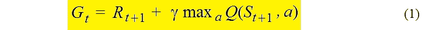
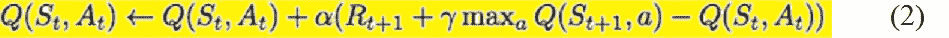
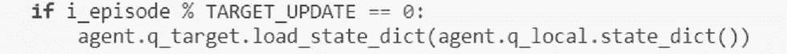
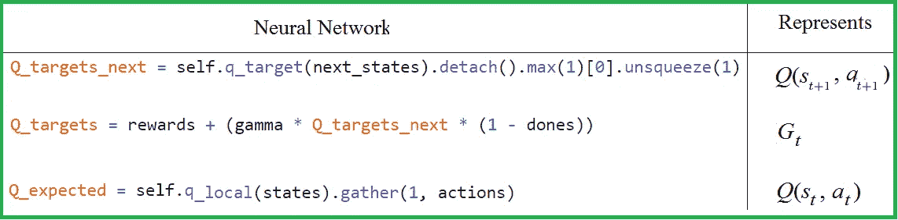
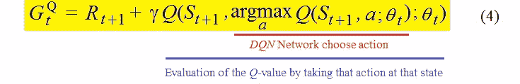
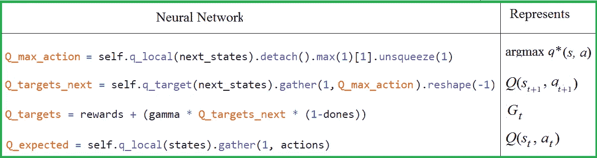
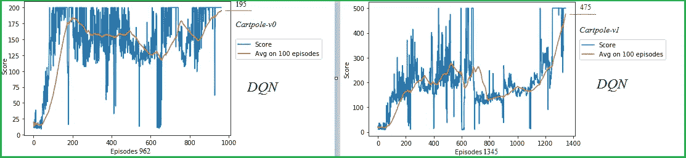
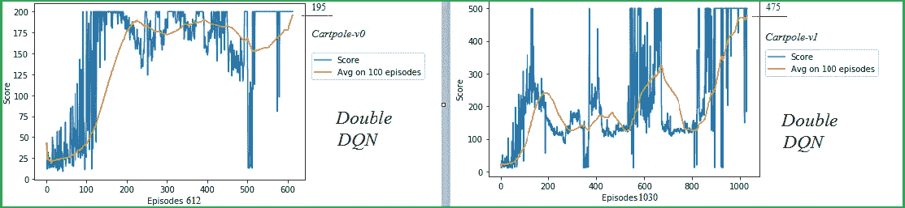
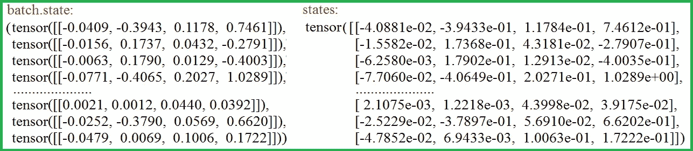
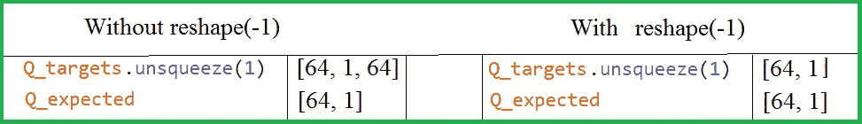

# 深度 Q 网络中的一对相关神经网络

> 原文：<https://towardsdatascience.com/a-pair-of-interrelated-neural-networks-in-dqn-f0f58e09b3c4?source=collection_archive---------30----------------------->

## 在 DQN 和双 DQN 模型中，比较两个相互关联的神经网络是至关重要的。

资料来源:123rf.com

我们将遵循在开发 *DQN* 和*双* *DQN* 算法中为对抗相关性和高估而采取的一些步骤。作为 *DQN* 和*双 DQN* 应用的例子，我们展示了 *CartPole-v0* 和 *CartPole-v1* 环境的训练结果。最后一节包含一些关于 *PyTorch* 张量的提示。

**从查找表到神经网络**

直到 2013 年左右，深度 Q-Learning 还是一种强化学习( *RL* )方法，只对查找表有效。神经网络在计算机视觉中的成功激起了人们在《T21》RL 中尝试它们的兴趣。论文“ [*用深度 RL*](https://arxiv.org/abs/1312.5602) 玩雅达利”(V.Mnih 等人，2013，DeepMind)提出了第一个使用神经网络函数逼近的成功的*深度学习*模型。在 2015 年， [DeepMind 展示了](https://www.nature.com/articles/nature14236)Deep Q-network 代理，仅接收行像素数据和游戏分数作为输入，就能够超过之前所有算法的性能。

> 在这两个 DeepMind 工作之后，查找表被神经网络取代，一个*Q-学习*变成了一个*深度 Q-学习、*或者等价地，*深度 Q-网络(DQN)。*其实是 RL 特工训练的一个突破。

*DQN* 是将 Q 学习与神经网络相结合的算法。

# ***DQN***组件

1.  一对*Q*-网络(本地和目标)。
2.  体验回放—一种生物启发机制。
3.  ε-贪婪机制。
4.  *Q*-学习，即将最大值用于所有可能的动作。
5.  利用梯度下降机制最小化损失函数。

**相关性有害**

当神经网络被用作函数逼近时，强化学习被认为是不稳定的。这种不稳定性的原因如下:

*   观察序列中的相关性，
*   对 *Q* 值的微小更新可能会显著改变策略，
*   *Q*-值`***Q(s_t, a_t)***`和*TD*-目标值之间的相关性

**TD-目标**

用于 *DQN* 的关键方程，eq。(2).

**DQN 关键方程**

**对*Q*-网络:本地和目标**

*DQN* 算法在对抗相关性中的一个重要组成部分就是使用目标网络 *(* `***q_target***` *)* 。目标网络(具有参数`***θ****`)与本地网络相同，除了它的参数从本地网络(`***q_local***`)的每个`***τ***`步骤被复制，以便然后`***θ**_*t* = *θ*_*t***`，并在所有其他步骤保持固定。在看起来如下:

在 [*横翻*](https://github.com/Rafael1s/Deep-Reinforcement-Learning-Udacity/blob/master/Cartpole-Deep-Q-Learning/CartPole-v0_DQN_Pytorch.ipynb) 中设置 *τ =* TARGET_UPDATE = 10。

**损失函数为 *DQN* 代理**

> 比较代表相同 Q-表的两个神经网络并找到这些网络非常接近的点是 DQN 算法的基本部分。

由网络 *q_local* 和 *q_target* 张量*当前估计* `***Q*(s_*t, a_t*)**`和*备选估计* `***G_t***` *，*参见(1)，进行计算。此外，在`**class Agent**`的功能`***learn()***`中

**表 1。** **三张量(PyTorch 中)，DQN**

*   `**Q_targets**` 与`**Q_expected**` 之间的距离由`***MSELoss***` 函数计算**；`***loss***`值通过梯度下降机制最小化；**
*   **执行`***loss***`张量的`***backpropagation***` 机制；**
*   **梯度下降算法由优化器执行，例如`***torch.optim.Adam*, *torch.optim.RMSprop***`或任何其他。**

****DQN 的学习功能****

****体验回放——一种受生物启发的机制****

***DQN* 用来减少相关性的另一个东西是**体验回放**机制，它将数据放入特定的内存存储中，并从内存存储中随机接收数据。**

****ε-贪婪机制****

***DQN*`**ε**`-贪婪机制促进了*勘探*和*开采之间的合理比例。*该机构提供参数`**ε**`，其中`**0 < ε < 1**`，允许控制该比例。对于任何`**ε**`，以概率`**1-ε**`，选择剥削。*利用*意味着代理通过在给定状态的所有可能动作中最大化*Q*-值找到以下动作，参见函数`***get_action()***`中的相关行:**

****退火ε-贪婪机制****

**但是如何选择 epsilon 呢？一个流行的选择是退火`**ε**`——贪婪算法。对于任何一集`***i***`，动作都是贪婪概率`**1-ε**`。**

****

**在 eq 中。(3)`**ε_m**`**是中`**ε**`的最小值，在`**Mε**` **中必须达到。**由(3)如果`***i* = 0**` 我们有`**ε = 1**`；如果`***i =* 1**` 那么`**ε**` 接近`**1**` **。**为例，对于`**Mε = 50**`**`**ε_m =0.01**`**我们有`**ε = 0.98**` **。**然后以概率`**0.02**`选择*开采*，以概率`**0.98**` **选择，**即*动作号*的一个相当随机的值。因此，对于第一集来说，动作会被随机选择，这就是探索。********

****如果`***i =* Mε**` **，**我们得到`**ε = ε_m**` **。**以`**ε = 0.01**`为例，**。**然后以概率`**0.99**`选择利用，仅在 1%的情况下获得行动数的随机值。对于从`**0**` 到`**Mε**`的剧集，`**ε**` 的值从`**1**`到`**ε_m**`**递减，之后固定在`**ε_m**`。******

# ****双 DQN 对 DQN****

******高估*DQN*******

****众所周知， *DQN* 算法高估了动作值。 [Thrun 和 Schwartz (1993)](https://www.ri.cmu.edu/publications/issues-in-using-function-approximation-for-reinforcement-learning/) 首次调查了 *DQN* 的*高估。他们给出了一个例子，其中这些高估渐进地导致次优政策。假设，对于某个状态`***s***’`，所有动作`***a***`的真值为`***Q(s’, a) = 0***`，而 *Q* 的估计值分布在零上下。那么这些估计值的最大值就是对真实值的高估。2015 年，( [Hasselt et。艾尔。，](https://arxiv.org/abs/1509.06461) DeepMind)表明，估计误差会使估计值上升并远离真正的最优值。他们假设减少高估的解决方案:*双 DQN。******

****高估的原因是什么？问题出在 eqs 中的`**max**`运算符。(1)和(2)。假设`***Q(S_t, a)***` 的评估值已经被高估。然后在方程中得到的动作值。(1)或(2)变得更加高估。等式中的*TD*-目标`***G_t***`。(1)可以重写为*TD*-目标`***G^Q_t***`如下:****

********

****这里，`***θ*_*t***`是网络的权值集合`***q_target***`，*，*见上表 1。****

******解耦动作和评估******

*****双 DQN* 的解决方案是在*解耦*中选择*动作* `***argmax_a***` 从*求值* `***Q*(*S_{t+1}, argmax_a*)**`，参见(4)。这是使用另一个具有权重集`***θ’*_*t***` *:* 的网络来完成的****

********

> ****通过(5)贪婪策略(argmax)由神经网络`*q_local* ***(***`权重`***θ*_*t).***` 估计，网络 `q_target (`权重`***θ'*_*t)***` 用于公平地评估该策略。这个方案是*双 DQN* 的主要思想。****

******损失函数为*双* *DQN* 代理******

****对于*双* *DQN* 代理的情况，张量`***Q*(s_*t, a_t*)**`和`***G_t***` 的计算同 *DQN、*见表 1 和表 2。****

********

******表二。四张量(PyTorch 中)，双 DQN******

****表 1 和表 2 的主要区别在于张量`***Q_target_next***` 的计算(评估 *Q* 值):****

*   ****在表 1 中，`***Q_target_next***`仅由一个网络计算`***q_target,***` 见(4)。****
*   ****在表 2 中，`***Q_target_next***` 使用两个网络计算:`***q_target***`和`***q_local***`(见(5)和`***Q_max_action***`)。****

******双 DQN 的学习功能******

# ****杠-v0 和杠-v1 训练****

****一根杆子通过一个接头连接到一辆沿轨道移动的车上。通过对推车施加+1 或-1 的力来控制该系统。****

******第*题*是一个二元分类问题******

*****小车*观察空间的维数为 4，因为有 4 个特征构成输入:*小车坐标*、*速度*、*立柱与垂线的角度*及其*导数*(立柱“下落”速度)。*横竿*是一个二元分类问题，因为在每个时间步，代理人在移动`***left***`或`***right***`之间进行选择。钟摆开始直立，目标是防止它翻倒。柱子保持直立的每个时间步长提供+1 的奖励。当柱子偏离垂直方向超过 15 度，或者手推车偏离中心超过 2.4 个单位时，该集结束。****

> *****如果连续 100 次试验获得平均奖励>****195****，则认为环境*问题解决；横竿-v1 *如果连续 100 次试验得到平均奖励>****475****就认为解决了。*****

******对*小车-v0* 和*小车-v1* 和**的训练实验****

****下面是我用 *DQN* 和*双 DQN* 进行实验的结果，是在训练 *CartPole-v0* 和 *CartPole-v1* 时获得的。对于所有情况，LEARNING_RATE = 0.001。贪婪参数`**ε**`从`**1**`变为`**ε_m = 0.01**`****

****[**与 DQN 一起翻筋斗**](https://github.com/Rafael1s/Deep-Reinforcement-Learning-Udacity/tree/master/Cartpole-Deep-Q-Learning)****

****对于 *CartPole-v0* 和 *CartPole-v1、*我们把`**Mε= 50.**`****

1.  *****DQN，钢管舞-v0，*奖励 **195** 在第 **962 集达成。******
2.  *****DQN，扁担-v1，*奖励 **475** 在第 **1345** 集达成。****

********

****[**翻筋斗带双 DQN**](https://github.com/Rafael1s/Deep-Reinforcement-Learning-Udacity/tree/master/Cartpole-Double-Deep-Q-Learning)****

****对于 *CartPole-v0* 我们把`**Mε= 200;**`对于 *CartPole-v1，*我们把`**Mε= 150.**`回忆一下`**Mε**` 是`**ε**` 达到最小值`**ε_m.**`的那一集的数量****

****3.*双 DQN，弹弓-v0，*奖励 **195** 在第 **612 集达成。******

****4.*双 DQN，横竿-v1，*奖励 **475** 在第 **1030** 集达成。****

********

******超参数的选择******

****如果`**Mε**`设置得太大，那么`**ε**`的选择将在*探索*的高概率(`**> ε_m**`)条件下进行很长时间。换句话说，很长一段时间`**ε**`将在神经网络中没有信息积累的情况下进行。这意味着在移动`***left***`或`***right***`之间做出选择，我们可能会在很长一段时间内有一半的情况是错误的。****

****如果`**Mε**`设置过小，那么`**ε**`的选择将会在*利用*的高概率(`**= ε_m**`)的情况下进行很长时间。这在神经网络训练的早期阶段可能非常糟糕，因为使用`***argmax***`的*动作*的选择将从神经网络中做出，这仍然非常粗糙。那么在很多情况下，选择的*动作*就会被弄错。****

# ****结论****

****在开发 *DQN* 和*双 DQN* 算法时，采取了三个步骤来对抗相关性和高估:(1)目标和局部网络，(2)经验重放机制，(3)将选择与评估分离。这些机制是通过大量使用两个相关的神经网络开发出来的。****

# ****附录。关于 PyTorch 张量****

******用 torch.no_grad()******

*****PyTorch* 函数`***no_grad()***` 从渐变计算中排除一些元素。当确信没有执行*反向传播*过程时使用。该功能减少了内存消耗，参见`***get_action().***` 使用`***detach()***` 功能时也会出现类似的效果。`***with***`声明阐明了对应于`***try...finally***` 块的代码。****

******optim.zero_grad()******

****清除上一步的旧梯度(否则梯度将从所有`***loss.backward()***`调用中累加)****

******视图(1，1)******

****该函数返回一个新的张量，与原始张量相同，但形状不同。试图去除`***view(1,1)***` 中的`***get_action()***`*我们得到了*中不同形状的动作张量*的两个分支`***get_action().***`然后在`***learn()***`中我们得到了由各种形状的张量组成的`***batch.action***` 。这是失败。函数`***view(1,1)***` 将形状从`***tensor([a])***` 改变为`***tensor([[a]]).***` 参数`***1,1***`表示每个维度的元素个数。例如，view(1，1，1，1，1)表示
`***tensor([[[[[a]]]]]).***`*****

*******torch.cat*******

*****将给定的张量元组连接成单个张量。例如在`***learn()***`函数中，`***batch.state***` 是形状[1，4]的 64 个张量的*元组*。函数`***torch.cat***`将该元组转换为形状【64，4】的单个张量`***states***`,如下所示:*****

**********

*******States = torch . cat(batch . state)*******

*******整形(-1)*******

*****为什么我们要用`***reshape(-1)***`来求`***Q_targets_next***`张量，见表 2？在`***learn()***`函数中我们比较两个张量:`***Q_targets.unsqueeze(1)***`和`***Q_expected.***`如果我们不使用`***reshape***`函数，那么由表 3 可知这些张量具有不同的形状，那么比较就是失败的。*****

**********

*******表 3 learn()函数中比较的张量形状*******

**********

*****其他深度强化学习项目，见我的 [github 目录](https://github.com/Rafael1s/Deep-Reinforcement-Learning-Udacity)。关于贝尔曼方程和神经网络之间的相互关系，见[我之前的论文](/how-the-bellman-equation-works-in-deep-reinforcement-learning-5301fe41b25a)。同一篇文章提供了关于 *PyTorch* 的更多提示。*****

# *****参考*****

*****[1] V.Minh 等人艾尔。，用深度强化学习玩雅达利(2013)，arXiv:1312.5602*****

*****[2] H .范·哈塞尔特等人。艾尔。，采用双 Q 学习的深度强化学习(2015)，arXiv:1509.06461*****

*****[3] A.Karpathy，深度强化学习:Pong from Pixels (2016)，karpathy.github.io*****

*****[4]魔方密码，双 Q 学习导论，(2020)，rubikscode.net*****

*****[5] S.Karagiannakos，将深度 Q 网络推进一步，(2018)，TheAISummer*****

*****[6] V.Minh 等人艾尔。，通过深度强化学习的人类级控制，(2015)，《自然》*****

*****[7] R.Stekolshchik，贝尔曼方程在 Deep RL 中是如何工作的？，(2020)，走向数据科学*****

*****[8] C.Yoon，双深度 Q-Networks 2019，走向数据科学*****

*****[9] S.Thrun 和 A.Schwartz，使用函数逼近进行强化学习的问题，(1993 年)，
卡内基梅隆大学机器人研究所

【10】F . Mutsch，cart pole with Q-Learning——open ai Gym 的首次体验(2017 年)，muetsch.io*****

*****[11] T.Seno，欢迎来到深度强化学习第一部分:DQN，(2017)，走向数据科学*****

*****[12][https://towards data science . com/dqn-part-1-vanilla-deep-q-networks-6 EB 4a 00 feb FB](/dqn-part-1-vanilla-deep-q-networks-6eb4a00febfb)*****